Some set up
============

```r
rm(list = ls())

library(knitr)
library(markdown)
library(shiny)

opts_chunk$set(error = FALSE, tidy = TRUE, warning = FALSE, highlight = TRUE, 
    cache = TRUE, comment = NA, dev = c("png", "pdf"), fig.align = "center", 
    fig.show = "asis", dpi = 92)


options(stringsAsFactors = FALSE)
```

*****

Microarry pre-processing workflow for Illumina BeadArray data
=================================================================

## Author 
Dr Stephen Newhouse  
*Senior Bioinformatician*  
**NIHR Biomedical Research Centre for Mental Health**  
South London and Maudsley NHS Foundation Trust,  
Institute of Psychiatry,  
Kings College London,  
Box P092, 
De Crespigny Park,   
London SE5 8AF  
**email:-** stephen.newhouse@kcl.ac.uk  
**web:-** http://core.brc.iop.kcl.ac.uk/  

## Happy Microarry pre-processing!!!
**If you have some skill in R, all of this will be fairly straight forward**  
**Note that this is just one way of doing things**.  
This is all based on my experience, but I can guarantee that following the steps in this workflow will give you clean and robust data, and will also help identify and problems you may have with your data.  

*You will be surprised at some of the things your Omic's data will reveal....*

## R SCRIPTS AND TEMPLATE WORKFLOW
**R Workflow:-** http://git.brc.iop.kcl.ac.uk/snewhousebrc/sjnewhouse/blob/dev/GENE_EXPRESSION/Illumina_expression_workflow/illumina_gene_expression_workflow_preProcessing.Rmd  

**Custom R Functions:-** http://git.brc.iop.kcl.ac.uk/snewhousebrc/sjnewhouse/blob/dev/GENE_EXPRESSION/Illumina_expression_workflow/sjnewhouse_misc_R.R  

## GenomeStudio Gene Expression SOP
For those interested in how the raw data files were produced, and the standard workflow we follow.  

**GenomeStudio SOP:-** http://confluence.brc.iop.kcl.ac.uk:8090/display/PIP/Illumina+Gene+Expression+Chip+SOP+v1  

## How to get the worflow and scripts
This works...if it doesnt, then email me.


```r

# The Microarry pre-processing workflow for Illumina BeadArray data
wget http://git.brc.iop.kcl.ac.uk/snewhousebrc/sjnewhouse/blob/dev/GENE_EXPRESSION/Illumina_expression_workflow/illumina_gene_expression_workflow_preProcessing.Rmd  

# Associated functions and extra stuff
wget http://git.brc.iop.kcl.ac.uk/snewhousebrc/sjnewhouse/blob/dev/GENE_EXPRESSION/Illumina_expression_workflow/sjnewhouse_misc_R.R  

```

*****

Example workflow based on real data (GAP). 
------------------------------------------

Project Directory and Files
==============================
Data files and directories used in this workflow. This is here as a note to the reader/user.

```r

# Get workflow template, rename and set up for your project.
Copy illumina_gene_expression_workflow_preProcessing.Rmd to your project directory and rename as [MY_PROJECT_NAME].illumina_gene_expression_workflow_preProcessing.Rmd..or something that makes sense to you.

# Data Directory
"/media/D/expression/GAP_Expression"

# Data Files Exported from GenomeStudio
* control_probe_profile_Final_Report.txt
* Group_Probe_Profile_Final_Report.txt
* probe_annotation_Final_Report.txt
* sample_table_Final_Report.txt

# Required Input Files

# 1) Input for lumiR
* Sample_and_Control_Probe_Profile_FinalReport.txt 

# User Provided Data Files
# Use NA to record missing values in batch_info.txt
# Use Unknown to record missing values in pheno_info.txt 

# 2) Phenotype File
* pheno_info.txt
# REQUIRED COLUMNS (MATCH FORMAT SHOWN HERE ie SEX not Sex or Gender etc!):- "Sample.ID","SEX","GROUPS","TISSUE","PHENOTYPE","Study_ID"
# example 
# some proceeing of pheno_info** to make all UPPERCASE
head pheno_info.tmp;
cat pheno_info.tmp | sed '1q' > header;
cat pheno_info.tmp | sed '1,1d' | tr '[:lower:]' '[:upper:]'  > tmp;
cat header tmp > pheno_info_upper.txt;
mv pheno_info_upper.txt pheno_info.txt
head pheno_info.txt


# 3) Batch Information File
* batch_info.txt
# REQUIRED COLUMNS:- "Sample.ID","RIN","RNA_YIELD" and any other related batch info eg dates or processing. 
# example 
$ head batch_info.txt


# Naming Convensions
* All UPPERCASE
* SEX = MALE, FEMALE or UNKNOWN
* Missing data = NA for all data. The exceptioins are: SEX,GROUPS,PHENOTYPE, TISSUE. Use UNKNOWN

```


****

## load libs

```r
# Load libraries
library(lumi)
library(annotate)
library(lumiHumanAll.db)
library(affy)
library(cluster)
library(impute)
library(WGCNA)
```

```
==========================================================================
*
*  Package WGCNA 1.34 loaded.
*
*    Important note: It appears that your system supports multi-threading,
*    but it is not enabled within WGCNA in R. 
*    To allow multi-threading within WGCNA with all available cores, use 
*
*          allowWGCNAThreads()
*
*    within R. Use disableWGCNAThreads() to disable threading if necessary.
*    Alternatively, set the following environment variable on your system:
*
*          ALLOW_WGCNA_THREADS=<number_of_processors>
*
*    for example 
*
*          ALLOW_WGCNA_THREADS=8
*
*    To set the environment variable in linux bash shell, type 
*
*           export ALLOW_WGCNA_THREADS=8
*
*     before running R. Other operating systems or shells will
*     have a similar command to achieve the same aim.
*
==========================================================================
```

```r
library(gplots)
library(limma)
library(vsn)
library(MBCB)
library(lumiHumanIDMapping)
library(scatterplot3d)
library(relaimpo)
library(plyr)
library(ggplot2)

# a little housekeeping for par() and subsequent plots
def.par <- par(no.readonly = TRUE)
par(def.par)
```


## load source file with some processing functions
email stephen.newhouse@kcl.ac.uk for code. This will all be on git soon.


```r

# path to gene expression processing scripts
path_to_scripts <- "/media/D/expression/GAP_Expression"

# load 'em
source(paste(path_to_scripts, "/sjnewhouse_misc_R.R", sep = ""))

ls()
```

```
 [1] "basic_qc_plot_lumi"          "basic_sampleNetwork"        
 [3] "basic_sampleNetworkIterate"  "bgcor_mbcb"                 
 [5] "coloured_dendrogram_lumi"    "cv"                         
 [7] "data_summary_plots"          "def.par"                    
 [9] "gx_qc_plots_lumi"            "gx_qc_plots_lumi_2"         
[11] "has_var_probe"               "has_var_probe2"             
[13] "heatmap_plot_lumi"           "max_probe"                  
[15] "mean_probe"                  "min_probe"                  
[17] "negBeadOutlierRepMean"       "outlierSamples"             
[19] "outlierSamplesIterate"       "path_to_scripts"            
[21] "pca_plot_lumi"               "preProcess"                 
[23] "quantfun"                    "removeOutlierProbes"        
[25] "removeOutlierProbesIterate"  "removeSamples_eset_lumi"    
[27] "removeTooManyNAs"            "runVSN"                     
[29] "sampleNetwork_plot_all_lumi" "sd_probe"                   
[31] "shuffle_cols"                "shuffle_rows"               
[33] "var_probe"                   "write_expression_files"     
[35] "zero_var_probe"             
```


****

## set project settings and I/O
User is asked to manually provide these options.  
This sets the working directoty, prjoect name, input and output files, along with qc options for transformation and normalisation methods.  
This project configuration data is written to *.csv file in your project directory.


```r
# project directory
project_dir <- "/media/D/expression/GAP_Expression"

# set working dir again
setwd(project_dir)

# project name
project_name <- "GAP"

# processing_date <- format(Sys.Date(),'%d_%m_%Y')
processing_date <- format(Sys.time(), "%d_%m_%Y_%s")

# output directory for lumi process and plots
out_dir <- paste(project_dir, "/", project_name, "_lumi_processing_", processing_date, 
    sep = "")

# make project pre-processing directory
make_dir_command <- paste(" if [ ! -e ", out_dir, " ]; then mkdir ", out_dir, 
    "; fi", sep = "")

system(make_dir_command)

# genomestudio reports
gs_report <- "/media/D/expression/GAP_Expression/final_reports_genomestudio/Sample_and_Control_Probe_Profile_FinalReport.txt"
gs_probe <- "/media/D/expression/GAP_Expression/final_reports_genomestudio/Group_Probe_Profile_Final_Report.txt"
gs_sample <- "/media/D/expression/GAP_Expression/final_reports_genomestudio/sample_table_Final_Report.txt"
gs_control <- "/media/D/expression/GAP_Expression/final_reports_genomestudio/control_probe_profile_Final_Report.txt"
anno_table <- "/media/D/expression/GAP_Expression/final_reports_genomestudio/probe_annotation_Final_Report.txt"

# sample information FILE NAME must contain :
# Sample.ID,SEX,GROUPS,TISSUE,PHENOTYPE,Study_ID
pheno_file <- "/media/D/expression/GAP_Expression/final_reports_genomestudio/pheno_info.txt"

# batch information
tech_pheno_file <- "/media/D/expression/GAP_Expression/final_reports_genomestudio/batch_info.txt"

# detection call rate threshold
probe_det <- 80
sample_det <- 80

# flag for gender and sampleNetwork
sex_check <- 1  # DO THIS!! I'm not providing an option to skip this
iac_check <- 1  # DO THIS!! I'm not providing an option to skip this
iac_sd_thrs <- 2  # 2 or 3

# Model based background correction method (MLE as default) All data should
# be background correceted.  The recomended methods is MBCB (Model-based
# Background Correction for Beadarray) URL
# http://www.bioconductor.org/packages/release/bioc/html/MBCB.html
mbcb_method <- "MLE"

# Transformation method
transform_method <- "log2"  ## 'vst' # log2, vst or both

# Normalisation method
norm_method <- "rsn"  ## 'rsn' # quantile, rsn, or both

# Folks that done stuff
analyst_email <- "stephen.newhouse@kcl.ac.uk"
analyst_name <- "Stephen Newhouse"
lab_contact_email <- "charles.curtis@kcl.ac.uk"
lab_contact_name <- "Charle Curtis"
```


## write_project_settings_to_file


```r
# write settings to file
project_settings <- data.frame(project_dir = project_dir, project_name = project_name, 
    out_dir = out_dir, gs_report = gs_report, gs_probe = gs_probe, gs_sample = gs_sample, 
    gs_control = gs_control, anno_table = anno_table, pheno_file = pheno_file, 
    tech_pheno_file = tech_pheno_file, probe_det = probe_det, sample_det = sample_det, 
    sex_check = sex_check, iac_check = iac_check, iac_sd_thrs = iac_sd_thrs, 
    mbcb_method = mbcb_method, transform_method = transform_method, norm_method = norm_method, 
    analyst_email = analyst_email, analyst_name = analyst_name, lab_contact_email = lab_contact_email, 
    lab_contact_name = lab_contact_name)

# some data wrangling
project_settings <- as.data.frame(t(project_settings))
colnames(project_settings) <- "Project_Setting"
project_settings$Project_Variable <- rownames(project_settings)
project_settings <- project_settings[, c("Project_Variable", "Project_Setting")]

# write table to out_dir
write.table(project_settings, file = paste(out_dir, "/", project_name, ".project_settings.csv", 
    sep = ""), row.names = FALSE, quote = FALSE, sep = ",")

# check settings
project_settings
```

```
                   Project_Variable
project_dir             project_dir
project_name           project_name
out_dir                     out_dir
gs_report                 gs_report
gs_probe                   gs_probe
gs_sample                 gs_sample
gs_control               gs_control
anno_table               anno_table
pheno_file               pheno_file
tech_pheno_file     tech_pheno_file
probe_det                 probe_det
sample_det               sample_det
sex_check                 sex_check
iac_check                 iac_check
iac_sd_thrs             iac_sd_thrs
mbcb_method             mbcb_method
transform_method   transform_method
norm_method             norm_method
analyst_email         analyst_email
analyst_name           analyst_name
lab_contact_email lab_contact_email
lab_contact_name   lab_contact_name
                                                                                                                 Project_Setting
project_dir                                                                                   /media/D/expression/GAP_Expression
project_name                                                                                                                 GAP
out_dir                                             /media/D/expression/GAP_Expression/GAP_lumi_processing_26_01_2014_1390755915
gs_report         /media/D/expression/GAP_Expression/final_reports_genomestudio/Sample_and_Control_Probe_Profile_FinalReport.txt
gs_probe                      /media/D/expression/GAP_Expression/final_reports_genomestudio/Group_Probe_Profile_Final_Report.txt
gs_sample                            /media/D/expression/GAP_Expression/final_reports_genomestudio/sample_table_Final_Report.txt
gs_control                  /media/D/expression/GAP_Expression/final_reports_genomestudio/control_probe_profile_Final_Report.txt
anno_table                       /media/D/expression/GAP_Expression/final_reports_genomestudio/probe_annotation_Final_Report.txt
pheno_file                                          /media/D/expression/GAP_Expression/final_reports_genomestudio/pheno_info.txt
tech_pheno_file                                     /media/D/expression/GAP_Expression/final_reports_genomestudio/batch_info.txt
probe_det                                                                                                                     80
sample_det                                                                                                                    80
sex_check                                                                                                                      1
iac_check                                                                                                                      1
iac_sd_thrs                                                                                                                    2
mbcb_method                                                                                                                  MLE
transform_method                                                                                                            log2
norm_method                                                                                                                  rsn
analyst_email                                                                                         stephen.newhouse@kcl.ac.uk
analyst_name                                                                                                    Stephen Newhouse
lab_contact_email                                                                                       charles.curtis@kcl.ac.uk
lab_contact_name                                                                                                   Charle Curtis
```


****

BEGIN PRE-PROCESSING Raw Expression Data
=========================================

## 1. read raw gene expression data 

```r

# raw input This is the 1) Probe Profile, 2) Control Probe Profile and 3)
# Sample Table, Final Reports exported from GenomeStudio, all concatenated
if (is.na(gs_report)) stop(" WARNING!: YOU HAVENT PROVIDED ANY DATA TO READ")

# read raw gene expression data from genomestudio reports and create
# ExpressionSet

eset_raw <- lumiR(paste(gs_report), lib.mapping = "lumiHumanIDMapping", checkDupId = TRUE, 
    detectionTh = 0.01, convertNuID = TRUE, inputAnnotation = TRUE, annotationColumn = c("PROBE_ID", 
        "CHROMOSOME", "SYMBOL", "DEFINITION", "ACCESSION", "ENTREZ_GENE_ID", 
        "PROBE_TYPE", "PROBE_START", "PROBE_SEQUENCE", "PROBE_CHR_ORIENTATION", 
        "PROBE_COORDINATES", "CHROMOSOME", "TRANSCRIPT", "ILMN_GENE", "REFSEQ_ID", 
        "UNIGENE_ID", "SYMBOL", "PROTEIN_PRODUCT"), QC = TRUE)
```

```
Inputting the data ...
Perform Quality Control assessment of the LumiBatch object ...
Directly converting probe sequence to nuIDs ...
```

```r

# check it
eset_raw
```

```
Summary of data information:
	 Data File Information:
		GSGX Version	1.9.0
		Report Date	29/10/2013 14:56:38
		Project	BRC_GAP_Expression_02
		Group Set	BRC_GAP_Expression
		Analysis	BRC_GAP_Expression_nonorm_nobkgd
		Normalization	none

Major Operation History:
            submitted            finished
1 2014-01-26 17:05:16 2014-01-26 17:10:40
2 2014-01-26 17:05:16 2014-01-26 17:10:40
                                                                                                                   command
1 lumiR("/media/D/expression/GAP_Expression/final_reports_genomestudio/Sample_and_Control_Probe_Profile_FinalReport.txt", 
2                                                       lib.mapping = "lumiHumanIDMapping", checkDupId = TRUE, QC = TRUE, 
  lumiVersion
1      2.14.1
2      2.14.1
...
            submitted            finished
8 2014-01-26 17:10:40 2014-01-26 17:14:35
9 2014-01-26 17:14:35 2014-01-26 17:14:43
                                                                      command
8        lumiQ(x.lumi = x.lumi, detectionTh = detectionTh, verbose = verbose)
9 addNuID2lumi(x.lumi = x.lumi, lib.mapping = lib.mapping, verbose = verbose)
  lumiVersion
8      2.14.1
9      2.14.1

Object Information:
LumiBatch (storageMode: lockedEnvironment)
assayData: 47231 features, 618 samples 
  element names: beadNum, detection, exprs, se.exprs 
protocolData: none
phenoData
  sampleNames: 9020374058_A 9020374058_B ... 9249907052_L (618
    total)
  varLabels: sampleID
  varMetadata: labelDescription
featureData
  featureNames: Ku8QhfS0n_hIOABXuE fqPEquJRRlSVSfL.8A ...
    N8t5EuJCr0Tk9.zHno (47231 total)
  fvarLabels: ProbeID TargetID ... DEFINITION (17 total)
  fvarMetadata: labelDescription
experimentData: use 'experimentData(object)'
Annotation: lumiHumanAll.db 
Control Data: Available
QC information: Please run summary(x, 'QC') for details!
```

```r

# n_expression_chips
n_expression_chips <- dim(eset_raw)[2]
cat("  WARNING!: The number of expression chips=[", dim(eset_raw)[2], "]", "\r", 
    "\n")
```

```
  WARNING!: The number of expression chips=[ 618 ] 
 
```

```r

# getChipInfo
chip_id <- getChipInfo(eset_raw)$chipVersion
chip_species <- getChipInfo(eset_raw)$species
chip_probes <- getChipInfo(eset_raw)$matchedProbeNumber
```


## 2. read in sample, pheno, batch and pData(eset) information

### read_gs_sample_info
This is the Sample Table from the Genomestudio Final Report tab.  
This contains lots of information realted to GS processing and intensity data. We use this data in GS to flag and remove "bad" chips/samples before exporting the final reports for processing in R.


```r

# gs_sample
if (is.na(gs_sample)) stop(" WARNING!: YOU HAVENT PROVIDED ANY SAMPLE INFORMATION!!!")

gs_sample
```

```
[1] "/media/D/expression/GAP_Expression/final_reports_genomestudio/sample_table_Final_Report.txt"
```

```r

gs_sample_data <- read.table(paste(gs_sample), skip = 8, as.is = T, fill = T, 
    head = T, sep = "\t")
rownames(gs_sample_data) <- gs_sample_data$Sample.ID
gs_sample_data <- gs_sample_data[, names(gs_sample_data) != "X"]
gs_tech_var <- c("BIOTIN", "CY3_HYB", "HOUSEKEEPING", "LABELING", "LOW_STRINGENCY_HYB", 
    "NEGATIVE..background.", "Noise")
sel_col <- colnames(gs_sample_data) %in% gs_tech_var
colnames(gs_sample_data) <- c(colnames(gs_sample_data[!sel_col]), paste("tech.", 
    gs_tech_var, sep = ""))
# added this as genomestudio likes to add mystery columns to the end of this
# report
n_samples <- dim(gs_sample_data)[1]  # number of rows ie samples

# save it
save(gs_sample_data, file = paste(out_dir, "/", project_name, ".eset_raw.gs_sample_data.RData", 
    sep = ""))
```


### read_pheno_info
This is basic phenotype information provided by the user.  
Required feilds are:- "Sample.ID","SEX","GROUPS","TISSUE","PHENOTYPE","Study_ID".  
The GROUPS field is used in the qc to determine sample outliers per GROUP and id probes that are detected in X percent per group.


```r
# pheno_file
if (is.na(pheno_file)) stop(" WARNING!: YOU HAVENT PROVIDED ANY PHENOTYPE INFORMATION!!!")

pheno_file
```

```
[1] "/media/D/expression/GAP_Expression/final_reports_genomestudio/pheno_info.txt"
```

```r

pheno_dat <- read.table(paste(pheno_file), as.is = T, fill = T, head = T, sep = "\t")
save(pheno_dat, file = paste(out_dir, "/", project_name, ".eset_raw.pheno_dat.RData", 
    sep = ""))
has_pheno_cols <- c("Sample.ID", "SEX", "GROUPS", "TISSUE", "PHENOTYPE", "Study_ID") %in% 
    names(pheno_dat)
missing_pheno_cols <- "FALSE" %in% has_pheno_cols
if (missing_pheno_cols == "TRUE") stop(" WARNING!: YOU ARE MISSING ESSENTIAL SAMPLE INFORMATION! MAKE SURE YOUR PHENO_FILE HAS:- Sample.ID,SEX,GROUPS,TISSUE,PHENOTYPE,Study_ID !!!")
raw_n_pheno_dat <- dim(pheno_dat)[1]  # number of rows ie samples

cat(" Running toupper() on PHENOTYPE, GROUP AND TISSUE variables to fix potential case issues", 
    "\r")
```

```
 Running toupper() on PHENOTYPE, GROUP AND TISSUE variables to fix potential case issues 
```

```r
# fix case
pheno_dat$PHENOTYPE <- toupper(pheno_dat$PHENOTYPE)
pheno_dat$SEX <- toupper(pheno_dat$SEX)
pheno_dat$GROUPS <- toupper(pheno_dat$GROUPS)
pheno_dat$TISSUE <- toupper(pheno_dat$TISSUE)
# a quick looksee at counts
table(pheno_dat$PHENOTYPE)
```

```

   CASE CONTROL UNKNOWN 
    400     195      13 
```

```r
table(pheno_dat$GROUPS)
```

```

   CASE CONTROL UNKNOWN 
    400     195      13 
```

```r
table(pheno_dat$TISSUE)
```

```

BLOOD 
  608 
```

```r
table(pheno_dat$SEX)
```

```

 FEMALE    MALE UNKNOWN 
    240     357      11 
```


### read_batch_info

```r
# tech_pheno_file
if (is.na(tech_pheno_file)) stop(" WARNING!: YOU HAVENT PROVIDED ANY BATCH INFORMATION!!!")
tech_pheno_file
```

```
[1] "/media/D/expression/GAP_Expression/final_reports_genomestudio/batch_info.txt"
```

```r

tech_pheno <- read.table(paste(tech_pheno_file), head = T, sep = "\t")
tech_pheno$Sentrix.Barcode <- as.character(tech_pheno$Sentrix.Barcode)
rownames(tech_pheno) <- tech_pheno$Sample.ID
colnames(tech_pheno) <- paste("tech.", names(tech_pheno), sep = "")
colnames(tech_pheno) <- c("Sample.ID", names(tech_pheno[, -1]))
save(tech_pheno, file = paste(out_dir, "/", project_name, ".eset_raw.tech_pheno.RData", 
    sep = ""))
```


### read_pdata_info
This is the actual list of chips present in the expression set object.  
This is the base starting point for all subsequent merges of sample information, and determines the chip or sample order.


```r

# get pData()
eset_samples <- pData(eset_raw)

# add chip order and flad for 'has expression data' to eset_samples (pData)
eset_samples$has_expression <- 1

# making chip_oder columm
eset_samples$chip_order <- 1:dim(eset_samples)[1]
save(eset_samples, file = paste(out_dir, "/", project_name, ".eset_raw.pData_samples.RData", 
    sep = ""))
```


### quick_compare_pdata_pheno_batch_gs_sample_info

```r
# col names
names(eset_samples)
```

```
[1] "sampleID"       "has_expression" "chip_order"    
```

```r
names(gs_sample_data)
```

```
 [1] "Index"                      "Sample.ID"                 
 [3] "Sample.Group"               "Sentrix.Barcode"           
 [5] "Sample.Section"             "Detected.Genes..0.01."     
 [7] "Detected.Genes..0.05."      "Signal.Average"            
 [9] "Signal.P05"                 "Signal.P25"                
[11] "Signal.P50"                 "Signal.P75"                
[13] "Signal.P95"                 "tech.BIOTIN"               
[15] "tech.CY3_HYB"               "tech.HOUSEKEEPING"         
[17] "tech.LABELING"              "tech.LOW_STRINGENCY_HYB"   
[19] "tech.NEGATIVE..background." "tech.Noise"                
```

```r
names(pheno_dat)
```

```
[1] "Sample.ID"          "GROUPS"             "SEX"               
[4] "TISSUE"             "PHENOTYPE"          "Study_ID"          
[7] "Groups_orginal"     "PHENOTYPE_Original"
```

```r
names(tech_pheno)
```

```
 [1] "Sample.ID"                           
 [2] "tech.Sentrix.Barcode"                
 [3] "tech.SampleSection"                  
 [4] "tech.Batch"                          
 [5] "tech.Date_out"                       
 [6] "tech.Date_extraction"                
 [7] "tech.person"                         
 [8] "tech.Conc_Nanodrop"                  
 [9] "tech.Date_Dilutionand_Amplification" 
[10] "tech.Date_cRNApurification"          
[11] "tech.Date_Quantitation_by_RiboGreen" 
[12] "tech.Eluted_Total_labelled_cRNA"     
[13] "tech.labelled_cRNA_Yield"            
[14] "tech.concentration_of_labelled_cRNA" 
[15] "tech.Date_labelled_cRNA"             
[16] "tech.Date_Hybridization_for_15_hours"
[17] "tech.Date_Washing_and_scanning"      
```

```r

# head
head(eset_samples)
```

```
                 sampleID has_expression chip_order
9020374058_A 9020374058_A              1          1
9020374058_B 9020374058_B              1          2
9020374058_C 9020374058_C              1          3
9020374058_D 9020374058_D              1          4
9020374058_E 9020374058_E              1          5
9020374058_F 9020374058_F              1          6
```

```r
head(gs_sample_data)
```

```
             Index    Sample.ID Sample.Group Sentrix.Barcode
9020374058_A     1 9020374058_A 9020374058_A        9.02e+09
9020374058_B     2 9020374058_B 9020374058_B        9.02e+09
9020374058_C     3 9020374058_C 9020374058_C        9.02e+09
9020374058_D     4 9020374058_D 9020374058_D        9.02e+09
9020374058_E     5 9020374058_E 9020374058_E        9.02e+09
9020374058_F     6 9020374058_F 9020374058_F        9.02e+09
             Sample.Section Detected.Genes..0.01. Detected.Genes..0.05.
9020374058_A              A                  5416                 10351
9020374058_B              B                  7670                 11874
9020374058_C              C                  6186                 10444
9020374058_D              D                  7718                 12057
9020374058_E              E                  7877                 11742
9020374058_F              F                  8623                 12306
             Signal.Average Signal.P05 Signal.P25 Signal.P50 Signal.P75
9020374058_A            148         79         83         88        101
9020374058_B            152         79         83         87        100
9020374058_C            119         75         78         82         90
9020374058_D            157         79         84         88        104
9020374058_E            140         77         81         85         96
9020374058_F            179         82         87         92        112
             Signal.P95 tech.BIOTIN tech.CY3_HYB tech.HOUSEKEEPING
9020374058_A        279        7315         4016              2714
9020374058_B        313        7178         3970              2844
9020374058_C        189        7129         3893              1769
9020374058_D        330        7181         3835              3144
9020374058_E        255        7195         3832              2275
9020374058_F        396        6936         3721              4006
             tech.LABELING tech.LOW_STRINGENCY_HYB
9020374058_A          84.7                    3948
9020374058_B          83.6                    3880
9020374058_C          80.1                    3800
9020374058_D          82.7                    3737
9020374058_E          81.2                    3706
9020374058_F          91.0                    3704
             tech.NEGATIVE..background. tech.Noise
9020374058_A                       85.5       16.8
9020374058_B                       83.6        6.9
9020374058_C                       79.5        6.9
9020374058_D                       85.0        8.9
9020374058_E                       81.8        6.1
9020374058_F                       88.0        6.8
```

```r
head(pheno_dat)
```

```
     Sample.ID  GROUPS    SEX TISSUE PHENOTYPE Study_ID Groups_orginal
1 9020374058_A CONTROL   MALE  BLOOD   CONTROL  SGAP393       BASELINE
2 9020374058_B CONTROL   MALE  BLOOD   CONTROL  SGAP377       BASELINE
3 9020374058_C    CASE FEMALE  BLOOD      CASE  SGAP464       BASELINE
4 9020374058_D CONTROL   MALE  BLOOD   CONTROL  SGAP331       BASELINE
5 9020374058_E CONTROL   MALE  BLOOD   CONTROL   GAP625       BASELINE
6 9020374058_F    CASE   MALE  BLOOD      CASE  SGAP116       BASELINE
  PHENOTYPE_Original
1            CONTROL
2            CONTROL
3               CASE
4            CONTROL
5            CONTROL
6               CASE
```

```r
head(tech_pheno)
```

```
                Sample.ID tech.Sentrix.Barcode tech.SampleSection
9020374058_A 9020374058_A           9020374058                  A
9020374058_B 9020374058_B           9020374058                  B
9020374058_C 9020374058_C           9020374058                  C
9020374058_D 9020374058_D           9020374058                  D
9020374058_E 9020374058_E           9020374058                  E
9020374058_F 9020374058_F           9020374058                  F
             tech.Batch tech.Date_out tech.Date_extraction tech.person
9020374058_A          1    13/05/2013           14/05/2013           1
9020374058_B          1    13/05/2013           14/05/2013           1
9020374058_C          1    21/05/2013           22/05/2013           1
9020374058_D          1    21/05/2013           22/05/2013           1
9020374058_E          1    13/05/2013           14/05/2013           1
9020374058_F          1    13/05/2013           14/05/2013           1
             tech.Conc_Nanodrop tech.Date_Dilutionand_Amplification
9020374058_A              62.89                          16/07/2013
9020374058_B              52.75                          16/07/2013
9020374058_C              98.97                          16/07/2013
9020374058_D              78.19                          16/07/2013
9020374058_E              56.07                          16/07/2013
9020374058_F              37.58                          16/07/2013
             tech.Date_cRNApurification
9020374058_A                 17/07/2013
9020374058_B                 17/07/2013
9020374058_C                 17/07/2013
9020374058_D                 17/07/2013
9020374058_E                 17/07/2013
9020374058_F                 17/07/2013
             tech.Date_Quantitation_by_RiboGreen
9020374058_A                          23/07/2013
9020374058_B                          23/07/2013
9020374058_C                          23/07/2013
9020374058_D                          23/07/2013
9020374058_E                          23/07/2013
9020374058_F                          23/07/2013
             tech.Eluted_Total_labelled_cRNA tech.labelled_cRNA_Yield
9020374058_A                              40                     9884
9020374058_B                              40                    13085
9020374058_C                              40                    22013
9020374058_D                              40                    17625
9020374058_E                              40                    16468
9020374058_F                              40                    10738
             tech.concentration_of_labelled_cRNA tech.Date_labelled_cRNA
9020374058_A                               247.1              25/07/2013
9020374058_B                               327.1              25/07/2013
9020374058_C                               550.3              25/07/2013
9020374058_D                               440.6              25/07/2013
9020374058_E                               411.7              25/07/2013
9020374058_F                               268.5              25/07/2013
             tech.Date_Hybridization_for_15_hours
9020374058_A                           25/07/2013
9020374058_B                           25/07/2013
9020374058_C                           25/07/2013
9020374058_D                           25/07/2013
9020374058_E                           25/07/2013
9020374058_F                           25/07/2013
             tech.Date_Washing_and_scanning
9020374058_A                     26/07/2013
9020374058_B                     26/07/2013
9020374058_C                     26/07/2013
9020374058_D                     26/07/2013
9020374058_E                     26/07/2013
9020374058_F                     26/07/2013
```

```r

# quick check these should all have the same number of rows or samples!
dim(eset_samples)
```

```
[1] 618   3
```

```r
dim(gs_sample_data)
```

```
[1] 618  20
```

```r
dim(pheno_dat)
```

```
[1] 608   8
```

```r
dim(tech_pheno)
```

```
[1] 641  17
```

```r

# Venn of Sample.ID
ex <- eset_samples$sampleID
pp <- pheno_dat$Sample.ID
tt <- tech_pheno$Sample.ID
venninput <- list(ArrayExpression = ex, Batch_Info = tt, Pheno_Info = pp)
venn(venninput)
```


```r
# dev.off()
```


## 2 check for duplicate Study_ID

```r
# check for duplicate Study_ID
tab_id <- table(pheno_dat$Study_ID)
tab_id_df <- as.data.frame(tab_id)
colnames(tab_id_df) <- c("Study_ID", "Freq")
dupe_samples <- subset(tab_id_df, tab_id_df$Freq >= 2)
if (dim(dupe_samples)[1] > 1) {
    cat("  WARNING!: You have duplicate Study_IDs. N=[", dim(dupe_samples)[1], 
        "]", "\r", "\n")
}
```

```
  WARNING!: You have duplicate Study_IDs. N=[ 59 ] 
 
```

```r
# show dupes
dupe_samples
```

```
    Study_ID Freq
7    CGAP130    2
32   EUGE237    2
63    GAP555    2
78   GAP584L    2
94    GAP619    2
98    GAP626    2
110   GAP645    2
117   GAP660    2
118   GAP661    2
119   GAP663    2
126  GAP674L    2
128   GAP680    2
132   GAP689    2
141   GAP712    2
144   GAP716    2
151   GAP729    2
163  GAP736L    2
165   GAP741    2
168  GAP743C    2
191  GAP796C    2
256   GAP863    2
267   GAP892    2
269  GAP893C    2
280   GAP902    2
283   GAP904    2
285  GAP906C    2
291  GAP909C    2
328   GAP959    2
330   GAP962    2
335   GAP970    2
344   GAP990    2
349  LGAP103    2
351  LGAP134    2
361  LGAP171    2
369  SGAP136    2
381  SGAP161    2
382  SGAP163    2
384  SGAP169    2
387  SGAP175    2
396  SGAP197    2
404  SGAP208    2
408  SGAP232    2
417  SGAP250    2
421  SGAP260    2
423  SGAP265    2
439  SGAP309    2
442  SGAP316    2
444  SGAP320    2
445  SGAP322    2
466  SGAP348    2
469  SGAP353    2
472  SGAP358    2
475  SGAP363    2
496  SGAP391    2
502  SGAP399    2
511  SGAP408    2
520  SGAP421    2
522  SGAP424    2
546  SGAP473    2
```

```r
# save to file
write.table(dupe_samples, file = paste(out_dir, "/", project_name, ".dupe_Study_IDs.txt", 
    sep = ""), sep = "\t", quote = FALSE, row.names = FALSE)
# n_unique_study_id
n_unique_study_id <- length(unique(tab_id_df$Study_ID))
cat("  WARNING!: The number of unique Study_Ids=[", n_unique_study_id, "]", 
    "\r", "\n")
```

```
  WARNING!: The number of unique Study_Ids=[ 549 ] 
 
```


## 3. check eset_samples, sample & batch info Sample.ID's match in names and numbers & merge all

```r
cat(" Megreing pdata, pheno data, batch information adn genomestudio samople data", 
    "\r", "\n")
```

```
 Megreing pdata, pheno data, batch information adn genomestudio samople data 
 
```

```r
# 1. merge eset_samples with pheno_dat.  Keep ALL overlaps only
eset_pheno_merge <- merge(eset_samples, pheno_dat, by.x = "sampleID", by.y = "Sample.ID")
eset_pheno_merge <- eset_pheno_merge[order(eset_pheno_merge$chip_order), ]
dim(eset_samples)
```

```
[1] 618   3
```

```r
dim(eset_pheno_merge)  # check size
```

```
[1] 608  10
```

```r

# 2. merge eset_pheno_merge with tech_pheno
eset_pheno_batch_merge <- merge(eset_pheno_merge, tech_pheno, by.x = "sampleID", 
    by.y = "Sample.ID")
eset_pheno_batch_merge <- eset_pheno_batch_merge[order(eset_pheno_batch_merge$chip_order), 
    ]
dim(eset_samples)
```

```
[1] 618   3
```

```r
dim(eset_pheno_merge)
```

```
[1] 608  10
```

```r
dim(eset_pheno_batch_merge)  # check size
```

```
[1] 608  26
```

```r

# 3. merge all with genomestudio final report
eset_pheno_batch_gs_merge <- merge(eset_pheno_batch_merge, gs_sample_data, by.x = "sampleID", 
    by.y = "Sample.ID")
eset_pheno_batch_gs_merge <- eset_pheno_batch_gs_merge[order(eset_pheno_batch_gs_merge$chip_order), 
    ]

# final look at numbers in each merged data set
dim(eset_samples)
```

```
[1] 618   3
```

```r
dim(eset_pheno_merge)
```

```
[1] 608  10
```

```r
dim(eset_pheno_batch_merge)
```

```
[1] 608  26
```

```r
dim(eset_pheno_batch_gs_merge)
```

```
[1] 608  45
```

```r

# names
names(eset_pheno_batch_gs_merge)
```

```
 [1] "sampleID"                            
 [2] "has_expression"                      
 [3] "chip_order"                          
 [4] "GROUPS"                              
 [5] "SEX"                                 
 [6] "TISSUE"                              
 [7] "PHENOTYPE"                           
 [8] "Study_ID"                            
 [9] "Groups_orginal"                      
[10] "PHENOTYPE_Original"                  
[11] "tech.Sentrix.Barcode"                
[12] "tech.SampleSection"                  
[13] "tech.Batch"                          
[14] "tech.Date_out"                       
[15] "tech.Date_extraction"                
[16] "tech.person"                         
[17] "tech.Conc_Nanodrop"                  
[18] "tech.Date_Dilutionand_Amplification" 
[19] "tech.Date_cRNApurification"          
[20] "tech.Date_Quantitation_by_RiboGreen" 
[21] "tech.Eluted_Total_labelled_cRNA"     
[22] "tech.labelled_cRNA_Yield"            
[23] "tech.concentration_of_labelled_cRNA" 
[24] "tech.Date_labelled_cRNA"             
[25] "tech.Date_Hybridization_for_15_hours"
[26] "tech.Date_Washing_and_scanning"      
[27] "Index"                               
[28] "Sample.Group"                        
[29] "Sentrix.Barcode"                     
[30] "Sample.Section"                      
[31] "Detected.Genes..0.01."               
[32] "Detected.Genes..0.05."               
[33] "Signal.Average"                      
[34] "Signal.P05"                          
[35] "Signal.P25"                          
[36] "Signal.P50"                          
[37] "Signal.P75"                          
[38] "Signal.P95"                          
[39] "tech.BIOTIN"                         
[40] "tech.CY3_HYB"                        
[41] "tech.HOUSEKEEPING"                   
[42] "tech.LABELING"                       
[43] "tech.LOW_STRINGENCY_HYB"             
[44] "tech.NEGATIVE..background."          
[45] "tech.Noise"                          
```

```r

# looksee
head(eset_pheno_batch_gs_merge)
```

```
      sampleID has_expression chip_order  GROUPS    SEX TISSUE PHENOTYPE
1 9020374058_A              1          1 CONTROL   MALE  BLOOD   CONTROL
2 9020374058_B              1          2 CONTROL   MALE  BLOOD   CONTROL
3 9020374058_C              1          3    CASE FEMALE  BLOOD      CASE
4 9020374058_D              1          4 CONTROL   MALE  BLOOD   CONTROL
5 9020374058_E              1          5 CONTROL   MALE  BLOOD   CONTROL
6 9020374058_F              1          6    CASE   MALE  BLOOD      CASE
  Study_ID Groups_orginal PHENOTYPE_Original tech.Sentrix.Barcode
1  SGAP393       BASELINE            CONTROL           9020374058
2  SGAP377       BASELINE            CONTROL           9020374058
3  SGAP464       BASELINE               CASE           9020374058
4  SGAP331       BASELINE            CONTROL           9020374058
5   GAP625       BASELINE            CONTROL           9020374058
6  SGAP116       BASELINE               CASE           9020374058
  tech.SampleSection tech.Batch tech.Date_out tech.Date_extraction
1                  A          1    13/05/2013           14/05/2013
2                  B          1    13/05/2013           14/05/2013
3                  C          1    21/05/2013           22/05/2013
4                  D          1    21/05/2013           22/05/2013
5                  E          1    13/05/2013           14/05/2013
6                  F          1    13/05/2013           14/05/2013
  tech.person tech.Conc_Nanodrop tech.Date_Dilutionand_Amplification
1           1              62.89                          16/07/2013
2           1              52.75                          16/07/2013
3           1              98.97                          16/07/2013
4           1              78.19                          16/07/2013
5           1              56.07                          16/07/2013
6           1              37.58                          16/07/2013
  tech.Date_cRNApurification tech.Date_Quantitation_by_RiboGreen
1                 17/07/2013                          23/07/2013
2                 17/07/2013                          23/07/2013
3                 17/07/2013                          23/07/2013
4                 17/07/2013                          23/07/2013
5                 17/07/2013                          23/07/2013
6                 17/07/2013                          23/07/2013
  tech.Eluted_Total_labelled_cRNA tech.labelled_cRNA_Yield
1                              40                     9884
2                              40                    13085
3                              40                    22013
4                              40                    17625
5                              40                    16468
6                              40                    10738
  tech.concentration_of_labelled_cRNA tech.Date_labelled_cRNA
1                               247.1              25/07/2013
2                               327.1              25/07/2013
3                               550.3              25/07/2013
4                               440.6              25/07/2013
5                               411.7              25/07/2013
6                               268.5              25/07/2013
  tech.Date_Hybridization_for_15_hours tech.Date_Washing_and_scanning
1                           25/07/2013                     26/07/2013
2                           25/07/2013                     26/07/2013
3                           25/07/2013                     26/07/2013
4                           25/07/2013                     26/07/2013
5                           25/07/2013                     26/07/2013
6                           25/07/2013                     26/07/2013
  Index Sample.Group Sentrix.Barcode Sample.Section Detected.Genes..0.01.
1     1 9020374058_A        9.02e+09              A                  5416
2     2 9020374058_B        9.02e+09              B                  7670
3     3 9020374058_C        9.02e+09              C                  6186
4     4 9020374058_D        9.02e+09              D                  7718
5     5 9020374058_E        9.02e+09              E                  7877
6     6 9020374058_F        9.02e+09              F                  8623
  Detected.Genes..0.05. Signal.Average Signal.P05 Signal.P25 Signal.P50
1                 10351            148         79         83         88
2                 11874            152         79         83         87
3                 10444            119         75         78         82
4                 12057            157         79         84         88
5                 11742            140         77         81         85
6                 12306            179         82         87         92
  Signal.P75 Signal.P95 tech.BIOTIN tech.CY3_HYB tech.HOUSEKEEPING
1        101        279        7315         4016              2714
2        100        313        7178         3970              2844
3         90        189        7129         3893              1769
4        104        330        7181         3835              3144
5         96        255        7195         3832              2275
6        112        396        6936         3721              4006
  tech.LABELING tech.LOW_STRINGENCY_HYB tech.NEGATIVE..background.
1          84.7                    3948                       85.5
2          83.6                    3880                       83.6
3          80.1                    3800                       79.5
4          82.7                    3737                       85.0
5          81.2                    3706                       81.8
6          91.0                    3704                       88.0
  tech.Noise
1       16.8
2        6.9
3        6.9
4        8.9
5        6.1
6        6.8
```

```r

# quick visual check to make sure chip order is intact
plot(eset_pheno_batch_gs_merge$chip_order, pch = 20, cex = 0.6, main = "this should be a straight line")
```


## 4. Subset raw ExpressionSet to matched/complete Sample.IDs & Update pData() slot.
Here we subset the expression data to those chips/samples that have phenotype and bacth data.  


```r

# samples in gene expression data
samples_eset <- pData(eset_raw)$sampleID
length(samples_eset)
```

```
[1] 618
```

```r

# samples with complete data
samples_complete_data <- eset_pheno_batch_gs_merge$sampleID
length(samples_complete_data)
```

```
[1] 608
```

```r

# samples to remove
samples_to_remove <- (samples_eset %in% samples_complete_data) == FALSE
samples_to_remove <- pData(eset_raw)$sampleID[samples_to_remove]
length(samples_to_remove)
```

```
[1] 10
```

```r

# rename eset_raw & save
eset_raw_preqc <- eset_raw
cat(" saving eset_raw before any qc takes place - this will be the pure un altered raw data file, subseted to samples with pheno data", 
    "\r", "\n")
```

```
 saving eset_raw before any qc takes place - this will be the pure un altered raw data file, subseted to samples with pheno data 
 
```

```r
cat(" File=[", paste(out_dir, "/", project_name, ".eset_raw_preqc.RData", sep = ""), 
    "]", "\r", "\n")
```

```
 File=[ /media/D/expression/GAP_Expression/GAP_lumi_processing_26_01_2014_1390755915/GAP.eset_raw_preqc.RData ] 
 
```

```r
save(eset_raw_preqc, file = paste(out_dir, "/", project_name, ".eset_raw_preqc.RData", 
    sep = ""))


# subset eset_raw
eset_raw <- removeSamples_eset_lumi(eset = eset_raw_preqc, sampleRemove = samples_to_remove)
```

```
The sample names in the controlData don't match sampleNames(object).
```

```r
eset_raw
```

```
Summary of data information:
	 Data File Information:
		GSGX Version	1.9.0
		Report Date	29/10/2013 14:56:38
		Project	BRC_GAP_Expression_02
		Group Set	BRC_GAP_Expression
		Analysis	BRC_GAP_Expression_nonorm_nobkgd
		Normalization	none

Major Operation History:
            submitted            finished
1 2014-01-26 17:05:16 2014-01-26 17:10:40
2 2014-01-26 17:05:16 2014-01-26 17:10:40
                                                                                                                   command
1 lumiR("/media/D/expression/GAP_Expression/final_reports_genomestudio/Sample_and_Control_Probe_Profile_FinalReport.txt", 
2                                                       lib.mapping = "lumiHumanIDMapping", checkDupId = TRUE, QC = TRUE, 
  lumiVersion
1      2.14.1
2      2.14.1
...
             submitted            finished
9  2014-01-26 17:14:35 2014-01-26 17:14:43
10 2014-01-26 17:16:26 2014-01-26 17:16:29
                                                                       command
9  addNuID2lumi(x.lumi = x.lumi, lib.mapping = lib.mapping, verbose = verbose)
10                                                     Subsetting 618 samples.
   lumiVersion
9       2.14.1
10      2.14.1

Object Information:
LumiBatch (storageMode: lockedEnvironment)
assayData: 47231 features, 608 samples 
  element names: beadNum, detection, exprs, se.exprs 
protocolData: none
phenoData
  sampleNames: 9020374058_A 9020374058_B ... 9249907052_L (608
    total)
  varLabels: sampleID
  varMetadata: labelDescription
featureData
  featureNames: Ku8QhfS0n_hIOABXuE fqPEquJRRlSVSfL.8A ...
    N8t5EuJCr0Tk9.zHno (47231 total)
  fvarLabels: ProbeID TargetID ... DEFINITION (17 total)
  fvarMetadata: labelDescription
experimentData: use 'experimentData(object)'
Annotation: lumiHumanAll.db 
Control Data: Available
QC information: Please run summary(x, 'QC') for details!
```

```r

# update pData
old_pdata <- pData(eset_raw)
old_pdata$old_order <- 1:dim(old_pdata)[1]

# merge with eset_pheno_batch_gs_merge
new_pdata <- merge(old_pdata, eset_pheno_batch_gs_merge, by.x = "sampleID", 
    by.y = "sampleID", all = TRUE, sort = FALSE)
new_pdata <- new_pdata[order(new_pdata$old_order), ]

# remove columns old_order has_expression chip_order
new_pdata <- new_pdata[, -c(2, 3, 4)]

# update rownames
rownames(new_pdata) <- new_pdata$sampleID

# update pData slot
pData(eset_raw) <- new_pdata
dim(pData(eset_raw))
```

```
[1] 608  43
```

```r

# check it
eset_raw
```

```
Summary of data information:
	 Data File Information:
		GSGX Version	1.9.0
		Report Date	29/10/2013 14:56:38
		Project	BRC_GAP_Expression_02
		Group Set	BRC_GAP_Expression
		Analysis	BRC_GAP_Expression_nonorm_nobkgd
		Normalization	none

Major Operation History:
            submitted            finished
1 2014-01-26 17:05:16 2014-01-26 17:10:40
2 2014-01-26 17:05:16 2014-01-26 17:10:40
                                                                                                                   command
1 lumiR("/media/D/expression/GAP_Expression/final_reports_genomestudio/Sample_and_Control_Probe_Profile_FinalReport.txt", 
2                                                       lib.mapping = "lumiHumanIDMapping", checkDupId = TRUE, QC = TRUE, 
  lumiVersion
1      2.14.1
2      2.14.1
...
             submitted            finished
9  2014-01-26 17:14:35 2014-01-26 17:14:43
10 2014-01-26 17:16:26 2014-01-26 17:16:29
                                                                       command
9  addNuID2lumi(x.lumi = x.lumi, lib.mapping = lib.mapping, verbose = verbose)
10                                                     Subsetting 618 samples.
   lumiVersion
9       2.14.1
10      2.14.1

Object Information:
LumiBatch (storageMode: lockedEnvironment)
assayData: 47231 features, 608 samples 
  element names: beadNum, detection, exprs, se.exprs 
protocolData: none
phenoData
  sampleNames: 9020374058_A 9020374058_B ... 9249907052_L (608
    total)
  varLabels: sampleID GROUPS ... tech.Noise (43 total)
  varMetadata: labelDescription
featureData
  featureNames: Ku8QhfS0n_hIOABXuE fqPEquJRRlSVSfL.8A ...
    N8t5EuJCr0Tk9.zHno (47231 total)
  fvarLabels: ProbeID TargetID ... DEFINITION (17 total)
  fvarMetadata: labelDescription
experimentData: use 'experimentData(object)'
Annotation: lumiHumanAll.db 
Control Data: Available
QC information: Please run summary(x, 'QC') for details!
```

```r

## n_expression_chips_with_data
n_expression_chips_with_data <- dim(eset_raw)[2]

cat(" Number of chips with complete Phenotype and Batch data=[", n_expression_chips_with_data, 
    "]", "\r", "\n")
```

```
 Number of chips with complete Phenotype and Batch data=[ 608 ] 
 
```


## 5. Add nuID to fData
nuID is a stable probe id and should be used over and above your standard gene ids - illumina has a habit of changing probe names and sequences!.


```r
# Add nuID to fData
cat(" Add nuID to fData", "\r", "\n")
```

```
 Add nuID to fData 
 
```

```r
fData(eset_raw)$nuID <- rownames(fData(eset_raw))
head(fData(eset_raw))
```

```
                   ProbeID TargetID  TRANSCRIPT ILMN_GENE   REFSEQ_ID
Ku8QhfS0n_hIOABXuE 6450255      7A5 ILMN_183371       7A5 NM_182762.2
fqPEquJRRlSVSfL.8A 2570615     A1BG ILMN_175569      A1BG NM_130786.2
ckiehnugOno9d7vf1Q 6370619     A1BG  ILMN_18893      A1BG NM_130786.2
x57Vw5B5Fbt5JUnQkI 2600039     A1CF  ILMN_18532      A1CF NM_138932.1
ritxUH.kuHlYqjozpE 2650615     A1CF   ILMN_7300      A1CF NM_014576.2
QpE5UiUgmJOJEkPXpc 5340672     A1CF ILMN_165661      A1CF NM_138933.1
                   UNIGENE_ID ENTREZ_GENE_ID   ACCESSION SYMBOL
Ku8QhfS0n_hIOABXuE                    346389 NM_182762.2    7A5
fqPEquJRRlSVSfL.8A                         1 NM_130786.2   A1BG
ckiehnugOno9d7vf1Q                         1 NM_130786.2   A1BG
x57Vw5B5Fbt5JUnQkI                     29974 NM_138932.1   A1CF
ritxUH.kuHlYqjozpE                     29974 NM_014576.2   A1CF
QpE5UiUgmJOJEkPXpc                     29974 NM_138933.1   A1CF
                   PROTEIN_PRODUCT     PROBE_ID PROBE_TYPE PROBE_START
Ku8QhfS0n_hIOABXuE     NP_877439.2 ILMN_1762337          S        2725
fqPEquJRRlSVSfL.8A     NP_570602.2 ILMN_2055271          S        3151
ckiehnugOno9d7vf1Q     NP_570602.2 ILMN_1736007          S        2512
x57Vw5B5Fbt5JUnQkI     NP_620310.1 ILMN_2383229          A        1826
ritxUH.kuHlYqjozpE     NP_055391.2 ILMN_1806310          A        1893
QpE5UiUgmJOJEkPXpc     NP_620311.1 ILMN_1779670          I         278
                   CHROMOSOME PROBE_CHR_ORIENTATION PROBE_COORDINATES
Ku8QhfS0n_hIOABXuE          7                     - 20147187-20147236
fqPEquJRRlSVSfL.8A         19                     - 63548541-63548590
ckiehnugOno9d7vf1Q         19                     - 63549180-63549229
x57Vw5B5Fbt5JUnQkI         10                     - 52566586-52566635
ritxUH.kuHlYqjozpE         10                     - 52566495-52566544
QpE5UiUgmJOJEkPXpc         10                     - 52610479-52610528
                                                                                        DEFINITION
Ku8QhfS0n_hIOABXuE                          Homo sapiens putative binding protein 7a5 (7A5), mRNA.
fqPEquJRRlSVSfL.8A                               Homo sapiens alpha-1-B glycoprotein (A1BG), mRNA.
ckiehnugOno9d7vf1Q                               Homo sapiens alpha-1-B glycoprotein (A1BG), mRNA.
x57Vw5B5Fbt5JUnQkI Homo sapiens APOBEC1 complementation factor (A1CF), transcript variant 2, mRNA.
ritxUH.kuHlYqjozpE Homo sapiens APOBEC1 complementation factor (A1CF), transcript variant 1, mRNA.
QpE5UiUgmJOJEkPXpc Homo sapiens APOBEC1 complementation factor (A1CF), transcript variant 3, mRNA.
                                 nuID
Ku8QhfS0n_hIOABXuE Ku8QhfS0n_hIOABXuE
fqPEquJRRlSVSfL.8A fqPEquJRRlSVSfL.8A
ckiehnugOno9d7vf1Q ckiehnugOno9d7vf1Q
x57Vw5B5Fbt5JUnQkI x57Vw5B5Fbt5JUnQkI
ritxUH.kuHlYqjozpE ritxUH.kuHlYqjozpE
QpE5UiUgmJOJEkPXpc QpE5UiUgmJOJEkPXpc
```


## 6. Save updated raw ExpressionSet eset_raw

```r
# Save updated raw ExpressionSet eset_raw
save(eset_raw, file = paste(out_dir, "/", project_name, ".eset_raw.RData", sep = ""))
```


## 7. Write data files to out_dir for eset_raw

```r
# Write data files to out_dir for eset_raw
write_expression_files(eset = eset_raw, outfile = paste(out_dir, "/", project_name, 
    ".eset_raw", sep = ""))
```

```
 Writing probe exprs matrix [ /media/D/expression/GAP_Expression/GAP_lumi_processing_26_01_2014_1390755915/GAP.eset_raw.exprs_matrix.txt ] 
 
 Writing probe se.exprs matrix [ /media/D/expression/GAP_Expression/GAP_lumi_processing_26_01_2014_1390755915/GAP.eset_raw.se.exprs_matrix.txt ] 
 
 Writing probe detection matrix [ /media/D/expression/GAP_Expression/GAP_lumi_processing_26_01_2014_1390755915/GAP.eset_raw.detection_matrix.txt ] 
 
 Writing probe beadNum matrix [ /media/D/expression/GAP_Expression/GAP_lumi_processing_26_01_2014_1390755915/GAP.eset_raw.beadNum_matrix.txt ] 
 
 Writing probe PCA matrix [ /media/D/expression/GAP_Expression/GAP_lumi_processing_26_01_2014_1390755915/GAP.eset_raw.pca_matrix.txt ] 
 
 Writing pData slot of eset and adding PCA data to [ /media/D/expression/GAP_Expression/GAP_lumi_processing_26_01_2014_1390755915/GAP.eset_raw.pData.txt ] 
 
 Writing fData slot of eset [ /media/D/expression/GAP_Expression/GAP_lumi_processing_26_01_2014_1390755915/GAP.eset_raw.fData.txt ] 
 
```


QC plots on `eset_raw`
-----------------------------------------------------------
### basic_qc_plot_lumi

```r
# basic plots plot to screen
basic_qc_plot_lumi(eset_raw)
```

```
 Running flashClust 
 
 beging plotting boxplot 
 
```


```
 beging plotting outlier 
 
```

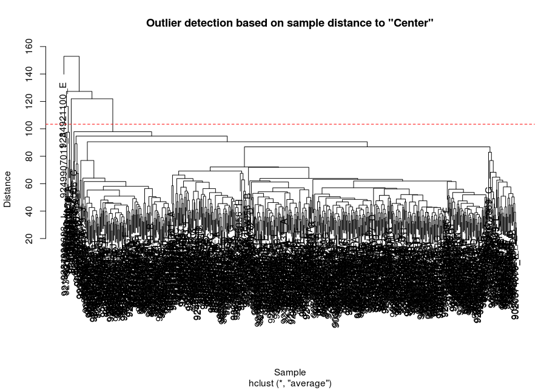

```
 beging plotting sampleTree <- flashClust( dist_exprs, method = "average") 
 
```


```
 beging plotting density 
 
```

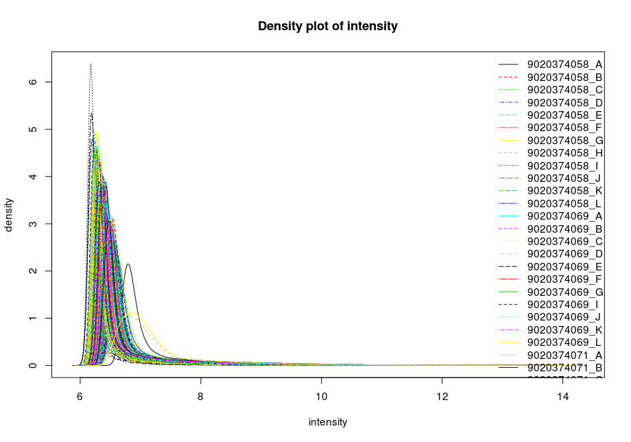

```
 beging plotting cv 
 
```

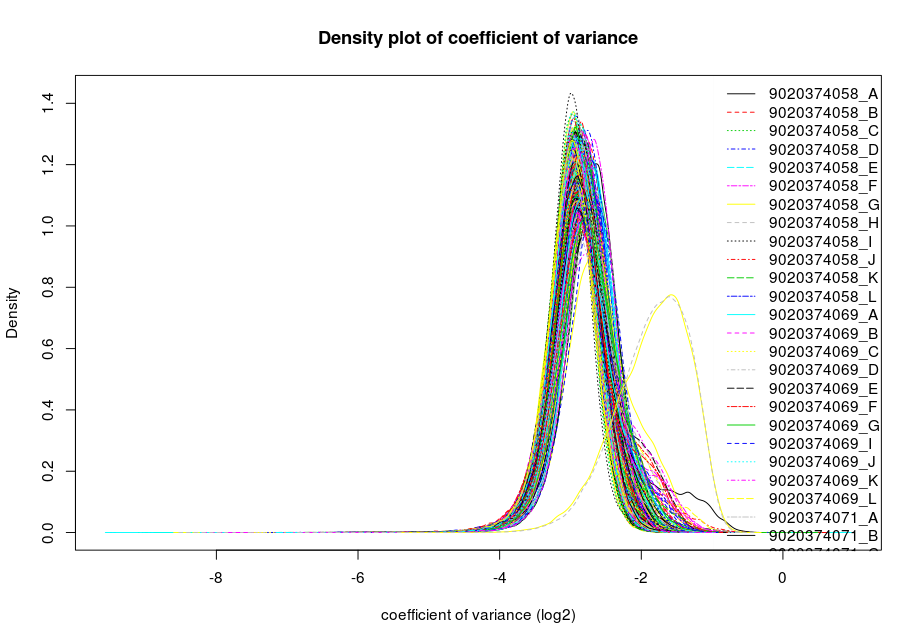

```r
par(def.par)
```


```r
pdf(file = paste(out_dir, "/", project_name, ".eset_raw.basic_qc_plot_lumi.pdf", 
    sep = ""), width = 11, height = 8)
basic_qc_plot_lumi(eset_raw)
```

```
 Running flashClust 
 
 beging plotting boxplot 
 
```

```
 beging plotting outlier 
 
```

```
 beging plotting sampleTree <- flashClust( dist_exprs, method = "average") 
 
```

```
 beging plotting density 
 
```

```
 beging plotting cv 
 
```

```r
dev.off()
```

```
pdf 
  2 
```

```r
par(def.par)
```


### coloured_dendrogram_lumi

```r
# coloured_dendrogram_lumi plot to screen
par(mar = c(5, 20, 5, 5))
coloured_dendrogram_lumi(eset_raw)
```

```
 get pheno data 
 
 basic colours 
 
 batch pheno data 
 
 batch colours 
 
 datExprs and sampleTree 
 
 plotDendroAndColors 
 
```


```r
par(def.par)
```


```r
pdf(file = paste(out_dir, "/", project_name, ".eset_raw.coloured_dendrogram_lumi.pdf", 
    sep = ""), width = 11, height = 8)
coloured_dendrogram_lumi(eset_raw)
```

```
 get pheno data 
 
 basic colours 
 
 batch pheno data 
 
 batch colours 
 
 datExprs and sampleTree 
 
 plotDendroAndColors 
 
```

```r
dev.off()
```

```
pdf 
  2 
```

```r
par(def.par)
```


### pca_plot_lumi

```r
# PCA plots plot to screen
pca_plot_lumi(eset_raw)
```

```
 setting up data for qc plots 
 
 get pheno data 
 
 basic colours 
 
 batch pheno data 
 
 begin PCA plots 
 
 calculating PCs using prcomp() 
 
 plotting Proportion of Variance Explained 
 
```

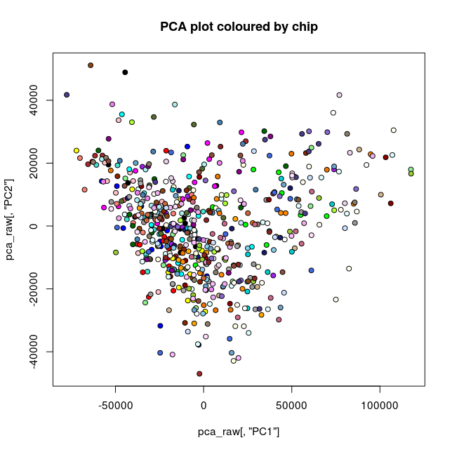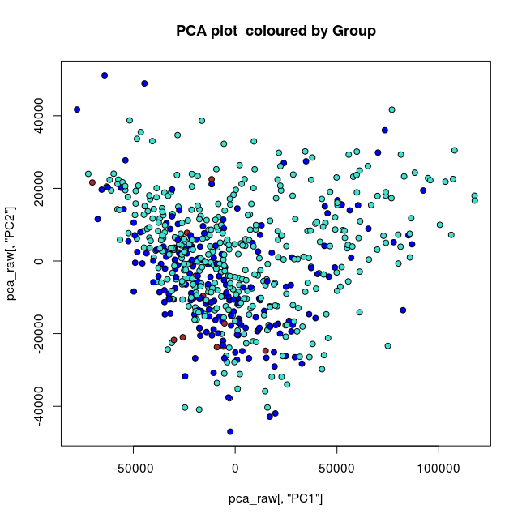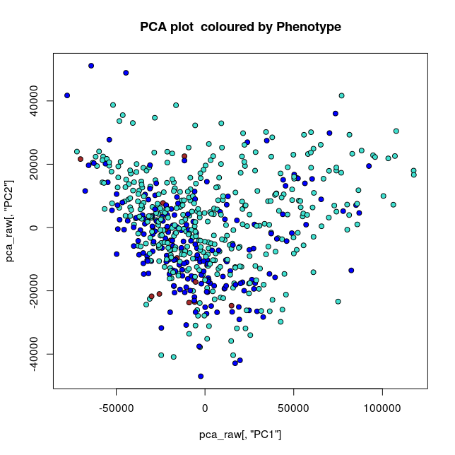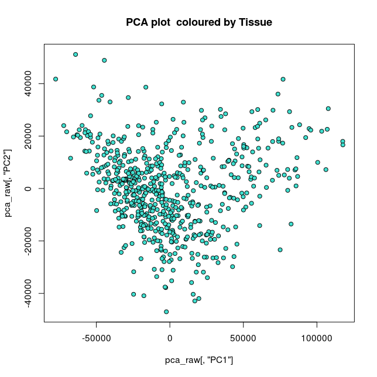

```
 begin looping through batch variable PCA plots  tech.Sentrix.Barcode 
 
```

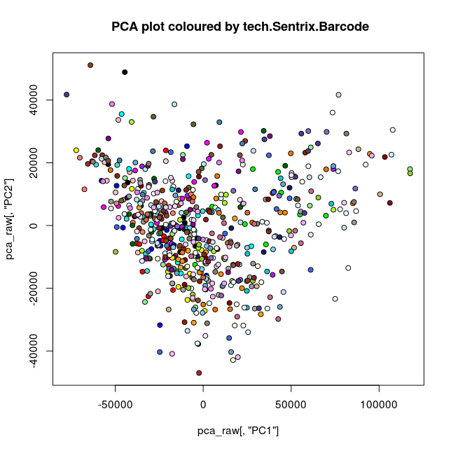

```
 begin looping through batch variable PCA plots  tech.SampleSection 
 
```


```
 begin looping through batch variable PCA plots  tech.Date_out 
 
```


```
 begin looping through batch variable PCA plots  tech.Date_extraction 
 
```

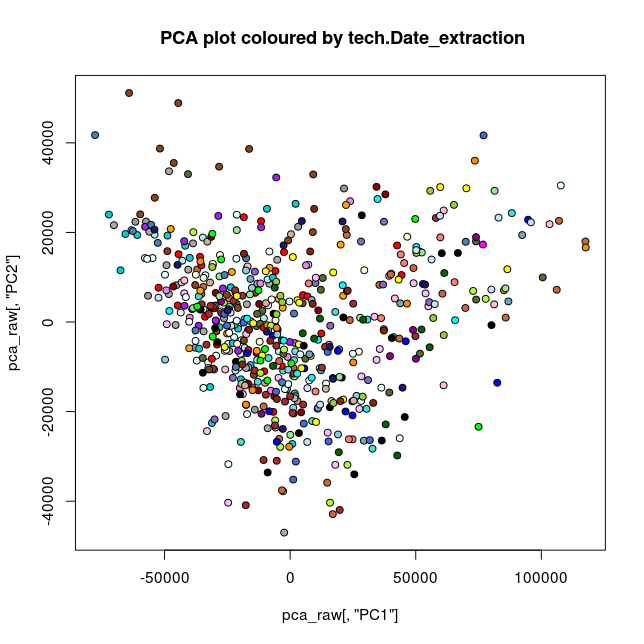

```
 begin looping through batch variable PCA plots  tech.Date_Dilutionand_Amplification 
 
```


```
 begin looping through batch variable PCA plots  tech.Date_cRNApurification 
 
```

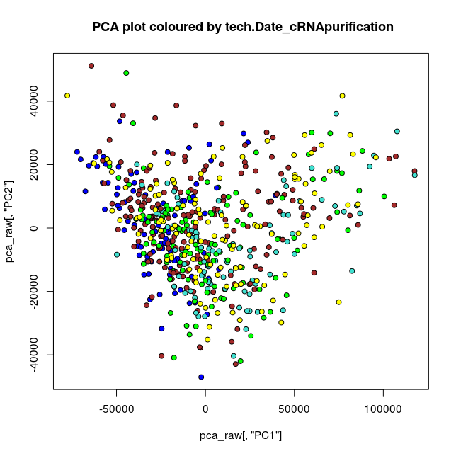

```
 begin looping through batch variable PCA plots  tech.Date_Quantitation_by_RiboGreen 
 
```


```
 begin looping through batch variable PCA plots  tech.Date_labelled_cRNA 
 
```

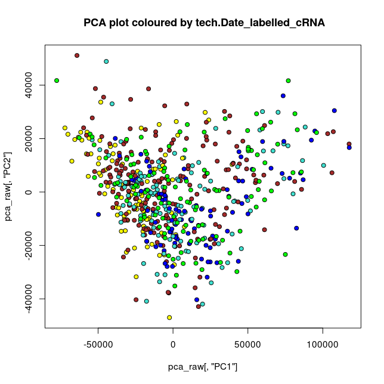

```
 begin looping through batch variable PCA plots  tech.Date_Hybridization_for_15_hours 
 
```

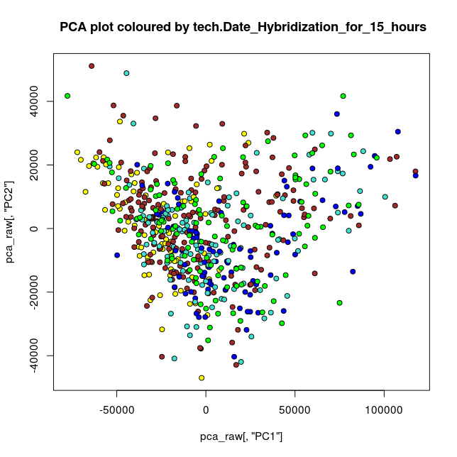

```
 begin looping through batch variable PCA plots  tech.Date_Washing_and_scanning 
 
```


```
 begin looping through batch variable PCA plots  tech.Conc_Nanodrop 
 
```

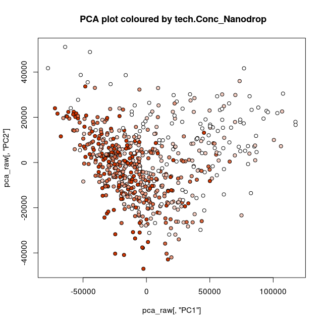

```
 begin looping through batch variable PCA plots  tech.labelled_cRNA_Yield 
 
```


```
 begin looping through batch variable PCA plots  tech.concentration_of_labelled_cRNA 
 
```

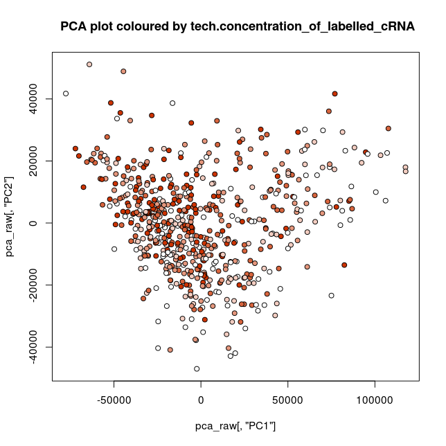

```
 begin looping through batch variable PCA plots  tech.BIOTIN 
 
```


```
 begin looping through batch variable PCA plots  tech.CY3_HYB 
 
```


```
 begin looping through batch variable PCA plots  tech.HOUSEKEEPING 
 
```


```
 begin looping through batch variable PCA plots  tech.LABELING 
 
```


```
 begin looping through batch variable PCA plots  tech.LOW_STRINGENCY_HYB 
 
```


```
 begin looping through batch variable PCA plots  tech.NEGATIVE..background. 
 
```

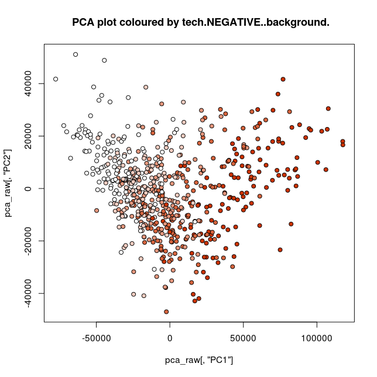

```
 begin looping through batch variable PCA plots  tech.Noise 
 
```

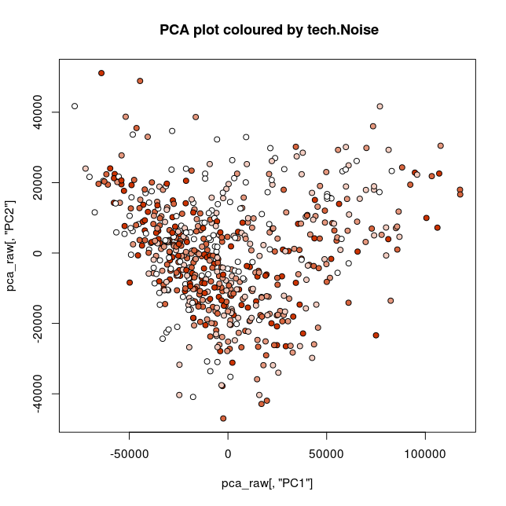

```r
par(def.par)
```


```r
pdf(file = paste(out_dir, "/", project_name, ".eset_raw.pca_plot_lumi.pdf", 
    sep = ""), width = 7, height = 7)
pca_plot_lumi(eset_raw)
```

```
 setting up data for qc plots 
 
 get pheno data 
 
 basic colours 
 
 batch pheno data 
 
 begin PCA plots 
 
 calculating PCs using prcomp() 
 
 plotting Proportion of Variance Explained 
 
```

```
 begin looping through batch variable PCA plots  tech.Sentrix.Barcode 
 
```

```
 begin looping through batch variable PCA plots  tech.SampleSection 
 
```

```
 begin looping through batch variable PCA plots  tech.Date_out 
 
```

```
 begin looping through batch variable PCA plots  tech.Date_extraction 
 
```

```
 begin looping through batch variable PCA plots  tech.Date_Dilutionand_Amplification 
 
```

```
 begin looping through batch variable PCA plots  tech.Date_cRNApurification 
 
```

```
 begin looping through batch variable PCA plots  tech.Date_Quantitation_by_RiboGreen 
 
```

```
 begin looping through batch variable PCA plots  tech.Date_labelled_cRNA 
 
```

```
 begin looping through batch variable PCA plots  tech.Date_Hybridization_for_15_hours 
 
```

```
 begin looping through batch variable PCA plots  tech.Date_Washing_and_scanning 
 
```

```
 begin looping through batch variable PCA plots  tech.Conc_Nanodrop 
 
```

```
 begin looping through batch variable PCA plots  tech.labelled_cRNA_Yield 
 
```

```
 begin looping through batch variable PCA plots  tech.concentration_of_labelled_cRNA 
 
```

```
 begin looping through batch variable PCA plots  tech.BIOTIN 
 
```

```
 begin looping through batch variable PCA plots  tech.CY3_HYB 
 
```

```
 begin looping through batch variable PCA plots  tech.HOUSEKEEPING 
 
```

```
 begin looping through batch variable PCA plots  tech.LABELING 
 
```

```
 begin looping through batch variable PCA plots  tech.LOW_STRINGENCY_HYB 
 
```

```
 begin looping through batch variable PCA plots  tech.NEGATIVE..background. 
 
```

```
 begin looping through batch variable PCA plots  tech.Noise 
 
```

```r
dev.off()
```

```
pdf 
  2 
```

```r
par(def.par)
```


### SampleNetwork Plots

```r
# SampleNetwork Plots plot to screen
sampleNetwork_plot_all_lumi(eset_raw, colBy = "chip")
```

```
 setting up data for qc plots 
 
 expression matrix and IAC 
 
 fundamentalNetworkConcepts 
 
 colorvec [ chip ] 
 
 begin SampleNetwork plots 
 
```


```r
sampleNetwork_plot_all_lumi(eset_raw, colBy = "group")
```

```
 setting up data for qc plots 
 
 expression matrix and IAC 
 
 fundamentalNetworkConcepts 
 
 colorvec [ group ] 
 
 begin SampleNetwork plots 
 
```

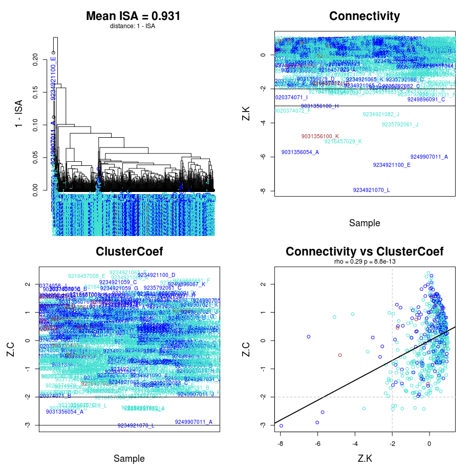

```r
par(def.par)
```


```r
pdf(file = paste(out_dir, "/", project_name, ".eset_raw.sampleNetwork_plot_all_lumi.pdf", 
    sep = ""), width = 8, height = 8)
sampleNetwork_plot_all_lumi(eset_raw, colBy = "chip")
```

```
 setting up data for qc plots 
 
 expression matrix and IAC 
 
 fundamentalNetworkConcepts 
 
 colorvec [ chip ] 
 
 begin SampleNetwork plots 
 
```

```r
sampleNetwork_plot_all_lumi(eset_raw, colBy = "group")
```

```
 setting up data for qc plots 
 
 expression matrix and IAC 
 
 fundamentalNetworkConcepts 
 
 colorvec [ group ] 
 
 begin SampleNetwork plots 
 
```

```r
dev.off()
```

```
pdf 
  2 
```

```r
par(def.par)
```


Basic fundamentalNetworkConcepts `eset_raw`
-------------------------------------------------------------------

## SampleNetwork on eset_raw for all samples as a first pass

```r
datExprs <- exprs(eset_raw)
samle_names <- sampleNames(eset_raw)
IAC = cor(datExprs, method = "p", use = "p")
diag(IAC) = 0
A.IAC = ((1 + IAC)/2)^2  ## ADJACENCY MATRIX
# fundamentalNetworkConcepts
FNC = fundamentalNetworkConcepts(A.IAC)  ## WGCNA
K2 = FNC$ScaledConnectivity
Z.K = round((K2 - mean(K2))/sd(K2), 3)
Z.C = round((FNC$ClusterCoef - mean(FNC$ClusterCoef))/sd(FNC$ClusterCoef), 3)
# cor K,C
rho <- signif(cor.test(Z.K, Z.C, method = "s")$estimate, 2)
rho_pvalue <- signif(cor.test(Z.K, Z.C, method = "s")$p.value, 2)
# Z.K_outliers
Z.K_outliers <- Z.K < -iac_sd_thrs
Z.K_outliers <- names(Z.K_outliers[Z.K_outliers == TRUE])
n_outliers <- length(Z.K_outliers)
mean_IAC <- signif(mean(IAC[upper.tri(IAC)]), 2)
min_Z.K <- min(Z.K)
cat(" Number of Z.K outliers=[", n_outliers, "]", "\r", "\n")
```

```
 Number of Z.K outliers=[ 22 ] 
 
```

```r
cat(" mean_IAC=[", mean_IAC, "]", "\r", "\n")
```

```
 mean_IAC=[ 0.93 ] 
 
```

```r
cat(" cor(Z.k,Z.C)=[", rho, "] P=[", rho_pvalue, "]", "\r", "\n")
```

```
 cor(Z.k,Z.C)=[ 0.29 ] P=[ 7.2e-13 ] 
 
```

```r
# print chip ids
Z.K_outliers
```

```
 [1] "9020374071_I" "9020374072_F" "9031356054_A" "9031356100_H"
 [5] "9031356100_K" "9216457012_A" "9216457023_A" "9216457023_I"
 [9] "9216457029_K" "9216457032_J" "9216457033_L" "9234921070_L"
[13] "9234921082_J" "9234921083_J" "9234921100_A" "9234921100_E"
[17] "9235792061_J" "9235792095_J" "9249896091_B" "9249896091_C"
[21] "9249907011_A" "9249907031_F"
```

```r
# get these bad samples from pData and update pdata to include these metrics
pData(eset_raw)$Z.K_eset_raw <- Z.K
pData(eset_raw)$Z.C_eset_raw <- Z.C
pData(eset_raw)$cor_Z.K.Z.C_eset_raw <- rho
pData(eset_raw)$cor_p_Z.K.Z.C_eset_ra <- rho_pvalue
# take a look at these outliers
samples_out <- pData(eset_raw[, Z.K_outliers])
head(samples_out)
```

```
                 sampleID  GROUPS    SEX TISSUE PHENOTYPE Study_ID
9020374071_I 9020374071_I CONTROL FEMALE  BLOOD   CONTROL   GAP932
9020374072_F 9020374072_F    CASE   MALE  BLOOD      CASE  SGAP415
9031356054_A 9031356054_A CONTROL FEMALE  BLOOD   CONTROL   GAP578
9031356100_H 9031356100_H CONTROL   MALE  BLOOD   CONTROL  SGAP406
9031356100_K 9031356100_K UNKNOWN FEMALE  BLOOD   UNKNOWN   GAP949
9216457012_A 9216457012_A    CASE   MALE  BLOOD      CASE  GAP651L
                Groups_orginal PHENOTYPE_Original tech.Sentrix.Barcode
9020374071_I          BASELINE            CONTROL           9020374071
9020374072_F          BASELINE               CASE           9020374072
9031356054_A          BASELINE            CONTROL           9031356054
9031356100_H          BASELINE            CONTROL           9031356100
9031356100_K MOTHER OF PROBAND            UNKNOWN           9031356100
9216457012_A        12FOLLOWUP               CASE           9216457012
             tech.SampleSection tech.Batch tech.Date_out
9020374071_I                  I          1    22/05/2013
9020374072_F                  F          1    21/05/2013
9031356054_A                  A          1    25/06/2013
9031356100_H                  H          1    21/05/2013
9031356100_K                  K          1    22/05/2013
9216457012_A                  A          1    28/05/2013
             tech.Date_extraction tech.person tech.Conc_Nanodrop
9020374071_I           22/05/2013           2              66.52
9020374072_F           22/05/2013           1             204.10
9031356054_A           26/06/2013           3              23.00
9031356100_H           22/05/2013           1             124.83
9031356100_K           23/05/2013           2             439.09
9216457012_A           29/05/2013           2              43.29
             tech.Date_Dilutionand_Amplification
9020374071_I                          16/07/2013
9020374072_F                          16/07/2013
9031356054_A                          24/07/2013
9031356100_H                          16/07/2013
9031356100_K                          16/07/2013
9216457012_A                          19/07/2013
             tech.Date_cRNApurification
9020374071_I                 17/07/2013
9020374072_F                 17/07/2013
9031356054_A                 25/07/2013
9031356100_H                 17/07/2013
9031356100_K                 17/07/2013
9216457012_A                 20/07/2013
             tech.Date_Quantitation_by_RiboGreen
9020374071_I                          23/07/2013
9020374072_F                          23/07/2013
9031356054_A                          30/07/2013
9031356100_H                          23/07/2013
9031356100_K                          23/07/2013
9216457012_A                          23/07/2013
             tech.Eluted_Total_labelled_cRNA tech.labelled_cRNA_Yield
9020374071_I                              40                    23060
9020374072_F                              40                    27554
9031356054_A                              40                    16584
9031356100_H                              40                    27428
9031356100_K                              40                    48132
9216457012_A                              40                     6107
             tech.concentration_of_labelled_cRNA tech.Date_labelled_cRNA
9020374071_I                               576.5              25/07/2013
9020374072_F                               688.8              25/07/2013
9031356054_A                               414.6              05/08/2013
9031356100_H                               685.7              25/07/2013
9031356100_K                              1203.3              25/07/2013
9216457012_A                               152.7              24/07/2013
             tech.Date_Hybridization_for_15_hours
9020374071_I                           25/07/2013
9020374072_F                           25/07/2013
9031356054_A                           05/08/2013
9031356100_H                           25/07/2013
9031356100_K                           25/07/2013
9216457012_A                           24/07/2013
             tech.Date_Washing_and_scanning Index Sample.Group
9020374071_I                     26/07/2013    32 9020374071_I
9020374072_F                     26/07/2013    41 9020374072_F
9031356054_A                     06/08/2013    69 9031356054_A
9031356100_H                     26/07/2013   142 9031356100_H
9031356100_K                     26/07/2013   145 9031356100_K
9216457012_A                     25/07/2013   171 9216457012_A
             Sentrix.Barcode Sample.Section Detected.Genes..0.01.
9020374071_I       9.020e+09              I                  5742
9020374072_F       9.020e+09              F                  4814
9031356054_A       9.031e+09              A                  5567
9031356100_H       9.031e+09              H                  6593
9031356100_K       9.031e+09              K                  5959
9216457012_A       9.216e+09              A                 10208
             Detected.Genes..0.05. Signal.Average Signal.P05 Signal.P25
9020374071_I                 10288            115         73         77
9020374072_F                  9224            102         69         72
9031356054_A                  9545            118         73         76
9031356100_H                  9810            108         71         74
9031356100_K                  9285            109         72         75
9216457012_A                 14216            306        103        111
             Signal.P50 Signal.P75 Signal.P95 tech.BIOTIN tech.CY3_HYB
9020374071_I         80         86        185        7029         3702
9020374072_F         75         80        143        6928         3438
9031356054_A         79         84        165        7167         3774
9031356100_H         77         81        148        6512         3463
9031356100_K         78         83        141        6797         3441
9216457012_A        120        173        842        7138         3664
             tech.HOUSEKEEPING tech.LABELING tech.LOW_STRINGENCY_HYB
9020374071_I              1730          76.6                    3734
9020374072_F              1429          70.8                    4048
9031356054_A              2506          78.7                    3623
9031356100_H              1429          69.3                    3433
9031356100_K              1596          72.9                    3402
9216457012_A              6314         107.5                    3845
             tech.NEGATIVE..background. tech.Noise Z.K_eset_raw
9020374071_I                       77.7        6.6       -2.533
9020374072_F                       73.4        5.2       -3.314
9031356054_A                       77.3        7.1       -5.737
9031356100_H                       74.8        3.2       -3.045
9031356100_K                       75.9        4.1       -4.800
9216457012_A                      111.0        9.2       -2.197
             Z.C_eset_raw cor_Z.K.Z.C_eset_raw cor_p_Z.K.Z.C_eset_ra
9020374071_I       -0.203                 0.29               7.2e-13
9020374072_F       -0.391                 0.29               7.2e-13
9031356054_A       -2.536                 0.29               7.2e-13
9031356100_H        0.110                 0.29               7.2e-13
9031356100_K       -0.513                 0.29               7.2e-13
9216457012_A       -1.348                 0.29               7.2e-13
```

```r
# wrtite csv
write.table(samples_out, file = paste(out_dir, "/", project_name, ".eset_raw_Z.K_outliers.csv", 
    sep = ""), sep = ",", quote = FALSE, row.names = FALSE)
# looksee
table(samples_out$GROUPS)
```

```

   CASE CONTROL UNKNOWN 
     14       7       1 
```

```r
table(samples_out$PHENOTYPE)
```

```

   CASE CONTROL UNKNOWN 
     14       7       1 
```

```r
table(samples_out$SEX)
```

```

FEMALE   MALE 
     8     14 
```

```r
table(samples_out$tech.Sentrix.Barcode)
```

```

9020374071 9020374072 9031356054 9031356100 9216457012 9216457023 
         1          1          1          2          1          2 
9216457029 9216457032 9216457033 9234921070 9234921082 9234921083 
         1          1          1          1          1          1 
9234921100 9235792061 9235792095 9249896091 9249907011 9249907031 
         2          1          1          2          1          1 
```

```r
# get and save list of Z.K outliers
eset_raw_Z.K_outliers <- Z.K_outliers
save(eset_raw_Z.K_outliers, file = paste(out_dir, "/", project_name, ".eset_raw_Z.K_outliers.RData", 
    sep = ""))
```


Save `eset_raw`
-------------------------------------------------------------------


```r
# Save updated raw ExpressionSet eset_raw
save(eset_raw, file = paste(out_dir, "/", project_name, ".eset_raw.RData", sep = ""))
```


```r
# Write data files to out_dir for eset_raw
write_expression_files(eset = eset_raw, outfile = paste(out_dir, "/", project_name, 
    ".eset_raw", sep = ""))
```

```
 Writing probe exprs matrix [ /media/D/expression/GAP_Expression/GAP_lumi_processing_26_01_2014_1390755915/GAP.eset_raw.exprs_matrix.txt ] 
 
 Writing probe se.exprs matrix [ /media/D/expression/GAP_Expression/GAP_lumi_processing_26_01_2014_1390755915/GAP.eset_raw.se.exprs_matrix.txt ] 
 
 Writing probe detection matrix [ /media/D/expression/GAP_Expression/GAP_lumi_processing_26_01_2014_1390755915/GAP.eset_raw.detection_matrix.txt ] 
 
 Writing probe beadNum matrix [ /media/D/expression/GAP_Expression/GAP_lumi_processing_26_01_2014_1390755915/GAP.eset_raw.beadNum_matrix.txt ] 
 
 Writing probe PCA matrix [ /media/D/expression/GAP_Expression/GAP_lumi_processing_26_01_2014_1390755915/GAP.eset_raw.pca_matrix.txt ] 
 
 Writing pData slot of eset and adding PCA data to [ /media/D/expression/GAP_Expression/GAP_lumi_processing_26_01_2014_1390755915/GAP.eset_raw.pData.txt ] 
 
 Writing fData slot of eset [ /media/D/expression/GAP_Expression/GAP_lumi_processing_26_01_2014_1390755915/GAP.eset_raw.fData.txt ] 
 
```


****

MBCB (Model-based Background Correction for Beadarray)
=======================================================
Background correction! Do not skip this step.
If you have data from Genomestudio you will have NEGATIVE BEAD expression levels to use for background correction.  
http://www.ncbi.nlm.nih.gov/pubmed/18450815.  
Nucleic Acids Res. 2008 Jun;36(10):e58. doi: 10.1093/nar/gkn234. Epub 2008 May 1.  
**Enhanced identification and biological validation of differential gene expression via Illumina whole-genome expression arrays through the use of the model-based background correction methodology**.Ding LH, Xie Y, Park S, Xiao G, Story MD.  
The alternative is Robust multi-array (RMA) if you dont have NEGATIVE BEAD expression levels. Noe example code is provided for this.

## 1. Run mbcb.correct(signal,negCon,npBool=FALSE,mleBool=TRUE,isRawBead=FALSE)

```r
# Run Model-based Background Correction for Beadarray : method = MLE
# mbcb.correct(signal,negCon,npBool=FALSE,mleBool=TRUE, isRawBead=FALSE)
eset_bg <- bgcor_mbcb(eset = eset_raw, outfile = paste(out_dir, "/", project_name, 
    ".eset_bg", sep = ""))
```

```
 Start background correction  
 
 get negativeControl bead data  
 
 get expression bead data  
 
 set data for mbcb  
 
 run background correct using mbcb.correct(method="MLE")   
 
```

```
1 / 608  complete.
2 / 608  complete.
3 / 608  complete.
4 / 608  complete.
5 / 608  complete.
6 / 608  complete.
7 / 608  complete.
8 / 608  complete.
9 / 608  complete.
10 / 608  complete.
11 / 608  complete.
12 / 608  complete.
13 / 608  complete.
14 / 608  complete.
15 / 608  complete.
16 / 608  complete.
17 / 608  complete.
18 / 608  complete.
19 / 608  complete.
20 / 608  complete.
21 / 608  complete.
22 / 608  complete.
23 / 608  complete.
24 / 608  complete.
25 / 608  complete.
26 / 608  complete.
27 / 608  complete.
28 / 608  complete.
29 / 608  complete.
30 / 608  complete.
31 / 608  complete.
32 / 608  complete.
33 / 608  complete.
34 / 608  complete.
35 / 608  complete.
36 / 608  complete.
37 / 608  complete.
38 / 608  complete.
39 / 608  complete.
40 / 608  complete.
41 / 608  complete.
42 / 608  complete.
43 / 608  complete.
44 / 608  complete.
45 / 608  complete.
46 / 608  complete.
47 / 608  complete.
48 / 608  complete.
49 / 608  complete.
50 / 608  complete.
51 / 608  complete.
52 / 608  complete.
53 / 608  complete.
54 / 608  complete.
55 / 608  complete.
56 / 608  complete.
57 / 608  complete.
58 / 608  complete.
59 / 608  complete.
60 / 608  complete.
61 / 608  complete.
62 / 608  complete.
63 / 608  complete.
64 / 608  complete.
65 / 608  complete.
66 / 608  complete.
67 / 608  complete.
68 / 608  complete.
69 / 608  complete.
70 / 608  complete.
71 / 608  complete.
72 / 608  complete.
73 / 608  complete.
74 / 608  complete.
75 / 608  complete.
76 / 608  complete.
77 / 608  complete.
78 / 608  complete.
79 / 608  complete.
80 / 608  complete.
81 / 608  complete.
82 / 608  complete.
83 / 608  complete.
84 / 608  complete.
85 / 608  complete.
86 / 608  complete.
87 / 608  complete.
88 / 608  complete.
89 / 608  complete.
90 / 608  complete.
91 / 608  complete.
92 / 608  complete.
93 / 608  complete.
94 / 608  complete.
95 / 608  complete.
96 / 608  complete.
97 / 608  complete.
98 / 608  complete.
99 / 608  complete.
100 / 608  complete.
101 / 608  complete.
102 / 608  complete.
103 / 608  complete.
104 / 608  complete.
105 / 608  complete.
106 / 608  complete.
107 / 608  complete.
108 / 608  complete.
109 / 608  complete.
110 / 608  complete.
111 / 608  complete.
112 / 608  complete.
113 / 608  complete.
114 / 608  complete.
115 / 608  complete.
116 / 608  complete.
117 / 608  complete.
118 / 608  complete.
119 / 608  complete.
120 / 608  complete.
121 / 608  complete.
122 / 608  complete.
123 / 608  complete.
124 / 608  complete.
125 / 608  complete.
126 / 608  complete.
127 / 608  complete.
128 / 608  complete.
129 / 608  complete.
130 / 608  complete.
131 / 608  complete.
132 / 608  complete.
133 / 608  complete.
134 / 608  complete.
135 / 608  complete.
136 / 608  complete.
137 / 608  complete.
138 / 608  complete.
139 / 608  complete.
140 / 608  complete.
141 / 608  complete.
142 / 608  complete.
143 / 608  complete.
144 / 608  complete.
145 / 608  complete.
146 / 608  complete.
147 / 608  complete.
148 / 608  complete.
149 / 608  complete.
150 / 608  complete.
151 / 608  complete.
152 / 608  complete.
153 / 608  complete.
154 / 608  complete.
155 / 608  complete.
156 / 608  complete.
157 / 608  complete.
158 / 608  complete.
159 / 608  complete.
160 / 608  complete.
161 / 608  complete.
162 / 608  complete.
163 / 608  complete.
164 / 608  complete.
165 / 608  complete.
166 / 608  complete.
167 / 608  complete.
168 / 608  complete.
169 / 608  complete.
170 / 608  complete.
171 / 608  complete.
172 / 608  complete.
173 / 608  complete.
174 / 608  complete.
175 / 608  complete.
176 / 608  complete.
177 / 608  complete.
178 / 608  complete.
179 / 608  complete.
180 / 608  complete.
181 / 608  complete.
182 / 608  complete.
183 / 608  complete.
184 / 608  complete.
185 / 608  complete.
186 / 608  complete.
187 / 608  complete.
188 / 608  complete.
189 / 608  complete.
190 / 608  complete.
191 / 608  complete.
192 / 608  complete.
193 / 608  complete.
194 / 608  complete.
195 / 608  complete.
196 / 608  complete.
197 / 608  complete.
198 / 608  complete.
199 / 608  complete.
200 / 608  complete.
201 / 608  complete.
202 / 608  complete.
203 / 608  complete.
204 / 608  complete.
205 / 608  complete.
206 / 608  complete.
207 / 608  complete.
208 / 608  complete.
209 / 608  complete.
210 / 608  complete.
211 / 608  complete.
212 / 608  complete.
213 / 608  complete.
214 / 608  complete.
215 / 608  complete.
216 / 608  complete.
217 / 608  complete.
218 / 608  complete.
219 / 608  complete.
220 / 608  complete.
221 / 608  complete.
222 / 608  complete.
223 / 608  complete.
224 / 608  complete.
225 / 608  complete.
226 / 608  complete.
227 / 608  complete.
228 / 608  complete.
229 / 608  complete.
230 / 608  complete.
231 / 608  complete.
232 / 608  complete.
233 / 608  complete.
234 / 608  complete.
235 / 608  complete.
236 / 608  complete.
237 / 608  complete.
238 / 608  complete.
239 / 608  complete.
240 / 608  complete.
241 / 608  complete.
242 / 608  complete.
243 / 608  complete.
244 / 608  complete.
245 / 608  complete.
246 / 608  complete.
247 / 608  complete.
248 / 608  complete.
249 / 608  complete.
250 / 608  complete.
251 / 608  complete.
252 / 608  complete.
253 / 608  complete.
254 / 608  complete.
255 / 608  complete.
256 / 608  complete.
257 / 608  complete.
258 / 608  complete.
259 / 608  complete.
260 / 608  complete.
261 / 608  complete.
262 / 608  complete.
263 / 608  complete.
264 / 608  complete.
265 / 608  complete.
266 / 608  complete.
267 / 608  complete.
268 / 608  complete.
269 / 608  complete.
270 / 608  complete.
271 / 608  complete.
272 / 608  complete.
273 / 608  complete.
274 / 608  complete.
275 / 608  complete.
276 / 608  complete.
277 / 608  complete.
278 / 608  complete.
279 / 608  complete.
280 / 608  complete.
281 / 608  complete.
282 / 608  complete.
283 / 608  complete.
284 / 608  complete.
285 / 608  complete.
286 / 608  complete.
287 / 608  complete.
288 / 608  complete.
289 / 608  complete.
290 / 608  complete.
291 / 608  complete.
292 / 608  complete.
293 / 608  complete.
294 / 608  complete.
295 / 608  complete.
296 / 608  complete.
297 / 608  complete.
298 / 608  complete.
299 / 608  complete.
300 / 608  complete.
301 / 608  complete.
302 / 608  complete.
303 / 608  complete.
304 / 608  complete.
305 / 608  complete.
306 / 608  complete.
307 / 608  complete.
308 / 608  complete.
309 / 608  complete.
310 / 608  complete.
311 / 608  complete.
312 / 608  complete.
313 / 608  complete.
314 / 608  complete.
315 / 608  complete.
316 / 608  complete.
317 / 608  complete.
318 / 608  complete.
319 / 608  complete.
320 / 608  complete.
321 / 608  complete.
322 / 608  complete.
323 / 608  complete.
324 / 608  complete.
325 / 608  complete.
326 / 608  complete.
327 / 608  complete.
328 / 608  complete.
329 / 608  complete.
330 / 608  complete.
331 / 608  complete.
332 / 608  complete.
333 / 608  complete.
334 / 608  complete.
335 / 608  complete.
336 / 608  complete.
337 / 608  complete.
338 / 608  complete.
339 / 608  complete.
340 / 608  complete.
341 / 608  complete.
342 / 608  complete.
343 / 608  complete.
344 / 608  complete.
345 / 608  complete.
346 / 608  complete.
347 / 608  complete.
348 / 608  complete.
349 / 608  complete.
350 / 608  complete.
351 / 608  complete.
352 / 608  complete.
353 / 608  complete.
354 / 608  complete.
355 / 608  complete.
356 / 608  complete.
357 / 608  complete.
358 / 608  complete.
359 / 608  complete.
360 / 608  complete.
361 / 608  complete.
362 / 608  complete.
363 / 608  complete.
364 / 608  complete.
365 / 608  complete.
366 / 608  complete.
367 / 608  complete.
368 / 608  complete.
369 / 608  complete.
370 / 608  complete.
371 / 608  complete.
372 / 608  complete.
373 / 608  complete.
374 / 608  complete.
375 / 608  complete.
376 / 608  complete.
377 / 608  complete.
378 / 608  complete.
379 / 608  complete.
380 / 608  complete.
381 / 608  complete.
382 / 608  complete.
383 / 608  complete.
384 / 608  complete.
385 / 608  complete.
386 / 608  complete.
387 / 608  complete.
388 / 608  complete.
389 / 608  complete.
390 / 608  complete.
391 / 608  complete.
392 / 608  complete.
393 / 608  complete.
394 / 608  complete.
395 / 608  complete.
396 / 608  complete.
397 / 608  complete.
398 / 608  complete.
399 / 608  complete.
400 / 608  complete.
401 / 608  complete.
402 / 608  complete.
403 / 608  complete.
404 / 608  complete.
405 / 608  complete.
406 / 608  complete.
407 / 608  complete.
408 / 608  complete.
409 / 608  complete.
410 / 608  complete.
411 / 608  complete.
412 / 608  complete.
413 / 608  complete.
414 / 608  complete.
415 / 608  complete.
416 / 608  complete.
417 / 608  complete.
418 / 608  complete.
419 / 608  complete.
420 / 608  complete.
421 / 608  complete.
422 / 608  complete.
423 / 608  complete.
424 / 608  complete.
425 / 608  complete.
426 / 608  complete.
427 / 608  complete.
428 / 608  complete.
429 / 608  complete.
430 / 608  complete.
431 / 608  complete.
432 / 608  complete.
433 / 608  complete.
434 / 608  complete.
435 / 608  complete.
436 / 608  complete.
437 / 608  complete.
438 / 608  complete.
439 / 608  complete.
440 / 608  complete.
441 / 608  complete.
442 / 608  complete.
443 / 608  complete.
444 / 608  complete.
445 / 608  complete.
446 / 608  complete.
447 / 608  complete.
448 / 608  complete.
449 / 608  complete.
450 / 608  complete.
451 / 608  complete.
452 / 608  complete.
453 / 608  complete.
454 / 608  complete.
455 / 608  complete.
456 / 608  complete.
457 / 608  complete.
458 / 608  complete.
459 / 608  complete.
460 / 608  complete.
461 / 608  complete.
462 / 608  complete.
463 / 608  complete.
464 / 608  complete.
465 / 608  complete.
466 / 608  complete.
467 / 608  complete.
468 / 608  complete.
469 / 608  complete.
470 / 608  complete.
471 / 608  complete.
472 / 608  complete.
473 / 608  complete.
474 / 608  complete.
475 / 608  complete.
476 / 608  complete.
477 / 608  complete.
478 / 608  complete.
479 / 608  complete.
480 / 608  complete.
481 / 608  complete.
482 / 608  complete.
483 / 608  complete.
484 / 608  complete.
485 / 608  complete.
486 / 608  complete.
487 / 608  complete.
488 / 608  complete.
489 / 608  complete.
490 / 608  complete.
491 / 608  complete.
492 / 608  complete.
493 / 608  complete.
494 / 608  complete.
495 / 608  complete.
496 / 608  complete.
497 / 608  complete.
498 / 608  complete.
499 / 608  complete.
500 / 608  complete.
501 / 608  complete.
502 / 608  complete.
503 / 608  complete.
504 / 608  complete.
505 / 608  complete.
506 / 608  complete.
507 / 608  complete.
508 / 608  complete.
509 / 608  complete.
510 / 608  complete.
511 / 608  complete.
512 / 608  complete.
513 / 608  complete.
514 / 608  complete.
515 / 608  complete.
516 / 608  complete.
517 / 608  complete.
518 / 608  complete.
519 / 608  complete.
520 / 608  complete.
521 / 608  complete.
522 / 608  complete.
523 / 608  complete.
524 / 608  complete.
525 / 608  complete.
526 / 608  complete.
527 / 608  complete.
528 / 608  complete.
529 / 608  complete.
530 / 608  complete.
531 / 608  complete.
532 / 608  complete.
533 / 608  complete.
534 / 608  complete.
535 / 608  complete.
536 / 608  complete.
537 / 608  complete.
538 / 608  complete.
539 / 608  complete.
540 / 608  complete.
541 / 608  complete.
542 / 608  complete.
543 / 608  complete.
544 / 608  complete.
545 / 608  complete.
546 / 608  complete.
547 / 608  complete.
548 / 608  complete.
549 / 608  complete.
550 / 608  complete.
551 / 608  complete.
552 / 608  complete.
553 / 608  complete.
554 / 608  complete.
555 / 608  complete.
556 / 608  complete.
557 / 608  complete.
558 / 608  complete.
559 / 608  complete.
560 / 608  complete.
561 / 608  complete.
562 / 608  complete.
563 / 608  complete.
564 / 608  complete.
565 / 608  complete.
566 / 608  complete.
567 / 608  complete.
568 / 608  complete.
569 / 608  complete.
570 / 608  complete.
571 / 608  complete.
572 / 608  complete.
573 / 608  complete.
574 / 608  complete.
575 / 608  complete.
576 / 608  complete.
577 / 608  complete.
578 / 608  complete.
579 / 608  complete.
580 / 608  complete.
581 / 608  complete.
582 / 608  complete.
583 / 608  complete.
584 / 608  complete.
585 / 608  complete.
586 / 608  complete.
587 / 608  complete.
588 / 608  complete.
589 / 608  complete.
590 / 608  complete.
591 / 608  complete.
592 / 608  complete.
593 / 608  complete.
594 / 608  complete.
595 / 608  complete.
596 / 608  complete.
597 / 608  complete.
598 / 608  complete.
599 / 608  complete.
600 / 608  complete.
601 / 608  complete.
602 / 608  complete.
603 / 608  complete.
604 / 608  complete.
605 / 608  complete.
606 / 608  complete.
607 / 608  complete.
608 / 608  complete.
```

```
 mbcb complete  
 
 saveing raw mbcb matrix to  /media/D/expression/GAP_Expression/GAP_lumi_processing_26_01_2014_1390755915/GAP.eset_bg.mbcb.correct.output.RData 
 
 Selected mbcb method:  MLE 
 
 replace names with original sampleNames(eset_raw), as R adds X to numbers  
 
 Creating Background Corrected Data set: eset_bg   
 
 replace old exprs data with new mbcb Background corrected data  
 
 returning new mbcb Background corrected data: eset_bg  
 
```

```r
eset_bg
```

```
Summary of data information:
	 Data File Information:
		GSGX Version	1.9.0
		Report Date	29/10/2013 14:56:38
		Project	BRC_GAP_Expression_02
		Group Set	BRC_GAP_Expression
		Analysis	BRC_GAP_Expression_nonorm_nobkgd
		Normalization	none

Major Operation History:
            submitted            finished
1 2014-01-26 17:05:16 2014-01-26 17:10:40
2 2014-01-26 17:05:16 2014-01-26 17:10:40
                                                                                                                   command
1 lumiR("/media/D/expression/GAP_Expression/final_reports_genomestudio/Sample_and_Control_Probe_Profile_FinalReport.txt", 
2                                                       lib.mapping = "lumiHumanIDMapping", checkDupId = TRUE, QC = TRUE, 
  lumiVersion
1      2.14.1
2      2.14.1
...
             submitted            finished
9  2014-01-26 17:14:35 2014-01-26 17:14:43
10 2014-01-26 17:16:26 2014-01-26 17:16:29
                                                                       command
9  addNuID2lumi(x.lumi = x.lumi, lib.mapping = lib.mapping, verbose = verbose)
10                                                     Subsetting 618 samples.
   lumiVersion
9       2.14.1
10      2.14.1

Object Information:
LumiBatch (storageMode: lockedEnvironment)
assayData: 47231 features, 608 samples 
  element names: beadNum, detection, exprs, se.exprs 
protocolData: none
phenoData
  sampleNames: 9020374058_A 9020374058_B ... 9249907052_L (608
    total)
  varLabels: sampleID GROUPS ... cor_p_Z.K.Z.C_eset_ra (47 total)
  varMetadata: labelDescription
featureData
  featureNames: Ku8QhfS0n_hIOABXuE fqPEquJRRlSVSfL.8A ...
    N8t5EuJCr0Tk9.zHno (47231 total)
  fvarLabels: ProbeID TargetID ... nuID (18 total)
  fvarMetadata: labelDescription
experimentData: use 'experimentData(object)'
Annotation: lumiHumanAll.db 
Control Data: Available
QC information: Please run summary(x, 'QC') for details!
```


## 2. SAVE BACKGROUND CORRECTED DATA 

```r
save(eset_bg, file = paste(out_dir, "/", project_name, ".eset_bg.RData", sep = ""), 
    compress = T)
```


## 3. Write data files to out_dir for eset_bg

```r
# Write data files to out_dir for eset_raw
write_expression_files(eset = eset_bg, outfile = paste(out_dir, "/", project_name, 
    ".eset_bg", sep = ""))
```

```
 Writing probe exprs matrix [ /media/D/expression/GAP_Expression/GAP_lumi_processing_26_01_2014_1390755915/GAP.eset_bg.exprs_matrix.txt ] 
 
 Writing probe se.exprs matrix [ /media/D/expression/GAP_Expression/GAP_lumi_processing_26_01_2014_1390755915/GAP.eset_bg.se.exprs_matrix.txt ] 
 
 Writing probe detection matrix [ /media/D/expression/GAP_Expression/GAP_lumi_processing_26_01_2014_1390755915/GAP.eset_bg.detection_matrix.txt ] 
 
 Writing probe beadNum matrix [ /media/D/expression/GAP_Expression/GAP_lumi_processing_26_01_2014_1390755915/GAP.eset_bg.beadNum_matrix.txt ] 
 
 Writing probe PCA matrix [ /media/D/expression/GAP_Expression/GAP_lumi_processing_26_01_2014_1390755915/GAP.eset_bg.pca_matrix.txt ] 
 
 Writing pData slot of eset and adding PCA data to [ /media/D/expression/GAP_Expression/GAP_lumi_processing_26_01_2014_1390755915/GAP.eset_bg.pData.txt ] 
 
 Writing fData slot of eset [ /media/D/expression/GAP_Expression/GAP_lumi_processing_26_01_2014_1390755915/GAP.eset_bg.fData.txt ] 
 
```


QC Plots of `eset_bg`
---------------------------------------------------------

## basic_qc_plot_lumi 

```r
# basic plots plot to screen
basic_qc_plot_lumi(eset_bg)
```

```
 Running flashClust 
 
 beging plotting boxplot 
 
```


```
 beging plotting outlier 
 
```


```
 beging plotting sampleTree <- flashClust( dist_exprs, method = "average") 
 
```


```
 beging plotting density 
 
```

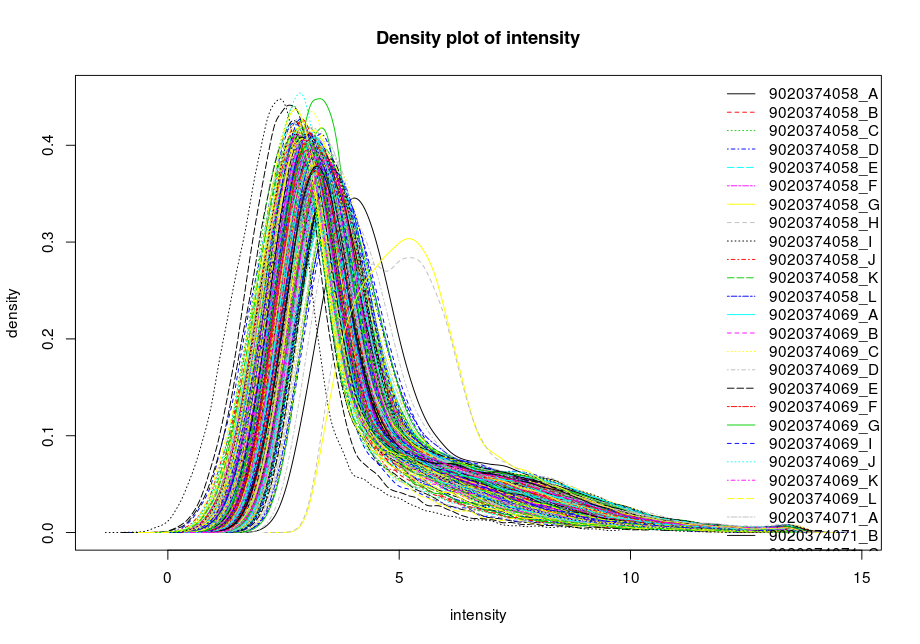

```
 beging plotting cv 
 
```

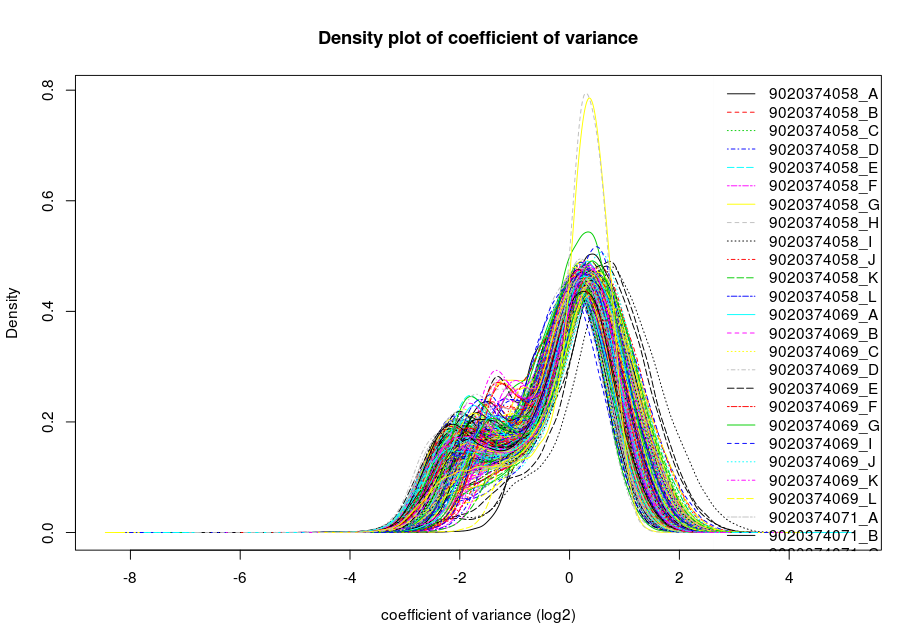

```r
par(def.par)
```


```r
pdf(file = paste(out_dir, "/", project_name, ".eset_bg.basic_qc_plot_lumi.pdf", 
    sep = ""), width = 11, height = 8)
basic_qc_plot_lumi(eset_bg)
```

```
 Running flashClust 
 
 beging plotting boxplot 
 
```

```
 beging plotting outlier 
 
```

```
 beging plotting sampleTree <- flashClust( dist_exprs, method = "average") 
 
```

```
 beging plotting density 
 
```

```
 beging plotting cv 
 
```

```r
dev.off()
```

```
pdf 
  2 
```

```r
par(def.par)
```


## coloured_dendrogram_lumi 

```r
# coloured_dendrogram_lumi plot to screen
par(mar = c(5, 20, 5, 5))
coloured_dendrogram_lumi(eset_bg)
```

```
 get pheno data 
 
 basic colours 
 
 batch pheno data 
 
 batch colours 
 
 datExprs and sampleTree 
 
 plotDendroAndColors 
 
```

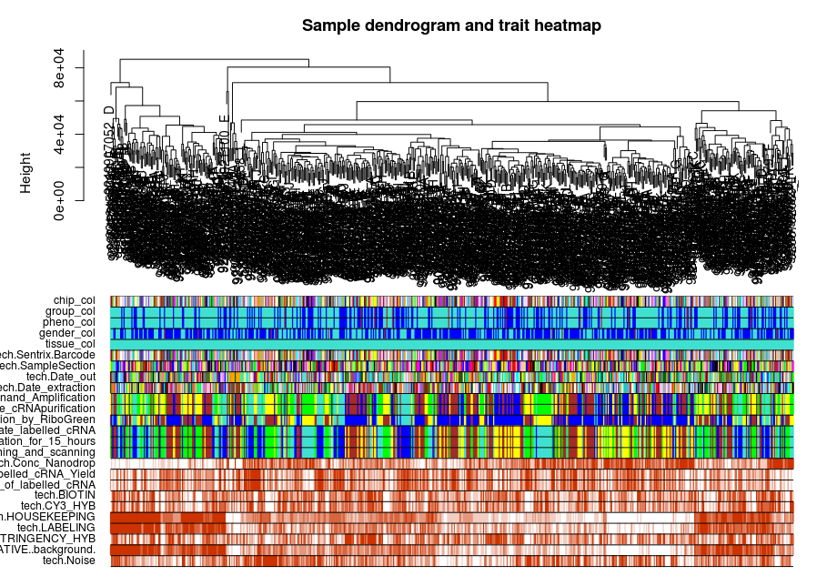

```r
par(def.par)
```


```r
pdf(file = paste(out_dir, "/", project_name, ".eset_bg.coloured_dendrogram_lumi.pdf", 
    sep = ""), width = 11, height = 8)
coloured_dendrogram_lumi(eset_bg)
```

```
 get pheno data 
 
 basic colours 
 
 batch pheno data 
 
 batch colours 
 
 datExprs and sampleTree 
 
 plotDendroAndColors 
 
```

```r
dev.off()
```

```
pdf 
  2 
```

```r
par(def.par)
```


## pca_plot_lumi 

```r
# PCA plots plot to screen
pca_plot_lumi(eset_bg)
```

```
 setting up data for qc plots 
 
 get pheno data 
 
 basic colours 
 
 batch pheno data 
 
 begin PCA plots 
 
 calculating PCs using prcomp() 
 
 plotting Proportion of Variance Explained 
 
```

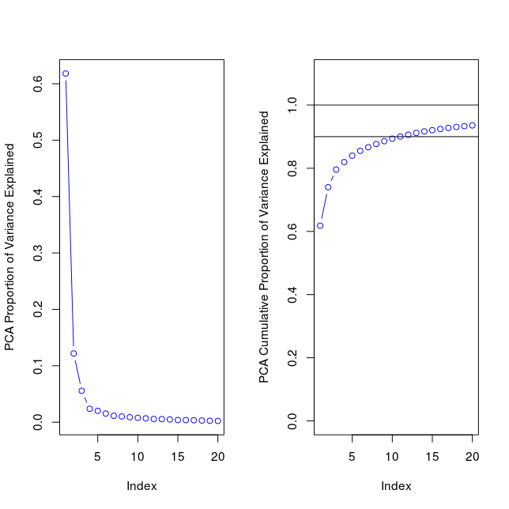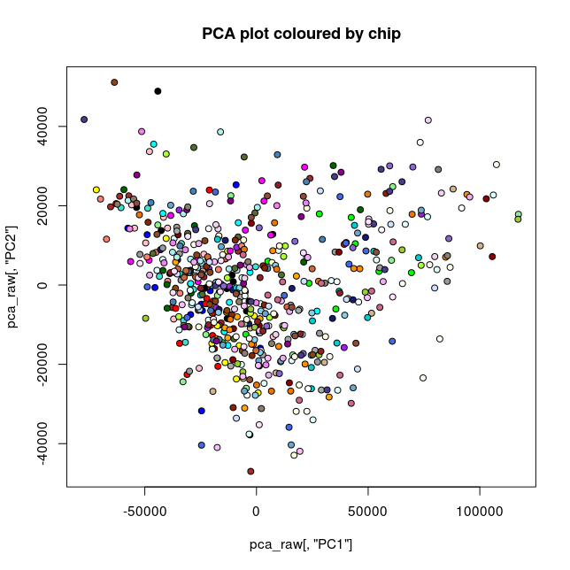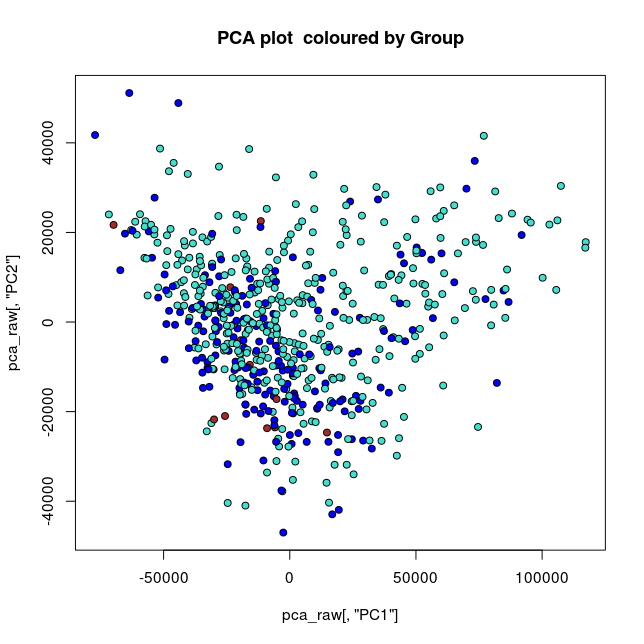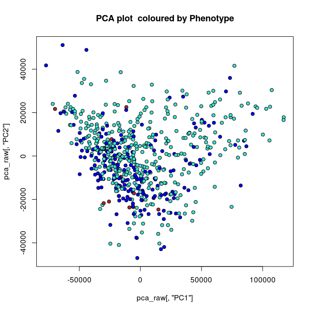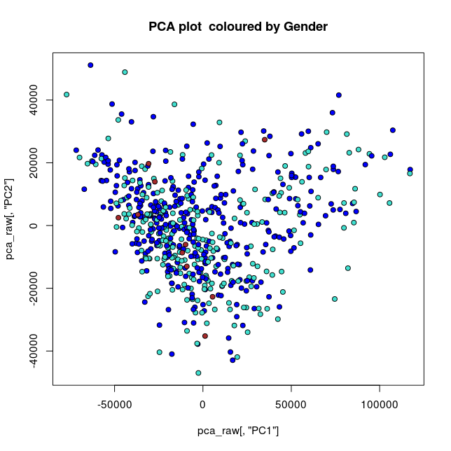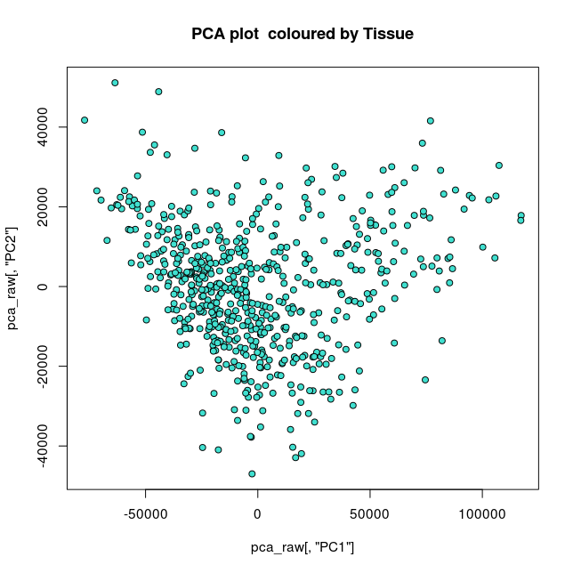

```
 begin looping through batch variable PCA plots  tech.Sentrix.Barcode 
 
```

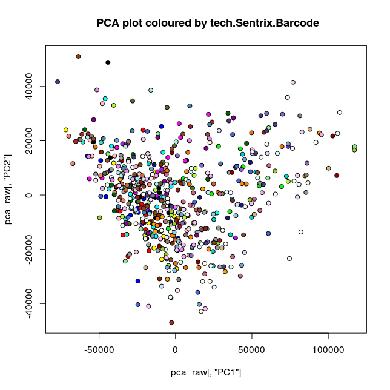

```
 begin looping through batch variable PCA plots  tech.SampleSection 
 
```

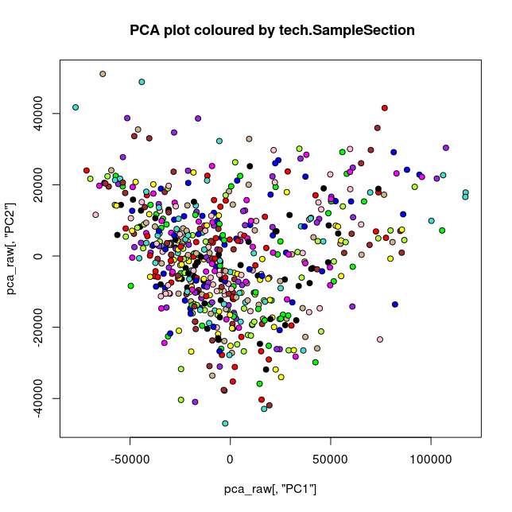

```
 begin looping through batch variable PCA plots  tech.Date_out 
 
```

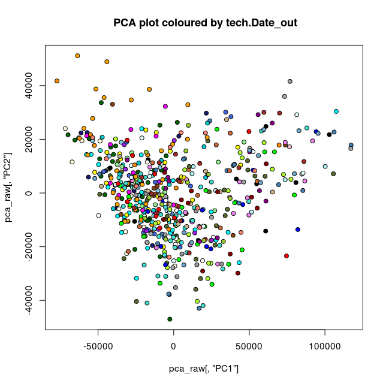

```
 begin looping through batch variable PCA plots  tech.Date_extraction 
 
```

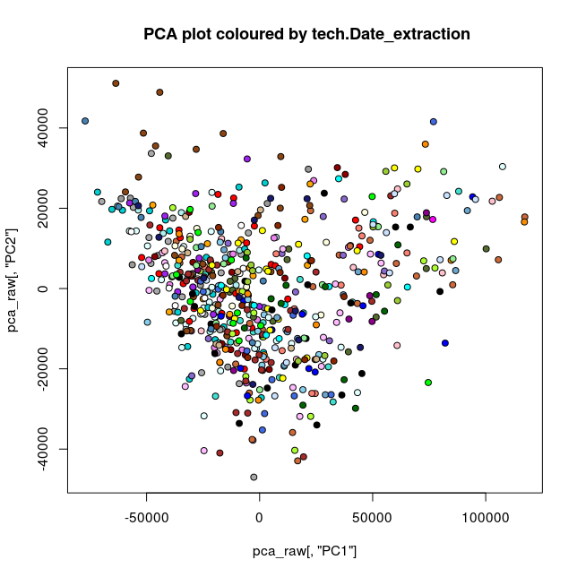

```
 begin looping through batch variable PCA plots  tech.Date_Dilutionand_Amplification 
 
```


```
 begin looping through batch variable PCA plots  tech.Date_cRNApurification 
 
```

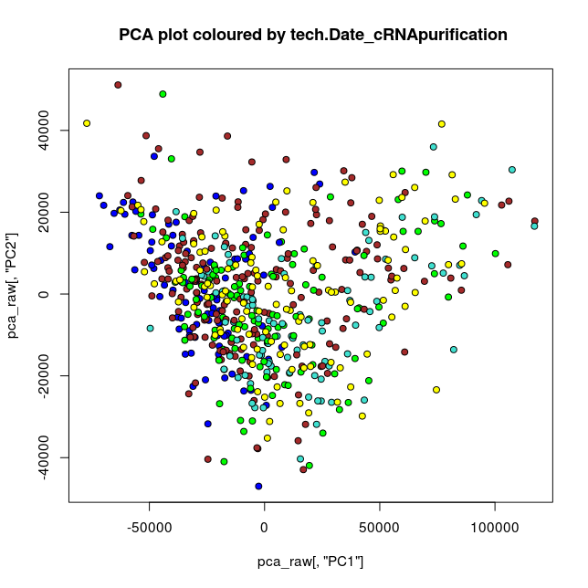

```
 begin looping through batch variable PCA plots  tech.Date_Quantitation_by_RiboGreen 
 
```

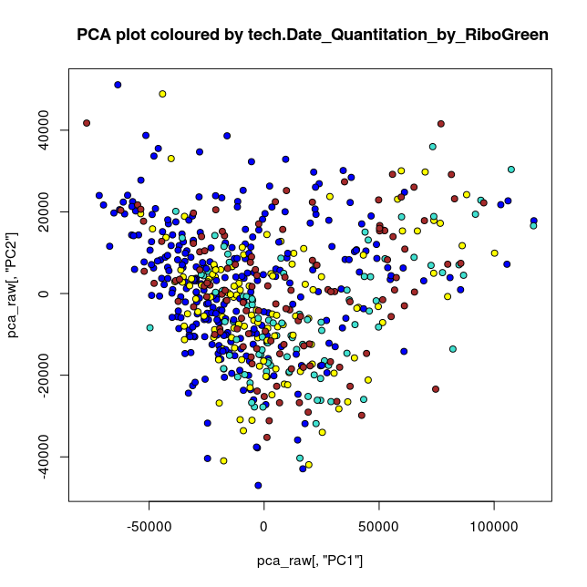

```
 begin looping through batch variable PCA plots  tech.Date_labelled_cRNA 
 
```


```
 begin looping through batch variable PCA plots  tech.Date_Hybridization_for_15_hours 
 
```


```
 begin looping through batch variable PCA plots  tech.Date_Washing_and_scanning 
 
```


```
 begin looping through batch variable PCA plots  tech.Conc_Nanodrop 
 
```

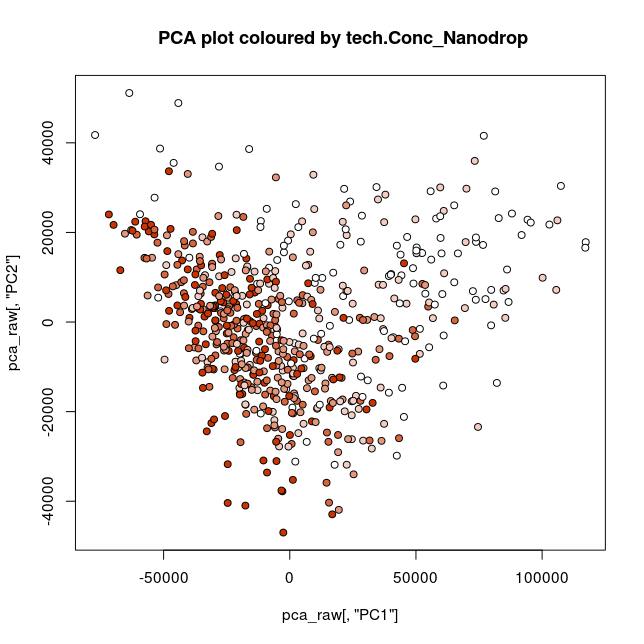

```
 begin looping through batch variable PCA plots  tech.labelled_cRNA_Yield 
 
```


```
 begin looping through batch variable PCA plots  tech.concentration_of_labelled_cRNA 
 
```


```
 begin looping through batch variable PCA plots  tech.BIOTIN 
 
```

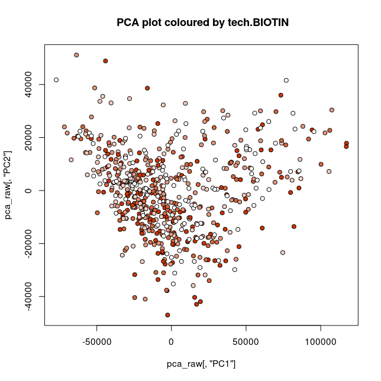

```
 begin looping through batch variable PCA plots  tech.CY3_HYB 
 
```

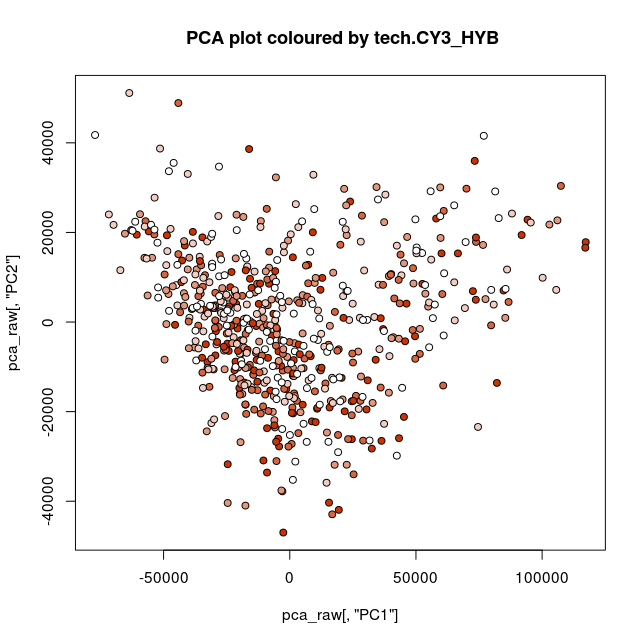

```
 begin looping through batch variable PCA plots  tech.HOUSEKEEPING 
 
```

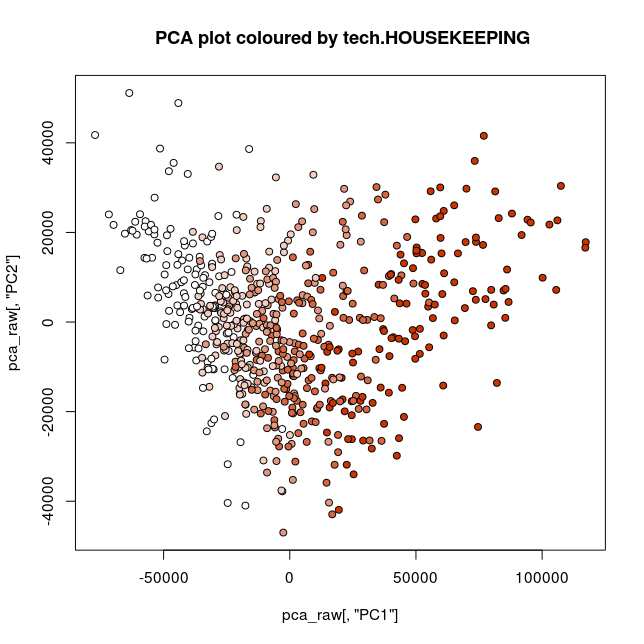

```
 begin looping through batch variable PCA plots  tech.LABELING 
 
```

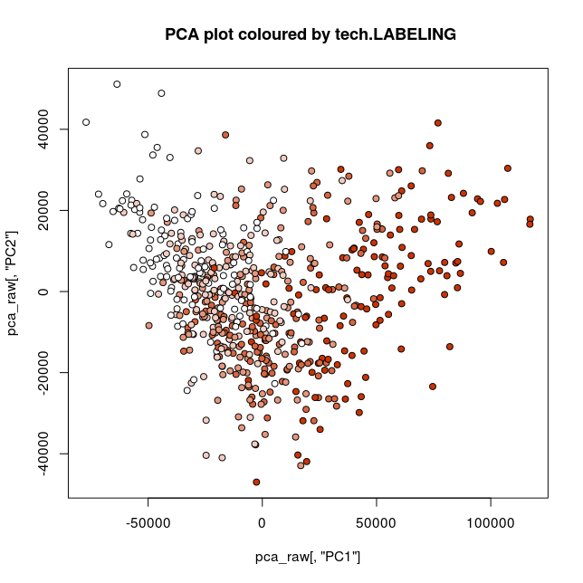

```
 begin looping through batch variable PCA plots  tech.LOW_STRINGENCY_HYB 
 
```

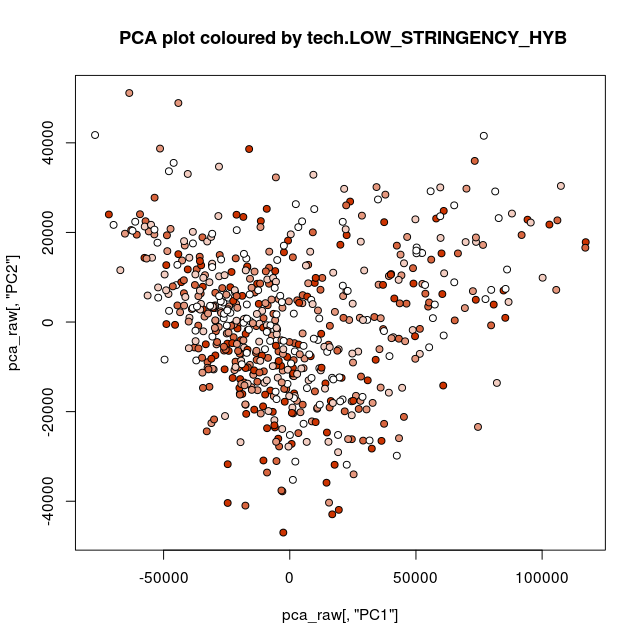

```
 begin looping through batch variable PCA plots  tech.NEGATIVE..background. 
 
```


```
 begin looping through batch variable PCA plots  tech.Noise 
 
```


```r
pdf(file = paste(out_dir, "/", project_name, ".eset_bg.pca_plot_lumi.pdf", sep = ""), 
    width = 7, height = 7)
pca_plot_lumi(eset_bg)
```

```
 setting up data for qc plots 
 
 get pheno data 
 
 basic colours 
 
 batch pheno data 
 
 begin PCA plots 
 
 calculating PCs using prcomp() 
 
 plotting Proportion of Variance Explained 
 
```

```
 begin looping through batch variable PCA plots  tech.Sentrix.Barcode 
 
```

```
 begin looping through batch variable PCA plots  tech.SampleSection 
 
```

```
 begin looping through batch variable PCA plots  tech.Date_out 
 
```

```
 begin looping through batch variable PCA plots  tech.Date_extraction 
 
```

```
 begin looping through batch variable PCA plots  tech.Date_Dilutionand_Amplification 
 
```

```
 begin looping through batch variable PCA plots  tech.Date_cRNApurification 
 
```

```
 begin looping through batch variable PCA plots  tech.Date_Quantitation_by_RiboGreen 
 
```

```
 begin looping through batch variable PCA plots  tech.Date_labelled_cRNA 
 
```

```
 begin looping through batch variable PCA plots  tech.Date_Hybridization_for_15_hours 
 
```

```
 begin looping through batch variable PCA plots  tech.Date_Washing_and_scanning 
 
```

```
 begin looping through batch variable PCA plots  tech.Conc_Nanodrop 
 
```

```
 begin looping through batch variable PCA plots  tech.labelled_cRNA_Yield 
 
```

```
 begin looping through batch variable PCA plots  tech.concentration_of_labelled_cRNA 
 
```

```
 begin looping through batch variable PCA plots  tech.BIOTIN 
 
```

```
 begin looping through batch variable PCA plots  tech.CY3_HYB 
 
```

```
 begin looping through batch variable PCA plots  tech.HOUSEKEEPING 
 
```

```
 begin looping through batch variable PCA plots  tech.LABELING 
 
```

```
 begin looping through batch variable PCA plots  tech.LOW_STRINGENCY_HYB 
 
```

```
 begin looping through batch variable PCA plots  tech.NEGATIVE..background. 
 
```

```
 begin looping through batch variable PCA plots  tech.Noise 
 
```

```r
dev.off()
```

```
pdf 
  2 
```

```r
par(def.par)
```


## SampleNetwork Plots 

```r
# SampleNetwork Plots plot to screen
sampleNetwork_plot_all_lumi(eset_bg, colBy = "chip")
```

```
 setting up data for qc plots 
 
 expression matrix and IAC 
 
 fundamentalNetworkConcepts 
 
 colorvec [ chip ] 
 
 begin SampleNetwork plots 
 
```

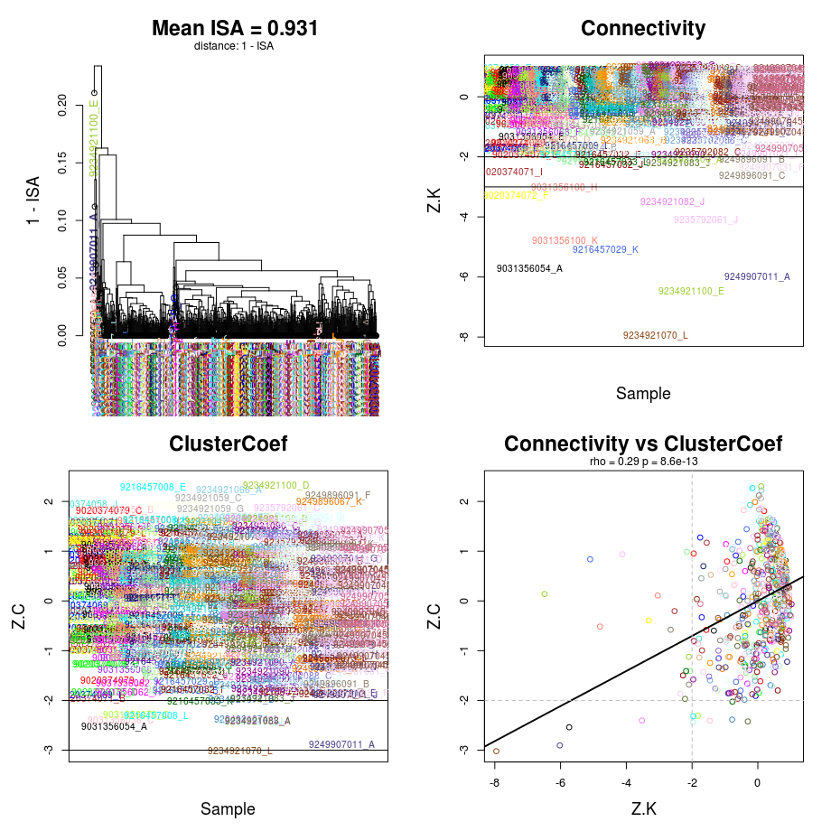

```r
sampleNetwork_plot_all_lumi(eset_bg, colBy = "group")
```

```
 setting up data for qc plots 
 
 expression matrix and IAC 
 
 fundamentalNetworkConcepts 
 
 colorvec [ group ] 
 
 begin SampleNetwork plots 
 
```

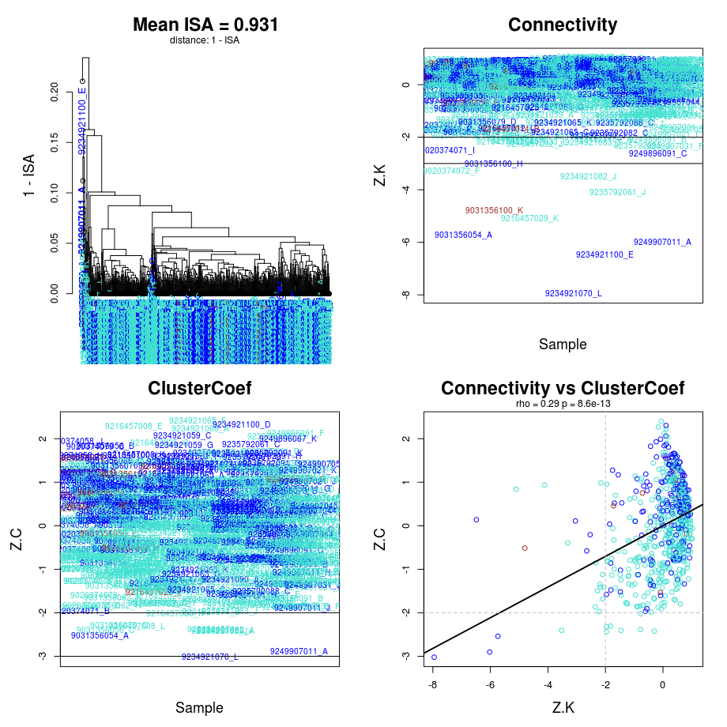

```r
par(def.par)
```


```r
pdf(file = paste(out_dir, "/", project_name, ".eset_bg.sampleNetwork_plot_all_lumi.pdf", 
    sep = ""), width = 8, height = 8)
sampleNetwork_plot_all_lumi(eset_bg, colBy = "chip")
```

```
 setting up data for qc plots 
 
 expression matrix and IAC 
 
 fundamentalNetworkConcepts 
 
 colorvec [ chip ] 
 
 begin SampleNetwork plots 
 
```

```r
sampleNetwork_plot_all_lumi(eset_bg, colBy = "group")
```

```
 setting up data for qc plots 
 
 expression matrix and IAC 
 
 fundamentalNetworkConcepts 
 
 colorvec [ group ] 
 
 begin SampleNetwork plots 
 
```

```r
dev.off()
```

```
pdf 
  2 
```

```r
par(def.par)
```


****

Check Gender based on XIST gene expression
===========================================
Uses background corrected data to detemine gender based on XIST gene expression: http://en.wikipedia.org/wiki/XIST_(gene).  
Samples with XIST probe expression greater than or equal to the mean of the negative bead expression values are flagged as FEMALE.
Compares XIST based gender with clinical gender, and flags potential problems as GENDER_FAIL. These may be due to database typos and sample mix ups and should be double checked. Thes samples are kept at this stage.


```r
cat(" Checking Gender based on XIST gene expression", "\r", "\n")
```

```
 Checking Gender based on XIST gene expression 
 
```

```r

## get neg control data from eset_bg
negativeControl <- getControlData(eset_bg)
negativeControl <- subset(negativeControl, negativeControl$controlType == "NEGATIVE")
negativeControl <- negativeControl[, c(3:dim(negativeControl)[2])]

## get neg control info mean,sd,max etc
neg_max <- apply(negativeControl, 2, max)
neg_sd <- apply(negativeControl, 2, sd)
neg_mean <- apply(negativeControl, 2, mean)
neg_2sd <- neg_mean + 2 * neg_sd

## get XIST gene postion
xist_raw <- fData(eset_raw)$ILMN_GENE == "XIST"
xist_bgcor <- fData(eset_bg)$ILMN_GENE == "XIST"

## get XIST gene expression signal
xist_gx_raw <- exprs(eset_raw[xist_raw, ])
xist_gx_raw <- as.data.frame(t(xist_gx_raw))
xist_gx_bgcor <- exprs(eset_bg[xist_bgcor, ])
xist_gx_bgcor <- as.data.frame(t(xist_gx_bgcor))

## cobine raw and bkCro gx data
xist_gx <- cbind(xist_gx_raw, xist_gx_bgcor)
colnames(xist_gx) <- c("raw_XIST", "bgcor_XIST")
xist_gx$neg_2sd <- neg_2sd
xist_gx$neg_max <- neg_max
xist_gx$neg_mean <- neg_mean
xist_gx$neg_sd <- neg_sd

## gender based on XIST expression 1=FEMALE , 0 = MALE
## xist_gx$XIST_Gender_max <- ifelse(xist_gx$bgcor_XIST >
## xist_gx$neg_max,1,0) xist_gx$XIST_Gender_2sd <- ifelse(xist_gx$bgcor_XIST
## > xist_gx$neg_2sd,1,0)
xist_gx$XIST_z <- (xist_gx$bgcor_XIST - xist_gx$neg_mean)/xist_gx$neg_sd
xist_gx$Sample.ID <- rownames(xist_gx)

# illumina detection p value for xist
xist_gx$xist_illumina_detection_p <- as.numeric(detection(eset_bg[fData(eset_bg)$ILMN_GENE == 
    "XIST", ]))
xist_gx$xist_illumina_detection_p <- ifelse(xist_gx$xist_illumina_detection_p == 
    0, 1e-05, xist_gx$xist_illumina_detection_p)

# gender based on bg cor expression > 2SD negatibe beads xist_gx$xist_gender
# <- ifelse(xist_gx$bgcor_XIST > xist_gx$neg_2sd,'FEMALE','MALE')
xist_gx$xist_gender <- ifelse(xist_gx$bgcor_XIST >= xist_gx$neg_mean, "FEMALE", 
    "MALE")

# gender provided in database
xist_gx$clinical_gender <- pData(eset_bg)$SEX

# gender based on illumina detecetion p value
xist_gx$xist_illumina_detection_p_gender <- ifelse(xist_gx$xist_illumina_detection_p <= 
    0.01, "FEMALE", "MALE")  ## 0.05 makes them all FEMALE!

# flag gender FAIL
xist_gx$gender_FAIL <- ifelse(xist_gx$xist_gender == xist_gx$clinical_gender, 
    "PASS", "GENDER_FAIL")
xist_gx$gender_FAIL_illumina_detection_p <- ifelse(xist_gx$xist_illumina_detection_p_gender == 
    xist_gx$clinical_gender, "PASS", "GENDER_FAIL")
# head
head(xist_gx)
```

```
             raw_XIST bgcor_XIST neg_2sd neg_max neg_mean neg_sd XIST_z
9020374058_A    108.2      32.72  119.19   367.1    85.51 16.840 -3.135
9020374058_B    105.8      30.18   97.51   186.4    83.64  6.935 -7.709
9020374058_C    196.0     123.22   93.32   167.6    79.50  6.913  6.325
9020374058_D    114.3      38.18  102.94   212.7    85.04  8.949 -5.236
9020374058_E     96.0      21.58   94.02   159.9    81.83  6.094 -9.887
9020374058_F    109.9      31.32  101.60   164.4    87.96  6.824 -8.300
                Sample.ID xist_illumina_detection_p xist_gender
9020374058_A 9020374058_A                   0.01429        MALE
9020374058_B 9020374058_B                   0.00779        MALE
9020374058_C 9020374058_C                   0.00001      FEMALE
9020374058_D 9020374058_D                   0.00779        MALE
9020374058_E 9020374058_E                   0.01169        MALE
9020374058_F 9020374058_F                   0.00909        MALE
             clinical_gender xist_illumina_detection_p_gender gender_FAIL
9020374058_A            MALE                             MALE        PASS
9020374058_B            MALE                           FEMALE        PASS
9020374058_C          FEMALE                           FEMALE        PASS
9020374058_D            MALE                           FEMALE        PASS
9020374058_E            MALE                             MALE        PASS
9020374058_F            MALE                           FEMALE        PASS
             gender_FAIL_illumina_detection_p
9020374058_A                             PASS
9020374058_B                      GENDER_FAIL
9020374058_C                             PASS
9020374058_D                      GENDER_FAIL
9020374058_E                             PASS
9020374058_F                      GENDER_FAIL
```

```r

# gender_concordance
gender_concordance <- round(sum(xist_gx$xist_gender == xist_gx$clinical_gender)/dim(xist_gx)[1], 
    3)
cat(" Gender Concordance=[", gender_concordance, "]", "\r", "\n")
```

```
 Gender Concordance=[ 0.951 ] 
 
```

```r

# table SEX
table(xist_gx$clinical_gender)
```

```

 FEMALE    MALE UNKNOWN 
    240     357      11 
```

```r
table(xist_gx$xist_gender)
```

```

FEMALE   MALE 
   233    375 
```

```r
table(xist_gx$xist_illumina_detection_p_gender)
```

```

FEMALE   MALE 
   546     62 
```

```r

# tables SEX compare
table(xist_gx$xist_gender, xist_gx$clinical_gender)
```

```
        
         FEMALE MALE UNKNOWN
  FEMALE    225    4       4
  MALE       15  353       7
```

```r
table(xist_gx$xist_illumina_detection_p_gender, xist_gx$clinical_gender)
```

```
        
         FEMALE MALE UNKNOWN
  FEMALE    238  299       9
  MALE        2   58       2
```

```r

# percent_gender_match
percent_gender_match <- round(sum(xist_gx$xist_gender == xist_gx$clinical_gender)/dim(xist_gx)[1], 
    3)
cat(" Percent Gender Match=[", percent_gender_match, "]", "\r", "\n")
```

```
 Percent Gender Match=[ 0.951 ] 
 
```

```r

# Density plots with semi-transparent fill of SEX CALLS
df <- xist_gx[, c("bgcor_XIST", "clinical_gender", "xist_gender", "xist_illumina_detection_p_gender")]
head(df)
```

```
             bgcor_XIST clinical_gender xist_gender
9020374058_A      32.72            MALE        MALE
9020374058_B      30.18            MALE        MALE
9020374058_C     123.22          FEMALE      FEMALE
9020374058_D      38.18            MALE        MALE
9020374058_E      21.58            MALE        MALE
9020374058_F      31.32            MALE        MALE
             xist_illumina_detection_p_gender
9020374058_A                             MALE
9020374058_B                           FEMALE
9020374058_C                           FEMALE
9020374058_D                           FEMALE
9020374058_E                             MALE
9020374058_F                           FEMALE
```

```r

# Find the mean of each group library(plyr)
cdf_clinical_gender <- ddply(df, "clinical_gender", summarise, mean = mean(log2(bgcor_XIST)))
cdf_xist_gender <- ddply(df, "xist_gender", summarise, mean = mean(log2(bgcor_XIST)))

cdf_clinical_gender
```

```
  clinical_gender  mean
1          FEMALE 8.153
2            MALE 5.151
3         UNKNOWN 6.155
```

```r
cdf_xist_gender
```

```
  xist_gender  mean
1      FEMALE 8.308
2        MALE 5.140
```

```r


# ggplots
ggplot(df, aes(x = log2(bgcor_XIST), fill = clinical_gender)) + geom_histogram(binwidth = 0.5, 
    alpha = 0.5, position = "identity")
```

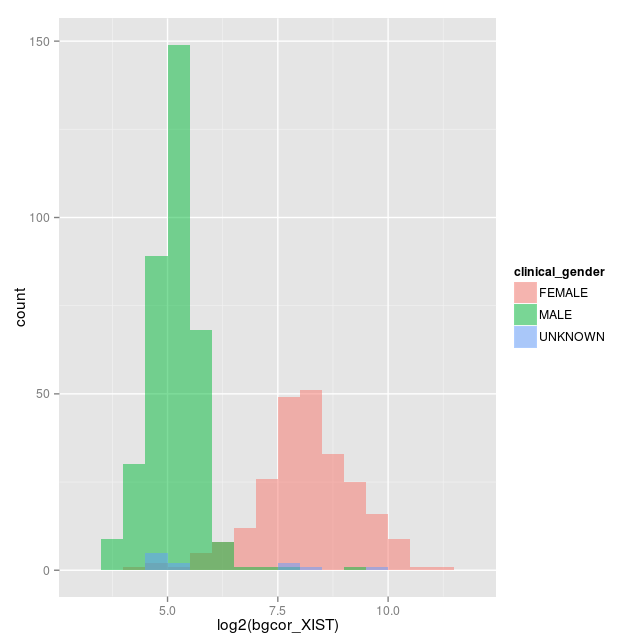

```r
ggplot(df, aes(x = log2(bgcor_XIST), fill = xist_gender)) + geom_histogram(binwidth = 0.5, 
    alpha = 0.5, position = "identity")
```

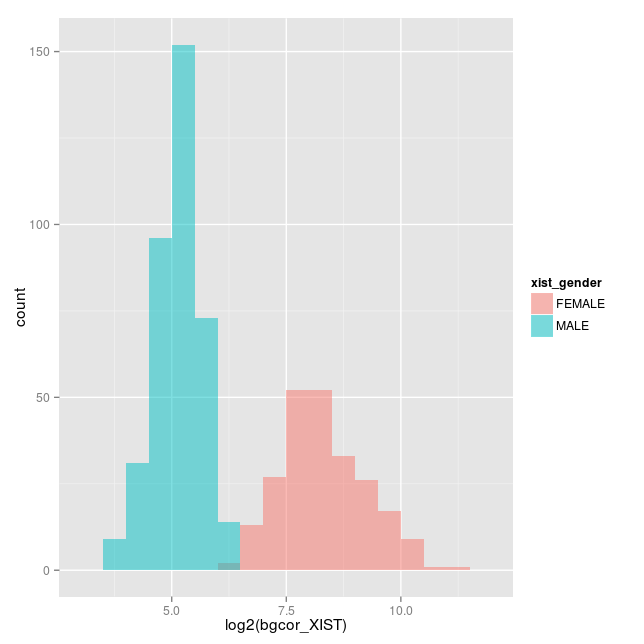

```r
ggplot(df, aes(x = log2(bgcor_XIST), fill = xist_illumina_detection_p_gender)) + 
    geom_histogram(binwidth = 0.5, alpha = 0.5, position = "identity")
```

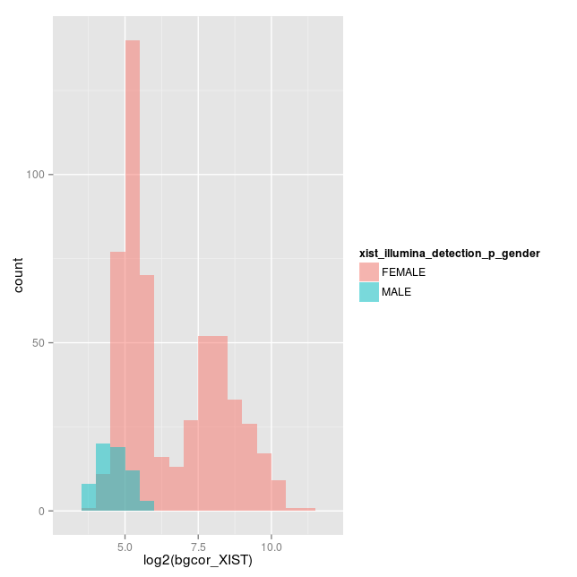

```r

# Box plots With flipped axes
ggplot(df, aes(y = log2(bgcor_XIST), x = clinical_gender, fill = clinical_gender)) + 
    geom_boxplot() + guides(fill = FALSE) + coord_flip()
```

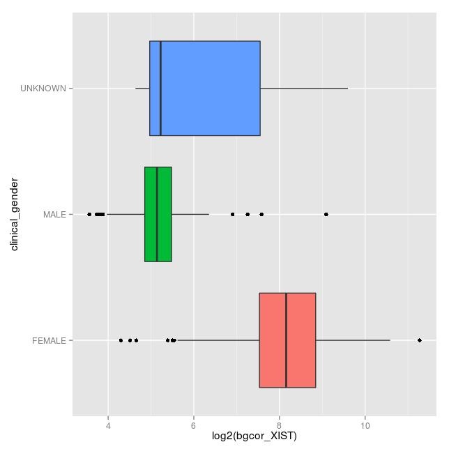

```r
ggplot(df, aes(y = log2(bgcor_XIST), x = xist_gender, fill = xist_gender)) + 
    geom_boxplot() + guides(fill = FALSE) + coord_flip()
```

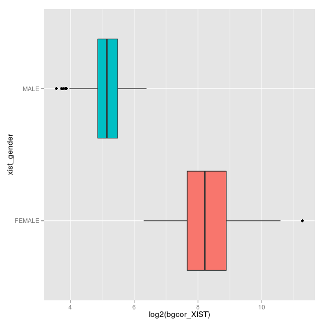

```r
# ggplot(df, aes( y=log2(bgcor_XIST), x=xist_illumina_detection_p_gender,
# fill=xist_illumina_detection_p_gender)) + geom_boxplot() +
# guides(fill=FALSE) + coord_flip()

# save xist_gx data
save(xist_gx, file = paste(out_dir, "/", project_name, ".eset_bg.XIST.Gender.RData", 
    sep = ""))
write.table(xist_gx, file = paste(out_dir, "/", project_name, ".eset_bg.XIST.Gender.txt", 
    sep = ""), sep = "\t", row.names = F)

## check sex and add to pData
pheno_update <- merge(pData(eset_bg), xist_gx, by.x = "sampleID", by.y = "Sample.ID", 
    all.x = TRUE, sort = FALSE)
rownames(pheno_update) <- pheno_update$sampleID

pData(eset_bg) <- pheno_update
save(eset_bg, file = paste(out_dir, "/", project_name, ".eset_bg.RData", sep = ""))

# n_gender_fails
n_gender_fails <- sum(pData(eset_bg)$gender_FAIL == "GENDER_FAIL")
n_unique_study_id_gender_fails <- length(pData(eset_bg)$Study_ID[pData(eset_bg)$gender_FAIL == 
    "GENDER_FAIL"])

if (n_gender_fails > 0) {
    cat(" WARNING: Youn have GENDER_FAIL samples!!!!!!! N=[", n_gender_fails, 
        "]", "\r", "\n")
} else {
    cat(" Congratulations! \n All your MALEs are MALE and FEMALEs are FEMALE. \n You have NO GENDER_FAIL samples!!!", 
        "\r", "\n")
}
```

```
 WARNING: Youn have GENDER_FAIL samples!!!!!!! N=[ 30 ] 
 
```

```r

## write file of sex fails
gender_FAIL_table <- subset(pData(eset_bg), pData(eset_bg)$gender_FAIL == "GENDER_FAIL")
write.table(gender_FAIL_table, file = paste(out_dir, "/", project_name, ".eset_bg.XIST.gender_FAIL_table.txt", 
    sep = ""), sep = "\t", row.names = F)

## SAVE BACKGROUND CORRECTED DATA sex checked
pData(eset_bg)$GROUPS <- toupper(pData(eset_bg)$GROUPS)  ## added as an extra check for those pesky 'case' issues!
pData(eset_bg)$PHENOTYPE <- toupper(pData(eset_bg)$PHENOTYPE)
save(eset_bg, file = paste(out_dir, "/", project_name, ".eset_bg.RData", sep = ""), 
    compress = T)

cat(" Writing eset_bg [beadNum, detection, exprs, se.exprs] data to file ", 
    paste(out_dir, "/", project_name, ".eset_bg.[beadNum, detection, exprs, se.exprs].txt", 
        sep = ""), "\r", "\n")
```

```
 Writing eset_bg [beadNum, detection, exprs, se.exprs] data to file  /media/D/expression/GAP_Expression/GAP_lumi_processing_26_01_2014_1390755915/GAP.eset_bg.[beadNum, detection, exprs, se.exprs].txt 
 
```

```r
write_expression_files(eset = eset_bg, outfile = paste(out_dir, "/", project_name, 
    ".eset_bg", sep = ""))
```

```
 Writing probe exprs matrix [ /media/D/expression/GAP_Expression/GAP_lumi_processing_26_01_2014_1390755915/GAP.eset_bg.exprs_matrix.txt ] 
 
 Writing probe se.exprs matrix [ /media/D/expression/GAP_Expression/GAP_lumi_processing_26_01_2014_1390755915/GAP.eset_bg.se.exprs_matrix.txt ] 
 
 Writing probe detection matrix [ /media/D/expression/GAP_Expression/GAP_lumi_processing_26_01_2014_1390755915/GAP.eset_bg.detection_matrix.txt ] 
 
 Writing probe beadNum matrix [ /media/D/expression/GAP_Expression/GAP_lumi_processing_26_01_2014_1390755915/GAP.eset_bg.beadNum_matrix.txt ] 
 
 Writing probe PCA matrix [ /media/D/expression/GAP_Expression/GAP_lumi_processing_26_01_2014_1390755915/GAP.eset_bg.pca_matrix.txt ] 
 
 Writing pData slot of eset and adding PCA data to [ /media/D/expression/GAP_Expression/GAP_lumi_processing_26_01_2014_1390755915/GAP.eset_bg.pData.txt ] 
 
 Writing fData slot of eset [ /media/D/expression/GAP_Expression/GAP_lumi_processing_26_01_2014_1390755915/GAP.eset_bg.fData.txt ] 
 
```

```r

# save plots to pdf
pdf(file = paste(out_dir, "/", project_name, ".eset_bg.XIST.Gender_plot.pdf", 
    sep = ""), height = 8, width = 11)
# some plots
boxplot(log2(bgcor_XIST) ~ clinical_gender, data = xist_gx, main = "bg XIST.gx ~ clinical_gender")
boxplot(log2(bgcor_XIST) ~ xist_gender, data = xist_gx, main = "bg XIST.gx ~ xist_gender")
boxplot(log2(bgcor_XIST) ~ xist_illumina_detection_p_gender, data = xist_gx, 
    main = "bg XIST.gx ~ xist_illumina_detection_p_gende")
dev.off()
```

```
pdf 
  2 
```


****

Id Detected Probes per GROUPS
==============================
Here we are creating lists of probes that have expression levels greater than of the mean intensity of the negative control beads.  
This seems to be a better measure of "expressed/detected" than Illumina's own detection p-values. You can see proof of that when looking at XIST expression levels versus Geneder using Illumina's own detection p-values for both p=0.05 and p=0.01!  
The expression levels are taken from the **background corrected** data \[eset_bg\].
This needs be be run after the gender check, as Y Chrom probe expression is determined in xist_MALES only. 


```r
## PROBE DETECTED 2SD ABOVE MEAN BACKGROUND ##
cat(" Calculating Probe Detection rates. \n Probe is seen as Detected if it has background corrected signal intensity greather than the mean intensity of the negative control beads", 
    "\r", "\n")
```

```
 Calculating Probe Detection rates. 
 Probe is seen as Detected if it has background corrected signal intensity greather than the mean intensity of the negative control beads 
 
```

```r
## get expression matrix
gx <- exprs(eset_bg)

## get negative bead ranges mean or max or 2SD mean of neg beads
neg_2sd <- neg_mean + 2 * neg_sd

## sweep through gx matrix to id probes greater than Mean of negative beads
## rows are probes, cols are samples

## THIS IS THE MAIN PROBE DETECTION CALCULATION
det <- sweep(gx, 1, round(neg_mean, 2), ">")

## Writing Probe Detection Calls to file #
det_tmp <- as.data.frame(det)
det_tmp$nuID <- rownames(det_tmp)
det_tmp$min_expression <- apply(gx, 1, min)
det_tmp$max_expression <- apply(gx, 1, max)
det_tmp$mean_expression <- apply(gx, 1, mean)
det_tmp$sd_expression <- apply(gx, 1, sd)

probe_detected <- merge(fData(eset_bg), det_tmp, by.x = "nuID", by.y = "nuID", 
    sort = FALSE)

cat(" Writing Probe Detection Calls to", paste(out_dir, "/", project_name, ".eset_bg.probe_detected.txt", 
    sep = ""), "\r", "\n")
```

```
 Writing Probe Detection Calls to /media/D/expression/GAP_Expression/GAP_lumi_processing_26_01_2014_1390755915/GAP.eset_bg.probe_detected.txt 
 
```

```r
write.table(probe_detected, file = paste(out_dir, "/", project_name, ".eset_bg.probe_detected.txt", 
    sep = ""), sep = "\t", row.names = FALSE, quote = FALSE)

## probe_detection counts
probe_detection <- rowSums(det)

## n samples
n_samples <- dim(gx)[2]

## probe annotations
probes_not_detected_in_any_sample <- probe_detection == 0
probes_detected_in_50_sample <- probe_detection >= n_samples * 0.5
probes_detected_in_80_sample <- probe_detection >= n_samples * 0.8
probes_detected_in_all_sample <- probe_detection == n_samples
# 
probe_annotations_0_detected <- fData(eset_bg[probes_not_detected_in_any_sample, 
    ])
probe_annotations_50_detected <- fData(eset_bg[probes_detected_in_50_sample, 
    ])
probe_annotations_80_detected <- fData(eset_bg[probes_detected_in_80_sample, 
    ])
probe_annotations_100_detected <- fData(eset_bg[probes_detected_in_all_sample, 
    ])

cat(" Adding detetion call rate for all probes and samples to fData() slot for eset_bg", 
    "\r", "\n")
```

```
 Adding detetion call rate for all probes and samples to fData() slot for eset_bg 
 
```

```r
fData(eset_bg)$n_detected <- probe_detection
fData(eset_bg)$n_detected_call_rate <- round(probe_detection/n_samples, 3)
fData(eset_bg)$probes_not_detected_in_any_sample <- probe_detection == 0
fData(eset_bg)$probes_detected_in_50_sample <- probe_detection >= n_samples * 
    0.5
fData(eset_bg)$probes_detected_in_80_sample <- probe_detection >= n_samples * 
    0.8
fData(eset_bg)$probes_detected_in_all_sample <- probe_detection == n_samples
# add min, max, mean, sd, median
fData(eset_bg)$min_expression <- round(apply(exprs(eset_bg), 1, min), 3)
fData(eset_bg)$max_expression <- round(apply(exprs(eset_bg), 1, max), 3)
fData(eset_bg)$mean_expression <- round(apply(exprs(eset_bg), 1, mean), 3)
fData(eset_bg)$sd_expression <- round(apply(exprs(eset_bg), 1, sd), 3)
fData(eset_bg)$median_expression <- round(apply(exprs(eset_bg), 1, median), 
    3)

## sample_detection counts
cat(" sample probe detection rate", "\r", "\n")
```

```
 sample probe detection rate 
 
```

```r
n_probes <- dim(eset_bg)[1]
sample_detection <- colSums(det)
pData(eset_bg)$n_probes_detected <- sample_detection
pData(eset_bg)$n_probes_detected_call_rate <- round(sample_detection/n_probes, 
    3)
save(eset_bg, file = paste(out_dir, "/", project_name, ".eset_bg.RData", sep = ""))

## get group information from pData() slot
group_names <- unique(pData(eset_bg)$GROUPS)
group_names
```

```
[1] "CONTROL" "CASE"    "UNKNOWN"
```

```r
groups <- pData(eset_bg)$GROUPS
n_groups <- length(group_names)

## get expression matrix ##
gx <- exprs(eset_bg)
# get neg_mean values. Calculated previously
head(neg_mean)
```

```
9020374058_A 9020374058_B 9020374058_C 9020374058_D 9020374058_E 
       85.51        83.64        79.50        85.04        81.83 
9020374058_F 
       87.96 
```

```r

############################################################################################# THIS IS THE MAIN PROBE DETECTION CALCULATION loop through each group and
############################################################################################# id probes greater than mean neg beads in X% of samples/group

for (n in group_names) {
    cat(" Finding probes in ", probe_det/100, " of sample group [", n, "] with signal intensity greather than mean intensity of the negative control beads ", 
        "\r", "\n")
    
    group_label <- paste(n)
    
    sel_samples <- pData(eset_bg)$GROUPS == n
    
    n_samples_in_group <- dim(gx[, sel_samples])[2]
    
    cat(" Number of samples in group [", n, "] = ", n_samples_in_group, "\r", 
        "\n")
    
    detection_matrix <- sweep(gx[, sel_samples], 1, round(neg_mean, 2)[sel_samples], 
        ">")
    
    group_probe_detection <- rowSums(detection_matrix) >= (probe_det/100) * 
        n_samples_in_group
    
    group_probe_detection_nuID <- rownames(gx[group_probe_detection == TRUE, 
        ])
    
    cat(" Number of probes in group [", n, "] with signal intensity greater than the mean intensity of the negative control beads = ", 
        length(group_probe_detection_nuID), "\r", "\n")
    
    cat(" Writing probe list to ", paste(out_dir, "/", project_name, ".GROUP.", 
        group_label, ".detected_probes_nuID.txt", sep = ""), "\r", "\n")
    
    det_probes <- as.data.frame(group_probe_detection_nuID)
    
    colnames(det_probes) <- c("nuID")
    
    write.table(det_probes, file = paste(out_dir, "/", project_name, ".GROUP.", 
        group_label, ".detected_probes_nuID.txt", sep = ""), row.names = FALSE, 
        quote = FALSE, col.names = FALSE)
    
}
```

```
 Finding probes in  0.8  of sample group [ CONTROL ] with signal intensity greather than mean intensity of the negative control beads  
 
 Number of samples in group [ CONTROL ] =  195 
 
 Number of probes in group [ CONTROL ] with signal intensity greater than the mean intensity of the negative control beads =  4583 
 
 Writing probe list to  /media/D/expression/GAP_Expression/GAP_lumi_processing_26_01_2014_1390755915/GAP.GROUP.CONTROL.detected_probes_nuID.txt 
 
 Finding probes in  0.8  of sample group [ CASE ] with signal intensity greather than mean intensity of the negative control beads  
 
 Number of samples in group [ CASE ] =  400 
 
 Number of probes in group [ CASE ] with signal intensity greater than the mean intensity of the negative control beads =  4527 
 
 Writing probe list to  /media/D/expression/GAP_Expression/GAP_lumi_processing_26_01_2014_1390755915/GAP.GROUP.CASE.detected_probes_nuID.txt 
 
 Finding probes in  0.8  of sample group [ UNKNOWN ] with signal intensity greather than mean intensity of the negative control beads  
 
 Number of samples in group [ UNKNOWN ] =  13 
 
 Number of probes in group [ UNKNOWN ] with signal intensity greater than the mean intensity of the negative control beads =  4130 
 
 Writing probe list to  /media/D/expression/GAP_Expression/GAP_lumi_processing_26_01_2014_1390755915/GAP.GROUP.UNKNOWN.detected_probes_nuID.txt 
 
```

```r

#################################### Y CHROM EXPRESSION IN XIST MALES
cat(" Y Chromosome probe detection based on XIST MALEs", "\r", "\n")
```

```
 Y Chromosome probe detection based on XIST MALEs 
 
```

```r
xist_MALES <- pData(eset_bg)$xist_gender == "MALE"
gx_y <- exprs(eset_bg[fData(eset_bg)$CHR == "Y", ])
detection_matrix_y <- sweep(gx_y[, xist_MALES], 1, neg_mean[xist_MALES], ">")
y_probe_detection <- rowSums(detection_matrix_y) >= (probe_det/100) * sum(xist_MALES == 
    TRUE)
y_probe_detection_nuID <- rownames(gx_y[y_probe_detection, ])
y_det_probes <- as.data.frame(y_probe_detection_nuID)
colnames(y_det_probes) <- c("nuID")
write.table(y_det_probes, file = paste(out_dir, "/", project_name, ".GROUP.Y.detected_probes_nuID.txt", 
    sep = ""), row.names = FALSE, quote = FALSE, col.names = FALSE)

################################## writing final good probe list

cat(" writing final good probe list to ", paste(out_dir, "/", project_name, 
    ".detected_probes_nuID_final.txt", sep = ""), "\r", "\n")
```

```
 writing final good probe list to  /media/D/expression/GAP_Expression/GAP_lumi_processing_26_01_2014_1390755915/GAP.detected_probes_nuID_final.txt 
 
```

```r
system(paste("cat ", out_dir, "/", project_name, "****.detected_probes_nuID.txt | sort | uniq >> ", 
    out_dir, "/", project_name, ".detected_probes_nuID_final.txt", sep = ""))
good_probes <- read.table(file = paste(out_dir, "/", project_name, ".detected_probes_nuID_final.txt", 
    sep = ""), head = FALSE)
good_probes <- paste(good_probes[, 1])
n_good_probes <- length(good_probes)
cat(" Total number of good probes = ", n_good_probes, "\n", "\r")
```

```
 Total number of good probes =  4756 
 
```

```r
good_probes_annotation <- fData(eset_bg[paste(good_probes, sep = ""), ])
head(good_probes_annotation)
```

```
                   ProbeID TargetID  TRANSCRIPT ILMN_GENE      REFSEQ_ID
00K3OeGXV631V5_6eA 1660039     DHPS  ILMN_17692      DHPS    NM_013406.1
0106ep0.a1f3X61SF8 1850221    APH1A ILMN_180233     APH1A NM_001077628.1
018jRX7Du8atT.16DY 2230411    SMEK2  ILMN_21228     SMEK2    NM_020463.1
01BXNAw4H3SIpN6rXo 2230433  TMEM154   ILMN_2086   TMEM154    NM_152680.1
01kigeOLuQ_IkyS6SU 3450138     CTSC  ILMN_14007      CTSC    NM_001814.2
01QpEiEak1_HU2pn38 4830204      MBP  ILMN_14913       MBP NM_001025101.1
                   UNIGENE_ID ENTREZ_GENE_ID      ACCESSION  SYMBOL
00K3OeGXV631V5_6eA                      1725    NM_013406.1    DHPS
0106ep0.a1f3X61SF8                     51107 NM_001077628.1   APH1A
018jRX7Du8atT.16DY                     57223    NM_020463.1   SMEK2
01BXNAw4H3SIpN6rXo                    201799    NM_152680.1 TMEM154
01kigeOLuQ_IkyS6SU                      1075    NM_001814.2    CTSC
01QpEiEak1_HU2pn38                      4155 NM_001025101.1     MBP
                   PROTEIN_PRODUCT     PROBE_ID PROBE_TYPE PROBE_START
00K3OeGXV631V5_6eA     NP_037538.1 ILMN_1752967          A         966
0106ep0.a1f3X61SF8  NP_001071096.1 ILMN_1658472          S        1468
018jRX7Du8atT.16DY     NP_065196.1 ILMN_1661650          S        3871
01BXNAw4H3SIpN6rXo     NP_689893.1 ILMN_1683494          S        2498
01kigeOLuQ_IkyS6SU     NP_001805.1 ILMN_2242463          I        1420
01QpEiEak1_HU2pn38  NP_001020272.1 ILMN_2331544          A         752
                   CHROMOSOME PROBE_CHR_ORIENTATION
00K3OeGXV631V5_6eA         19                     -
0106ep0.a1f3X61SF8          1                     -
018jRX7Du8atT.16DY          2                     -
01BXNAw4H3SIpN6rXo          4                     -
01kigeOLuQ_IkyS6SU         11                     -
01QpEiEak1_HU2pn38         18                     -
                                     PROBE_COORDINATES
00K3OeGXV631V5_6eA 12786702-12786747:12786831-12786834
0106ep0.a1f3X61SF8                 150238132-150238181
018jRX7Du8atT.16DY                   55629253-55629302
01BXNAw4H3SIpN6rXo                 153767258-153767307
01kigeOLuQ_IkyS6SU                   87666842-87666891
01QpEiEak1_HU2pn38                   74728826-74728875
                                                                                                              DEFINITION
00K3OeGXV631V5_6eA                               Homo sapiens deoxyhypusine synthase (DHPS), transcript variant 2, mRNA.
0106ep0.a1f3X61SF8 Homo sapiens anterior pharynx defective 1 homolog A (C. elegans) (APH1A), transcript variant 1, mRNA.
018jRX7Du8atT.16DY                        Homo sapiens SMEK homolog 2, suppressor of mek1 (Dictyostelium) (SMEK2), mRNA.
01BXNAw4H3SIpN6rXo                                               Homo sapiens transmembrane protein 154 (TMEM154), mRNA.
01kigeOLuQ_IkyS6SU                                          Homo sapiens cathepsin C (CTSC), transcript variant 1, mRNA.
01QpEiEak1_HU2pn38                                  Homo sapiens myelin basic protein (MBP), transcript variant 7, mRNA.
                                 nuID n_detected n_detected_call_rate
00K3OeGXV631V5_6eA 00K3OeGXV631V5_6eA        542                0.891
0106ep0.a1f3X61SF8 0106ep0.a1f3X61SF8        580                0.954
018jRX7Du8atT.16DY 018jRX7Du8atT.16DY        493                0.811
01BXNAw4H3SIpN6rXo 01BXNAw4H3SIpN6rXo        606                0.997
01kigeOLuQ_IkyS6SU 01kigeOLuQ_IkyS6SU        593                0.975
01QpEiEak1_HU2pn38 01QpEiEak1_HU2pn38        518                0.852
                   probes_not_detected_in_any_sample
00K3OeGXV631V5_6eA                             FALSE
0106ep0.a1f3X61SF8                             FALSE
018jRX7Du8atT.16DY                             FALSE
01BXNAw4H3SIpN6rXo                             FALSE
01kigeOLuQ_IkyS6SU                             FALSE
01QpEiEak1_HU2pn38                             FALSE
                   probes_detected_in_50_sample
00K3OeGXV631V5_6eA                         TRUE
0106ep0.a1f3X61SF8                         TRUE
018jRX7Du8atT.16DY                         TRUE
01BXNAw4H3SIpN6rXo                         TRUE
01kigeOLuQ_IkyS6SU                         TRUE
01QpEiEak1_HU2pn38                         TRUE
                   probes_detected_in_80_sample
00K3OeGXV631V5_6eA                         TRUE
0106ep0.a1f3X61SF8                         TRUE
018jRX7Du8atT.16DY                         TRUE
01BXNAw4H3SIpN6rXo                         TRUE
01kigeOLuQ_IkyS6SU                         TRUE
01QpEiEak1_HU2pn38                         TRUE
                   probes_detected_in_all_sample min_expression
00K3OeGXV631V5_6eA                         FALSE         14.047
0106ep0.a1f3X61SF8                         FALSE         21.933
018jRX7Du8atT.16DY                         FALSE         20.133
01BXNAw4H3SIpN6rXo                         FALSE         40.933
01kigeOLuQ_IkyS6SU                         FALSE          7.513
01QpEiEak1_HU2pn38                         FALSE          4.850
                   max_expression mean_expression sd_expression
00K3OeGXV631V5_6eA          373.1           153.3         59.05
0106ep0.a1f3X61SF8          570.2           216.9         94.56
018jRX7Du8atT.16DY          706.3           179.1        121.55
01BXNAw4H3SIpN6rXo         2168.4           803.1        358.88
01kigeOLuQ_IkyS6SU          925.5           295.2        150.03
01QpEiEak1_HU2pn38          477.2           162.7         83.87
                   median_expression
00K3OeGXV631V5_6eA             144.4
0106ep0.a1f3X61SF8             199.7
018jRX7Du8atT.16DY             146.9
01BXNAw4H3SIpN6rXo             740.6
01kigeOLuQ_IkyS6SU             270.6
01QpEiEak1_HU2pn38             147.2
```

```r

######################################## add $good_probe annotation to eset_bg
fData(eset_bg)$good_probe <- fData(eset_bg)$nuID %in% good_probes
save(eset_bg, file = paste(out_dir, "/", project_name, ".eset_bg.RData", sep = ""))
write_expression_files(eset = eset_bg, outfile = paste(out_dir, "/", project_name, 
    ".eset_bg", sep = ""))
```

```
 Writing probe exprs matrix [ /media/D/expression/GAP_Expression/GAP_lumi_processing_26_01_2014_1390755915/GAP.eset_bg.exprs_matrix.txt ] 
 
 Writing probe se.exprs matrix [ /media/D/expression/GAP_Expression/GAP_lumi_processing_26_01_2014_1390755915/GAP.eset_bg.se.exprs_matrix.txt ] 
 
 Writing probe detection matrix [ /media/D/expression/GAP_Expression/GAP_lumi_processing_26_01_2014_1390755915/GAP.eset_bg.detection_matrix.txt ] 
 
 Writing probe beadNum matrix [ /media/D/expression/GAP_Expression/GAP_lumi_processing_26_01_2014_1390755915/GAP.eset_bg.beadNum_matrix.txt ] 
 
 Writing probe PCA matrix [ /media/D/expression/GAP_Expression/GAP_lumi_processing_26_01_2014_1390755915/GAP.eset_bg.pca_matrix.txt ] 
 
 Writing pData slot of eset and adding PCA data to [ /media/D/expression/GAP_Expression/GAP_lumi_processing_26_01_2014_1390755915/GAP.eset_bg.pData.txt ] 
 
 Writing fData slot of eset [ /media/D/expression/GAP_Expression/GAP_lumi_processing_26_01_2014_1390755915/GAP.eset_bg.fData.txt ] 
 
```

```r

# Saving good probe annotations
cat(" saving good probe annotations to ", paste(out_dir, "/", project_name, 
    ".detected_probes_nuID_final.***", sep = ""), "\r", "\n")
```

```
 saving good probe annotations to  /media/D/expression/GAP_Expression/GAP_lumi_processing_26_01_2014_1390755915/GAP.detected_probes_nuID_final.*** 
 
```

```r
save(good_probes_annotation, file = paste(out_dir, "/", project_name, ".detected_probes_nuID_final.RData", 
    sep = ""))
write.table(good_probes_annotation, file = paste(out_dir, "/", project_name, 
    ".detected_probes_nuID_final.txt", sep = ""), quote = F, sep = "\t", row.names = F)

# looksee
table(good_probes_annotation$CHROMOSOME)
```

```

      1  10  11  12  13  14  15  16  17  18  19   2  20  21  22   3   4 
412 483 160 250 240  56 146 119 219 256  49 330 285 139  45 125 221 119 
  5   6   7   8   9   X  XY   Y 
187 237 236 130 146 150   5  11 
```

```r

# plot
plot(good_probes_annotation$n_detected_call_rate, ylim = c(0, 1), pch = "*", 
    main = "Probe Call Rate: Detected Probes in 80% per group", ylab = "Call Rate")
abline(h = 0.5, col = "grey", lty = 2)
abline(h = 0.8, col = "red")
```

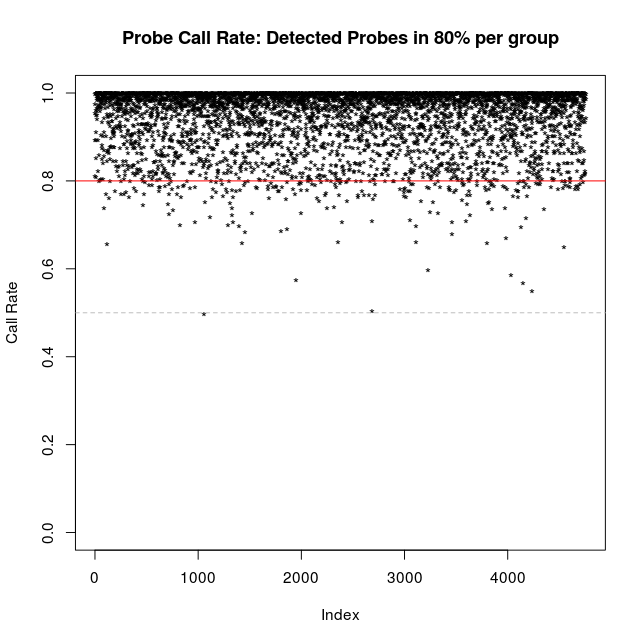

```r

# plot pdf
dev.off()
```

```
null device 
          1 
```

```r
pdf(file = paste(out_dir, "/", project_name, ".eset_bg.detected_probe_call_rate.pdf", 
    sep = ""), width = 8, height = 8)
plot(good_probes_annotation$n_detected_call_rate, ylim = c(0, 1), pch = "*", 
    main = "Probe Call Rate: Detected Probes in 80% per group", ylab = "Call Rate")
abline(h = 0.5, col = "grey", lty = 2)
abline(h = 0.8, col = "red")
dev.off()
```

```
null device 
          1 
```


****

Transform and Normalise
=======================
See **Comparison of normalization methods for Illumina BeadChip HumanHT-12 v3**
BMC Genomics. 2010; 11: 349. Ramona Schmid et al
http://www.pubmedcentral.nih.gov/articlerender.fcgi?artid=3091625&tool=pmcentrez&rendertype=abstract
Figure 10 Pearson correlation of log2 ratios for different normalization methods and qRT-PCR. 
This study selects bg_rma_log_rsn as the best.
Here we have used a better method for background correction, followed by log2 transformation and robust-splince normalisation (rsn).
The robust spline normalization (RSN) algorithm combines the features of quantile and loess normalization.

## 1. lumiExpresso

```r
# See Comparison of normalization methods for Illumina BeadChip HumanHT-12
# v3.  BMC Genomics. 2010; 11: 349.  Ramona Schmid et al Figure 10 Pearson
# correlation of log2 ratios for different normalization methods and
# qRT-PCR.  This study selects bg_rma_log_rsn as the best
# http://www.pubmedcentral.nih.gov/articlerender.fcgi?artid=3091625&tool=pmcentrez&rendertype=abstract

# log2 > rsn
eset_bg_log2_rsn_0 <- lumiExpresso(eset_bg, bg.correct = FALSE, variance.stabilize = TRUE, 
    varianceStabilize.param = list(method = paste(transform_method, sep = "")), 
    normalize.param = list(method = paste(norm_method, sep = "")), verbose = FALSE)
```

```
Perform log2 transformation ...
Perform rsn normalization ...
2014-01-26 19:05:00 , processing array  1 
2014-01-26 19:05:00 , processing array  2 
2014-01-26 19:05:00 , processing array  3 
2014-01-26 19:05:00 , processing array  4 
2014-01-26 19:05:00 , processing array  5 
2014-01-26 19:05:00 , processing array  6 
2014-01-26 19:05:00 , processing array  7 
2014-01-26 19:05:01 , processing array  8 
2014-01-26 19:05:01 , processing array  9 
2014-01-26 19:05:01 , processing array  10 
2014-01-26 19:05:01 , processing array  11 
2014-01-26 19:05:01 , processing array  12 
2014-01-26 19:05:01 , processing array  13 
2014-01-26 19:05:01 , processing array  14 
2014-01-26 19:05:01 , processing array  15 
2014-01-26 19:05:01 , processing array  16 
2014-01-26 19:05:01 , processing array  17 
2014-01-26 19:05:02 , processing array  18 
2014-01-26 19:05:02 , processing array  19 
2014-01-26 19:05:02 , processing array  20 
2014-01-26 19:05:02 , processing array  21 
2014-01-26 19:05:02 , processing array  22 
2014-01-26 19:05:02 , processing array  23 
2014-01-26 19:05:02 , processing array  24 
2014-01-26 19:05:02 , processing array  25 
2014-01-26 19:05:02 , processing array  26 
2014-01-26 19:05:02 , processing array  27 
2014-01-26 19:05:03 , processing array  28 
2014-01-26 19:05:03 , processing array  29 
2014-01-26 19:05:03 , processing array  30 
2014-01-26 19:05:03 , processing array  31 
2014-01-26 19:05:03 , processing array  32 
2014-01-26 19:05:03 , processing array  33 
2014-01-26 19:05:03 , processing array  34 
2014-01-26 19:05:03 , processing array  35 
2014-01-26 19:05:03 , processing array  36 
2014-01-26 19:05:03 , processing array  37 
2014-01-26 19:05:04 , processing array  38 
2014-01-26 19:05:04 , processing array  39 
2014-01-26 19:05:04 , processing array  40 
2014-01-26 19:05:04 , processing array  41 
2014-01-26 19:05:04 , processing array  42 
2014-01-26 19:05:04 , processing array  43 
2014-01-26 19:05:04 , processing array  44 
2014-01-26 19:05:04 , processing array  45 
2014-01-26 19:05:04 , processing array  46 
2014-01-26 19:05:04 , processing array  47 
2014-01-26 19:05:04 , processing array  48 
2014-01-26 19:05:05 , processing array  49 
2014-01-26 19:05:05 , processing array  50 
2014-01-26 19:05:05 , processing array  51 
2014-01-26 19:05:05 , processing array  52 
2014-01-26 19:05:05 , processing array  53 
2014-01-26 19:05:05 , processing array  54 
2014-01-26 19:05:05 , processing array  55 
2014-01-26 19:05:05 , processing array  56 
2014-01-26 19:05:05 , processing array  57 
2014-01-26 19:05:05 , processing array  58 
2014-01-26 19:05:06 , processing array  59 
2014-01-26 19:05:06 , processing array  60 
2014-01-26 19:05:06 , processing array  61 
2014-01-26 19:05:06 , processing array  62 
2014-01-26 19:05:06 , processing array  63 
2014-01-26 19:05:06 , processing array  64 
2014-01-26 19:05:06 , processing array  65 
2014-01-26 19:05:06 , processing array  66 
2014-01-26 19:05:06 , processing array  67 
2014-01-26 19:05:06 , processing array  68 
2014-01-26 19:05:06 , processing array  69 
2014-01-26 19:05:07 , processing array  70 
2014-01-26 19:05:07 , processing array  71 
2014-01-26 19:05:07 , processing array  72 
2014-01-26 19:05:07 , processing array  73 
2014-01-26 19:05:07 , processing array  74 
2014-01-26 19:05:07 , processing array  75 
2014-01-26 19:05:07 , processing array  76 
2014-01-26 19:05:07 , processing array  77 
2014-01-26 19:05:07 , processing array  78 
2014-01-26 19:05:07 , processing array  79 
2014-01-26 19:05:08 , processing array  80 
2014-01-26 19:05:08 , processing array  81 
2014-01-26 19:05:08 , processing array  82 
2014-01-26 19:05:08 , processing array  83 
2014-01-26 19:05:08 , processing array  84 
2014-01-26 19:05:08 , processing array  85 
2014-01-26 19:05:08 , processing array  86 
2014-01-26 19:05:08 , processing array  87 
2014-01-26 19:05:08 , processing array  88 
2014-01-26 19:05:08 , processing array  89 
2014-01-26 19:05:09 , processing array  90 
2014-01-26 19:05:09 , processing array  91 
2014-01-26 19:05:09 , processing array  92 
2014-01-26 19:05:09 , processing array  93 
2014-01-26 19:05:09 , processing array  94 
2014-01-26 19:05:09 , processing array  95 
2014-01-26 19:05:09 , processing array  96 
2014-01-26 19:05:09 , processing array  97 
2014-01-26 19:05:09 , processing array  98 
2014-01-26 19:05:09 , processing array  99 
2014-01-26 19:05:09 , processing array  100 
2014-01-26 19:05:10 , processing array  101 
2014-01-26 19:05:10 , processing array  102 
2014-01-26 19:05:10 , processing array  103 
2014-01-26 19:05:10 , processing array  104 
2014-01-26 19:05:10 , processing array  105 
2014-01-26 19:05:10 , processing array  106 
2014-01-26 19:05:10 , processing array  107 
2014-01-26 19:05:10 , processing array  108 
2014-01-26 19:05:10 , processing array  109 
2014-01-26 19:05:10 , processing array  110 
2014-01-26 19:05:11 , processing array  111 
2014-01-26 19:05:11 , processing array  112 
2014-01-26 19:05:11 , processing array  113 
2014-01-26 19:05:11 , processing array  114 
2014-01-26 19:05:11 , processing array  115 
2014-01-26 19:05:11 , processing array  116 
2014-01-26 19:05:11 , processing array  117 
2014-01-26 19:05:11 , processing array  118 
2014-01-26 19:05:11 , processing array  119 
2014-01-26 19:05:11 , processing array  120 
2014-01-26 19:05:11 , processing array  121 
2014-01-26 19:05:12 , processing array  122 
2014-01-26 19:05:12 , processing array  123 
2014-01-26 19:05:12 , processing array  124 
2014-01-26 19:05:12 , processing array  125 
2014-01-26 19:05:12 , processing array  126 
2014-01-26 19:05:12 , processing array  127 
2014-01-26 19:05:12 , processing array  128 
2014-01-26 19:05:12 , processing array  129 
2014-01-26 19:05:12 , processing array  130 
2014-01-26 19:05:12 , processing array  131 
2014-01-26 19:05:13 , processing array  132 
2014-01-26 19:05:13 , processing array  133 
2014-01-26 19:05:13 , processing array  134 
2014-01-26 19:05:13 , processing array  135 
2014-01-26 19:05:13 , processing array  136 
2014-01-26 19:05:13 , processing array  137 
2014-01-26 19:05:13 , processing array  138 
2014-01-26 19:05:13 , processing array  139 
2014-01-26 19:05:13 , processing array  140 
2014-01-26 19:05:13 , processing array  141 
2014-01-26 19:05:14 , processing array  142 
2014-01-26 19:05:14 , processing array  143 
2014-01-26 19:05:14 , processing array  144 
2014-01-26 19:05:14 , processing array  145 
2014-01-26 19:05:14 , processing array  146 
2014-01-26 19:05:14 , processing array  147 
2014-01-26 19:05:14 , processing array  148 
2014-01-26 19:05:14 , processing array  149 
2014-01-26 19:05:14 , processing array  150 
2014-01-26 19:05:14 , processing array  151 
2014-01-26 19:05:15 , processing array  152 
2014-01-26 19:05:15 , processing array  153 
2014-01-26 19:05:15 , processing array  154 
2014-01-26 19:05:15 , processing array  155 
2014-01-26 19:05:15 , processing array  156 
2014-01-26 19:05:15 , processing array  157 
2014-01-26 19:05:15 , processing array  158 
2014-01-26 19:05:15 , processing array  159 
2014-01-26 19:05:15 , processing array  160 
2014-01-26 19:05:15 , processing array  161 
2014-01-26 19:05:15 , processing array  162 
2014-01-26 19:05:16 , processing array  163 
2014-01-26 19:05:16 , processing array  164 
2014-01-26 19:05:16 , processing array  165 
2014-01-26 19:05:16 , processing array  166 
2014-01-26 19:05:16 , processing array  167 
2014-01-26 19:05:16 , processing array  168 
2014-01-26 19:05:16 , processing array  169 
2014-01-26 19:05:16 , processing array  170 
2014-01-26 19:05:16 , processing array  171 
2014-01-26 19:05:16 , processing array  172 
2014-01-26 19:05:17 , processing array  173 
2014-01-26 19:05:17 , processing array  174 
2014-01-26 19:05:17 , processing array  175 
2014-01-26 19:05:17 , processing array  176 
2014-01-26 19:05:17 , processing array  177 
2014-01-26 19:05:17 , processing array  178 
2014-01-26 19:05:17 , processing array  179 
2014-01-26 19:05:17 , processing array  180 
2014-01-26 19:05:17 , processing array  181 
2014-01-26 19:05:17 , processing array  182 
2014-01-26 19:05:17 , processing array  183 
2014-01-26 19:05:18 , processing array  184 
2014-01-26 19:05:18 , processing array  185 
2014-01-26 19:05:18 , processing array  186 
2014-01-26 19:05:18 , processing array  187 
2014-01-26 19:05:18 , processing array  188 
2014-01-26 19:05:18 , processing array  189 
2014-01-26 19:05:18 , processing array  190 
2014-01-26 19:05:18 , processing array  191 
2014-01-26 19:05:18 , processing array  192 
2014-01-26 19:05:18 , processing array  193 
2014-01-26 19:05:19 , processing array  194 
2014-01-26 19:05:19 , processing array  195 
2014-01-26 19:05:19 , processing array  196 
2014-01-26 19:05:19 , processing array  197 
2014-01-26 19:05:19 , processing array  198 
2014-01-26 19:05:19 , processing array  199 
2014-01-26 19:05:19 , processing array  200 
2014-01-26 19:05:19 , processing array  201 
2014-01-26 19:05:19 , processing array  202 
2014-01-26 19:05:19 , processing array  203 
2014-01-26 19:05:20 , processing array  204 
2014-01-26 19:05:20 , processing array  205 
2014-01-26 19:05:20 , processing array  206 
2014-01-26 19:05:20 , processing array  207 
2014-01-26 19:05:20 , processing array  208 
2014-01-26 19:05:20 , processing array  209 
2014-01-26 19:05:20 , processing array  210 
2014-01-26 19:05:20 , processing array  211 
2014-01-26 19:05:20 , processing array  212 
2014-01-26 19:05:20 , processing array  213 
2014-01-26 19:05:21 , processing array  214 
2014-01-26 19:05:21 , processing array  215 
2014-01-26 19:05:21 , processing array  216 
2014-01-26 19:05:21 , processing array  217 
2014-01-26 19:05:21 , processing array  218 
2014-01-26 19:05:21 , processing array  219 
2014-01-26 19:05:21 , processing array  220 
2014-01-26 19:05:21 , processing array  221 
2014-01-26 19:05:21 , processing array  222 
2014-01-26 19:05:21 , processing array  223 
2014-01-26 19:05:21 , processing array  224 
2014-01-26 19:05:22 , processing array  225 
2014-01-26 19:05:22 , processing array  226 
2014-01-26 19:05:22 , processing array  227 
2014-01-26 19:05:22 , processing array  228 
2014-01-26 19:05:22 , processing array  229 
2014-01-26 19:05:22 , processing array  230 
2014-01-26 19:05:22 , processing array  231 
2014-01-26 19:05:22 , processing array  232 
2014-01-26 19:05:22 , processing array  233 
2014-01-26 19:05:22 , processing array  234 
2014-01-26 19:05:23 , processing array  235 
2014-01-26 19:05:23 , processing array  236 
2014-01-26 19:05:23 , processing array  237 
2014-01-26 19:05:23 , processing array  238 
2014-01-26 19:05:23 , processing array  239 
2014-01-26 19:05:23 , processing array  240 
2014-01-26 19:05:23 , processing array  241 
2014-01-26 19:05:23 , processing array  242 
2014-01-26 19:05:23 , processing array  243 
2014-01-26 19:05:23 , processing array  244 
2014-01-26 19:05:24 , processing array  245 
2014-01-26 19:05:24 , processing array  246 
2014-01-26 19:05:24 , processing array  247 
2014-01-26 19:05:24 , processing array  248 
2014-01-26 19:05:24 , processing array  249 
2014-01-26 19:05:24 , processing array  250 
2014-01-26 19:05:24 , processing array  251 
2014-01-26 19:05:24 , processing array  252 
2014-01-26 19:05:24 , processing array  253 
2014-01-26 19:05:24 , processing array  254 
2014-01-26 19:05:24 , processing array  255 
2014-01-26 19:05:25 , processing array  256 
2014-01-26 19:05:25 , processing array  257 
2014-01-26 19:05:25 , processing array  258 
2014-01-26 19:05:25 , processing array  259 
2014-01-26 19:05:25 , processing array  260 
2014-01-26 19:05:25 , processing array  261 
2014-01-26 19:05:25 , processing array  262 
2014-01-26 19:05:25 , processing array  263 
2014-01-26 19:05:25 , processing array  264 
2014-01-26 19:05:25 , processing array  265 
2014-01-26 19:05:26 , processing array  266 
2014-01-26 19:05:26 , processing array  267 
2014-01-26 19:05:26 , processing array  268 
2014-01-26 19:05:26 , processing array  269 
2014-01-26 19:05:26 , processing array  270 
2014-01-26 19:05:26 , processing array  271 
2014-01-26 19:05:26 , processing array  272 
2014-01-26 19:05:26 , processing array  273 
2014-01-26 19:05:26 , processing array  274 
2014-01-26 19:05:26 , processing array  275 
2014-01-26 19:05:27 , processing array  276 
2014-01-26 19:05:27 , processing array  277 
2014-01-26 19:05:27 , processing array  278 
2014-01-26 19:05:27 , processing array  279 
2014-01-26 19:05:27 , processing array  280 
2014-01-26 19:05:27 , processing array  281 
2014-01-26 19:05:27 , processing array  282 
2014-01-26 19:05:27 , processing array  283 
2014-01-26 19:05:27 , processing array  284 
2014-01-26 19:05:27 , processing array  285 
2014-01-26 19:05:27 , processing array  286 
2014-01-26 19:05:28 , processing array  287 
2014-01-26 19:05:28 , processing array  288 
2014-01-26 19:05:28 , processing array  289 
2014-01-26 19:05:28 , processing array  290 
2014-01-26 19:05:28 , processing array  291 
2014-01-26 19:05:28 , processing array  292 
2014-01-26 19:05:28 , processing array  293 
2014-01-26 19:05:28 , processing array  294 
2014-01-26 19:05:28 , processing array  295 
2014-01-26 19:05:28 , processing array  296 
2014-01-26 19:05:29 , processing array  297 
2014-01-26 19:05:29 , processing array  298 
2014-01-26 19:05:29 , processing array  299 
2014-01-26 19:05:29 , processing array  300 
2014-01-26 19:05:29 , processing array  301 
2014-01-26 19:05:29 , processing array  302 
2014-01-26 19:05:29 , processing array  303 
2014-01-26 19:05:29 , processing array  304 
2014-01-26 19:05:29 , processing array  305 
2014-01-26 19:05:29 , processing array  306 
2014-01-26 19:05:30 , processing array  307 
2014-01-26 19:05:30 , processing array  308 
2014-01-26 19:05:30 , processing array  309 
2014-01-26 19:05:30 , processing array  310 
2014-01-26 19:05:30 , processing array  311 
2014-01-26 19:05:30 , processing array  312 
2014-01-26 19:05:30 , processing array  313 
2014-01-26 19:05:30 , processing array  314 
2014-01-26 19:05:30 , processing array  315 
2014-01-26 19:05:30 , processing array  316 
2014-01-26 19:05:30 , processing array  317 
2014-01-26 19:05:31 , processing array  318 
2014-01-26 19:05:31 , processing array  319 
2014-01-26 19:05:31 , processing array  320 
2014-01-26 19:05:31 , processing array  321 
2014-01-26 19:05:31 , processing array  322 
2014-01-26 19:05:31 , processing array  323 
2014-01-26 19:05:31 , processing array  324 
2014-01-26 19:05:31 , processing array  325 
2014-01-26 19:05:31 , processing array  326 
2014-01-26 19:05:31 , processing array  327 
2014-01-26 19:05:32 , processing array  328 
2014-01-26 19:05:32 , processing array  329 
2014-01-26 19:05:32 , processing array  330 
2014-01-26 19:05:32 , processing array  331 
2014-01-26 19:05:32 , processing array  332 
2014-01-26 19:05:32 , processing array  333 
2014-01-26 19:05:32 , processing array  334 
2014-01-26 19:05:32 , processing array  335 
2014-01-26 19:05:32 , processing array  336 
2014-01-26 19:05:32 , processing array  337 
2014-01-26 19:05:33 , processing array  338 
2014-01-26 19:05:33 , processing array  339 
2014-01-26 19:05:33 , processing array  340 
2014-01-26 19:05:33 , processing array  341 
2014-01-26 19:05:33 , processing array  342 
2014-01-26 19:05:33 , processing array  343 
2014-01-26 19:05:33 , processing array  344 
2014-01-26 19:05:33 , processing array  345 
2014-01-26 19:05:33 , processing array  346 
2014-01-26 19:05:33 , processing array  347 
2014-01-26 19:05:33 , processing array  348 
2014-01-26 19:05:34 , processing array  349 
2014-01-26 19:05:34 , processing array  350 
2014-01-26 19:05:34 , processing array  351 
2014-01-26 19:05:34 , processing array  352 
2014-01-26 19:05:34 , processing array  353 
2014-01-26 19:05:34 , processing array  354 
2014-01-26 19:05:34 , processing array  355 
2014-01-26 19:05:34 , processing array  356 
2014-01-26 19:05:34 , processing array  357 
2014-01-26 19:05:34 , processing array  358 
2014-01-26 19:05:35 , processing array  359 
2014-01-26 19:05:35 , processing array  360 
2014-01-26 19:05:35 , processing array  361 
2014-01-26 19:05:35 , processing array  362 
2014-01-26 19:05:35 , processing array  363 
2014-01-26 19:05:35 , processing array  364 
2014-01-26 19:05:35 , processing array  365 
2014-01-26 19:05:35 , processing array  366 
2014-01-26 19:05:35 , processing array  367 
2014-01-26 19:05:35 , processing array  368 
2014-01-26 19:05:36 , processing array  369 
2014-01-26 19:05:36 , processing array  370 
2014-01-26 19:05:36 , processing array  371 
2014-01-26 19:05:36 , processing array  372 
2014-01-26 19:05:36 , processing array  373 
2014-01-26 19:05:36 , processing array  374 
2014-01-26 19:05:36 , processing array  375 
2014-01-26 19:05:36 , processing array  376 
2014-01-26 19:05:36 , processing array  377 
2014-01-26 19:05:36 , processing array  378 
2014-01-26 19:05:37 , processing array  379 
2014-01-26 19:05:37 , processing array  380 
2014-01-26 19:05:37 , processing array  381 
2014-01-26 19:05:37 , processing array  382 
2014-01-26 19:05:37 , processing array  383 
2014-01-26 19:05:37 , processing array  384 
2014-01-26 19:05:37 , processing array  385 
2014-01-26 19:05:37 , processing array  386 
2014-01-26 19:05:37 , processing array  387 
2014-01-26 19:05:37 , processing array  388 
2014-01-26 19:05:37 , processing array  389 
2014-01-26 19:05:38 , processing array  390 
2014-01-26 19:05:38 , processing array  391 
2014-01-26 19:05:38 , processing array  392 
2014-01-26 19:05:38 , processing array  393 
2014-01-26 19:05:38 , processing array  394 
2014-01-26 19:05:38 , processing array  395 
2014-01-26 19:05:38 , processing array  396 
2014-01-26 19:05:38 , processing array  397 
2014-01-26 19:05:38 , processing array  398 
2014-01-26 19:05:38 , processing array  399 
2014-01-26 19:05:39 , processing array  400 
2014-01-26 19:05:39 , processing array  401 
2014-01-26 19:05:39 , processing array  402 
2014-01-26 19:05:39 , processing array  403 
2014-01-26 19:05:39 , processing array  404 
2014-01-26 19:05:39 , processing array  405 
2014-01-26 19:05:39 , processing array  406 
2014-01-26 19:05:39 , processing array  407 
2014-01-26 19:05:39 , processing array  408 
2014-01-26 19:05:39 , processing array  409 
2014-01-26 19:05:40 , processing array  410 
2014-01-26 19:05:40 , processing array  411 
2014-01-26 19:05:40 , processing array  412 
2014-01-26 19:05:40 , processing array  413 
2014-01-26 19:05:40 , processing array  414 
2014-01-26 19:05:40 , processing array  415 
2014-01-26 19:05:40 , processing array  416 
2014-01-26 19:05:40 , processing array  417 
2014-01-26 19:05:40 , processing array  418 
2014-01-26 19:05:40 , processing array  419 
2014-01-26 19:05:40 , processing array  420 
2014-01-26 19:05:41 , processing array  421 
2014-01-26 19:05:41 , processing array  422 
2014-01-26 19:05:41 , processing array  423 
2014-01-26 19:05:41 , processing array  424 
2014-01-26 19:05:41 , processing array  425 
2014-01-26 19:05:41 , processing array  426 
2014-01-26 19:05:41 , processing array  427 
2014-01-26 19:05:41 , processing array  428 
2014-01-26 19:05:41 , processing array  429 
2014-01-26 19:05:41 , processing array  430 
2014-01-26 19:05:42 , processing array  431 
2014-01-26 19:05:42 , processing array  432 
2014-01-26 19:05:42 , processing array  433 
2014-01-26 19:05:42 , processing array  434 
2014-01-26 19:05:42 , processing array  435 
2014-01-26 19:05:42 , processing array  436 
2014-01-26 19:05:42 , processing array  437 
2014-01-26 19:05:42 , processing array  438 
2014-01-26 19:05:42 , processing array  439 
2014-01-26 19:05:42 , processing array  440 
2014-01-26 19:05:43 , processing array  441 
2014-01-26 19:05:43 , processing array  442 
2014-01-26 19:05:43 , processing array  443 
2014-01-26 19:05:43 , processing array  444 
2014-01-26 19:05:43 , processing array  445 
2014-01-26 19:05:43 , processing array  446 
2014-01-26 19:05:43 , processing array  447 
2014-01-26 19:05:43 , processing array  448 
2014-01-26 19:05:43 , processing array  449 
2014-01-26 19:05:43 , processing array  450 
2014-01-26 19:05:44 , processing array  451 
2014-01-26 19:05:44 , processing array  452 
2014-01-26 19:05:44 , processing array  453 
2014-01-26 19:05:44 , processing array  454 
2014-01-26 19:05:44 , processing array  455 
2014-01-26 19:05:44 , processing array  456 
2014-01-26 19:05:44 , processing array  457 
2014-01-26 19:05:44 , processing array  458 
2014-01-26 19:05:44 , processing array  459 
2014-01-26 19:05:44 , processing array  460 
2014-01-26 19:05:44 , processing array  461 
2014-01-26 19:05:45 , processing array  462 
2014-01-26 19:05:45 , processing array  463 
2014-01-26 19:05:45 , processing array  464 
2014-01-26 19:05:45 , processing array  465 
2014-01-26 19:05:45 , processing array  466 
2014-01-26 19:05:45 , processing array  467 
2014-01-26 19:05:45 , processing array  468 
2014-01-26 19:05:45 , processing array  469 
2014-01-26 19:05:45 , processing array  470 
2014-01-26 19:05:45 , processing array  471 
2014-01-26 19:05:46 , processing array  472 
2014-01-26 19:05:46 , processing array  473 
2014-01-26 19:05:46 , processing array  474 
2014-01-26 19:05:46 , processing array  475 
2014-01-26 19:05:46 , processing array  476 
2014-01-26 19:05:46 , processing array  477 
2014-01-26 19:05:46 , processing array  478 
2014-01-26 19:05:46 , processing array  479 
2014-01-26 19:05:46 , processing array  480 
2014-01-26 19:05:46 , processing array  481 
2014-01-26 19:05:47 , processing array  482 
2014-01-26 19:05:47 , processing array  483 
2014-01-26 19:05:47 , processing array  484 
2014-01-26 19:05:47 , processing array  485 
2014-01-26 19:05:47 , processing array  486 
2014-01-26 19:05:47 , processing array  487 
2014-01-26 19:05:47 , processing array  488 
2014-01-26 19:05:47 , processing array  489 
2014-01-26 19:05:47 , processing array  490 
2014-01-26 19:05:47 , processing array  491 
2014-01-26 19:05:48 , processing array  492 
2014-01-26 19:05:48 , processing array  493 
2014-01-26 19:05:48 , processing array  494 
2014-01-26 19:05:48 , processing array  495 
2014-01-26 19:05:48 , processing array  496 
2014-01-26 19:05:48 , processing array  497 
2014-01-26 19:05:48 , processing array  498 
2014-01-26 19:05:48 , processing array  499 
2014-01-26 19:05:48 , processing array  500 
2014-01-26 19:05:48 , processing array  501 
2014-01-26 19:05:48 , processing array  502 
2014-01-26 19:05:49 , processing array  503 
2014-01-26 19:05:49 , processing array  504 
2014-01-26 19:05:49 , processing array  505 
2014-01-26 19:05:49 , processing array  506 
2014-01-26 19:05:49 , processing array  507 
2014-01-26 19:05:49 , processing array  508 
2014-01-26 19:05:49 , processing array  509 
2014-01-26 19:05:49 , processing array  510 
2014-01-26 19:05:49 , processing array  511 
2014-01-26 19:05:49 , processing array  512 
2014-01-26 19:05:50 , processing array  513 
2014-01-26 19:05:50 , processing array  514 
2014-01-26 19:05:50 , processing array  515 
2014-01-26 19:05:50 , processing array  516 
2014-01-26 19:05:50 , processing array  517 
2014-01-26 19:05:50 , processing array  518 
2014-01-26 19:05:50 , processing array  519 
2014-01-26 19:05:50 , processing array  520 
2014-01-26 19:05:50 , processing array  521 
2014-01-26 19:05:50 , processing array  522 
2014-01-26 19:05:50 , processing array  523 
2014-01-26 19:05:51 , processing array  524 
2014-01-26 19:05:51 , processing array  525 
2014-01-26 19:05:51 , processing array  526 
2014-01-26 19:05:51 , processing array  527 
2014-01-26 19:05:51 , processing array  528 
2014-01-26 19:05:51 , processing array  529 
2014-01-26 19:05:51 , processing array  530 
2014-01-26 19:05:51 , processing array  531 
2014-01-26 19:05:51 , processing array  532 
2014-01-26 19:05:51 , processing array  533 
2014-01-26 19:05:52 , processing array  534 
2014-01-26 19:05:52 , processing array  535 
2014-01-26 19:05:52 , processing array  536 
2014-01-26 19:05:52 , processing array  537 
2014-01-26 19:05:52 , processing array  538 
2014-01-26 19:05:52 , processing array  539 
2014-01-26 19:05:52 , processing array  540 
2014-01-26 19:05:52 , processing array  541 
2014-01-26 19:05:52 , processing array  542 
2014-01-26 19:05:52 , processing array  543 
2014-01-26 19:05:53 , processing array  544 
2014-01-26 19:05:53 , processing array  545 
2014-01-26 19:05:53 , processing array  546 
2014-01-26 19:05:53 , processing array  547 
2014-01-26 19:05:53 , processing array  548 
2014-01-26 19:05:53 , processing array  549 
2014-01-26 19:05:53 , processing array  550 
2014-01-26 19:05:53 , processing array  551 
2014-01-26 19:05:53 , processing array  552 
2014-01-26 19:05:53 , processing array  553 
2014-01-26 19:05:53 , processing array  554 
2014-01-26 19:05:54 , processing array  555 
2014-01-26 19:05:54 , processing array  556 
2014-01-26 19:05:54 , processing array  557 
2014-01-26 19:05:54 , processing array  558 
2014-01-26 19:05:54 , processing array  559 
2014-01-26 19:05:54 , processing array  560 
2014-01-26 19:05:54 , processing array  561 
2014-01-26 19:05:54 , processing array  562 
2014-01-26 19:05:54 , processing array  563 
2014-01-26 19:05:54 , processing array  564 
2014-01-26 19:05:55 , processing array  565 
2014-01-26 19:05:55 , processing array  566 
2014-01-26 19:05:55 , processing array  567 
2014-01-26 19:05:55 , processing array  568 
2014-01-26 19:05:55 , processing array  569 
2014-01-26 19:05:55 , processing array  570 
2014-01-26 19:05:56 , processing array  571 
2014-01-26 19:05:56 , processing array  572 
2014-01-26 19:05:56 , processing array  573 
2014-01-26 19:05:56 , processing array  574 
2014-01-26 19:05:56 , processing array  575 
2014-01-26 19:05:56 , processing array  576 
2014-01-26 19:05:56 , processing array  577 
2014-01-26 19:05:56 , processing array  578 
2014-01-26 19:05:56 , processing array  579 
2014-01-26 19:05:56 , processing array  580 
2014-01-26 19:05:56 , processing array  581 
2014-01-26 19:05:57 , processing array  582 
2014-01-26 19:05:57 , processing array  583 
2014-01-26 19:05:57 , processing array  584 
2014-01-26 19:05:57 , processing array  585 
2014-01-26 19:05:57 , processing array  586 
2014-01-26 19:05:57 , processing array  587 
2014-01-26 19:05:57 , processing array  588 
2014-01-26 19:05:57 , processing array  589 
2014-01-26 19:05:57 , processing array  590 
2014-01-26 19:05:57 , processing array  591 
2014-01-26 19:05:58 , processing array  592 
2014-01-26 19:05:58 , processing array  593 
2014-01-26 19:05:58 , processing array  594 
2014-01-26 19:05:58 , processing array  595 
2014-01-26 19:05:58 , processing array  596 
2014-01-26 19:05:58 , processing array  597 
2014-01-26 19:05:58 , processing array  598 
2014-01-26 19:05:58 , processing array  599 
2014-01-26 19:05:58 , processing array  600 
2014-01-26 19:05:58 , processing array  601 
2014-01-26 19:05:58 , processing array  602 
2014-01-26 19:05:59 , processing array  603 
2014-01-26 19:05:59 , processing array  604 
2014-01-26 19:05:59 , processing array  605 
2014-01-26 19:05:59 , processing array  606 
2014-01-26 19:05:59 , processing array  607 
2014-01-26 19:05:59 , processing array  608 
Perform Quality Control assessment of the LumiBatch object ...
```


## 2. Save Transformed and Normalised data pre-sample removal

```r
# save log2 > rsn
save(eset_bg_log2_rsn_0, file = paste(out_dir, "/", project_name, ".eset_bg_log2_rsn_0.RData", 
    sep = ""), compress = T)
```


## 3. Write Expression data files for Transformed and Normalised data pre-sample removal

```r
# write_expression_files
write_expression_files(eset = eset_bg_log2_rsn_0, outfile = paste(out_dir, "/", 
    project_name, ".eset_bg_log2_rsn_0", sep = ""))
```

```
 Writing probe exprs matrix [ /media/D/expression/GAP_Expression/GAP_lumi_processing_26_01_2014_1390755915/GAP.eset_bg_log2_rsn_0.exprs_matrix.txt ] 
 
 Writing probe se.exprs matrix [ /media/D/expression/GAP_Expression/GAP_lumi_processing_26_01_2014_1390755915/GAP.eset_bg_log2_rsn_0.se.exprs_matrix.txt ] 
 
 Writing probe detection matrix [ /media/D/expression/GAP_Expression/GAP_lumi_processing_26_01_2014_1390755915/GAP.eset_bg_log2_rsn_0.detection_matrix.txt ] 
 
 Writing probe beadNum matrix [ /media/D/expression/GAP_Expression/GAP_lumi_processing_26_01_2014_1390755915/GAP.eset_bg_log2_rsn_0.beadNum_matrix.txt ] 
 
 Writing probe PCA matrix [ /media/D/expression/GAP_Expression/GAP_lumi_processing_26_01_2014_1390755915/GAP.eset_bg_log2_rsn_0.pca_matrix.txt ] 
 
 Writing pData slot of eset and adding PCA data to [ /media/D/expression/GAP_Expression/GAP_lumi_processing_26_01_2014_1390755915/GAP.eset_bg_log2_rsn_0.pData.txt ] 
 
 Writing fData slot of eset [ /media/D/expression/GAP_Expression/GAP_lumi_processing_26_01_2014_1390755915/GAP.eset_bg_log2_rsn_0.fData.txt ] 
 
```


QC Plots of `eset_bg_log2_rsn_0` pre-sample removal
-------------------------------------------------------------------

## basic_qc_plot_lumi eset_bg_log2_rsn_0 pre-sample removal

```r
# basic plots plot to screen
basic_qc_plot_lumi(eset_bg_log2_rsn_0)
```

```
 Running flashClust 
 
 beging plotting boxplot 
 
```


```
 beging plotting outlier 
 
```

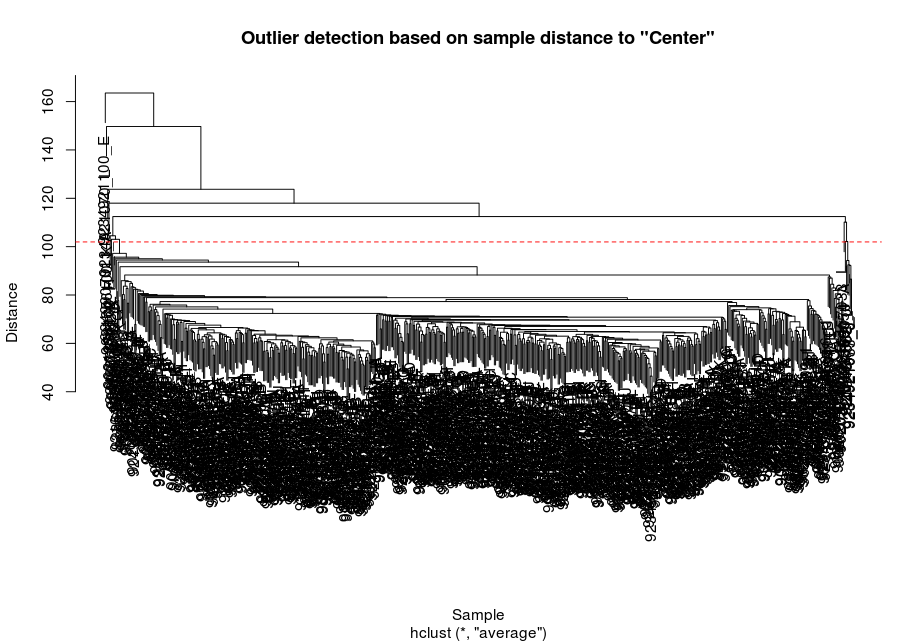

```
 beging plotting sampleTree <- flashClust( dist_exprs, method = "average") 
 
```


```
 beging plotting density 
 
```

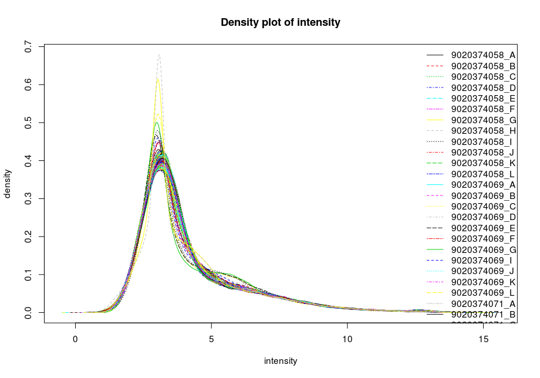

```
 beging plotting cv 
 
```

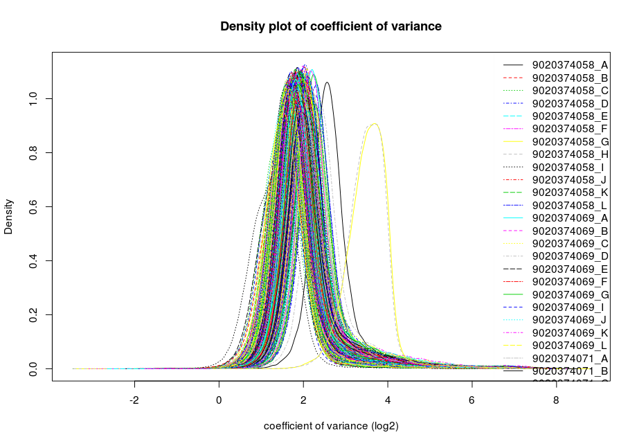

```r
par(def.par)
```


```r
pdf(file = paste(out_dir, "/", project_name, ".eset_bg_log2_rsn_0.basic_qc_plot_lumi.pdf", 
    sep = ""), width = 11, height = 8)
basic_qc_plot_lumi(eset_bg_log2_rsn_0)
```

```
 Running flashClust 
 
 beging plotting boxplot 
 
```

```
 beging plotting outlier 
 
```

```
 beging plotting sampleTree <- flashClust( dist_exprs, method = "average") 
 
```

```
 beging plotting density 
 
```

```
 beging plotting cv 
 
```

```r
dev.off()
```

```
pdf 
  2 
```

```r
par(def.par)
```


## coloured_dendrogram_lumi eset_bg_log2_rsn_0 pre-sample removal

```r
# coloured_dendrogram_lumi plot to screen
coloured_dendrogram_lumi(eset_bg_log2_rsn_0)
```

```
 get pheno data 
 
 basic colours 
 
 batch pheno data 
 
 batch colours 
 
 datExprs and sampleTree 
 
 plotDendroAndColors 
 
```

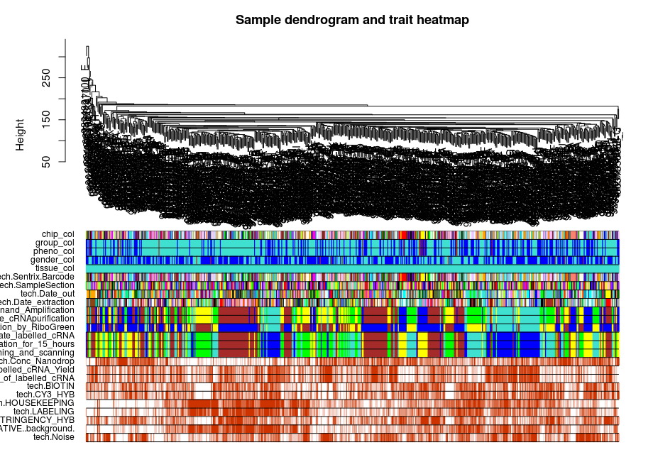

```r
par(def.par)
```


```r
pdf(file = paste(out_dir, "/", project_name, ".eset_bg_log2_rsn_0.coloured_dendrogram_lumi.pdf", 
    sep = ""), width = 11, height = 8)
coloured_dendrogram_lumi(eset_bg_log2_rsn_0)
```

```
 get pheno data 
 
 basic colours 
 
 batch pheno data 
 
 batch colours 
 
 datExprs and sampleTree 
 
 plotDendroAndColors 
 
```

```r
dev.off()
```

```
pdf 
  2 
```

```r
par(def.par)
```

 
## pca_plot_lumi eset_bg_log2_rsn_0 pre-sample removal

```r
# PCA plots plot to screen
pca_plot_lumi(eset_bg_log2_rsn_0)
```

```
 setting up data for qc plots 
 
 get pheno data 
 
 basic colours 
 
 batch pheno data 
 
 begin PCA plots 
 
 calculating PCs using prcomp() 
 
 plotting Proportion of Variance Explained 
 
```

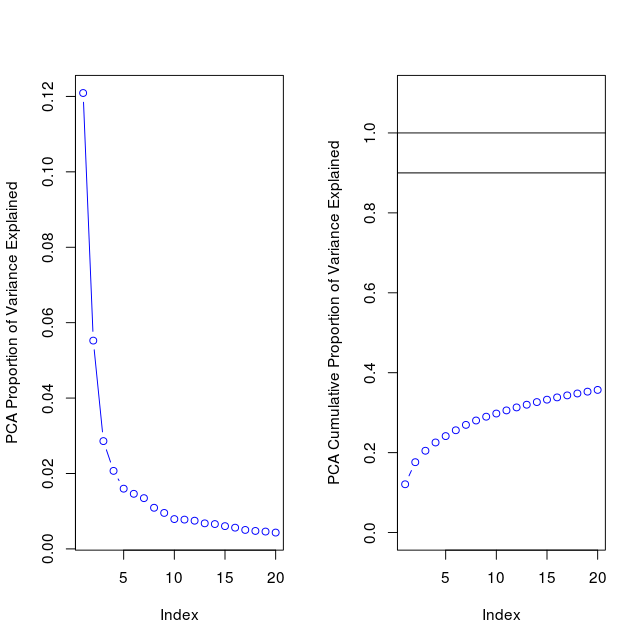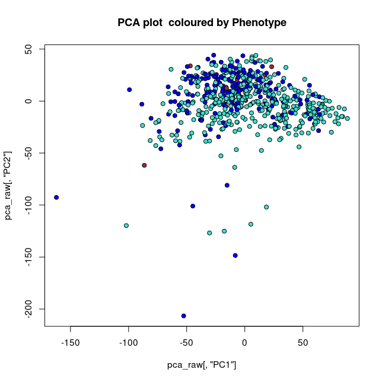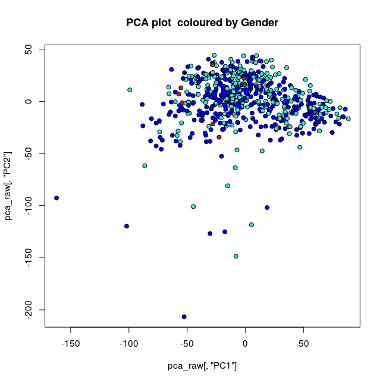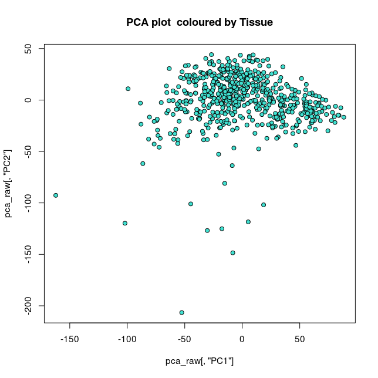

```
 begin looping through batch variable PCA plots  tech.Sentrix.Barcode 
 
```

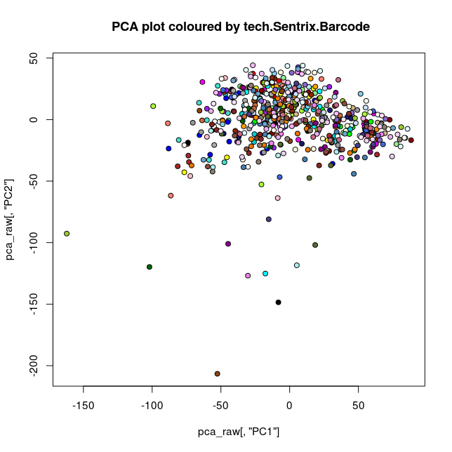

```
 begin looping through batch variable PCA plots  tech.SampleSection 
 
```

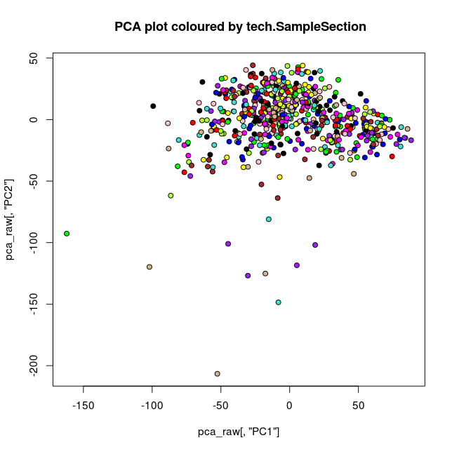

```
 begin looping through batch variable PCA plots  tech.Date_out 
 
```

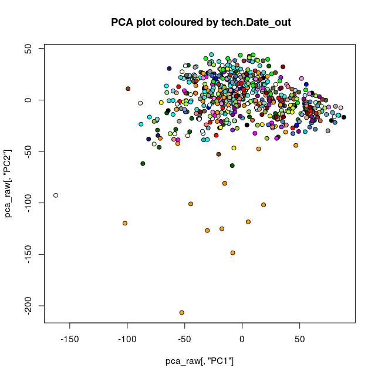

```
 begin looping through batch variable PCA plots  tech.Date_extraction 
 
```

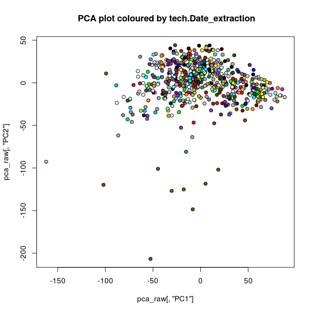

```
 begin looping through batch variable PCA plots  tech.Date_Dilutionand_Amplification 
 
```

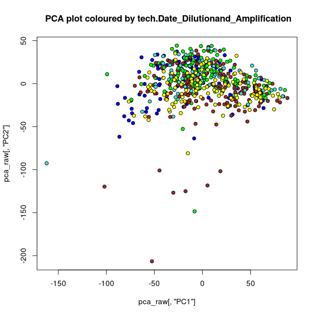

```
 begin looping through batch variable PCA plots  tech.Date_cRNApurification 
 
```


```
 begin looping through batch variable PCA plots  tech.Date_Quantitation_by_RiboGreen 
 
```

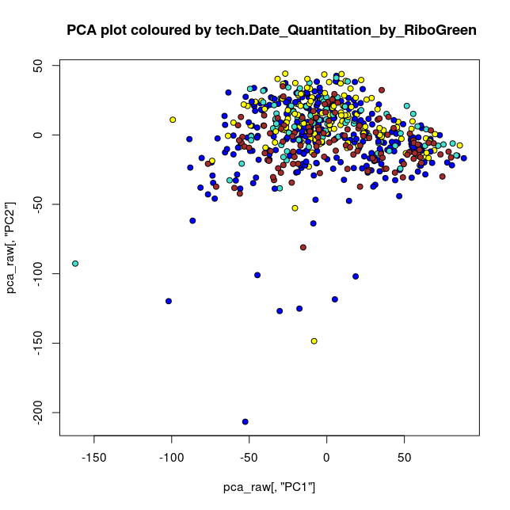

```
 begin looping through batch variable PCA plots  tech.Date_labelled_cRNA 
 
```


```
 begin looping through batch variable PCA plots  tech.Date_Hybridization_for_15_hours 
 
```

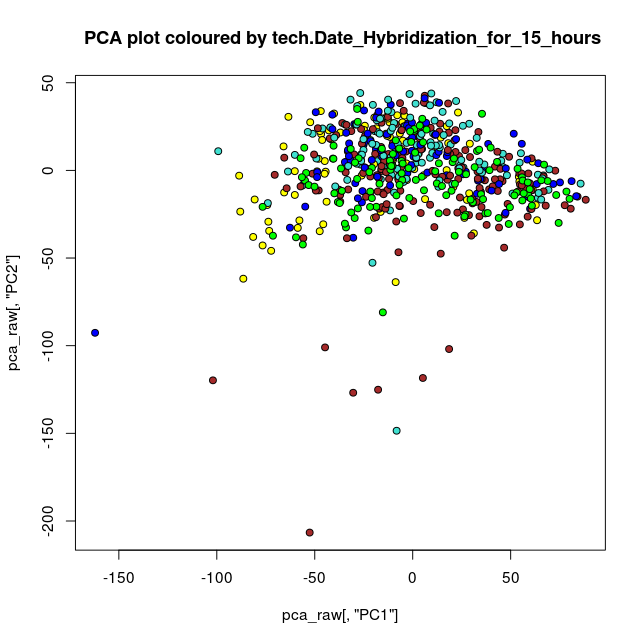

```
 begin looping through batch variable PCA plots  tech.Date_Washing_and_scanning 
 
```


```
 begin looping through batch variable PCA plots  tech.Conc_Nanodrop 
 
```

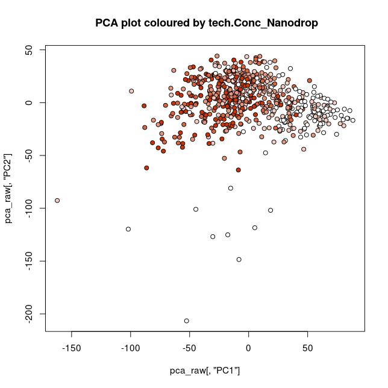

```
 begin looping through batch variable PCA plots  tech.labelled_cRNA_Yield 
 
```

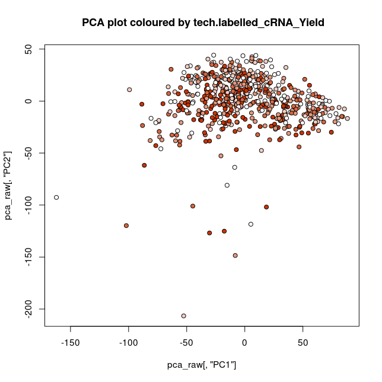

```
 begin looping through batch variable PCA plots  tech.concentration_of_labelled_cRNA 
 
```


```
 begin looping through batch variable PCA plots  tech.BIOTIN 
 
```

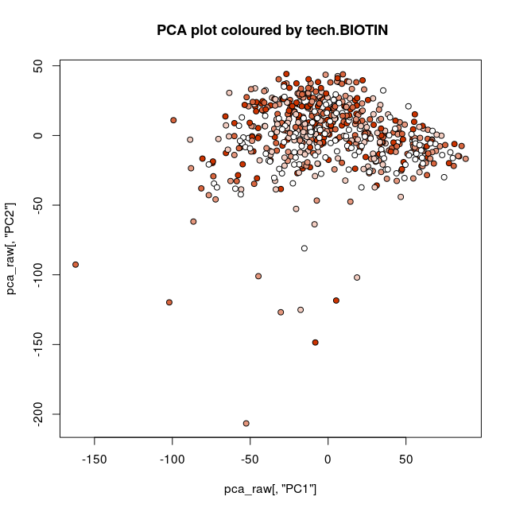

```
 begin looping through batch variable PCA plots  tech.CY3_HYB 
 
```

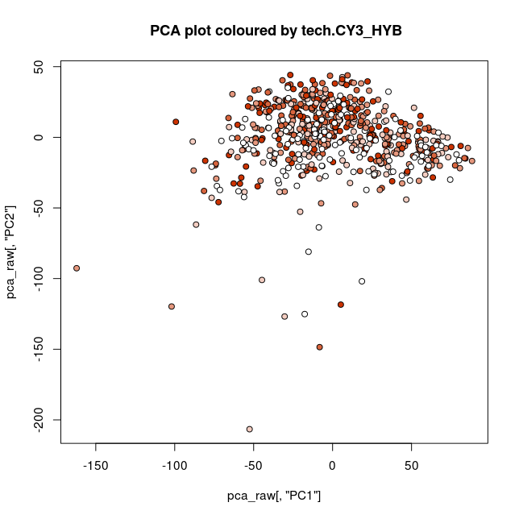

```
 begin looping through batch variable PCA plots  tech.HOUSEKEEPING 
 
```

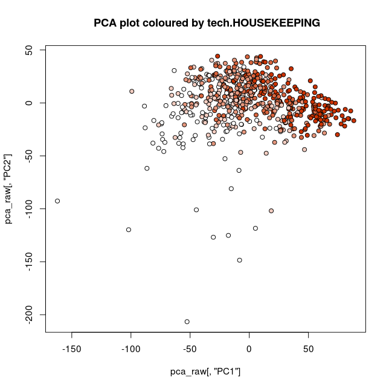

```
 begin looping through batch variable PCA plots  tech.LABELING 
 
```

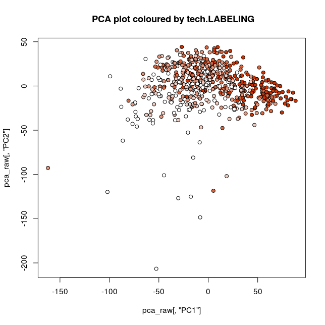

```
 begin looping through batch variable PCA plots  tech.LOW_STRINGENCY_HYB 
 
```

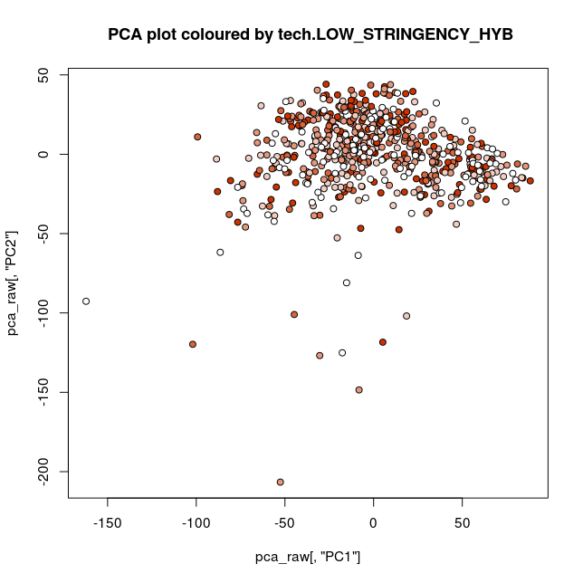

```
 begin looping through batch variable PCA plots  tech.NEGATIVE..background. 
 
```

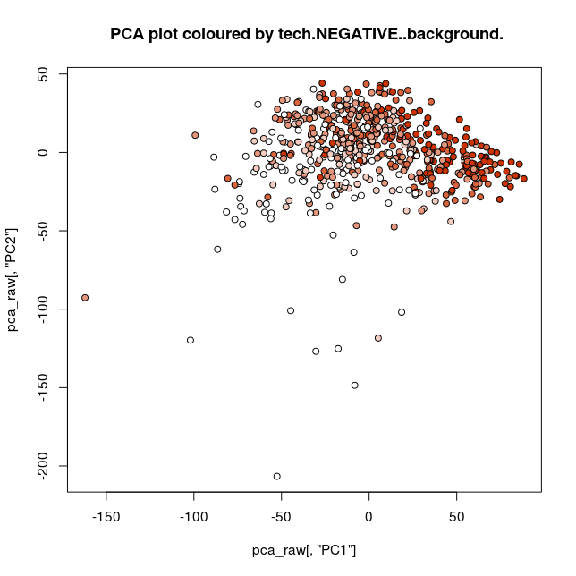

```
 begin looping through batch variable PCA plots  tech.Noise 
 
```

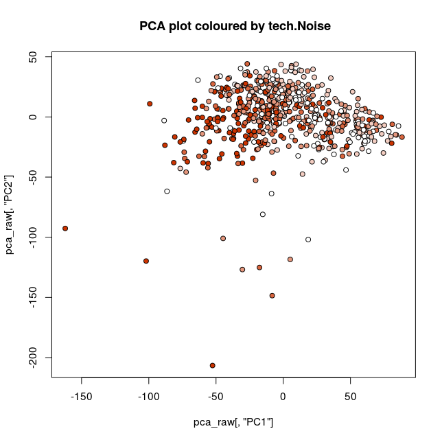

```r
par(def.par)
```


```r
pdf(file = paste(out_dir, "/", project_name, ".eset_bg_log2_rsn_0.pca_plot_lumi.pdf", 
    sep = ""), width = 7, height = 7)
pca_plot_lumi(eset_bg_log2_rsn_0)
```

```
 setting up data for qc plots 
 
 get pheno data 
 
 basic colours 
 
 batch pheno data 
 
 begin PCA plots 
 
 calculating PCs using prcomp() 
 
 plotting Proportion of Variance Explained 
 
```

```
 begin looping through batch variable PCA plots  tech.Sentrix.Barcode 
 
```

```
 begin looping through batch variable PCA plots  tech.SampleSection 
 
```

```
 begin looping through batch variable PCA plots  tech.Date_out 
 
```

```
 begin looping through batch variable PCA plots  tech.Date_extraction 
 
```

```
 begin looping through batch variable PCA plots  tech.Date_Dilutionand_Amplification 
 
```

```
 begin looping through batch variable PCA plots  tech.Date_cRNApurification 
 
```

```
 begin looping through batch variable PCA plots  tech.Date_Quantitation_by_RiboGreen 
 
```

```
 begin looping through batch variable PCA plots  tech.Date_labelled_cRNA 
 
```

```
 begin looping through batch variable PCA plots  tech.Date_Hybridization_for_15_hours 
 
```

```
 begin looping through batch variable PCA plots  tech.Date_Washing_and_scanning 
 
```

```
 begin looping through batch variable PCA plots  tech.Conc_Nanodrop 
 
```

```
 begin looping through batch variable PCA plots  tech.labelled_cRNA_Yield 
 
```

```
 begin looping through batch variable PCA plots  tech.concentration_of_labelled_cRNA 
 
```

```
 begin looping through batch variable PCA plots  tech.BIOTIN 
 
```

```
 begin looping through batch variable PCA plots  tech.CY3_HYB 
 
```

```
 begin looping through batch variable PCA plots  tech.HOUSEKEEPING 
 
```

```
 begin looping through batch variable PCA plots  tech.LABELING 
 
```

```
 begin looping through batch variable PCA plots  tech.LOW_STRINGENCY_HYB 
 
```

```
 begin looping through batch variable PCA plots  tech.NEGATIVE..background. 
 
```

```
 begin looping through batch variable PCA plots  tech.Noise 
 
```

```r
dev.off()
```

```
pdf 
  2 
```

```r
par(def.par)
```


## SampleNetwork Plots eset_bg_log2_rsn_0 pre-sample removal

```r
# SampleNetwork Plots plot to screen
sampleNetwork_plot_all_lumi(eset_bg_log2_rsn_0, colBy = "chip")
```

```
 setting up data for qc plots 
 
 expression matrix and IAC 
 
 fundamentalNetworkConcepts 
 
 colorvec [ chip ] 
 
 begin SampleNetwork plots 
 
```

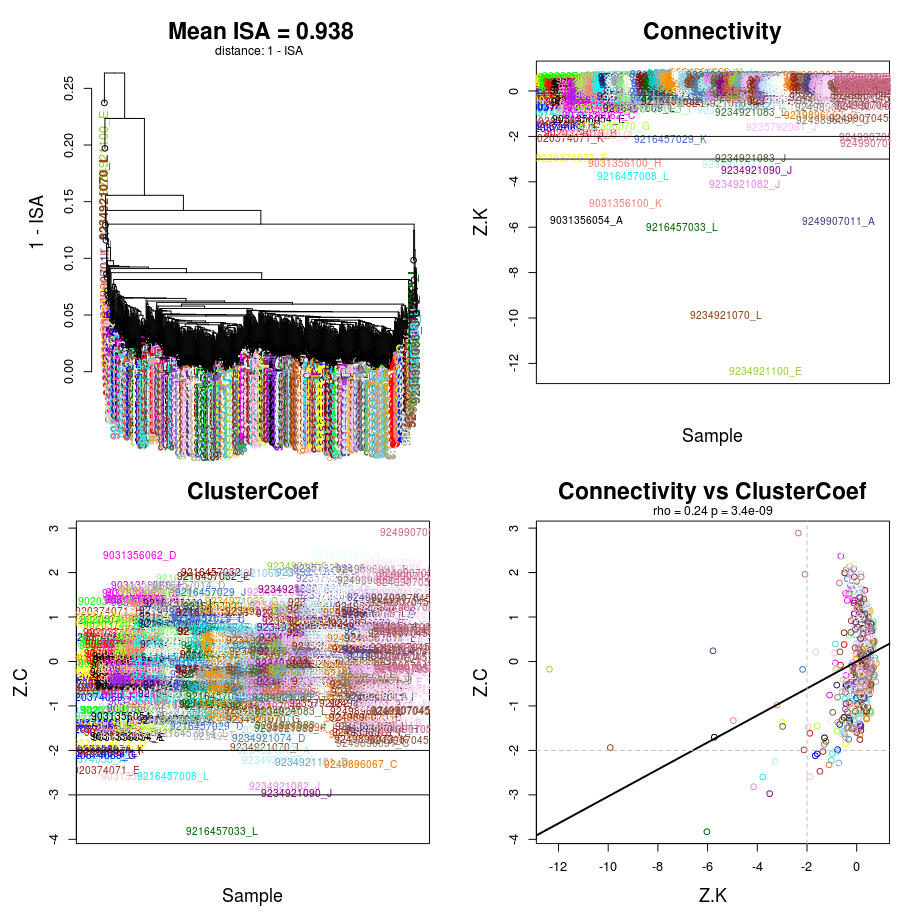

```r
sampleNetwork_plot_all_lumi(eset_bg_log2_rsn_0, colBy = "group")
```

```
 setting up data for qc plots 
 
 expression matrix and IAC 
 
 fundamentalNetworkConcepts 
 
 colorvec [ group ] 
 
 begin SampleNetwork plots 
 
```

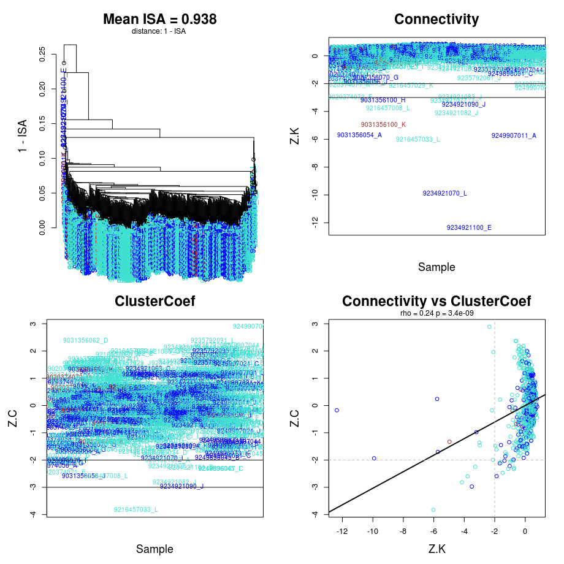

```r
par(def.par)
```


```r
pdf(file = paste(out_dir, "/", project_name, ".eset_bg_log2_rsn_0.sampleNetwork_plot_all_lumi.pdf", 
    sep = ""), width = 8, height = 8)
sampleNetwork_plot_all_lumi(eset_bg_log2_rsn_0, colBy = "chip")
```

```
 setting up data for qc plots 
 
 expression matrix and IAC 
 
 fundamentalNetworkConcepts 
 
 colorvec [ chip ] 
 
 begin SampleNetwork plots 
 
```

```r
sampleNetwork_plot_all_lumi(eset_bg_log2_rsn_0, colBy = "group")
```

```
 setting up data for qc plots 
 
 expression matrix and IAC 
 
 fundamentalNetworkConcepts 
 
 colorvec [ group ] 
 
 begin SampleNetwork plots 
 
```

```r
dev.off()
```

```
pdf 
  2 
```

```r
par(def.par)
```


*****

SampleNetwork : Id outlier samples 
===================================

Adapted from : ***Network methods for describing sample relationships in genomic datasets: application to Huntington's disease. Michael C Oldham et al.***
BMC Syst Biol. 2012; 6: 63.
http://www.ncbi.nlm.nih.gov/pmc/articles/PMC3441531/?tool=pmcentrez&report=abstract

## Basic Iterative SampleNetwork outlier removal

```r
# Id outlier samples Adapted from : Network methods for describing sample
# relationships in genomic datasets: application to Huntington's disease.
# Michael C Oldham et al.  BMC Syst Biol. 2012; 6: 63.
# http://www.ncbi.nlm.nih.gov/pmc/articles/PMC3441531/?tool=pmcentrez&report=abstract
# Oginal Code :

# basic_sampleNetworkIterate
ISAoutliers <- basic_sampleNetworkIterate(eset = eset_bg_log2_rsn_0, col_by_chip = 0, 
    groups = "byGroup", outfile = paste(out_dir, "/", project_name, ".eset_bg_log2_rsn_0", 
        sep = ""), IACthresh = 0.95, sd_thrs = iac_sd_thrs)
```

```
 Number of Groups [ 3 ]
Group Names [ CONTROL CASE UNKNOWN ] 
 
The sample names in the controlData don't match sampleNames(object).
 Subset eset to group [ CONTROL ] 
 
The sample names in the controlData don't match sampleNames(object).
 doing group [ CONTROL ] 
 
 Groups [ CONTROL ] 
 
 doing group [ CONTROL ] 
 
The sample names in the controlData don't match sampleNames(object).
The sample names in the controlData don't match sampleNames(object).
The sample names in the controlData don't match sampleNames(object).
 Calculating fundamentalNetworkConcepts Metrics  
 
 Number of Z.K outliers [ 6 ] 
 
 mean_IAC [ 0.94 ] 
 
 Making Data fram of fundamentalNetworkConcepts Metrics  
 
 Saving Data fram of fundamentalNetworkConcepts Metrics [ /media/D/expression/GAP_Expression/GAP_lumi_processing_26_01_2014_1390755915/GAP.eset_bg_log2_rsn_0.group.CONTROL.round.1.SampleNetwork_Stats.txt ] 
 
 Saving Data fram of fundamentalNetworkConcepts Z.K outliers [ /media/D/expression/GAP_Expression/GAP_lumi_processing_26_01_2014_1390755915/GAP.eset_bg_log2_rsn_0.group.CONTROL.round.1.SampleNetwork_Stats_Z.K_outliers.txt ] 
 
The sample names in the controlData don't match sampleNames(object).
 Plotting SampleNetwork Metrics [ /media/D/expression/GAP_Expression/GAP_lumi_processing_26_01_2014_1390755915/GAP.eset_bg_log2_rsn_0.group.CONTROL.round.1.group.CONTROL.SampleNetwork.qc.pdf ] 
 
```

```
The sample names in the controlData don't match sampleNames(object).
 Number of outliers after round [ 1 ] = [ 6 ].  Percentage [ 0.031 ]. Mean IAC [ 0.94 ]. Min Z.K [ -8.61 ]. KvC [ -0.063 ] [ 0.38 ] N SAMPLE LEFT [ 189 ] 
 
 Groups [ CONTROL ] 
 
 doing group [ CONTROL ] 
 
 Calculating fundamentalNetworkConcepts Metrics  
 
 Number of Z.K outliers [ 9 ] 
 
 mean_IAC [ 0.94 ] 
 
 Making Data fram of fundamentalNetworkConcepts Metrics  
 
 Saving Data fram of fundamentalNetworkConcepts Metrics [ /media/D/expression/GAP_Expression/GAP_lumi_processing_26_01_2014_1390755915/GAP.eset_bg_log2_rsn_0.group.CONTROL.round.2.SampleNetwork_Stats.txt ] 
 
 Saving Data fram of fundamentalNetworkConcepts Z.K outliers [ /media/D/expression/GAP_Expression/GAP_lumi_processing_26_01_2014_1390755915/GAP.eset_bg_log2_rsn_0.group.CONTROL.round.2.SampleNetwork_Stats_Z.K_outliers.txt ] 
 
 Plotting SampleNetwork Metrics [ /media/D/expression/GAP_Expression/GAP_lumi_processing_26_01_2014_1390755915/GAP.eset_bg_log2_rsn_0.group.CONTROL.round.2.group.CONTROL.SampleNetwork.qc.pdf ] 
 
```

```
The sample names in the controlData don't match sampleNames(object).
 Number of outliers after round [ 2 ] = [ 15 ].  Percentage [ 0.077 ]. Mean IAC [ 0.94 ]. Min Z.K [ -4.66 ]. KvC [ -0.88 ] [ 0 ] N SAMPLE LEFT [ 180 ] 
 
 Groups [ CONTROL ] 
 
 doing group [ CONTROL ] 
 
 Calculating fundamentalNetworkConcepts Metrics  
 
 Number of Z.K outliers [ 9 ] 
 
 mean_IAC [ 0.95 ] 
 
 Making Data fram of fundamentalNetworkConcepts Metrics  
 
 Saving Data fram of fundamentalNetworkConcepts Metrics [ /media/D/expression/GAP_Expression/GAP_lumi_processing_26_01_2014_1390755915/GAP.eset_bg_log2_rsn_0.group.CONTROL.round.3.SampleNetwork_Stats.txt ] 
 
 Saving Data fram of fundamentalNetworkConcepts Z.K outliers [ /media/D/expression/GAP_Expression/GAP_lumi_processing_26_01_2014_1390755915/GAP.eset_bg_log2_rsn_0.group.CONTROL.round.3.SampleNetwork_Stats_Z.K_outliers.txt ] 
 
 Plotting SampleNetwork Metrics [ /media/D/expression/GAP_Expression/GAP_lumi_processing_26_01_2014_1390755915/GAP.eset_bg_log2_rsn_0.group.CONTROL.round.3.group.CONTROL.SampleNetwork.qc.pdf ] 
 
```

```
The sample names in the controlData don't match sampleNames(object).
 Number of outliers after round [ 3 ] = [ 24 ].  Percentage [ 0.123 ]. Mean IAC [ 0.95 ]. Min Z.K [ -3.12 ]. KvC [ -0.98 ] [ 0 ] N SAMPLE LEFT [ 171 ] 
 
The sample names in the controlData don't match sampleNames(object).
 Subset eset to group [ CASE ] 
 
The sample names in the controlData don't match sampleNames(object).
 doing group [ CASE ] 
 
 Groups [ CASE ] 
 
 doing group [ CASE ] 
 
The sample names in the controlData don't match sampleNames(object).
The sample names in the controlData don't match sampleNames(object).
The sample names in the controlData don't match sampleNames(object).
 Calculating fundamentalNetworkConcepts Metrics  
 
 Number of Z.K outliers [ 16 ] 
 
 mean_IAC [ 0.94 ] 
 
 Making Data fram of fundamentalNetworkConcepts Metrics  
 
 Saving Data fram of fundamentalNetworkConcepts Metrics [ /media/D/expression/GAP_Expression/GAP_lumi_processing_26_01_2014_1390755915/GAP.eset_bg_log2_rsn_0.group.CASE.round.4.SampleNetwork_Stats.txt ] 
 
 Saving Data fram of fundamentalNetworkConcepts Z.K outliers [ /media/D/expression/GAP_Expression/GAP_lumi_processing_26_01_2014_1390755915/GAP.eset_bg_log2_rsn_0.group.CASE.round.4.SampleNetwork_Stats_Z.K_outliers.txt ] 
 
The sample names in the controlData don't match sampleNames(object).
 Plotting SampleNetwork Metrics [ /media/D/expression/GAP_Expression/GAP_lumi_processing_26_01_2014_1390755915/GAP.eset_bg_log2_rsn_0.group.CASE.round.4.group.CASE.SampleNetwork.qc.pdf ] 
 
```

```
The sample names in the controlData don't match sampleNames(object).
 Number of outliers after round [ 4 ] = [ 40 ].  Percentage [ 0.1 ]. Mean IAC [ 0.94 ]. Min Z.K [ -8.73 ]. KvC [ -0.11 ] [ 0.033 ] N SAMPLE LEFT [ 384 ] 
 
 Groups [ CASE ] 
 
 doing group [ CASE ] 
 
 Calculating fundamentalNetworkConcepts Metrics  
 
 Number of Z.K outliers [ 20 ] 
 
 mean_IAC [ 0.94 ] 
 
 Making Data fram of fundamentalNetworkConcepts Metrics  
 
 Saving Data fram of fundamentalNetworkConcepts Metrics [ /media/D/expression/GAP_Expression/GAP_lumi_processing_26_01_2014_1390755915/GAP.eset_bg_log2_rsn_0.group.CASE.round.5.SampleNetwork_Stats.txt ] 
 
 Saving Data fram of fundamentalNetworkConcepts Z.K outliers [ /media/D/expression/GAP_Expression/GAP_lumi_processing_26_01_2014_1390755915/GAP.eset_bg_log2_rsn_0.group.CASE.round.5.SampleNetwork_Stats_Z.K_outliers.txt ] 
 
 Plotting SampleNetwork Metrics [ /media/D/expression/GAP_Expression/GAP_lumi_processing_26_01_2014_1390755915/GAP.eset_bg_log2_rsn_0.group.CASE.round.5.group.CASE.SampleNetwork.qc.pdf ] 
 
```

```
The sample names in the controlData don't match sampleNames(object).
 Number of outliers after round [ 5 ] = [ 60 ].  Percentage [ 0.15 ]. Mean IAC [ 0.94 ]. Min Z.K [ -3.74 ]. KvC [ -0.59 ] [ 0 ] N SAMPLE LEFT [ 364 ] 
 
 Groups [ CASE ] 
 
 doing group [ CASE ] 
 
 Calculating fundamentalNetworkConcepts Metrics  
 
 Number of Z.K outliers [ 20 ] 
 
 mean_IAC [ 0.94 ] 
 
 Making Data fram of fundamentalNetworkConcepts Metrics  
 
 Saving Data fram of fundamentalNetworkConcepts Metrics [ /media/D/expression/GAP_Expression/GAP_lumi_processing_26_01_2014_1390755915/GAP.eset_bg_log2_rsn_0.group.CASE.round.6.SampleNetwork_Stats.txt ] 
 
 Saving Data fram of fundamentalNetworkConcepts Z.K outliers [ /media/D/expression/GAP_Expression/GAP_lumi_processing_26_01_2014_1390755915/GAP.eset_bg_log2_rsn_0.group.CASE.round.6.SampleNetwork_Stats_Z.K_outliers.txt ] 
 
 Plotting SampleNetwork Metrics [ /media/D/expression/GAP_Expression/GAP_lumi_processing_26_01_2014_1390755915/GAP.eset_bg_log2_rsn_0.group.CASE.round.6.group.CASE.SampleNetwork.qc.pdf ] 
 
```

```
The sample names in the controlData don't match sampleNames(object).
 Number of outliers after round [ 6 ] = [ 80 ].  Percentage [ 0.2 ]. Mean IAC [ 0.94 ]. Min Z.K [ -2.85 ]. KvC [ -0.82 ] [ 0 ] N SAMPLE LEFT [ 344 ] 
 
 Groups [ CASE ] 
 
 doing group [ CASE ] 
 
 Calculating fundamentalNetworkConcepts Metrics  
 
 Number of Z.K outliers [ 12 ] 
 
 mean_IAC [ 0.95 ] 
 
 Making Data fram of fundamentalNetworkConcepts Metrics  
 
 Saving Data fram of fundamentalNetworkConcepts Metrics [ /media/D/expression/GAP_Expression/GAP_lumi_processing_26_01_2014_1390755915/GAP.eset_bg_log2_rsn_0.group.CASE.round.7.SampleNetwork_Stats.txt ] 
 
 Saving Data fram of fundamentalNetworkConcepts Z.K outliers [ /media/D/expression/GAP_Expression/GAP_lumi_processing_26_01_2014_1390755915/GAP.eset_bg_log2_rsn_0.group.CASE.round.7.SampleNetwork_Stats_Z.K_outliers.txt ] 
 
 Plotting SampleNetwork Metrics [ /media/D/expression/GAP_Expression/GAP_lumi_processing_26_01_2014_1390755915/GAP.eset_bg_log2_rsn_0.group.CASE.round.7.group.CASE.SampleNetwork.qc.pdf ] 
 
```

```
The sample names in the controlData don't match sampleNames(object).
 Number of outliers after round [ 7 ] = [ 92 ].  Percentage [ 0.23 ]. Mean IAC [ 0.95 ]. Min Z.K [ -2.6 ]. KvC [ -0.91 ] [ 0 ] N SAMPLE LEFT [ 332 ] 
 
 Groups [ CASE ] 
 
 doing group [ CASE ] 
 
 Calculating fundamentalNetworkConcepts Metrics  
 
 Number of Z.K outliers [ 9 ] 
 
 mean_IAC [ 0.95 ] 
 
 Making Data fram of fundamentalNetworkConcepts Metrics  
 
 Saving Data fram of fundamentalNetworkConcepts Metrics [ /media/D/expression/GAP_Expression/GAP_lumi_processing_26_01_2014_1390755915/GAP.eset_bg_log2_rsn_0.group.CASE.round.8.SampleNetwork_Stats.txt ] 
 
 Saving Data fram of fundamentalNetworkConcepts Z.K outliers [ /media/D/expression/GAP_Expression/GAP_lumi_processing_26_01_2014_1390755915/GAP.eset_bg_log2_rsn_0.group.CASE.round.8.SampleNetwork_Stats_Z.K_outliers.txt ] 
 
 Plotting SampleNetwork Metrics [ /media/D/expression/GAP_Expression/GAP_lumi_processing_26_01_2014_1390755915/GAP.eset_bg_log2_rsn_0.group.CASE.round.8.group.CASE.SampleNetwork.qc.pdf ] 
 
```

```
The sample names in the controlData don't match sampleNames(object).
 Number of outliers after round [ 8 ] = [ 101 ].  Percentage [ 0.252 ]. Mean IAC [ 0.95 ]. Min Z.K [ -2.17 ]. KvC [ -0.95 ] [ 0 ] N SAMPLE LEFT [ 323 ] 
 
 Groups [ CASE ] 
 
 doing group [ CASE ] 
 
 Calculating fundamentalNetworkConcepts Metrics  
 
 Number of Z.K outliers [ 4 ] 
 
 mean_IAC [ 0.95 ] 
 
 Making Data fram of fundamentalNetworkConcepts Metrics  
 
 Saving Data fram of fundamentalNetworkConcepts Metrics [ /media/D/expression/GAP_Expression/GAP_lumi_processing_26_01_2014_1390755915/GAP.eset_bg_log2_rsn_0.group.CASE.round.9.SampleNetwork_Stats.txt ] 
 
 Saving Data fram of fundamentalNetworkConcepts Z.K outliers [ /media/D/expression/GAP_Expression/GAP_lumi_processing_26_01_2014_1390755915/GAP.eset_bg_log2_rsn_0.group.CASE.round.9.SampleNetwork_Stats_Z.K_outliers.txt ] 
 
 Plotting SampleNetwork Metrics [ /media/D/expression/GAP_Expression/GAP_lumi_processing_26_01_2014_1390755915/GAP.eset_bg_log2_rsn_0.group.CASE.round.9.group.CASE.SampleNetwork.qc.pdf ] 
 
```

```
The sample names in the controlData don't match sampleNames(object).
 Number of outliers after round [ 9 ] = [ 105 ].  Percentage [ 0.262 ]. Mean IAC [ 0.95 ]. Min Z.K [ -2.19 ]. KvC [ -0.96 ] [ 0 ] N SAMPLE LEFT [ 319 ] 
 
 Groups [ CASE ] 
 
 doing group [ CASE ] 
 
 Calculating fundamentalNetworkConcepts Metrics  
 
 Number of Z.K outliers [ 3 ] 
 
 mean_IAC [ 0.95 ] 
 
 Making Data fram of fundamentalNetworkConcepts Metrics  
 
 Saving Data fram of fundamentalNetworkConcepts Metrics [ /media/D/expression/GAP_Expression/GAP_lumi_processing_26_01_2014_1390755915/GAP.eset_bg_log2_rsn_0.group.CASE.round.10.SampleNetwork_Stats.txt ] 
 
 Saving Data fram of fundamentalNetworkConcepts Z.K outliers [ /media/D/expression/GAP_Expression/GAP_lumi_processing_26_01_2014_1390755915/GAP.eset_bg_log2_rsn_0.group.CASE.round.10.SampleNetwork_Stats_Z.K_outliers.txt ] 
 
 Plotting SampleNetwork Metrics [ /media/D/expression/GAP_Expression/GAP_lumi_processing_26_01_2014_1390755915/GAP.eset_bg_log2_rsn_0.group.CASE.round.10.group.CASE.SampleNetwork.qc.pdf ] 
 
```

```
The sample names in the controlData don't match sampleNames(object).
 Number of outliers after round [ 10 ] = [ 108 ].  Percentage [ 0.27 ]. Mean IAC [ 0.95 ]. Min Z.K [ -2.09 ]. KvC [ -0.96 ] [ 0 ] N SAMPLE LEFT [ 316 ] 
 
 Groups [ CASE ] 
 
 doing group [ CASE ] 
 
 Calculating fundamentalNetworkConcepts Metrics  
 
 Number of Z.K outliers [ 3 ] 
 
 mean_IAC [ 0.95 ] 
 
 Making Data fram of fundamentalNetworkConcepts Metrics  
 
 Saving Data fram of fundamentalNetworkConcepts Metrics [ /media/D/expression/GAP_Expression/GAP_lumi_processing_26_01_2014_1390755915/GAP.eset_bg_log2_rsn_0.group.CASE.round.11.SampleNetwork_Stats.txt ] 
 
 Saving Data fram of fundamentalNetworkConcepts Z.K outliers [ /media/D/expression/GAP_Expression/GAP_lumi_processing_26_01_2014_1390755915/GAP.eset_bg_log2_rsn_0.group.CASE.round.11.SampleNetwork_Stats_Z.K_outliers.txt ] 
 
 Plotting SampleNetwork Metrics [ /media/D/expression/GAP_Expression/GAP_lumi_processing_26_01_2014_1390755915/GAP.eset_bg_log2_rsn_0.group.CASE.round.11.group.CASE.SampleNetwork.qc.pdf ] 
 
```

```
The sample names in the controlData don't match sampleNames(object).
 Number of outliers after round [ 11 ] = [ 111 ].  Percentage [ 0.278 ]. Mean IAC [ 0.95 ]. Min Z.K [ -2.05 ]. KvC [ -0.97 ] [ 0 ] N SAMPLE LEFT [ 313 ] 
 
 Groups [ CASE ] 
 
 doing group [ CASE ] 
 
 Calculating fundamentalNetworkConcepts Metrics  
 
 Number of Z.K outliers [ 3 ] 
 
 mean_IAC [ 0.95 ] 
 
 Making Data fram of fundamentalNetworkConcepts Metrics  
 
 Saving Data fram of fundamentalNetworkConcepts Metrics [ /media/D/expression/GAP_Expression/GAP_lumi_processing_26_01_2014_1390755915/GAP.eset_bg_log2_rsn_0.group.CASE.round.12.SampleNetwork_Stats.txt ] 
 
 Saving Data fram of fundamentalNetworkConcepts Z.K outliers [ /media/D/expression/GAP_Expression/GAP_lumi_processing_26_01_2014_1390755915/GAP.eset_bg_log2_rsn_0.group.CASE.round.12.SampleNetwork_Stats_Z.K_outliers.txt ] 
 
 Plotting SampleNetwork Metrics [ /media/D/expression/GAP_Expression/GAP_lumi_processing_26_01_2014_1390755915/GAP.eset_bg_log2_rsn_0.group.CASE.round.12.group.CASE.SampleNetwork.qc.pdf ] 
 
```

```
The sample names in the controlData don't match sampleNames(object).
 Number of outliers after round [ 12 ] = [ 114 ].  Percentage [ 0.285 ]. Mean IAC [ 0.95 ]. Min Z.K [ -2.07 ]. KvC [ -0.97 ] [ 0 ] N SAMPLE LEFT [ 310 ] 
 
 Groups [ CASE ] 
 
 doing group [ CASE ] 
 
 Calculating fundamentalNetworkConcepts Metrics  
 
 Number of Z.K outliers [ 1 ] 
 
 mean_IAC [ 0.95 ] 
 
 Making Data fram of fundamentalNetworkConcepts Metrics  
 
 Saving Data fram of fundamentalNetworkConcepts Metrics [ /media/D/expression/GAP_Expression/GAP_lumi_processing_26_01_2014_1390755915/GAP.eset_bg_log2_rsn_0.group.CASE.round.13.SampleNetwork_Stats.txt ] 
 
 Saving Data fram of fundamentalNetworkConcepts Z.K outliers [ /media/D/expression/GAP_Expression/GAP_lumi_processing_26_01_2014_1390755915/GAP.eset_bg_log2_rsn_0.group.CASE.round.13.SampleNetwork_Stats_Z.K_outliers.txt ] 
 
 Plotting SampleNetwork Metrics [ /media/D/expression/GAP_Expression/GAP_lumi_processing_26_01_2014_1390755915/GAP.eset_bg_log2_rsn_0.group.CASE.round.13.group.CASE.SampleNetwork.qc.pdf ] 
 
```

```
The sample names in the controlData don't match sampleNames(object).
 Number of outliers after round [ 13 ] = [ 115 ].  Percentage [ 0.288 ]. Mean IAC [ 0.95 ]. Min Z.K [ -2.02 ]. KvC [ -0.97 ] [ 0 ] N SAMPLE LEFT [ 309 ] 
 
 Groups [ CASE ] 
 
 doing group [ CASE ] 
 
 Calculating fundamentalNetworkConcepts Metrics  
 
 Number of Z.K outliers [ 2 ] 
 
 mean_IAC [ 0.95 ] 
 
 Making Data fram of fundamentalNetworkConcepts Metrics  
 
 Saving Data fram of fundamentalNetworkConcepts Metrics [ /media/D/expression/GAP_Expression/GAP_lumi_processing_26_01_2014_1390755915/GAP.eset_bg_log2_rsn_0.group.CASE.round.14.SampleNetwork_Stats.txt ] 
 
 Saving Data fram of fundamentalNetworkConcepts Z.K outliers [ /media/D/expression/GAP_Expression/GAP_lumi_processing_26_01_2014_1390755915/GAP.eset_bg_log2_rsn_0.group.CASE.round.14.SampleNetwork_Stats_Z.K_outliers.txt ] 
 
 Plotting SampleNetwork Metrics [ /media/D/expression/GAP_Expression/GAP_lumi_processing_26_01_2014_1390755915/GAP.eset_bg_log2_rsn_0.group.CASE.round.14.group.CASE.SampleNetwork.qc.pdf ] 
 
```

```
The sample names in the controlData don't match sampleNames(object).
 Number of outliers after round [ 14 ] = [ 117 ].  Percentage [ 0.292 ]. Mean IAC [ 0.95 ]. Min Z.K [ -2.01 ]. KvC [ -0.97 ] [ 0 ] N SAMPLE LEFT [ 307 ] 
 
 Groups [ CASE ] 
 
 doing group [ CASE ] 
 
 Calculating fundamentalNetworkConcepts Metrics  
 
 Number of Z.K outliers [ 3 ] 
 
 mean_IAC [ 0.95 ] 
 
 Making Data fram of fundamentalNetworkConcepts Metrics  
 
 Saving Data fram of fundamentalNetworkConcepts Metrics [ /media/D/expression/GAP_Expression/GAP_lumi_processing_26_01_2014_1390755915/GAP.eset_bg_log2_rsn_0.group.CASE.round.15.SampleNetwork_Stats.txt ] 
 
 Saving Data fram of fundamentalNetworkConcepts Z.K outliers [ /media/D/expression/GAP_Expression/GAP_lumi_processing_26_01_2014_1390755915/GAP.eset_bg_log2_rsn_0.group.CASE.round.15.SampleNetwork_Stats_Z.K_outliers.txt ] 
 
 Plotting SampleNetwork Metrics [ /media/D/expression/GAP_Expression/GAP_lumi_processing_26_01_2014_1390755915/GAP.eset_bg_log2_rsn_0.group.CASE.round.15.group.CASE.SampleNetwork.qc.pdf ] 
 
```

```
The sample names in the controlData don't match sampleNames(object).
 Number of outliers after round [ 15 ] = [ 120 ].  Percentage [ 0.3 ]. Mean IAC [ 0.95 ]. Min Z.K [ -2.03 ]. KvC [ -0.97 ] [ 0 ] N SAMPLE LEFT [ 304 ] 
 
 Groups [ CASE ] 
 
 doing group [ CASE ] 
 
 Calculating fundamentalNetworkConcepts Metrics  
 
 Number of Z.K outliers [ 1 ] 
 
 mean_IAC [ 0.95 ] 
 
 Making Data fram of fundamentalNetworkConcepts Metrics  
 
 Saving Data fram of fundamentalNetworkConcepts Metrics [ /media/D/expression/GAP_Expression/GAP_lumi_processing_26_01_2014_1390755915/GAP.eset_bg_log2_rsn_0.group.CASE.round.16.SampleNetwork_Stats.txt ] 
 
 Saving Data fram of fundamentalNetworkConcepts Z.K outliers [ /media/D/expression/GAP_Expression/GAP_lumi_processing_26_01_2014_1390755915/GAP.eset_bg_log2_rsn_0.group.CASE.round.16.SampleNetwork_Stats_Z.K_outliers.txt ] 
 
 Plotting SampleNetwork Metrics [ /media/D/expression/GAP_Expression/GAP_lumi_processing_26_01_2014_1390755915/GAP.eset_bg_log2_rsn_0.group.CASE.round.16.group.CASE.SampleNetwork.qc.pdf ] 
 
```

```
The sample names in the controlData don't match sampleNames(object).
 Number of outliers after round [ 16 ] = [ 121 ].  Percentage [ 0.302 ]. Mean IAC [ 0.95 ]. Min Z.K [ -2.04 ]. KvC [ -0.98 ] [ 0 ] N SAMPLE LEFT [ 303 ] 
 
The sample names in the controlData don't match sampleNames(object).
 Subset eset to group [ UNKNOWN ] 
 
The sample names in the controlData don't match sampleNames(object).
 doing group [ UNKNOWN ] 
 
 Groups [ UNKNOWN ] 
 
 doing group [ UNKNOWN ] 
 
The sample names in the controlData don't match sampleNames(object).
The sample names in the controlData don't match sampleNames(object).
The sample names in the controlData don't match sampleNames(object).
 Calculating fundamentalNetworkConcepts Metrics  
 
 Number of Z.K outliers [ 1 ] 
 
 mean_IAC [ 0.93 ] 
 
 Making Data fram of fundamentalNetworkConcepts Metrics  
 
 Saving Data fram of fundamentalNetworkConcepts Metrics [ /media/D/expression/GAP_Expression/GAP_lumi_processing_26_01_2014_1390755915/GAP.eset_bg_log2_rsn_0.group.UNKNOWN.round.17.SampleNetwork_Stats.txt ] 
 
 Saving Data fram of fundamentalNetworkConcepts Z.K outliers [ /media/D/expression/GAP_Expression/GAP_lumi_processing_26_01_2014_1390755915/GAP.eset_bg_log2_rsn_0.group.UNKNOWN.round.17.SampleNetwork_Stats_Z.K_outliers.txt ] 
 
The sample names in the controlData don't match sampleNames(object).
 Plotting SampleNetwork Metrics [ /media/D/expression/GAP_Expression/GAP_lumi_processing_26_01_2014_1390755915/GAP.eset_bg_log2_rsn_0.group.UNKNOWN.round.17.group.UNKNOWN.SampleNetwork.qc.pdf ] 
 
```

```
The sample names in the controlData don't match sampleNames(object).
 Number of outliers after round [ 17 ] = [ 122 ].  Percentage [ 9.385 ]. Mean IAC [ 0.93 ]. Min Z.K [ -3.2 ]. KvC [ -0.98 ] [ 0 ] N SAMPLE LEFT [ 12 ] 
 
```

```r

# Outliers
outlier_samples <- ISAoutliers$iac_outlier_samples
cat(" number of outlier samples =", length(outlier_samples), "/", dim(eset_bg)["Samples"], 
    "=", length(outlier_samples)/dim(eset_bg)["Samples"], "\r", "\n")
```

```
 number of outlier samples = 122 / 608 = 0.2007 
 
```

```r

save(outlier_samples, file = paste(out_dir, "/", project_name, ".eset_bg_log2_rsn_0.SampleNetwork_outlier_samples.RData", 
    sep = ""))

# print outlier samples
ISAoutliers$iac_outlier_samples
```

```
  [1] "9031356100_K" "9020374069_E" "9031356100_G" "9234921094_H"
  [5] "9235792089_C" "9031356100_A" "9234921061_A" "9249907044_F"
  [9] "9234921061_J" "9249907031_D" "9249907052_H" "9234921074_E"
 [13] "9235792082_K" "9249907021_F" "9031356056_F" "9234921066_H"
 [17] "9234921082_G" "9031356062_K" "9234921082_F" "9249896045_D"
 [21] "9249896073_A" "9020374071_F" "9031356054_B" "9216457014_J"
 [25] "9234921065_L" "9234921094_C" "9235792091_L" "9249896073_F"
 [29] "9249907031_B" "9249907045_F" "9020374058_G" "9031356062_I"
 [33] "9031356068_B" "9216457009_A" "9216457029_D" "9216457029_H"
 [37] "9234921065_I" "9234921074_D" "9234921082_D" "9234921083_H"
 [41] "9249896045_J" "9249907044_A" "9020374072_D" "9020374079_E"
 [45] "9031356054_C" "9031356054_J" "9031356062_D" "9031356100_J"
 [49] "9216457008_A" "9216457009_K" "9216457012_J" "9216457014_L"
 [53] "9216457023_H" "9216457033_A" "9234921059_A" "9234921077_L"
 [57] "9235792061_B" "9235792082_G" "9235792089_J" "9235792091_B"
 [61] "9249907045_G" "9249907052_D" "9020374058_C" "9020374058_I"
 [65] "9020374058_L" "9020374069_B" "9031356062_C" "9031356062_G"
 [69] "9031356070_C" "9216457009_L" "9216457014_F" "9216457023_I"
 [73] "9234921070_G" "9234921077_A" "9234921083_L" "9234921101_D"
 [77] "9249896045_I" "9249896067_C" "9249896091_A" "9249907044_H"
 [81] "9249907045_C" "9249907045_L" "9020374069_L" "9020374071_E"
 [85] "9020374071_K" "9020374072_F" "9020374079_B" "9031356054_E"
 [89] "9031356056_C" "9216457008_L" "9216457029_K" "9216457033_L"
 [93] "9234921077_J" "9234921082_J" "9234921083_J" "9235792061_J"
 [97] "9249907052_K" "9249907052_L" "9020374058_K" "9020374069_A"
[101] "9020374071_A" "9020374071_B" "9020374079_I" "9031356056_G"
[105] "9031356056_H" "9235792082_C" "9235792088_C" "9020374058_A"
[109] "9020374069_G" "9020374071_I" "9031356056_B" "9031356056_J"
[113] "9031356070_G" "9235792095_E" "9249896091_C" "9249907044_K"
[117] "9031356054_A" "9031356100_H" "9234921070_L" "9234921090_J"
[121] "9234921100_E" "9249907011_A"
```

```r

# read in stats and lok=oksee
outlier_stats <- read.table(file = paste(out_dir, "/", project_name, ".eset_bg_log2_rsn_0.group.basic_sampleNetworkIterate_summary.csv", 
    sep = ""), sep = ",", head = T)
outlier_stats[, 1:8]
```

```
     Group round nSamp nOutlier mean_IAC min_Z.K    rho rho_pvalue
1  CONTROL     1   195        6     0.94   -8.61 -0.063      0.380
2  CONTROL     2   180        9     0.94   -4.66 -0.880      0.000
3  CONTROL     3   171        9     0.95   -3.12 -0.980      0.000
4     CASE     4   400       16     0.94   -8.73 -0.110      0.033
5     CASE     5   364       20     0.94   -3.74 -0.590      0.000
6     CASE     6   344       20     0.94   -2.85 -0.820      0.000
7     CASE     7   332       12     0.95   -2.60 -0.910      0.000
8     CASE     8   323        9     0.95   -2.17 -0.950      0.000
9     CASE     9   319        4     0.95   -2.19 -0.960      0.000
10    CASE    10   316        3     0.95   -2.09 -0.960      0.000
11    CASE    11   313        3     0.95   -2.05 -0.970      0.000
12    CASE    12   310        3     0.95   -2.07 -0.970      0.000
13    CASE    13   309        1     0.95   -2.02 -0.970      0.000
14    CASE    14   307        2     0.95   -2.01 -0.970      0.000
15    CASE    15   304        3     0.95   -2.03 -0.970      0.000
16    CASE    16   303        1     0.95   -2.04 -0.980      0.000
17 UNKNOWN    17    13        1     0.93   -3.20 -0.980      0.000
```

```r

# get pdata for outliers
SampleNetWork_outliers <- pData(eset_bg_log2_rsn_0[, outlier_samples])
n_unique_study_id_outliers <- length(unique(SampleNetWork_outliers$Study_ID))

# flag and save
pData(eset_bg_log2_rsn_0)$SampleNetWork_outlier <- pData(eset_bg_log2_rsn_0)$sampleID %in% 
    ISAoutliers$iac_outlier_samples
save(eset_bg_log2_rsn_0, file = paste(out_dir, "/", project_name, ".eset_bg_log2_rsn.RData", 
    sep = ""), compress = T)
```


*****

Remove SampleNetWork outlier samples 
=======================================

```r
# remove outlier_samples
eset_bg_log2_rsn <- removeSamples_eset_lumi(eset = eset_bg_log2_rsn_0, sampleRemove = outlier_samples)
```

```
The sample names in the controlData don't match sampleNames(object).
```

```r
eset_bg_log2_rsn
```

```
Summary of data information:
	 Data File Information:
		GSGX Version	1.9.0
		Report Date	29/10/2013 14:56:38
		Project	BRC_GAP_Expression_02
		Group Set	BRC_GAP_Expression
		Analysis	BRC_GAP_Expression_nonorm_nobkgd
		Normalization	none

Major Operation History:
            submitted            finished
1 2014-01-26 17:05:16 2014-01-26 17:10:40
2 2014-01-26 17:05:16 2014-01-26 17:10:40
                                                                                                                   command
1 lumiR("/media/D/expression/GAP_Expression/final_reports_genomestudio/Sample_and_Control_Probe_Profile_FinalReport.txt", 
2                                                       lib.mapping = "lumiHumanIDMapping", checkDupId = TRUE, QC = TRUE, 
  lumiVersion
1      2.14.1
2      2.14.1
...
              submitted            finished                 command
253 2014-01-26 19:06:00 2014-01-26 19:09:47  })(x.lumi = lumiBatch)
254 2014-01-26 19:52:53 2014-01-26 19:52:55 Subsetting 608 samples.
    lumiVersion
253      2.14.1
254      2.14.1

Object Information:
LumiBatch (storageMode: lockedEnvironment)
assayData: 47231 features, 486 samples 
  element names: beadNum, detection, exprs, se.exprs 
protocolData: none
phenoData
  sampleNames: 9020374058_B 9020374058_D ... 9249907052_J (486
    total)
  varLabels: sampleID GROUPS ... SampleNetWork_outlier (63 total)
  varMetadata: labelDescription
featureData
  featureNames: Ku8QhfS0n_hIOABXuE fqPEquJRRlSVSfL.8A ...
    N8t5EuJCr0Tk9.zHno (47231 total)
  fvarLabels: ProbeID TargetID ... good_probe (30 total)
  fvarMetadata: labelDescription
experimentData: use 'experimentData(object)'
Annotation: lumiHumanAll.db 
Control Data: Available
QC information: Please run summary(x, 'QC') for details!
```

```r
# save
save(eset_bg_log2_rsn, file = paste(out_dir, "/", project_name, ".eset_bg_log2_rsn.RData", 
    sep = ""), compress = T)
```


```r
# write_expression_files
write_expression_files(eset = eset_bg_log2_rsn, outfile = paste(out_dir, "/", 
    project_name, ".eset_bg_log2_rsn", sep = ""))
```

```
 Writing probe exprs matrix [ /media/D/expression/GAP_Expression/GAP_lumi_processing_26_01_2014_1390755915/GAP.eset_bg_log2_rsn.exprs_matrix.txt ] 
 
 Writing probe se.exprs matrix [ /media/D/expression/GAP_Expression/GAP_lumi_processing_26_01_2014_1390755915/GAP.eset_bg_log2_rsn.se.exprs_matrix.txt ] 
 
 Writing probe detection matrix [ /media/D/expression/GAP_Expression/GAP_lumi_processing_26_01_2014_1390755915/GAP.eset_bg_log2_rsn.detection_matrix.txt ] 
 
 Writing probe beadNum matrix [ /media/D/expression/GAP_Expression/GAP_lumi_processing_26_01_2014_1390755915/GAP.eset_bg_log2_rsn.beadNum_matrix.txt ] 
 
 Writing probe PCA matrix [ /media/D/expression/GAP_Expression/GAP_lumi_processing_26_01_2014_1390755915/GAP.eset_bg_log2_rsn.pca_matrix.txt ] 
 
 Writing pData slot of eset and adding PCA data to [ /media/D/expression/GAP_Expression/GAP_lumi_processing_26_01_2014_1390755915/GAP.eset_bg_log2_rsn.pData.txt ] 
 
 Writing fData slot of eset [ /media/D/expression/GAP_Expression/GAP_lumi_processing_26_01_2014_1390755915/GAP.eset_bg_log2_rsn.fData.txt ] 
 
```


QC Plots of Transformed and Normalised data after outlier removal `eset_bg_log2_rsn`
------------------------------------------------------------------------------------

## basic_qc_plot_lumi eset_bg_log2_rsn

```r
# basic plots plot to screen
basic_qc_plot_lumi(eset_bg_log2_rsn)
```

```
 Running flashClust 
 
 beging plotting boxplot 
 
```


```
 beging plotting outlier 
 
```


```
 beging plotting sampleTree <- flashClust( dist_exprs, method = "average") 
 
```


```
 beging plotting density 
 
```

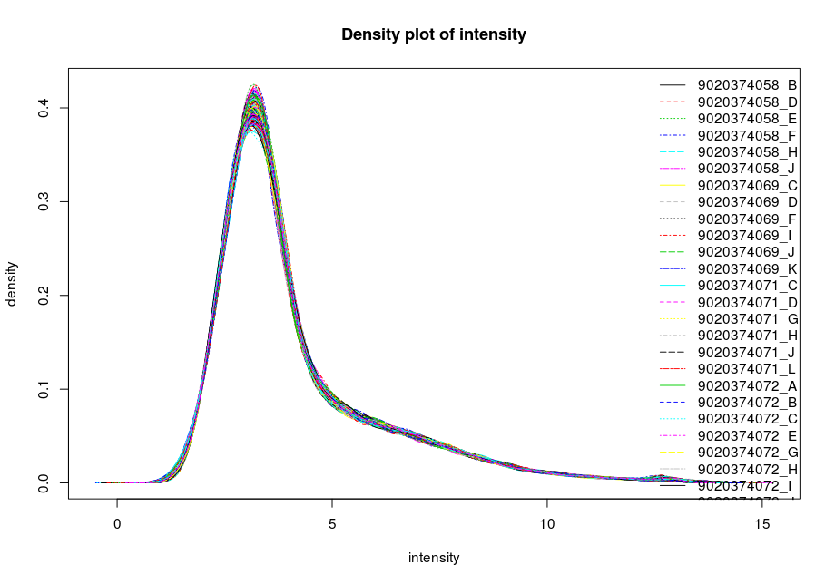

```
 beging plotting cv 
 
```

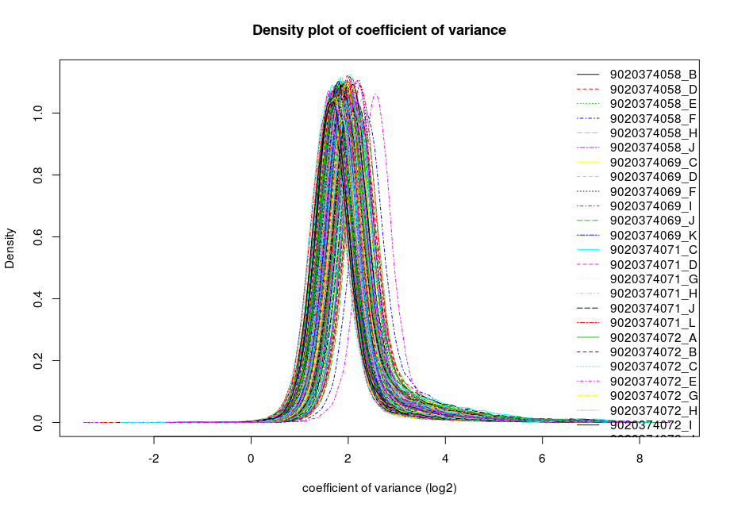

```r
par(def.par)

pdf(file = paste(out_dir, "/", project_name, ".eset_bg_log2_rsn.basic_qc_plot_lumi.pdf", 
    sep = ""), width = 11, height = 8)
basic_qc_plot_lumi(eset_bg_log2_rsn)
```

```
 Running flashClust 
 
 beging plotting boxplot 
 
```

```
 beging plotting outlier 
 
```

```
 beging plotting sampleTree <- flashClust( dist_exprs, method = "average") 
 
```

```
 beging plotting density 
 
```

```
 beging plotting cv 
 
```

```r
dev.off()
```

```
pdf 
  2 
```

```r
par(def.par)
```


## coloured_dendrogram_lumi eset_bg_log2_rsn

```r
# coloured_dendrogram_lumi plot to screen
coloured_dendrogram_lumi(eset_bg_log2_rsn)
```

```
 get pheno data 
 
 basic colours 
 
 batch pheno data 
 
 batch colours 
 
 datExprs and sampleTree 
 
 plotDendroAndColors 
 
```

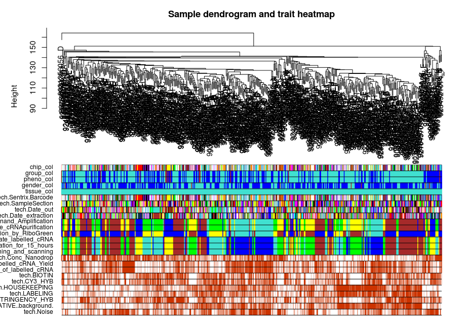

```r
par(def.par)

pdf(file = paste(out_dir, "/", project_name, ".eset_bg_log2_rsn.coloured_dendrogram_lumi.pdf", 
    sep = ""), width = 11, height = 8)
coloured_dendrogram_lumi(eset_bg_log2_rsn)
```

```
 get pheno data 
 
 basic colours 
 
 batch pheno data 
 
 batch colours 
 
 datExprs and sampleTree 
 
 plotDendroAndColors 
 
```

```r
dev.off()
```

```
pdf 
  2 
```

```r
par(def.par)
```


## pca_plot_lumi eset_bg_log2_rsn

```r
# PCA plots plot to screen
pca_plot_lumi(eset_bg_log2_rsn)
```

```
 setting up data for qc plots 
 
 get pheno data 
 
 basic colours 
 
 batch pheno data 
 
 begin PCA plots 
 
 calculating PCs using prcomp() 
 
 plotting Proportion of Variance Explained 
 
```

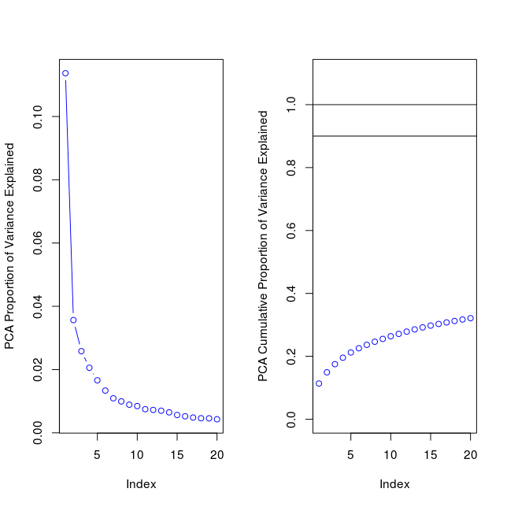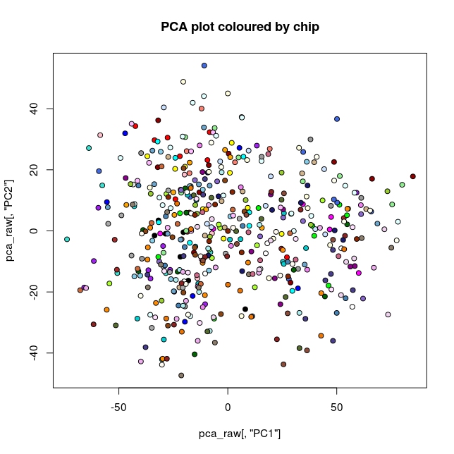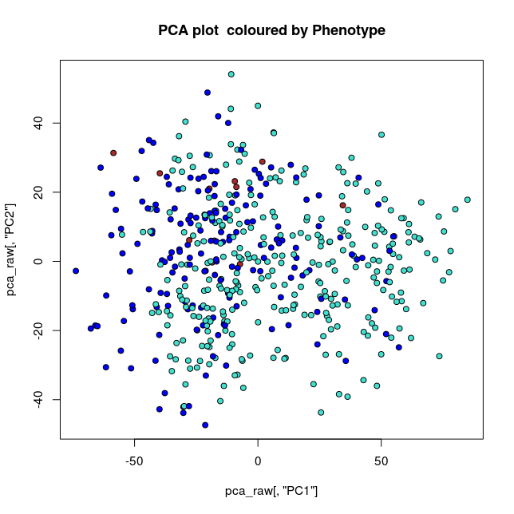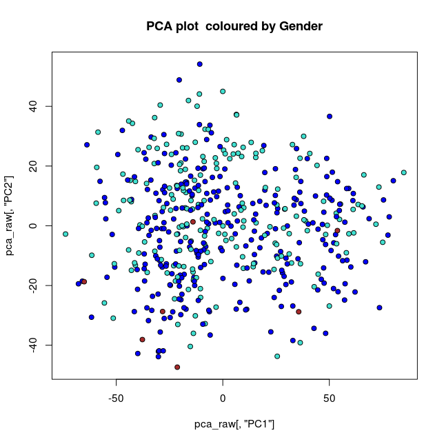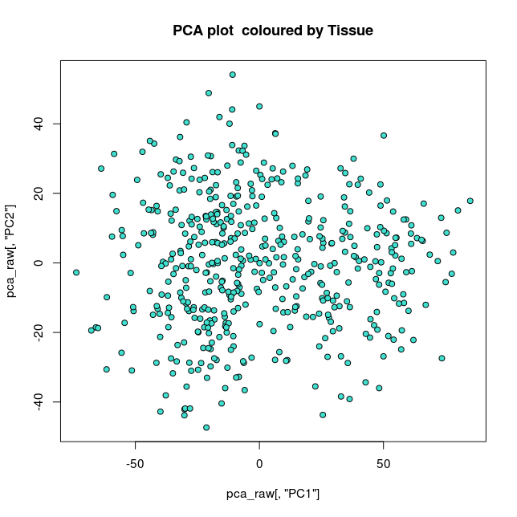

```
 begin looping through batch variable PCA plots  tech.Sentrix.Barcode 
 
```


```
 begin looping through batch variable PCA plots  tech.SampleSection 
 
```

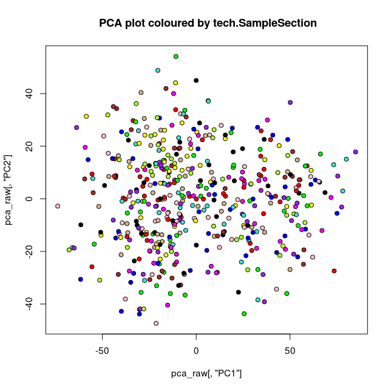

```
 begin looping through batch variable PCA plots  tech.Date_out 
 
```

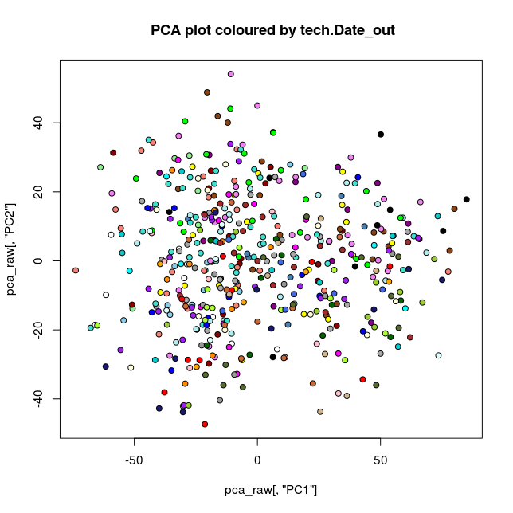

```
 begin looping through batch variable PCA plots  tech.Date_extraction 
 
```

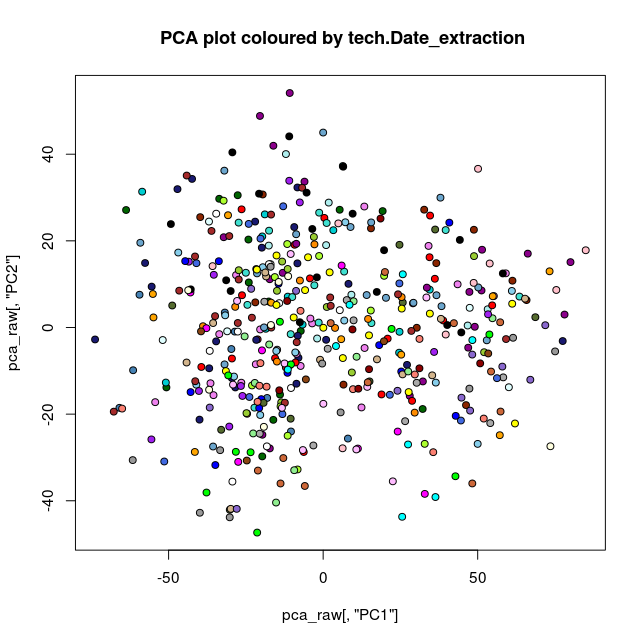

```
 begin looping through batch variable PCA plots  tech.Date_Dilutionand_Amplification 
 
```

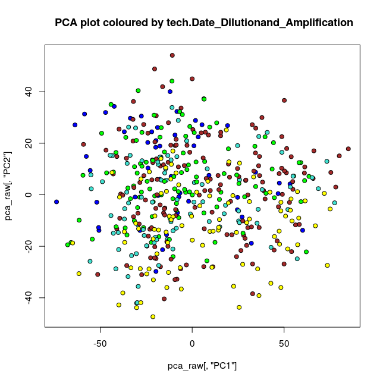

```
 begin looping through batch variable PCA plots  tech.Date_cRNApurification 
 
```

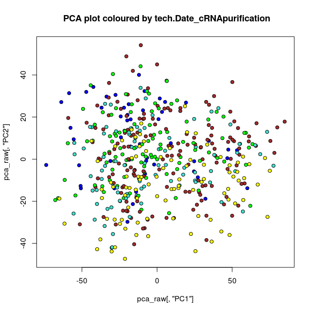

```
 begin looping through batch variable PCA plots  tech.Date_Quantitation_by_RiboGreen 
 
```

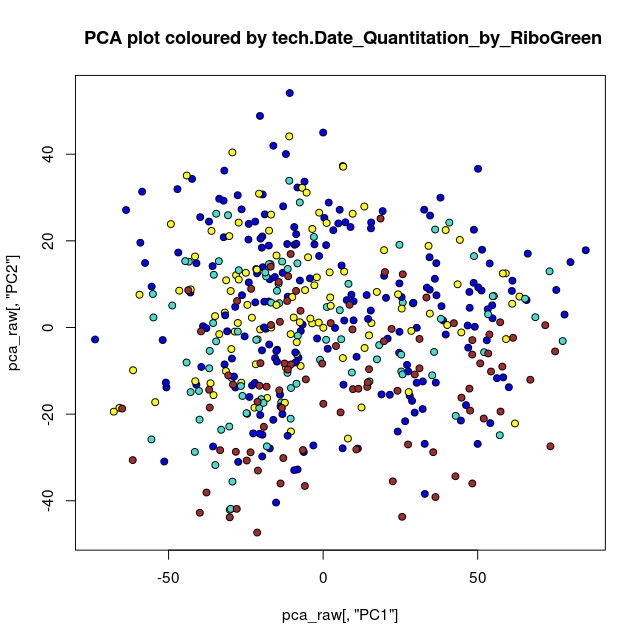

```
 begin looping through batch variable PCA plots  tech.Date_labelled_cRNA 
 
```

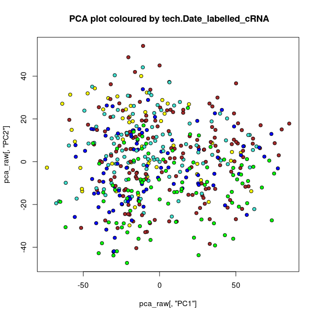

```
 begin looping through batch variable PCA plots  tech.Date_Hybridization_for_15_hours 
 
```


```
 begin looping through batch variable PCA plots  tech.Date_Washing_and_scanning 
 
```

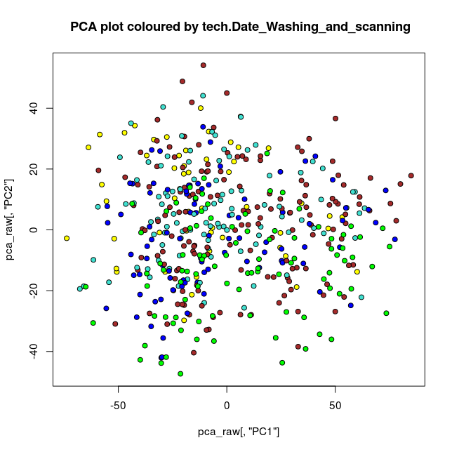

```
 begin looping through batch variable PCA plots  tech.Conc_Nanodrop 
 
```

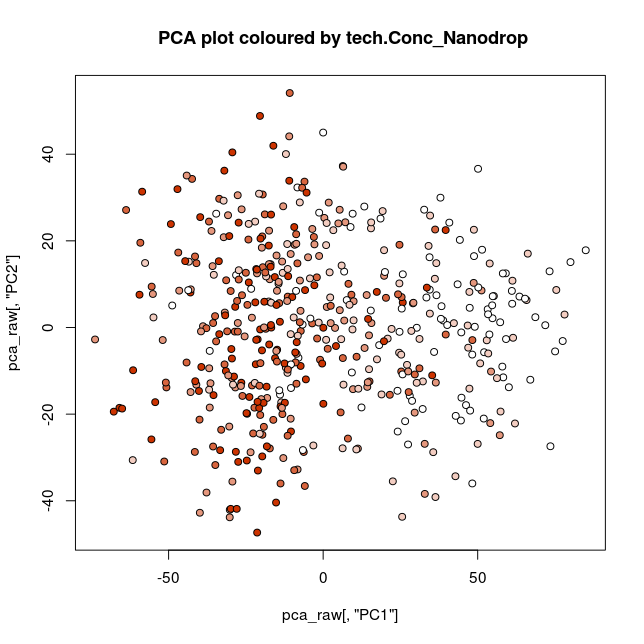

```
 begin looping through batch variable PCA plots  tech.labelled_cRNA_Yield 
 
```

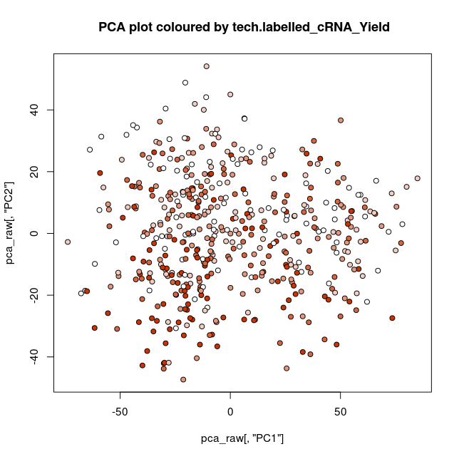

```
 begin looping through batch variable PCA plots  tech.concentration_of_labelled_cRNA 
 
```

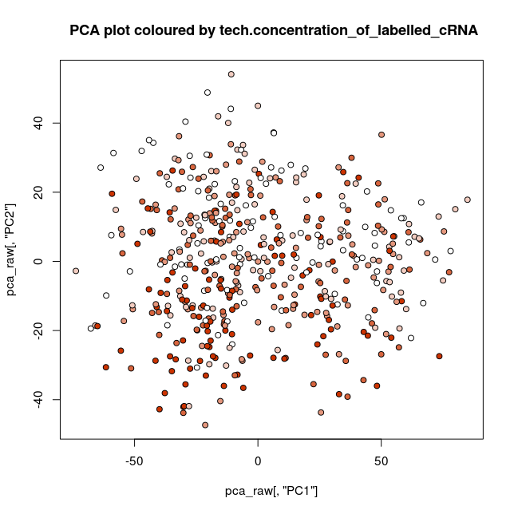

```
 begin looping through batch variable PCA plots  tech.BIOTIN 
 
```

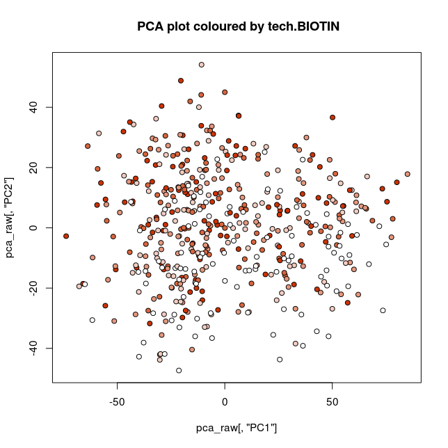

```
 begin looping through batch variable PCA plots  tech.CY3_HYB 
 
```

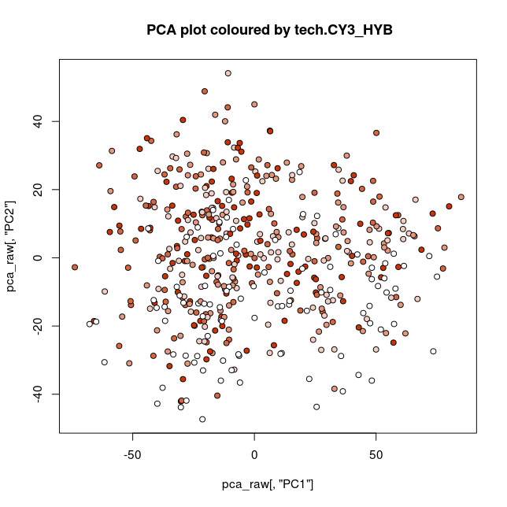

```
 begin looping through batch variable PCA plots  tech.HOUSEKEEPING 
 
```

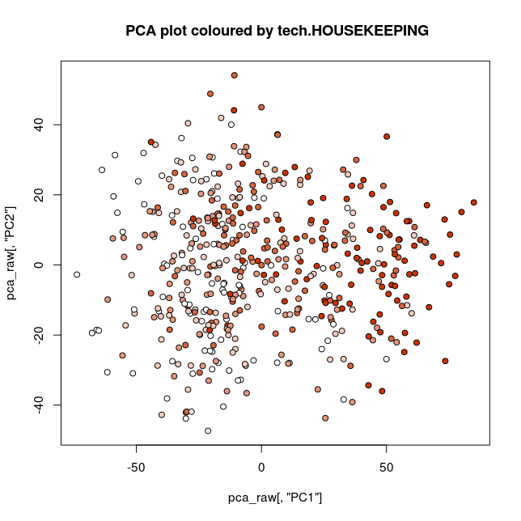

```
 begin looping through batch variable PCA plots  tech.LABELING 
 
```

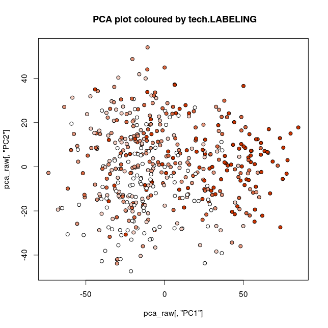

```
 begin looping through batch variable PCA plots  tech.LOW_STRINGENCY_HYB 
 
```

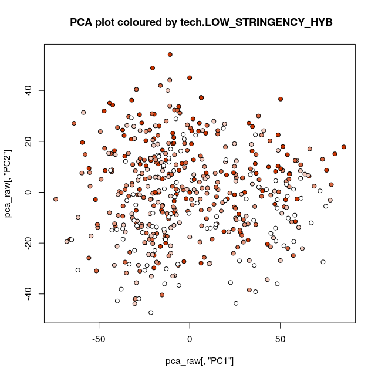

```
 begin looping through batch variable PCA plots  tech.NEGATIVE..background. 
 
```

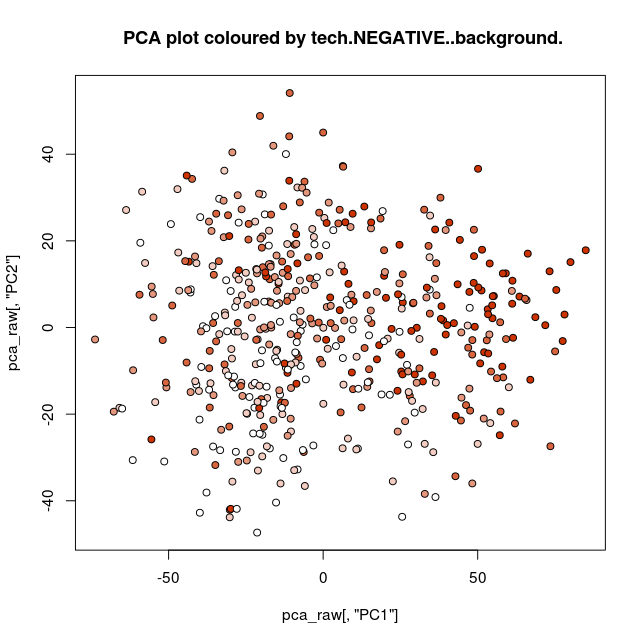

```
 begin looping through batch variable PCA plots  tech.Noise 
 
```

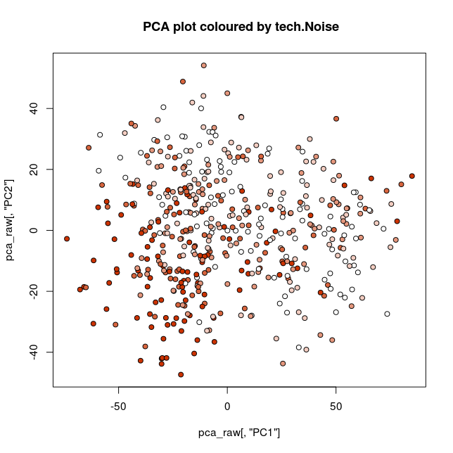

```r
par(def.par)

pdf(file = paste(out_dir, "/", project_name, ".eset_bg_log2_rsn.pca_plot_lumi.pdf", 
    sep = ""), width = 7, height = 7)
pca_plot_lumi(eset_bg_log2_rsn)
```

```
 setting up data for qc plots 
 
 get pheno data 
 
 basic colours 
 
 batch pheno data 
 
 begin PCA plots 
 
 calculating PCs using prcomp() 
 
 plotting Proportion of Variance Explained 
 
```

```
 begin looping through batch variable PCA plots  tech.Sentrix.Barcode 
 
```

```
 begin looping through batch variable PCA plots  tech.SampleSection 
 
```

```
 begin looping through batch variable PCA plots  tech.Date_out 
 
```

```
 begin looping through batch variable PCA plots  tech.Date_extraction 
 
```

```
 begin looping through batch variable PCA plots  tech.Date_Dilutionand_Amplification 
 
```

```
 begin looping through batch variable PCA plots  tech.Date_cRNApurification 
 
```

```
 begin looping through batch variable PCA plots  tech.Date_Quantitation_by_RiboGreen 
 
```

```
 begin looping through batch variable PCA plots  tech.Date_labelled_cRNA 
 
```

```
 begin looping through batch variable PCA plots  tech.Date_Hybridization_for_15_hours 
 
```

```
 begin looping through batch variable PCA plots  tech.Date_Washing_and_scanning 
 
```

```
 begin looping through batch variable PCA plots  tech.Conc_Nanodrop 
 
```

```
 begin looping through batch variable PCA plots  tech.labelled_cRNA_Yield 
 
```

```
 begin looping through batch variable PCA plots  tech.concentration_of_labelled_cRNA 
 
```

```
 begin looping through batch variable PCA plots  tech.BIOTIN 
 
```

```
 begin looping through batch variable PCA plots  tech.CY3_HYB 
 
```

```
 begin looping through batch variable PCA plots  tech.HOUSEKEEPING 
 
```

```
 begin looping through batch variable PCA plots  tech.LABELING 
 
```

```
 begin looping through batch variable PCA plots  tech.LOW_STRINGENCY_HYB 
 
```

```
 begin looping through batch variable PCA plots  tech.NEGATIVE..background. 
 
```

```
 begin looping through batch variable PCA plots  tech.Noise 
 
```

```r
dev.off()
```

```
pdf 
  2 
```

```r
par(def.par)
```


## SampleNetwork Plots eset_bg_log2_rsn

```r
# SampleNetwork Plots plot to screen
sampleNetwork_plot_all_lumi(eset_bg_log2_rsn, colBy = "chip")
```

```
 setting up data for qc plots 
 
 expression matrix and IAC 
 
 fundamentalNetworkConcepts 
 
 colorvec [ chip ] 
 
 begin SampleNetwork plots 
 
```

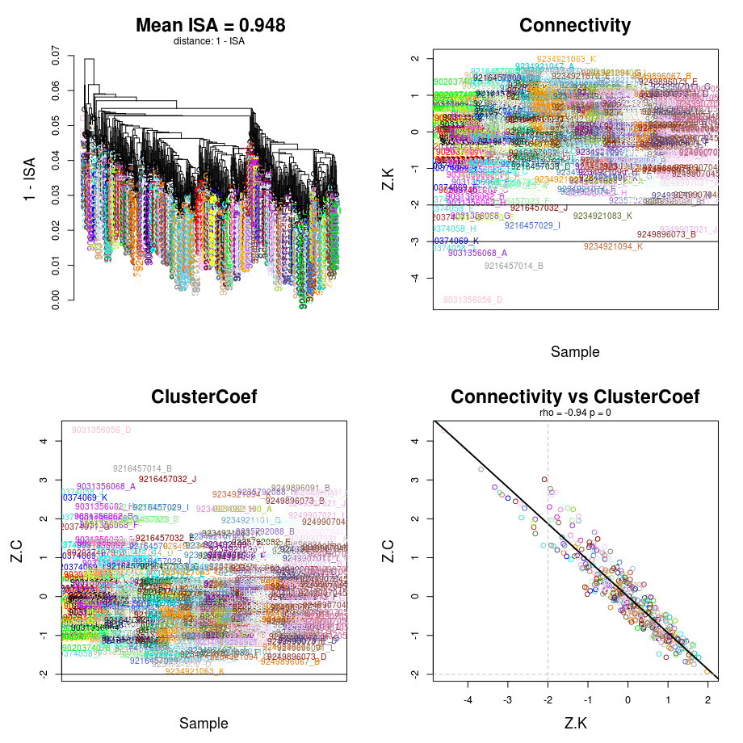

```r
sampleNetwork_plot_all_lumi(eset_bg_log2_rsn, colBy = "group")
```

```
 setting up data for qc plots 
 
 expression matrix and IAC 
 
 fundamentalNetworkConcepts 
 
 colorvec [ group ] 
 
 begin SampleNetwork plots 
 
```

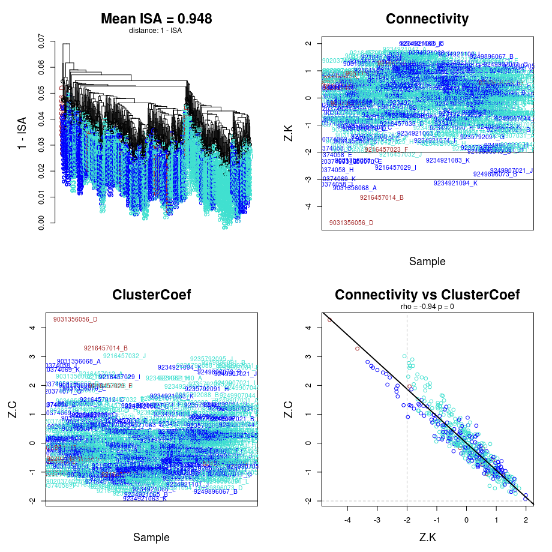

```r
par(def.par)

pdf(file = paste(out_dir, "/", project_name, ".eset_bg_log2_rsn.sampleNetwork_plot_all_lumi.pdf", 
    sep = ""), width = 8, height = 8)
sampleNetwork_plot_all_lumi(eset_bg_log2_rsn, colBy = "chip")
```

```
 setting up data for qc plots 
 
 expression matrix and IAC 
 
 fundamentalNetworkConcepts 
 
 colorvec [ chip ] 
 
 begin SampleNetwork plots 
 
```

```r
sampleNetwork_plot_all_lumi(eset_bg_log2_rsn, colBy = "group")
```

```
 setting up data for qc plots 
 
 expression matrix and IAC 
 
 fundamentalNetworkConcepts 
 
 colorvec [ group ] 
 
 begin SampleNetwork plots 
 
```

```r
dev.off()
```

```
pdf 
  2 
```

```r
par(def.par)
```


****

PCA Batch Regressions
======================
making this a requirement ie if [tech_pheno_file] exits then test for assoc of with PC1 and batches etc

## 1. Set up data for batch regressions

```r
# a little fix/renaming
eset_lumiN <- eset_bg_log2_rsn
cat(" Starting batch versus PC1 and PHENOTYPE Rregressions [PC1 ~ batch_var]", 
    "\r")
```

```
 Starting batch versus PC1 and PHENOTYPE Rregressions [PC1 ~ batch_var] 
```

```r
cat(" Getting Gene expression matrix ", "\r")
```

```
 Getting Gene expression matrix  
```

```r
gx <- exprs(eset_lumiN)
gx <- t(gx)
cat(" Reading in technical information on eg [Sample.ID, RIN, RNA_YIELD, BATCH, CHIP, DATE_CHIP_RUN, DATE_RNA_EXTRACTED] ", 
    tech_pheno_file, "\r")
```

```
 Reading in technical information on eg [Sample.ID, RIN, RNA_YIELD, BATCH, CHIP, DATE_CHIP_RUN, DATE_RNA_EXTRACTED]  /media/D/expression/GAP_Expression/final_reports_genomestudio/batch_info.txt 
```

```r
tech_pheno <- read.table(paste(tech_pheno_file), head = TRUE, sep = "\t")  ## Sample.ID,RIN,RNA_YIELD,BATCH,CHIP, DATE_CHIP_RUN,DATE_RNA_EXTRACTED
tech_pheno$Sentrix.Barcode <- as.factor(tech_pheno$Sentrix.Barcode)
pdata <- pData(eset_lumiN)
pdata <- as.data.frame(pdata[, c("sampleID", "Index")])
colnames(pdata) <- c("sampleID", "Index")
tech_batch <- merge(pdata, tech_pheno, by.x = "sampleID", by.y = "Sample.ID", 
    sort = FALSE, all.x = TRUE)
tech_batch <- tech_batch[order(tech_batch$Index), ]
tech_batch <- tech_batch[, 3:dim(tech_batch)[2]]
head(tech_batch)
```

```
  Sentrix.Barcode SampleSection Batch   Date_out Date_extraction person
1      9020374058             B     1 13/05/2013      14/05/2013      1
2      9020374058             D     1 21/05/2013      22/05/2013      1
3      9020374058             E     1 13/05/2013      14/05/2013      1
4      9020374058             F     1 13/05/2013      14/05/2013      1
5      9020374058             H     1 13/05/2013      14/05/2013      1
6      9020374058             J     1 21/05/2013      22/05/2013      1
  Conc_Nanodrop Date_Dilutionand_Amplification Date_cRNApurification
1         52.75                     16/07/2013            17/07/2013
2         78.19                     16/07/2013            17/07/2013
3         56.07                     16/07/2013            17/07/2013
4         37.58                     16/07/2013            17/07/2013
5         59.99                     16/07/2013            17/07/2013
6         90.00                     16/07/2013            17/07/2013
  Date_Quantitation_by_RiboGreen Eluted_Total_labelled_cRNA
1                     23/07/2013                         40
2                     23/07/2013                         40
3                     23/07/2013                         40
4                     23/07/2013                         40
5                     23/07/2013                         40
6                     23/07/2013                         40
  labelled_cRNA_Yield concentration_of_labelled_cRNA Date_labelled_cRNA
1               13085                          327.1         25/07/2013
2               17625                          440.6         25/07/2013
3               16468                          411.7         25/07/2013
4               10738                          268.5         25/07/2013
5               10726                          268.1         25/07/2013
6                9341                          233.5         25/07/2013
  Date_Hybridization_for_15_hours Date_Washing_and_scanning
1                      25/07/2013                26/07/2013
2                      25/07/2013                26/07/2013
3                      25/07/2013                26/07/2013
4                      25/07/2013                26/07/2013
5                      25/07/2013                26/07/2013
6                      25/07/2013                26/07/2013
```

```r
# get names of var
cat(" get names of var ", "\r")
```

```
 get names of var  
```

```r
batch_var_names <- names(tech_batch)
date_vars <- grep("Date", batch_var_names)  # which ones are dates
batch_var_names
```

```
 [1] "Sentrix.Barcode"                 "SampleSection"                  
 [3] "Batch"                           "Date_out"                       
 [5] "Date_extraction"                 "person"                         
 [7] "Conc_Nanodrop"                   "Date_Dilutionand_Amplification" 
 [9] "Date_cRNApurification"           "Date_Quantitation_by_RiboGreen" 
[11] "Eluted_Total_labelled_cRNA"      "labelled_cRNA_Yield"            
[13] "concentration_of_labelled_cRNA"  "Date_labelled_cRNA"             
[15] "Date_Hybridization_for_15_hours" "Date_Washing_and_scanning"      
```

```r
## Run PCA
cat(" Running PCA on t(exprs(eset)) ", "\r")
```

```
 Running PCA on t(exprs(eset))  
```

```r
pca_gx <- prcomp(gx)$x
pca_gx <- pca_gx[, "PC1"]
# PHENOTYPES FOR REGRESSIONS
cat(" setting up phenotypes PC1,PHENOTYPE & GROUPS for regressions ", "\r")
```

```
 setting up phenotypes PC1,PHENOTYPE & GROUPS for regressions  
```

```r
PC1 <- as.numeric(pca_gx)
PHENOTYPE <- as.numeric(as.factor(toupper(pData(eset_lumiN)$PHENOTYPE)))  # toupper() called because of pesky 'case' issues
GROUPS <- as.numeric(as.factor(toupper(pData(eset_lumiN)$GROUPS)))  # toupper() called because of pesky 'case' issues
# df <- cbind(tech_batch,PC1,PHENOTYPE,GROUPS) df_z <- apply(df,2,as.factor)
# df_z <- apply(df_z,2,as.numeric)
```


## 2. multivariate model

```r
# Test for association of batch vars with PC1 multivariate full model
multivariate_model_terms <- paste(batch_var_names, collapse = "+")

######################### PC1 is run last START LINEAR REGRESSION for(pheno in
######################### c('PHENOTYPE','GROUPS','PC1') ) {
for (pheno in c("PC1")) {
    # make model for lm
    multivariate_model <- paste(pheno, "~", multivariate_model_terms, sep = "")  ## prot ~ c1+c2+c3...
    multivariate_model <- as.formula(multivariate_model)
    # multivariate lm
    cat(" running full multivariate models ", pheno, " ~ multivariate_model ", 
        "\r", "\n")
    lm_batch <- lm(multivariate_model, data = tech_batch)
    
    # RSQUARED summary lm
    lm_r2 <- round(summary(lm_batch)$adj.r.squared, 3)
    
    # summary lm
    summary_lm_batch <- summary(lm_batch)$coef
    summary_lm_batch <- as.data.frame(summary_lm_batch)
    summary_lm_batch$terms <- rownames(summary_lm_batch)
    summary_lm_batch$significant <- ifelse(summary_lm_batch$"Pr(>|t|)" <= 0.05, 
        1, 0)
    summary_lm_batch$model_rsq <- lm_r2
    
    # save summary lm
    write.table(summary_lm_batch, file = paste(out_dir, "/", project_name, ".eset_bg_log2_rsn.", 
        pheno, ".multivariate_model_batch_variables.csv", sep = ""), row.names = FALSE, 
        quote = FALSE, sep = ",")
    
    # multivariate ANOVA
    anova_lm_batch <- anova(lm_batch)
    anova_lm_data <- as.data.frame(anova_lm_batch)
    anova_lm_data$terms <- rownames(anova_lm_data)
    anova_lm_data <- subset(anova_lm_data, anova_lm_data$terms != "Residuals")
    
    ## plot ANOVA P
    par(mar = c(15, 5, 4, 2))
    barplot(-log10(anova_lm_data$"Pr(>F)"), srt = 45, las = 3, names = c(anova_lm_data$terms), 
        ylab = "ANOVA -log10(P)", main = paste(pheno, "~multivariate_model. R2=", 
            lm_r2, sep = ""), cex.names = 0.8, cex.main = 0.8, cex.lab = 1)
    abline(h = -log10(0.05), col = "blue")
    abline(h = -log10(0.05/dim(anova_lm_data)[1]), col = "red")
    
    ## plot to pdf
    pdf(file = paste(out_dir, "/", project_name, ".eset_bg_log2_rsn.", pheno, 
        ".ANOVA_multivariate_model_batch_variables.pdf", sep = ""), width = 8, 
        height = 6)
    par(mar = c(15, 5, 4, 2))
    barplot(-log10(anova_lm_data$"Pr(>F)"), srt = 45, las = 3, names = c(anova_lm_data$terms), 
        ylab = "ANOVA -log10(P)", main = paste(pheno, "~ multivariate_model. R2=", 
            lm_r2, sep = ""), cex.names = 0.8, cex.main = 0.8, cex.lab = 1)
    abline(h = -log10(0.05), col = "blue")
    abline(h = -log10(0.05/dim(anova_lm_data)[1]), col = "red")
    dev.off()
    
    ## save ANOVA
    write.table(anova_lm_data, file = paste(out_dir, "/", project_name, ".eset_bg_log2_rsn.", 
        pheno, ".ANOVA_multivariate_model_batch_variables.csv", sep = ""), row.names = FALSE, 
        quote = FALSE, sep = ",")
    
    # are there any sig ANOVA terms
    min_anova_p <- min(anova_lm_data$"Pr(>F)")
    
    # if sig ANOVA terms then do this:-
    if (min_anova_p <= 0.05) {
        sig_anova_lm_data <- subset(anova_lm_data, anova_lm_data$"Pr(>F)" <= 
            0.05)
        most_sig_term <- sig_anova_lm_data$terms[sig_anova_lm_data$"Pr(>F)" == 
            min_anova_p]
        sig_terms <- sig_anova_lm_data$terms
        sig_terms <- paste(sig_terms, collapse = " + ")
        cat(" WARNING!: SIGNIFICANT ASSOCIATION BETWEEN [ ", pheno, " ] ~ [", 
            sig_terms, " ]. R2=", lm_r2, " [", most_sig_term, "] MIN_P=", min_anova_p, 
            ". YOU MAY WANT TO CORRECT FOR THIS BEFORE THE FINAL ANLYSIS ", 
            "\r", "\n")
        ######################## STEP find best terms#
        cat(" Finding a best model by AIC in a Stepwise Algorithm ", "\r", "\n")
        step_lm_batch <- stepAIC(lm_batch, direction = "both")
        # summary step lm
        summary_step_lm_batch <- summary(step_lm_batch)$coef
        summary_step_lm_batch <- as.data.frame(summary_step_lm_batch)
        summary_step_lm_batch$terms <- rownames(summary_step_lm_batch)
        # save summary step lm
        write.table(summary_step_lm_batch, file = paste(out_dir, "/", project_name, 
            ".eset_bg_log2_rsn.stepAIC_multivariate_model_batch_variables.csv", 
            sep = ""), row.names = FALSE, quote = FALSE, sep = ",")
        
        ## anova step #
        anova_step_lm_batch <- anova(step_lm_batch)
        anova_data <- as.data.frame(anova_step_lm_batch)
        anova_data$terms <- rownames(anova_data)
        anova_data <- subset(anova_data, anova_data$terms != "Residuals")
        # best model
        best_model <- paste(anova_data$terms, collapse = " + ")
        best_model <- as.formula(paste(pheno, "~", best_model, sep = ""))
        best_model
        
        # RSQ anova step
        anova_step_r2 <- round(summary(step_lm_batch)$adj.r.squared, 3)
        
        ## plot
        par(mar = c(15, 5, 4, 2))
        barplot(-log10(anova_data$"Pr(>F)"), las = 3, names = c(anova_data$terms), 
            ylab = "ANOVA -log10(P)", main = paste(step_lm_batch$call[2], " R2=", 
                anova_step_r2, sep = ""), cex.names = 0.8, cex.main = 0.6, cex.lab = 1)
        abline(h = -log10(0.05), col = "blue")
        abline(h = -log10(0.05/dim(anova_data)[1]), col = "red")
        
        ## plot ANOVA step P #
        pdf(file = paste(out_dir, "/", project_name, ".eset_bg_log2_rsn.", pheno, 
            ".stepANOVA_multivariate_model_batch_variables.pdf", sep = ""), 
            width = 8, height = 6)
        par(mar = c(15, 5, 4, 2))
        barplot(-log10(anova_data$"Pr(>F)"), las = 3, names = c(anova_data$terms), 
            ylab = "ANOVA -log10(P)", main = paste(step_lm_batch$call[2], " R2=", 
                anova_step_r2, sep = ""), cex.names = 0.8, cex.main = 0.6, cex.lab = 1)
        abline(h = -log10(0.05), col = "blue")
        abline(h = -log10(0.05/dim(anova_data)[1]), col = "red")
        dev.off()
        
        ## save stepANOVA
        write.table(anova_data, file = paste(out_dir, "/", project_name, ".eset_bg_log2_rsn.", 
            pheno, ".stepANOVA_multivariate_model_batch_variables.csv", sep = ""), 
            row.names = FALSE, quote = FALSE, sep = ",")
        cat(" BEST MODEL BASED ON stepAIC [", pheno, "] ~ [", paste(best_model)[3], 
            "] ", "\r", "\n")
    } else {
        cat(" NICE!: NO SIGNIFICANT ASSOCIATION BETWEEN [ ", pheno, " ] ~ [ BATCH PHENOTYPES ]", 
            "\r", "\n")
    }
}
```

```
 running full multivariate models  PC1  ~ multivariate_model  
 
```

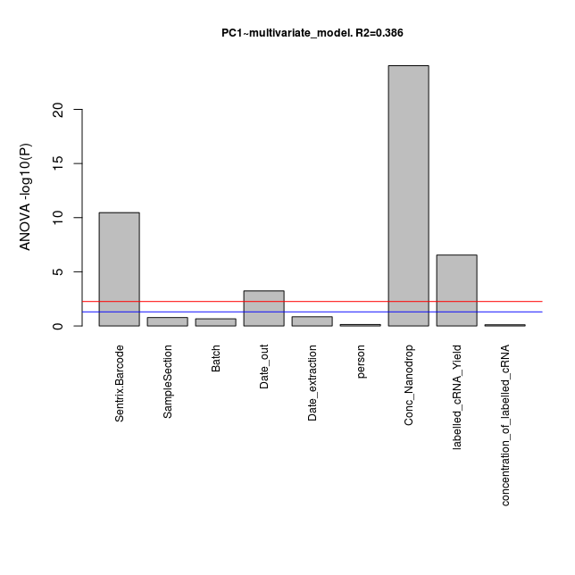

```
 WARNING!: SIGNIFICANT ASSOCIATION BETWEEN [  PC1  ] ~ [ Sentrix.Barcode + Date_out + Conc_Nanodrop + labelled_cRNA_Yield  ]. R2= 0.386  [ Conc_Nanodrop ] MIN_P= 9.213e-25 . YOU MAY WANT TO CORRECT FOR THIS BEFORE THE FINAL ANLYSIS  
 
 Finding a best model by AIC in a Stepwise Algorithm  
 
Start:  AIC=3254
PC1 ~ Sentrix.Barcode + SampleSection + Batch + Date_out + Date_extraction + 
    person + Conc_Nanodrop + Date_Dilutionand_Amplification + 
    Date_cRNApurification + Date_Quantitation_by_RiboGreen + 
    Eluted_Total_labelled_cRNA + labelled_cRNA_Yield + concentration_of_labelled_cRNA + 
    Date_labelled_cRNA + Date_Hybridization_for_15_hours + Date_Washing_and_scanning


Step:  AIC=3254
PC1 ~ Sentrix.Barcode + SampleSection + Batch + Date_out + Date_extraction + 
    person + Conc_Nanodrop + Date_Dilutionand_Amplification + 
    Date_cRNApurification + Date_Quantitation_by_RiboGreen + 
    Eluted_Total_labelled_cRNA + labelled_cRNA_Yield + concentration_of_labelled_cRNA + 
    Date_labelled_cRNA + Date_Hybridization_for_15_hours


Step:  AIC=3254
PC1 ~ Sentrix.Barcode + SampleSection + Batch + Date_out + Date_extraction + 
    person + Conc_Nanodrop + Date_Dilutionand_Amplification + 
    Date_cRNApurification + Date_Quantitation_by_RiboGreen + 
    Eluted_Total_labelled_cRNA + labelled_cRNA_Yield + concentration_of_labelled_cRNA + 
    Date_labelled_cRNA


Step:  AIC=3254
PC1 ~ Sentrix.Barcode + SampleSection + Batch + Date_out + Date_extraction + 
    person + Conc_Nanodrop + Date_Dilutionand_Amplification + 
    Date_cRNApurification + Date_Quantitation_by_RiboGreen + 
    Eluted_Total_labelled_cRNA + labelled_cRNA_Yield + concentration_of_labelled_cRNA


Step:  AIC=3254
PC1 ~ Sentrix.Barcode + SampleSection + Batch + Date_out + Date_extraction + 
    person + Conc_Nanodrop + Date_Dilutionand_Amplification + 
    Date_cRNApurification + Date_Quantitation_by_RiboGreen + 
    labelled_cRNA_Yield + concentration_of_labelled_cRNA


Step:  AIC=3254
PC1 ~ Sentrix.Barcode + SampleSection + Batch + Date_out + Date_extraction + 
    person + Conc_Nanodrop + Date_Dilutionand_Amplification + 
    Date_cRNApurification + labelled_cRNA_Yield + concentration_of_labelled_cRNA


Step:  AIC=3254
PC1 ~ Sentrix.Barcode + SampleSection + Batch + Date_out + Date_extraction + 
    person + Conc_Nanodrop + Date_Dilutionand_Amplification + 
    labelled_cRNA_Yield + concentration_of_labelled_cRNA


Step:  AIC=3254
PC1 ~ Sentrix.Barcode + SampleSection + Batch + Date_out + Date_extraction + 
    person + Conc_Nanodrop + labelled_cRNA_Yield + concentration_of_labelled_cRNA

                                 Df Sum of Sq    RSS  AIC
- Date_out                        3      1280 256636 3251
- Date_extraction                 6      5004 260360 3252
- labelled_cRNA_Yield             1        53 255409 3253
- concentration_of_labelled_cRNA  1        54 255409 3253
- person                          1        56 255412 3253
<none>                                        255356 3254
- Sentrix.Barcode                46     53262 308618 3254
- SampleSection                  11     12171 267527 3255
- Batch                           1      1781 257137 3256
- Conc_Nanodrop                   1     84634 339990 3392

Step:  AIC=3251
PC1 ~ Sentrix.Barcode + SampleSection + Batch + Date_extraction + 
    person + Conc_Nanodrop + labelled_cRNA_Yield + concentration_of_labelled_cRNA

                                 Df Sum of Sq    RSS  AIC
- Date_extraction                33     33449 290086 3244
- labelled_cRNA_Yield             1        45 256681 3249
- concentration_of_labelled_cRNA  1        45 256681 3249
- person                          1        71 256708 3249
- SampleSection                  11     11422 268058 3250
<none>                                        256636 3251
- Batch                           1      1722 258358 3252
+ Date_out                        3      1280 255356 3254
- Sentrix.Barcode                46     56011 312648 3255
- Conc_Nanodrop                   1     88520 345156 3393

Step:  AIC=3244
PC1 ~ Sentrix.Barcode + SampleSection + Batch + person + Conc_Nanodrop + 
    labelled_cRNA_Yield + concentration_of_labelled_cRNA

                                 Df Sum of Sq    RSS  AIC
- SampleSection                  11     11924 302010 3242
- labelled_cRNA_Yield             1         1 290087 3242
- concentration_of_labelled_cRNA  1         1 290087 3242
- Batch                           1        32 290117 3242
- person                          1       774 290860 3244
<none>                                        290086 3244
+ Date_extraction                33     33449 256636 3251
+ Date_out                       30     29726 260360 3252
- Sentrix.Barcode                52     96182 386268 3280
- Conc_Nanodrop                   1     95656 385741 3381

Step:  AIC=3242
PC1 ~ Sentrix.Barcode + Batch + person + Conc_Nanodrop + labelled_cRNA_Yield + 
    concentration_of_labelled_cRNA

                                 Df Sum of Sq    RSS  AIC
- labelled_cRNA_Yield             1         2 302012 3240
- concentration_of_labelled_cRNA  1         2 302012 3240
- Batch                           1         2 302012 3240
- person                          1       316 302326 3240
<none>                                        302010 3242
+ SampleSection                  11     11924 290086 3244
+ Date_extraction                33     33952 268058 3250
+ Date_out                       30     28443 273567 3254
- Sentrix.Barcode                52     93758 395768 3269
- Conc_Nanodrop                   1     98946 400956 3378

Step:  AIC=3240
PC1 ~ Sentrix.Barcode + Batch + person + Conc_Nanodrop + concentration_of_labelled_cRNA

                                 Df Sum of Sq    RSS  AIC
- Batch                           1         2 302014 3238
- person                          1       314 302326 3238
<none>                                        302012 3240
+ labelled_cRNA_Yield             1         2 302010 3242
+ SampleSection                  11     11925 290087 3242
+ Date_extraction                33     33909 268103 3248
+ Date_out                       30     28393 273619 3252
- concentration_of_labelled_cRNA  1     16356 318368 3264
- Sentrix.Barcode                52     93779 395791 3267
- Conc_Nanodrop                   1     98951 400963 3376

Step:  AIC=3238
PC1 ~ Sentrix.Barcode + person + Conc_Nanodrop + concentration_of_labelled_cRNA

                                 Df Sum of Sq    RSS  AIC
- person                          1       321 302335 3236
<none>                                        302014 3238
+ Batch                           1         2 302012 3240
+ labelled_cRNA_Yield             1         2 302012 3240
+ SampleSection                  11     11897 290117 3240
+ Date_extraction                33     32800 269214 3248
+ Date_out                       30     27219 274795 3252
- concentration_of_labelled_cRNA  1     16359 318373 3262
- Sentrix.Barcode                52     96596 398610 3269
- Conc_Nanodrop                   1    100613 402627 3376

Step:  AIC=3236
PC1 ~ Sentrix.Barcode + Conc_Nanodrop + concentration_of_labelled_cRNA

                                 Df Sum of Sq    RSS  AIC
<none>                                        302335 3236
+ person                          1       321 302014 3238
+ Batch                           1         9 302326 3238
+ labelled_cRNA_Yield             1         0 302334 3238
+ SampleSection                  11     11472 290863 3240
+ Date_extraction                33     32752 269583 3247
+ Date_out                       30     27249 275085 3251
- concentration_of_labelled_cRNA  1     16152 318487 3260
- Sentrix.Barcode                52     96284 398619 3267
- Conc_Nanodrop                   1    100293 402627 3374
```

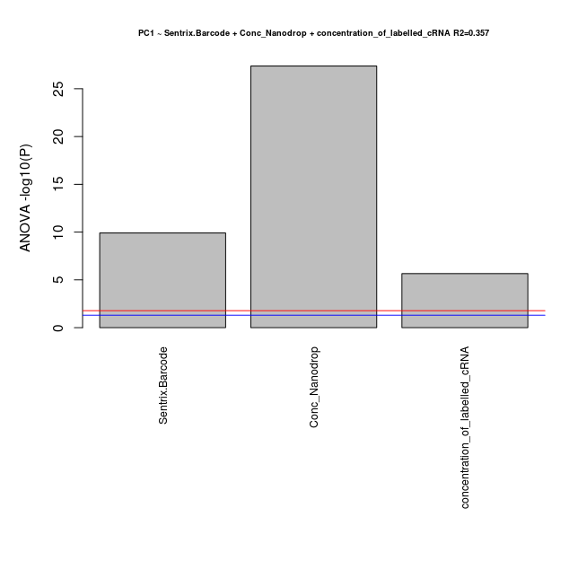

```
 BEST MODEL BASED ON stepAIC [ PC1 ] ~ [ Sentrix.Barcode + Conc_Nanodrop + concentration_of_labelled_cRNA ]  
 
```

```r

## 
anova_data
```

```
                               Df Sum Sq Mean Sq F value    Pr(>F)
Sentrix.Barcode                52 112918    2171   3.096 1.239e-10
Conc_Nanodrop                   1  97950   97950 139.634 4.186e-28
concentration_of_labelled_cRNA  1  16152   16152  23.026 2.207e-06
                                                        terms
Sentrix.Barcode                               Sentrix.Barcode
Conc_Nanodrop                                   Conc_Nanodrop
concentration_of_labelled_cRNA concentration_of_labelled_cRNA
```

```r

paste(best_model)[3]
```

```
[1] "Sentrix.Barcode + Conc_Nanodrop + concentration_of_labelled_cRNA"
```


Batch Correction using linear models
=====================================

```r

if (pheno != "PC1") stop(" WARNING!: model terms are not from the PC1 ~ batch regressions")

# get gene expressuion
gx <- exprs(eset_bg_log2_rsn)
n_probes <- dim(gx)[1]
gx <- t(gx)
dim(gx)
```

```
[1]   486 47231
```

```r
gx[1:10, 1:10]
```

```
             Ku8QhfS0n_hIOABXuE fqPEquJRRlSVSfL.8A ckiehnugOno9d7vf1Q
9020374058_B              3.669              4.773              3.109
9020374058_D              1.988              5.202              2.411
9020374058_E              2.969              4.698              3.168
9020374058_F              3.196              4.511              3.821
9020374058_H              4.080              5.533              2.850
9020374058_J              3.892              4.779              3.615
9020374069_C              2.899              5.320              3.183
9020374069_D              2.586              5.422              2.569
9020374069_F              2.673              5.429              3.067
9020374069_I              2.912              4.282              2.489
             x57Vw5B5Fbt5JUnQkI ritxUH.kuHlYqjozpE QpE5UiUgmJOJEkPXpc
9020374058_B              3.139              3.313              2.790
9020374058_D              3.042              3.113              3.027
9020374058_E              2.986              2.864              2.757
9020374058_F              2.767              2.651              2.136
9020374058_H              1.904              3.240              2.835
9020374058_J              2.657              3.084              2.418
9020374069_C              2.663              3.530              2.493
9020374069_D              3.798              3.250              3.460
9020374069_F              2.759              3.771              2.514
9020374069_I              2.894              3.143              3.500
             EedxN6XeUOgPSCywB0 ZtOcIegchMOATSJScI 3l3lDoD0gssAdeehIY
9020374058_B              2.687              2.219              4.139
9020374058_D              1.917              2.005              3.013
9020374058_E              1.787              2.053              3.648
9020374058_F              3.069              1.706              3.196
9020374058_H              3.667              1.938              3.343
9020374058_J              3.028              2.190              2.802
9020374069_C              3.384              1.994              3.262
9020374069_D              3.528              2.034              2.999
9020374069_F              2.603              1.327              3.584
9020374069_I              3.278              2.044              3.055
             WS4S8aGL855YVcUUZE
9020374058_B              3.867
9020374058_D              3.525
9020374058_E              2.934
9020374058_F              3.003
9020374058_H              2.773
9020374058_J              4.120
9020374069_C              3.183
9020374069_D              3.903
9020374069_F              3.036
9020374069_I              2.710
```

```r

# probe nuID names
new_probe_names <- paste("p_", colnames(gx), sep = "")  # ADD p as some nuID start with a number
# probe_names <- colnames(gx)
head(new_probe_names)
```

```
[1] "p_Ku8QhfS0n_hIOABXuE" "p_fqPEquJRRlSVSfL.8A" "p_ckiehnugOno9d7vf1Q"
[4] "p_x57Vw5B5Fbt5JUnQkI" "p_ritxUH.kuHlYqjozpE" "p_QpE5UiUgmJOJEkPXpc"
```

```r
colnames(gx) <- new_probe_names
gx[1:10, 1:10]
```

```
             p_Ku8QhfS0n_hIOABXuE p_fqPEquJRRlSVSfL.8A
9020374058_B                3.669                4.773
9020374058_D                1.988                5.202
9020374058_E                2.969                4.698
9020374058_F                3.196                4.511
9020374058_H                4.080                5.533
9020374058_J                3.892                4.779
9020374069_C                2.899                5.320
9020374069_D                2.586                5.422
9020374069_F                2.673                5.429
9020374069_I                2.912                4.282
             p_ckiehnugOno9d7vf1Q p_x57Vw5B5Fbt5JUnQkI
9020374058_B                3.109                3.139
9020374058_D                2.411                3.042
9020374058_E                3.168                2.986
9020374058_F                3.821                2.767
9020374058_H                2.850                1.904
9020374058_J                3.615                2.657
9020374069_C                3.183                2.663
9020374069_D                2.569                3.798
9020374069_F                3.067                2.759
9020374069_I                2.489                2.894
             p_ritxUH.kuHlYqjozpE p_QpE5UiUgmJOJEkPXpc
9020374058_B                3.313                2.790
9020374058_D                3.113                3.027
9020374058_E                2.864                2.757
9020374058_F                2.651                2.136
9020374058_H                3.240                2.835
9020374058_J                3.084                2.418
9020374069_C                3.530                2.493
9020374069_D                3.250                3.460
9020374069_F                3.771                2.514
9020374069_I                3.143                3.500
             p_EedxN6XeUOgPSCywB0 p_ZtOcIegchMOATSJScI
9020374058_B                2.687                2.219
9020374058_D                1.917                2.005
9020374058_E                1.787                2.053
9020374058_F                3.069                1.706
9020374058_H                3.667                1.938
9020374058_J                3.028                2.190
9020374069_C                3.384                1.994
9020374069_D                3.528                2.034
9020374069_F                2.603                1.327
9020374069_I                3.278                2.044
             p_3l3lDoD0gssAdeehIY p_WS4S8aGL855YVcUUZE
9020374058_B                4.139                3.867
9020374058_D                3.013                3.525
9020374058_E                3.648                2.934
9020374058_F                3.196                3.003
9020374058_H                3.343                2.773
9020374058_J                2.802                4.120
9020374069_C                3.262                3.183
9020374069_D                2.999                3.903
9020374069_F                3.584                3.036
9020374069_I                3.055                2.710
```

```r

# make new matrix to write adjusted values to
adj_gx <- gx * 0
adj_gx[1:10, 1:10]
```

```
             p_Ku8QhfS0n_hIOABXuE p_fqPEquJRRlSVSfL.8A
9020374058_B                    0                    0
9020374058_D                    0                    0
9020374058_E                    0                    0
9020374058_F                    0                    0
9020374058_H                    0                    0
9020374058_J                    0                    0
9020374069_C                    0                    0
9020374069_D                    0                    0
9020374069_F                    0                    0
9020374069_I                    0                    0
             p_ckiehnugOno9d7vf1Q p_x57Vw5B5Fbt5JUnQkI
9020374058_B                    0                    0
9020374058_D                    0                    0
9020374058_E                    0                    0
9020374058_F                    0                    0
9020374058_H                    0                    0
9020374058_J                    0                    0
9020374069_C                    0                    0
9020374069_D                    0                    0
9020374069_F                    0                    0
9020374069_I                    0                    0
             p_ritxUH.kuHlYqjozpE p_QpE5UiUgmJOJEkPXpc
9020374058_B                    0                    0
9020374058_D                    0                    0
9020374058_E                    0                    0
9020374058_F                    0                    0
9020374058_H                    0                    0
9020374058_J                    0                    0
9020374069_C                    0                    0
9020374069_D                    0                    0
9020374069_F                    0                    0
9020374069_I                    0                    0
             p_EedxN6XeUOgPSCywB0 p_ZtOcIegchMOATSJScI
9020374058_B                    0                    0
9020374058_D                    0                    0
9020374058_E                    0                    0
9020374058_F                    0                    0
9020374058_H                    0                    0
9020374058_J                    0                    0
9020374069_C                    0                    0
9020374069_D                    0                    0
9020374069_F                    0                    0
9020374069_I                    0                    0
             p_3l3lDoD0gssAdeehIY p_WS4S8aGL855YVcUUZE
9020374058_B                    0                    0
9020374058_D                    0                    0
9020374058_E                    0                    0
9020374058_F                    0                    0
9020374058_H                    0                    0
9020374058_J                    0                    0
9020374069_C                    0                    0
9020374069_D                    0                    0
9020374069_F                    0                    0
9020374069_I                    0                    0
```

```r

# get batch phenos
batch_pheno <- tech_batch[, anova_data$terms]
batch_pheno <- cbind(batch_pheno, gx)
# this is the data for the regression
batch_pheno[1:10, 1:10]
```

```
   Sentrix.Barcode Conc_Nanodrop concentration_of_labelled_cRNA
1       9020374058         52.75                          327.1
2       9020374058         78.19                          440.6
3       9020374058         56.07                          411.7
4       9020374058         37.58                          268.5
5       9020374058         59.99                          268.1
6       9020374058         90.00                          233.5
7       9020374069         99.96                          343.5
8       9020374069         78.71                          235.0
9       9020374069         81.19                          414.8
10      9020374069         23.89                          494.7
   p_Ku8QhfS0n_hIOABXuE p_fqPEquJRRlSVSfL.8A p_ckiehnugOno9d7vf1Q
1                 3.669                4.773                3.109
2                 1.988                5.202                2.411
3                 2.969                4.698                3.168
4                 3.196                4.511                3.821
5                 4.080                5.533                2.850
6                 3.892                4.779                3.615
7                 2.899                5.320                3.183
8                 2.586                5.422                2.569
9                 2.673                5.429                3.067
10                2.912                4.282                2.489
   p_x57Vw5B5Fbt5JUnQkI p_ritxUH.kuHlYqjozpE p_QpE5UiUgmJOJEkPXpc
1                 3.139                3.313                2.790
2                 3.042                3.113                3.027
3                 2.986                2.864                2.757
4                 2.767                2.651                2.136
5                 1.904                3.240                2.835
6                 2.657                3.084                2.418
7                 2.663                3.530                2.493
8                 3.798                3.250                3.460
9                 2.759                3.771                2.514
10                2.894                3.143                3.500
   p_EedxN6XeUOgPSCywB0
1                 2.687
2                 1.917
3                 1.787
4                 3.069
5                 3.667
6                 3.028
7                 3.384
8                 3.528
9                 2.603
10                3.278
```

```r
# 
eset_bg_log2_rsn_regression_input <- batch_pheno

save(eset_bg_log2_rsn_regression_input, file = paste(out_dir, "/", project_name, 
    ".eset_bg_log2_rsn.regression_input.RData", sep = ""))
```


```r
# loop through each probe and adjust for sig batches
pn <- 1
# 
for (probe in new_probe_names) {
    
    lm_model <- as.formula(paste(probe, "~", best_model[3], sep = ""))
    
    lm_probe <- lm(lm_model, data = eset_bg_log2_rsn_regression_input)
    
    rsq <- round(summary(lm_probe)$adj.r.squared, 3)
    
    residual_probe <- lm_probe$residual
    
    mean_probe_level <- mean(batch_pheno[, probe])
    
    adjusted_probe_level <- residual_probe + mean_probe_level
    
    adj_gx[, probe] <- adjusted_probe_level
    
    ### cat(' Progress: ',pn,' : ',round(pn/n_probes,3),'\r')
    
    sink(file = paste(out_dir, "/", project_name, ".eset_bg_log2_rsn.lm_probe_progress_rsq.txt", 
        sep = ""), append = TRUE)
    
    cat(" doing [", probe, "] ~ [", paste(best_model[3]), "].RSQ=", rsq, ". Progress:", 
        round(pn/n_probes, 3), "\r", "\n")
    
    sink()
    
    pn <- pn + 1
    
}

# update names and transform back to probe x sample matrix
adj_gx <- t(adj_gx)
rownames(adj_gx) <- rownames(exprs(eset_bg_log2_rsn))
adj_gx[1:10, 1:10]
```

```
                   9020374058_B 9020374058_D 9020374058_E 9020374058_F
Ku8QhfS0n_hIOABXuE        3.344        1.626        2.634        2.891
fqPEquJRRlSVSfL.8A        4.260        4.526        4.108        4.089
ckiehnugOno9d7vf1Q        2.863        2.175        2.937        3.571
x57Vw5B5Fbt5JUnQkI        3.154        3.055        3.009        2.784
ritxUH.kuHlYqjozpE        3.424        3.186        2.989        2.787
QpE5UiUgmJOJEkPXpc        3.056        3.227        2.982        2.437
EedxN6XeUOgPSCywB0        3.121        2.330        2.207        3.514
ZtOcIegchMOATSJScI        2.398        2.173        2.234        1.892
3l3lDoD0gssAdeehIY        4.017        2.902        3.542        3.070
WS4S8aGL855YVcUUZE        3.526        3.165        2.597        2.673
                   9020374058_H 9020374058_J 9020374069_C 9020374069_D
Ku8QhfS0n_hIOABXuE        3.750        3.530        3.016        2.734
fqPEquJRRlSVSfL.8A        5.047        4.234        4.683        4.933
ckiehnugOno9d7vf1Q        2.589        3.333        3.334        2.709
x57Vw5B5Fbt5JUnQkI        1.907        2.637        2.573        3.707
ritxUH.kuHlYqjozpE        3.317        3.072        3.104        2.852
QpE5UiUgmJOJEkPXpc        3.123        2.704        2.467        3.495
EedxN6XeUOgPSCywB0        4.109        3.470        3.412        3.576
ZtOcIegchMOATSJScI        2.109        2.340        2.239        2.287
3l3lDoD0gssAdeehIY        3.207        2.646        3.303        3.029
WS4S8aGL855YVcUUZE        2.418        3.728        3.042        3.775
                   9020374069_F 9020374069_I
Ku8QhfS0n_hIOABXuE        2.807        3.108
fqPEquJRRlSVSfL.8A        4.790        3.745
ckiehnugOno9d7vf1Q        3.241        2.704
x57Vw5B5Fbt5JUnQkI        2.689        2.869
ritxUH.kuHlYqjozpE        3.413        2.957
QpE5UiUgmJOJEkPXpc        2.467        3.451
EedxN6XeUOgPSCywB0        2.622        3.294
ZtOcIegchMOATSJScI        1.586        2.344
3l3lDoD0gssAdeehIY        3.647        3.161
WS4S8aGL855YVcUUZE        2.923        2.669
```

```r

# save raw matrix
eset_bg_log2_rsn_adj_gx <- adj_gx
save(eset_bg_log2_rsn_adj_gx, file = paste(out_dir, "/", project_name, ".eset_bg_log2_rsn_adj_gx.RData", 
    sep = ""))
```


Make Batch Adjusted Data Set
=================================================


```r
# make new eset and replace exprs() matrix with new batch adjusted data
eset_bg_log2_rsn_adj <- eset_bg_log2_rsn
exprs(eset_bg_log2_rsn_adj) <- adj_gx
```


```r
# save eset_bg_log2_rsn_adj
save(eset_bg_log2_rsn_adj, file = paste(out_dir, "/", project_name, ".eset_bg_log2_rsn_adj.RData", 
    sep = ""), compress = T)
```


```r
# write_expression_files eset_bg_log2_rsn_adj
write_expression_files(eset = eset_bg_log2_rsn_adj, outfile = paste(out_dir, 
    "/", project_name, ".eset_bg_log2_rsn_adj", sep = ""))
```

```
 Writing probe exprs matrix [ /media/D/expression/GAP_Expression/GAP_lumi_processing_26_01_2014_1390755915/GAP.eset_bg_log2_rsn_adj.exprs_matrix.txt ] 
 
 Writing probe se.exprs matrix [ /media/D/expression/GAP_Expression/GAP_lumi_processing_26_01_2014_1390755915/GAP.eset_bg_log2_rsn_adj.se.exprs_matrix.txt ] 
 
 Writing probe detection matrix [ /media/D/expression/GAP_Expression/GAP_lumi_processing_26_01_2014_1390755915/GAP.eset_bg_log2_rsn_adj.detection_matrix.txt ] 
 
 Writing probe beadNum matrix [ /media/D/expression/GAP_Expression/GAP_lumi_processing_26_01_2014_1390755915/GAP.eset_bg_log2_rsn_adj.beadNum_matrix.txt ] 
 
 Writing probe PCA matrix [ /media/D/expression/GAP_Expression/GAP_lumi_processing_26_01_2014_1390755915/GAP.eset_bg_log2_rsn_adj.pca_matrix.txt ] 
 
 Writing pData slot of eset and adding PCA data to [ /media/D/expression/GAP_Expression/GAP_lumi_processing_26_01_2014_1390755915/GAP.eset_bg_log2_rsn_adj.pData.txt ] 
 
 Writing fData slot of eset [ /media/D/expression/GAP_Expression/GAP_lumi_processing_26_01_2014_1390755915/GAP.eset_bg_log2_rsn_adj.fData.txt ] 
 
```


QC Plots of `eset_bg_log2_rsn_adj`
---------------------------------------------------------------
## basic_qc_plot_lumi 

```r
# basic plots plot to screen
basic_qc_plot_lumi(eset_bg_log2_rsn_adj)
```

```
 Running flashClust 
 
 beging plotting boxplot 
 
```


```
 beging plotting outlier 
 
```


```
 beging plotting sampleTree <- flashClust( dist_exprs, method = "average") 
 
```


```
 beging plotting density 
 
```

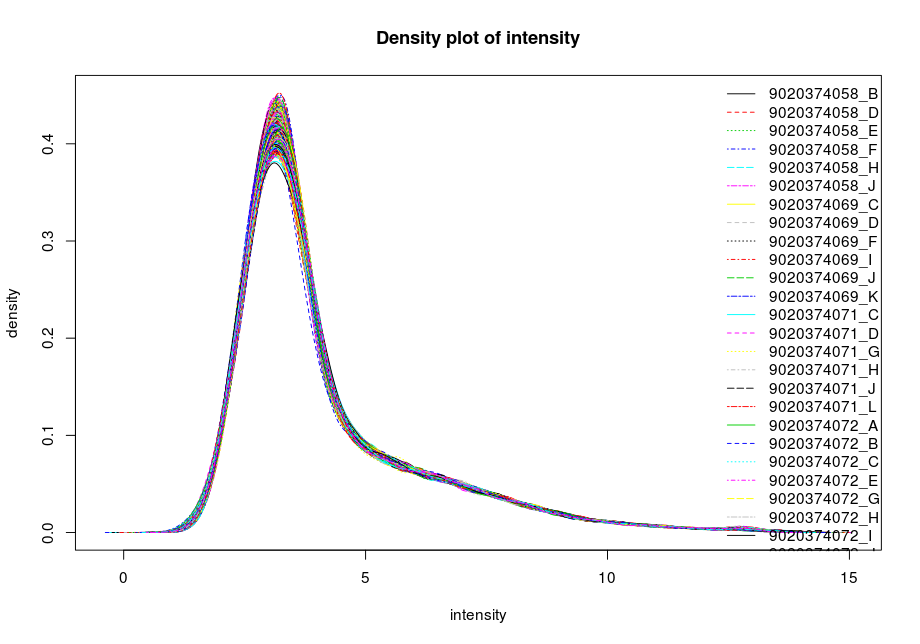

```
 beging plotting cv 
 
```

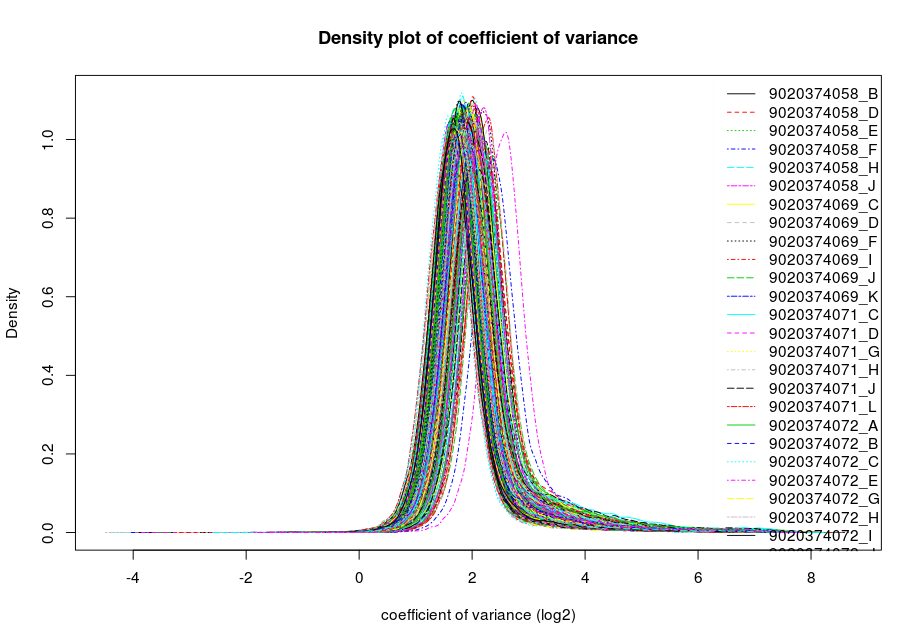

```r
par(def.par)
```


```r
pdf(file = paste(out_dir, "/", project_name, ".eset_bg_log2_rsn_adj.basic_qc_plot_lumi.pdf", 
    sep = ""), width = 11, height = 8)
basic_qc_plot_lumi(eset_bg_log2_rsn_adj)
```

```
 Running flashClust 
 
 beging plotting boxplot 
 
```

```
 beging plotting outlier 
 
```

```
 beging plotting sampleTree <- flashClust( dist_exprs, method = "average") 
 
```

```
 beging plotting density 
 
```

```
 beging plotting cv 
 
```

```r
dev.off()
```

```
pdf 
  2 
```

```r
par(def.par)
```


## coloured_dendrogram_lumi 

```r
# coloured_dendrogram_lumi plot to screen
par(c = 5, 20, 5, 5)
coloured_dendrogram_lumi(eset_bg_log2_rsn_adj)
```

```
 get pheno data 
 
 basic colours 
 
 batch pheno data 
 
 batch colours 
 
 datExprs and sampleTree 
 
 plotDendroAndColors 
 
```

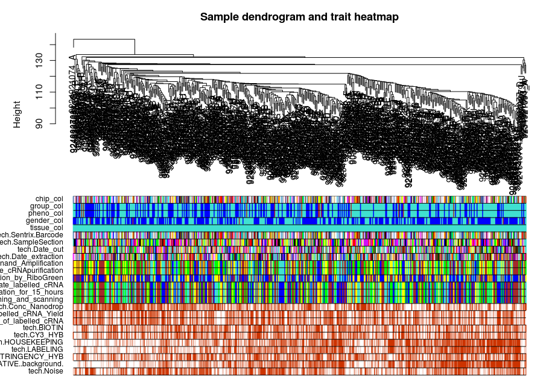

```r
par(def.par)
```


```r
pdf(file = paste(out_dir, "/", project_name, ".eset_bg_log2_rsn_adj.coloured_dendrogram_lumi.pdf", 
    sep = ""), width = 11, height = 8)
coloured_dendrogram_lumi(eset_bg_log2_rsn_adj)
```

```
 get pheno data 
 
 basic colours 
 
 batch pheno data 
 
 batch colours 
 
 datExprs and sampleTree 
 
 plotDendroAndColors 
 
```

```r
dev.off()
```

```
pdf 
  2 
```

```r
par(def.par)
```


## pca_plot_lumi 

```r
# PCA plots plot to screen
pca_plot_lumi(eset_bg_log2_rsn_adj)
```

```
 setting up data for qc plots 
 
 get pheno data 
 
 basic colours 
 
 batch pheno data 
 
 begin PCA plots 
 
 calculating PCs using prcomp() 
 
 plotting Proportion of Variance Explained 
 
```

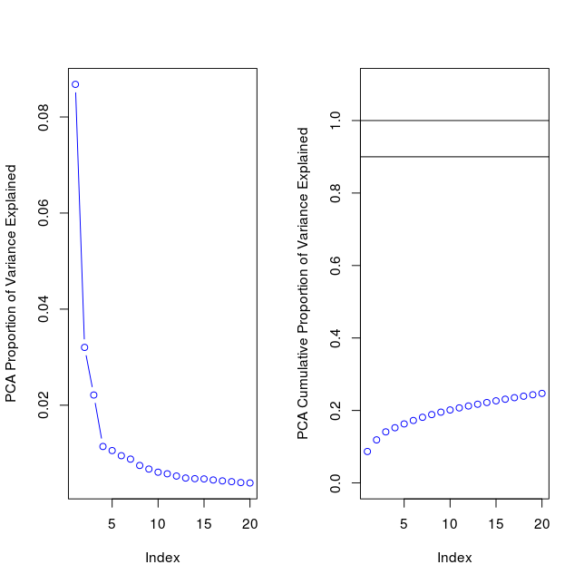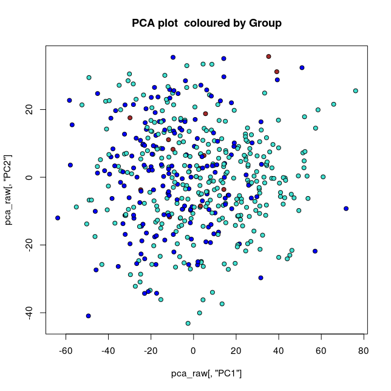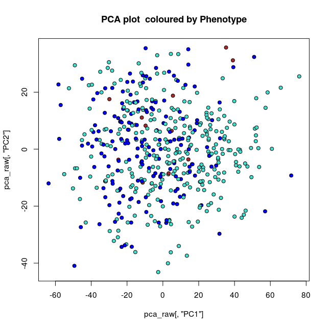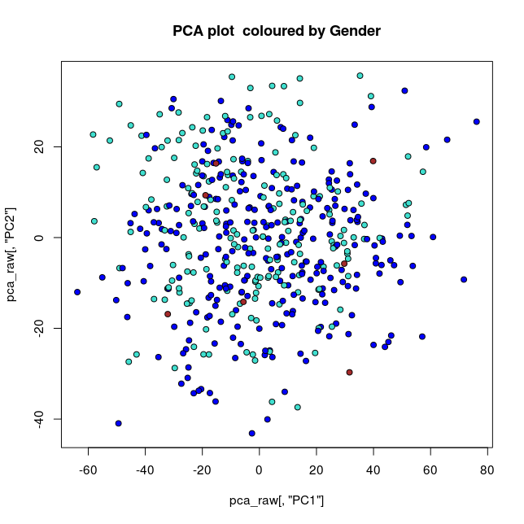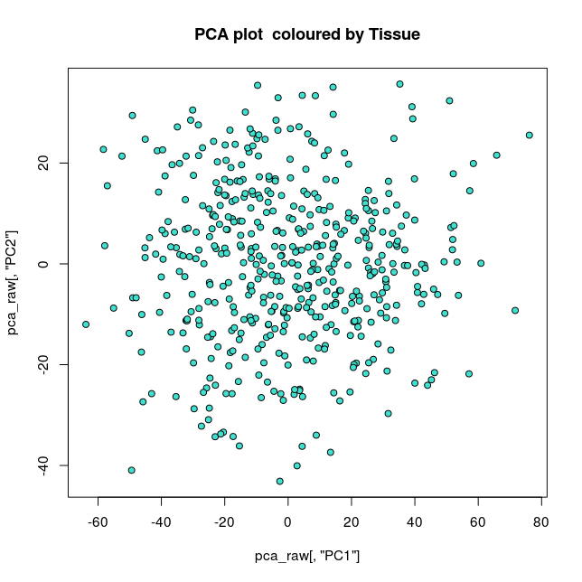

```
 begin looping through batch variable PCA plots  tech.Sentrix.Barcode 
 
```

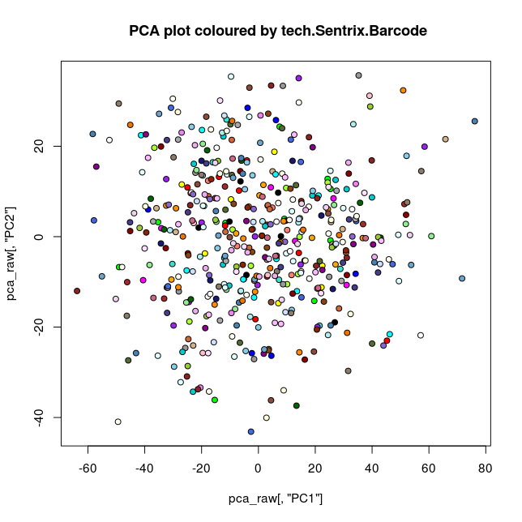

```
 begin looping through batch variable PCA plots  tech.SampleSection 
 
```

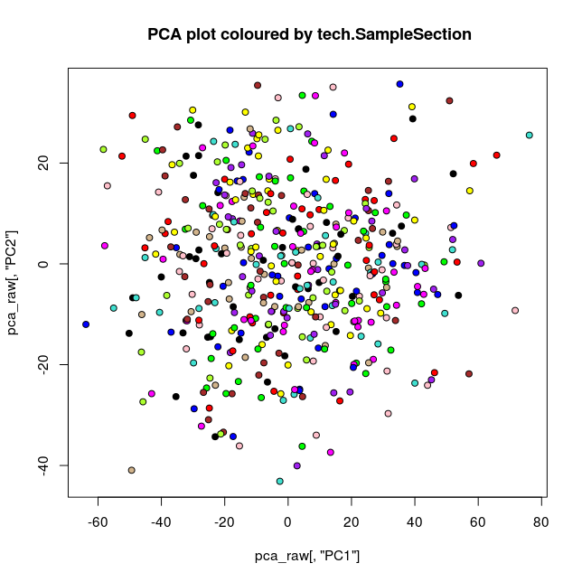

```
 begin looping through batch variable PCA plots  tech.Date_out 
 
```

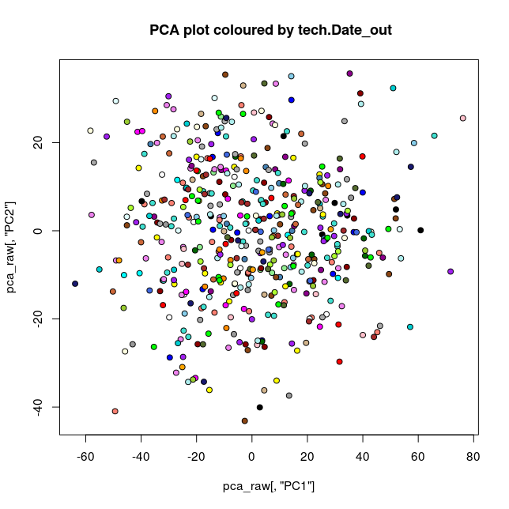

```
 begin looping through batch variable PCA plots  tech.Date_extraction 
 
```

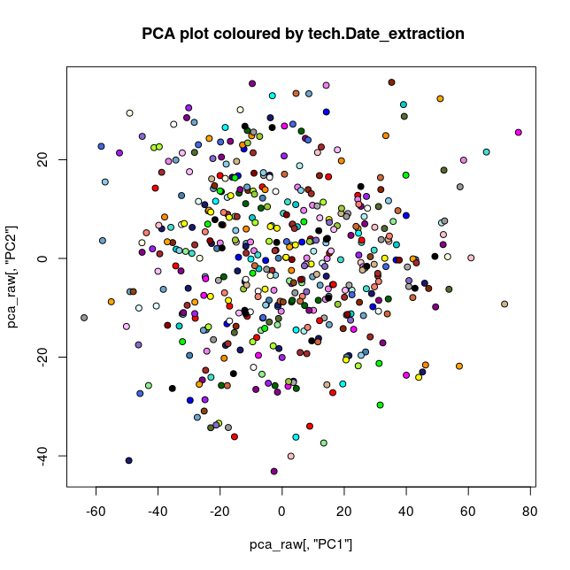

```
 begin looping through batch variable PCA plots  tech.Date_Dilutionand_Amplification 
 
```


```
 begin looping through batch variable PCA plots  tech.Date_cRNApurification 
 
```

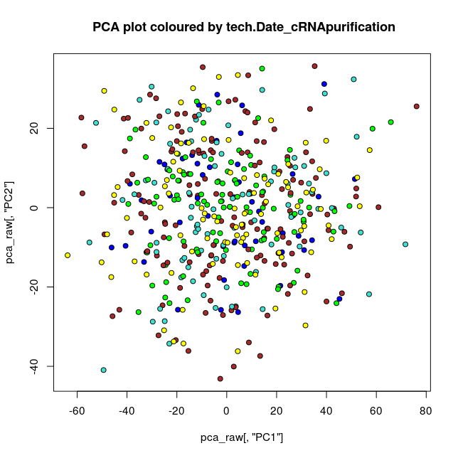

```
 begin looping through batch variable PCA plots  tech.Date_Quantitation_by_RiboGreen 
 
```

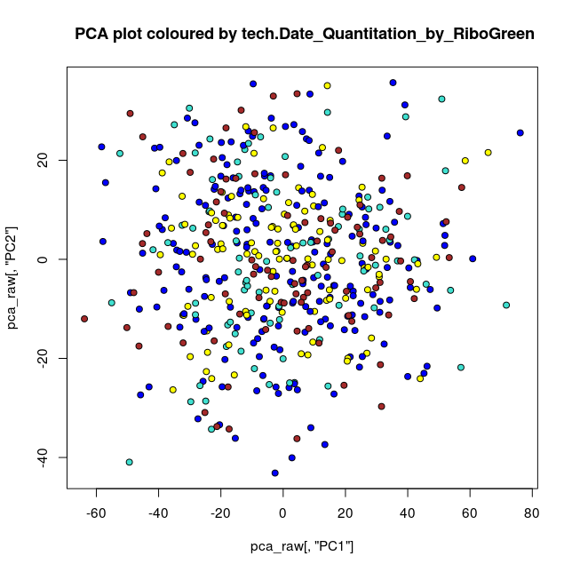

```
 begin looping through batch variable PCA plots  tech.Date_labelled_cRNA 
 
```

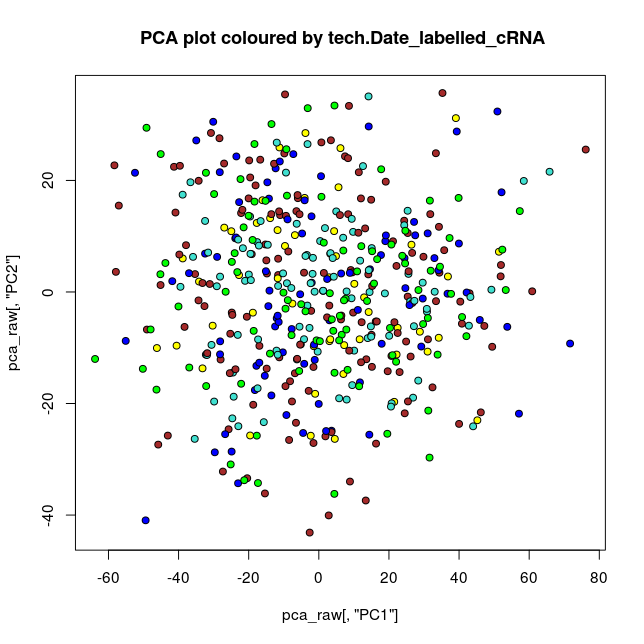

```
 begin looping through batch variable PCA plots  tech.Date_Hybridization_for_15_hours 
 
```


```
 begin looping through batch variable PCA plots  tech.Date_Washing_and_scanning 
 
```


```
 begin looping through batch variable PCA plots  tech.Conc_Nanodrop 
 
```

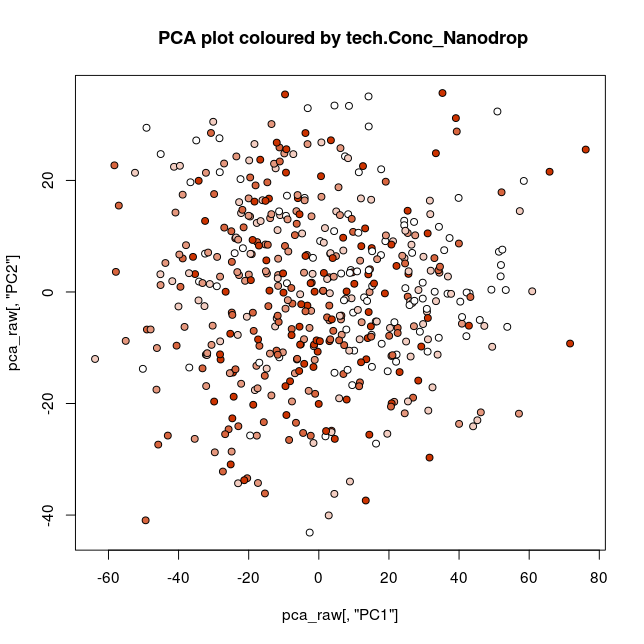

```
 begin looping through batch variable PCA plots  tech.labelled_cRNA_Yield 
 
```

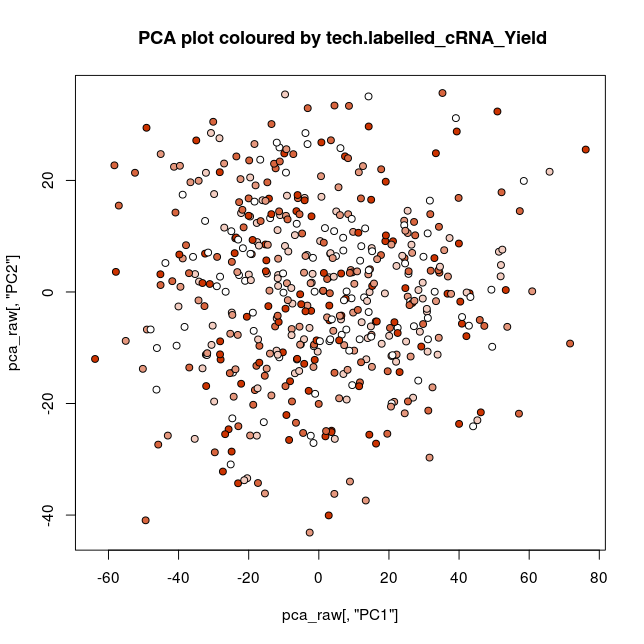

```
 begin looping through batch variable PCA plots  tech.concentration_of_labelled_cRNA 
 
```


```
 begin looping through batch variable PCA plots  tech.BIOTIN 
 
```

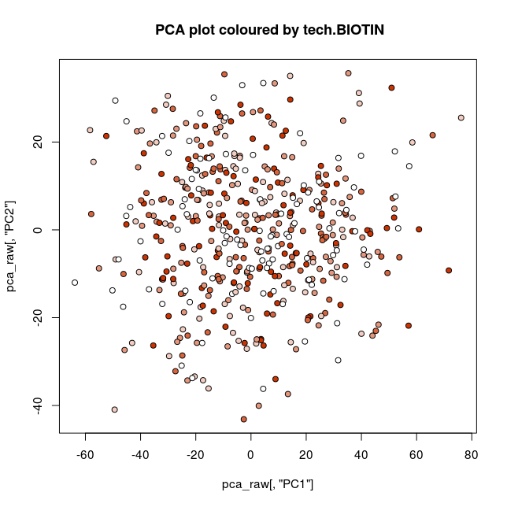

```
 begin looping through batch variable PCA plots  tech.CY3_HYB 
 
```

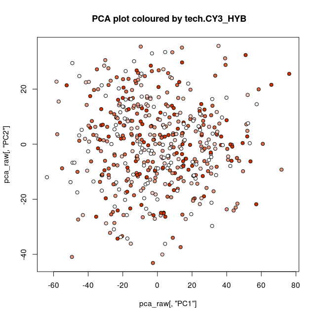

```
 begin looping through batch variable PCA plots  tech.HOUSEKEEPING 
 
```

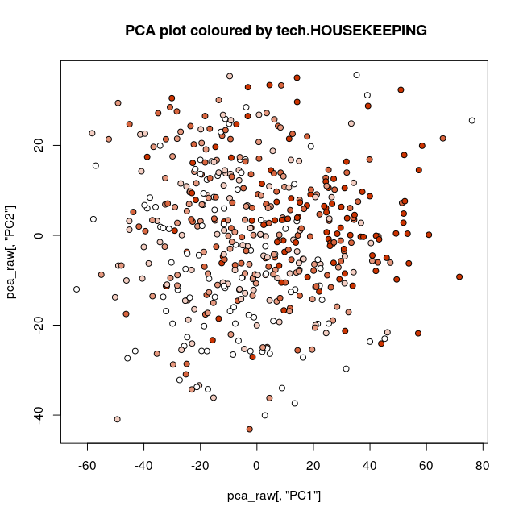

```
 begin looping through batch variable PCA plots  tech.LABELING 
 
```

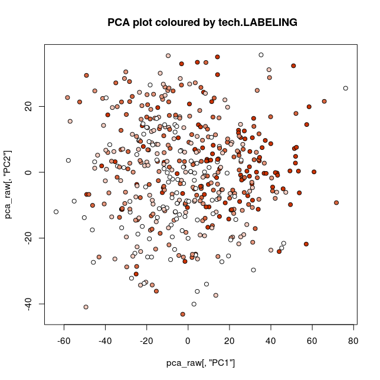

```
 begin looping through batch variable PCA plots  tech.LOW_STRINGENCY_HYB 
 
```

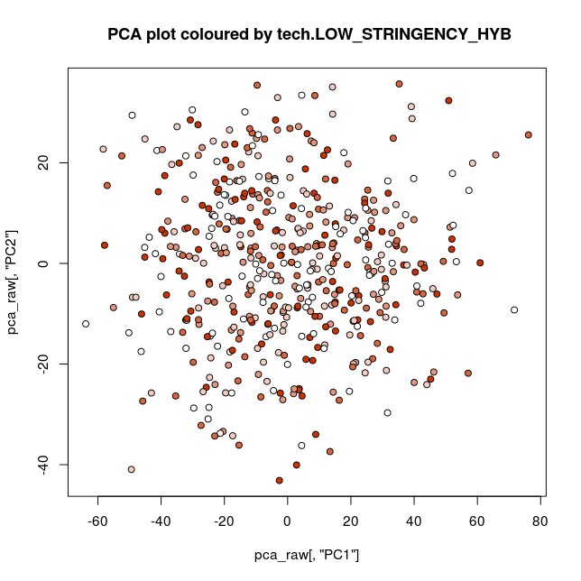

```
 begin looping through batch variable PCA plots  tech.NEGATIVE..background. 
 
```

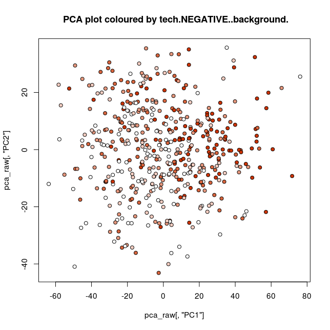

```
 begin looping through batch variable PCA plots  tech.Noise 
 
```

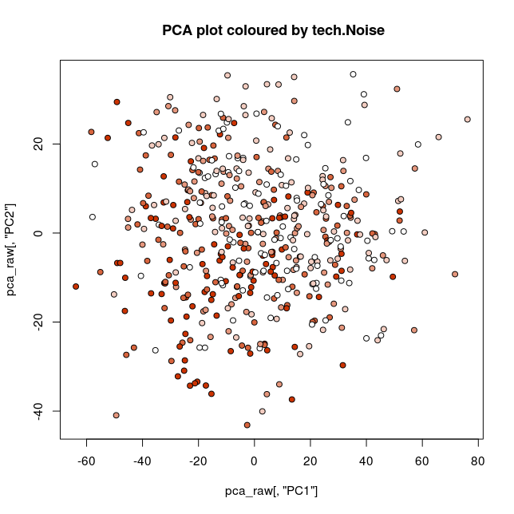

```r
par(def.par)
```


```r
pdf(file = paste(out_dir, "/", project_name, ".eset_bg_log2_rsn_adj.pca_plot_lumi.pdf", 
    sep = ""), width = 7, height = 7)
pca_plot_lumi(eset_bg_log2_rsn_adj)
```

```
 setting up data for qc plots 
 
 get pheno data 
 
 basic colours 
 
 batch pheno data 
 
 begin PCA plots 
 
 calculating PCs using prcomp() 
 
 plotting Proportion of Variance Explained 
 
```

```
 begin looping through batch variable PCA plots  tech.Sentrix.Barcode 
 
```

```
 begin looping through batch variable PCA plots  tech.SampleSection 
 
```

```
 begin looping through batch variable PCA plots  tech.Date_out 
 
```

```
 begin looping through batch variable PCA plots  tech.Date_extraction 
 
```

```
 begin looping through batch variable PCA plots  tech.Date_Dilutionand_Amplification 
 
```

```
 begin looping through batch variable PCA plots  tech.Date_cRNApurification 
 
```

```
 begin looping through batch variable PCA plots  tech.Date_Quantitation_by_RiboGreen 
 
```

```
 begin looping through batch variable PCA plots  tech.Date_labelled_cRNA 
 
```

```
 begin looping through batch variable PCA plots  tech.Date_Hybridization_for_15_hours 
 
```

```
 begin looping through batch variable PCA plots  tech.Date_Washing_and_scanning 
 
```

```
 begin looping through batch variable PCA plots  tech.Conc_Nanodrop 
 
```

```
 begin looping through batch variable PCA plots  tech.labelled_cRNA_Yield 
 
```

```
 begin looping through batch variable PCA plots  tech.concentration_of_labelled_cRNA 
 
```

```
 begin looping through batch variable PCA plots  tech.BIOTIN 
 
```

```
 begin looping through batch variable PCA plots  tech.CY3_HYB 
 
```

```
 begin looping through batch variable PCA plots  tech.HOUSEKEEPING 
 
```

```
 begin looping through batch variable PCA plots  tech.LABELING 
 
```

```
 begin looping through batch variable PCA plots  tech.LOW_STRINGENCY_HYB 
 
```

```
 begin looping through batch variable PCA plots  tech.NEGATIVE..background. 
 
```

```
 begin looping through batch variable PCA plots  tech.Noise 
 
```

```r
dev.off()
```

```
pdf 
  2 
```

## SampleNetwork Plots eset_bg_log2_rsn_adj

```r
# SampleNetwork Plots plot to screen
sampleNetwork_plot_all_lumi(eset_bg_log2_rsn_adj, colBy = "chip")
```

```
 setting up data for qc plots 
 
 expression matrix and IAC 
 
 fundamentalNetworkConcepts 
 
 colorvec [ chip ] 
 
 begin SampleNetwork plots 
 
```

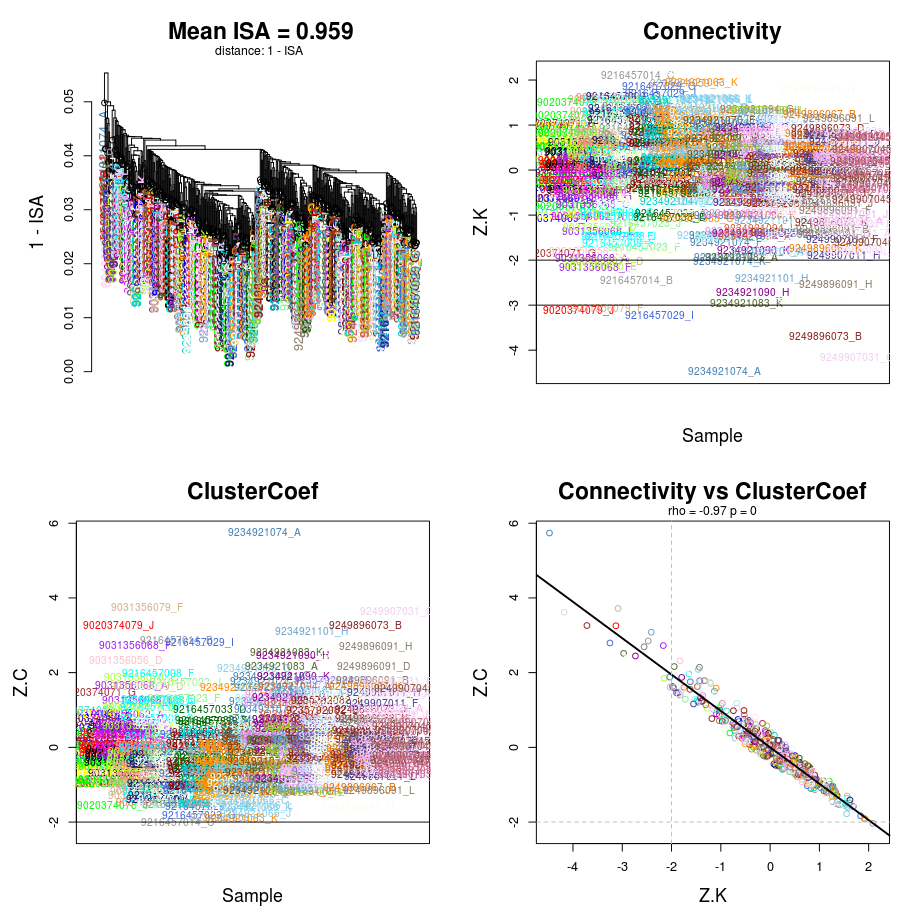

```r
sampleNetwork_plot_all_lumi(eset_bg_log2_rsn_adj, colBy = "group")
```

```
 setting up data for qc plots 
 
 expression matrix and IAC 
 
 fundamentalNetworkConcepts 
 
 colorvec [ group ] 
 
 begin SampleNetwork plots 
 
```

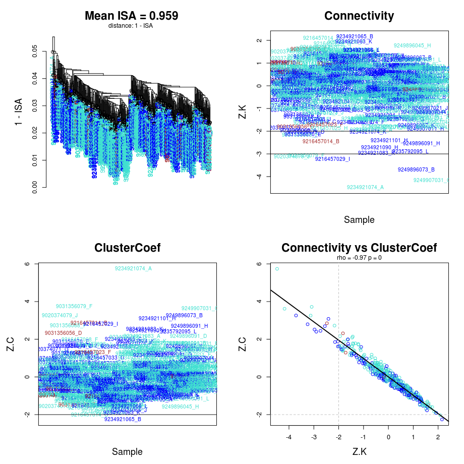

```r
par(def.par)
```


```r
pdf(file = paste(out_dir, "/", project_name, ".eset_bg_log2_rsn_adj.sampleNetwork_plot_all_lumi.pdf", 
    sep = ""), width = 8, height = 8)
sampleNetwork_plot_all_lumi(eset_bg_log2_rsn_adj, colBy = "chip")
```

```
 setting up data for qc plots 
 
 expression matrix and IAC 
 
 fundamentalNetworkConcepts 
 
 colorvec [ chip ] 
 
 begin SampleNetwork plots 
 
```

```r
sampleNetwork_plot_all_lumi(eset_bg_log2_rsn_adj, colBy = "group")
```

```
 setting up data for qc plots 
 
 expression matrix and IAC 
 
 fundamentalNetworkConcepts 
 
 colorvec [ group ] 
 
 begin SampleNetwork plots 
 
```

```r
dev.off()
```

```
pdf 
  2 
```


****

Create Final QC'd Expression data set: Good Probes & Good Samples
==================================================================
Subset data to good_probes.   
At this stage we have already removed sample outliers and adjusted for significant batch variables. Now we subset to probes that can be reliably detected in 80% of each GROUP. This is the final data set to be used on all analyses. 
Some of the QC plot wont look as nice, eg CV plots, as these genes should represent some real biology.


```r
# subset to good probes
eset_final <- eset_bg_log2_rsn_adj[good_probes, ]
eset_final
```

```
Summary of data information:
	 Data File Information:
		GSGX Version	1.9.0
		Report Date	29/10/2013 14:56:38
		Project	BRC_GAP_Expression_02
		Group Set	BRC_GAP_Expression
		Analysis	BRC_GAP_Expression_nonorm_nobkgd
		Normalization	none

Major Operation History:
            submitted            finished
1 2014-01-26 17:05:16 2014-01-26 17:10:40
2 2014-01-26 17:05:16 2014-01-26 17:10:40
                                                                                                                   command
1 lumiR("/media/D/expression/GAP_Expression/final_reports_genomestudio/Sample_and_Control_Probe_Profile_FinalReport.txt", 
2                                                       lib.mapping = "lumiHumanIDMapping", checkDupId = TRUE, QC = TRUE, 
  lumiVersion
1      2.14.1
2      2.14.1
...
              submitted            finished                    command
254 2014-01-26 19:52:53 2014-01-26 19:52:55    Subsetting 608 samples.
255 2014-01-26 22:09:17 2014-01-26 22:09:18 Subsetting 47231 features.
    lumiVersion
254      2.14.1
255      2.14.1

Object Information:
LumiBatch (storageMode: lockedEnvironment)
assayData: 4756 features, 486 samples 
  element names: beadNum, detection, exprs, se.exprs 
protocolData: none
phenoData
  sampleNames: 9020374058_B 9020374058_D ... 9249907052_J (486
    total)
  varLabels: sampleID GROUPS ... SampleNetWork_outlier (63 total)
  varMetadata: labelDescription
featureData
  featureNames: 00K3OeGXV631V5_6eA 0106ep0.a1f3X61SF8 ...
    Zzl1f_74R7J0x6ALY0 (4756 total)
  fvarLabels: ProbeID TargetID ... good_probe (30 total)
  fvarMetadata: labelDescription
experimentData: use 'experimentData(object)'
Annotation: lumiHumanAll.db 
Control Data: Available
QC information: Please run summary(x, 'QC') for details!
```


```r
# subset to good probes
save(eset_final, file = paste(out_dir, "/", project_name, ".eset_final.RData", 
    sep = ""), compress = T)
```


```r
# write_expression_files eset_bg_log2_rsn_adj
write_expression_files(eset = eset_final, outfile = paste(out_dir, "/", project_name, 
    ".eset_final", sep = ""))
```

```
 Writing probe exprs matrix [ /media/D/expression/GAP_Expression/GAP_lumi_processing_26_01_2014_1390755915/GAP.eset_final.exprs_matrix.txt ] 
 
 Writing probe se.exprs matrix [ /media/D/expression/GAP_Expression/GAP_lumi_processing_26_01_2014_1390755915/GAP.eset_final.se.exprs_matrix.txt ] 
 
 Writing probe detection matrix [ /media/D/expression/GAP_Expression/GAP_lumi_processing_26_01_2014_1390755915/GAP.eset_final.detection_matrix.txt ] 
 
 Writing probe beadNum matrix [ /media/D/expression/GAP_Expression/GAP_lumi_processing_26_01_2014_1390755915/GAP.eset_final.beadNum_matrix.txt ] 
 
 Writing probe PCA matrix [ /media/D/expression/GAP_Expression/GAP_lumi_processing_26_01_2014_1390755915/GAP.eset_final.pca_matrix.txt ] 
 
 Writing pData slot of eset and adding PCA data to [ /media/D/expression/GAP_Expression/GAP_lumi_processing_26_01_2014_1390755915/GAP.eset_final.pData.txt ] 
 
 Writing fData slot of eset [ /media/D/expression/GAP_Expression/GAP_lumi_processing_26_01_2014_1390755915/GAP.eset_final.fData.txt ] 
 
```


QC Plots of `eset_final`
---------------------------------------------------------------
## basic_qc_plot_lumi 

```r
# basic plots plot to screen
basic_qc_plot_lumi(eset_final)
```

```
 Running flashClust 
 
 beging plotting boxplot 
 
```


```
 beging plotting outlier 
 
```


```
 beging plotting sampleTree <- flashClust( dist_exprs, method = "average") 
 
```


```
 beging plotting density 
 
```

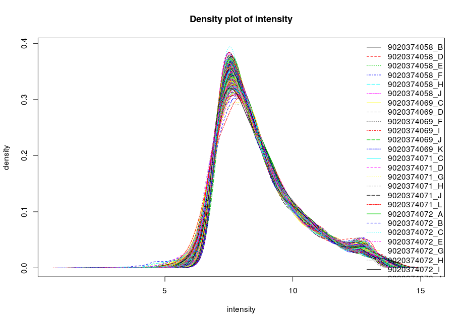

```
 beging plotting cv 
 
```

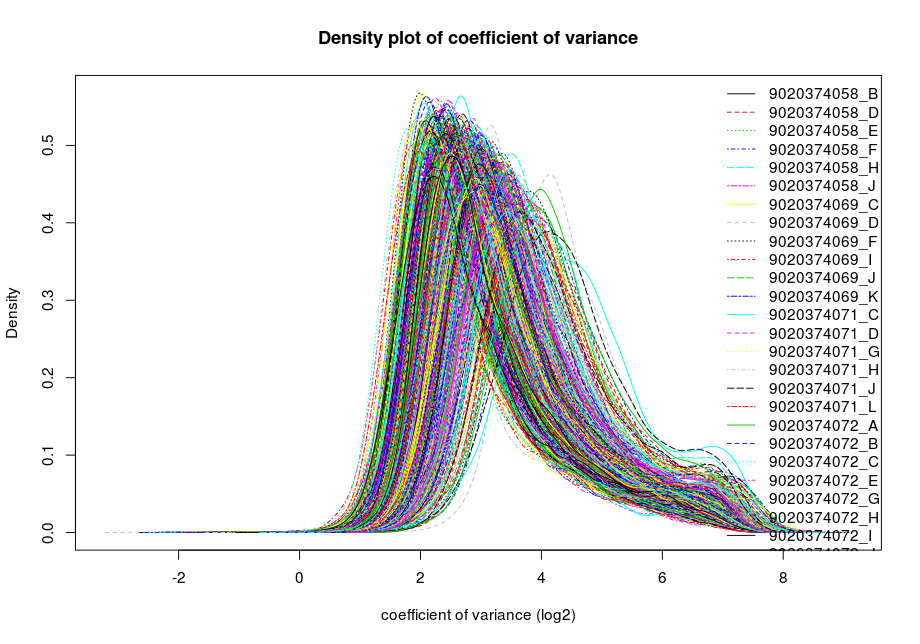

```r
par(def.par)
```


```r
pdf(file = paste(out_dir, "/", project_name, ".eset_final.basic_qc_plot_lumi.pdf", 
    sep = ""), width = 11, height = 8)
basic_qc_plot_lumi(eset_final)
```

```
 Running flashClust 
 
 beging plotting boxplot 
 
```

```
 beging plotting outlier 
 
```

```
 beging plotting sampleTree <- flashClust( dist_exprs, method = "average") 
 
```

```
 beging plotting density 
 
```

```
 beging plotting cv 
 
```

```r
dev.off()
```

```
pdf 
  2 
```


## coloured_dendrogram_lumi 

```r
# coloured_dendrogram_lumi plot to screen
par(mar = c(5, 20, 5, 5))
coloured_dendrogram_lumi(eset_final)
```

```
 get pheno data 
 
 basic colours 
 
 batch pheno data 
 
 batch colours 
 
 datExprs and sampleTree 
 
 plotDendroAndColors 
 
```

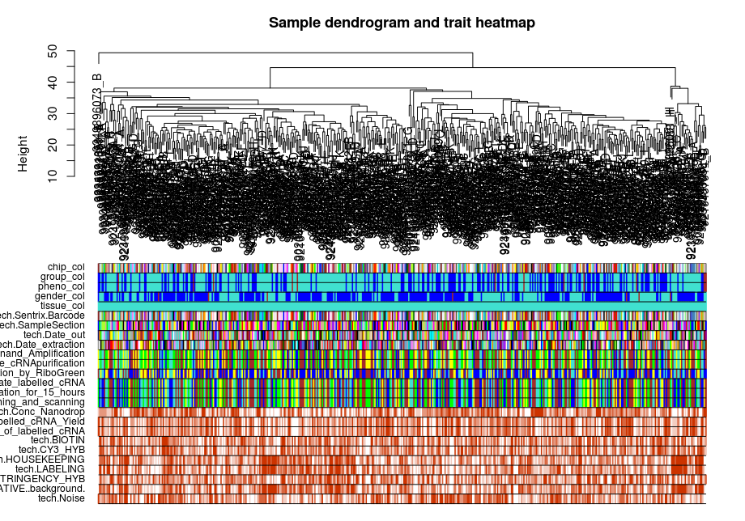

```r
par(def.par)
```


```r
pdf(file = paste(out_dir, "/", project_name, ".eset_final.coloured_dendrogram_lumi.pdf", 
    sep = ""), width = 11, height = 8)
coloured_dendrogram_lumi(eset_final)
```

```
 get pheno data 
 
 basic colours 
 
 batch pheno data 
 
 batch colours 
 
 datExprs and sampleTree 
 
 plotDendroAndColors 
 
```

```r
dev.off()
```

```
pdf 
  2 
```


## pca_plot_lumi 

```r
# PCA plots plot to screen
pca_plot_lumi(eset_final)
```

```
 setting up data for qc plots 
 
 get pheno data 
 
 basic colours 
 
 batch pheno data 
 
 begin PCA plots 
 
 calculating PCs using prcomp() 
 
 plotting Proportion of Variance Explained 
 
```

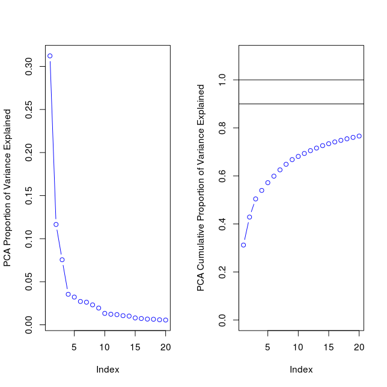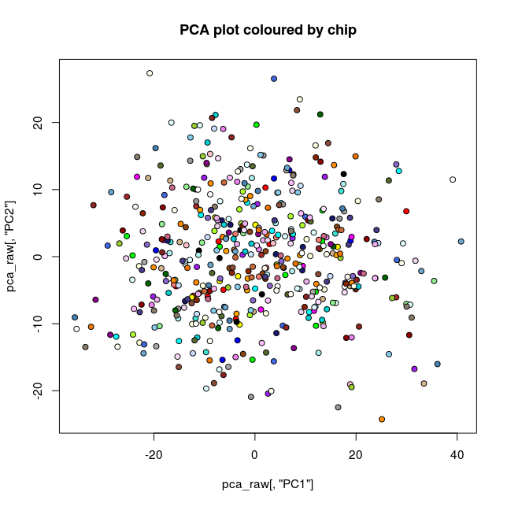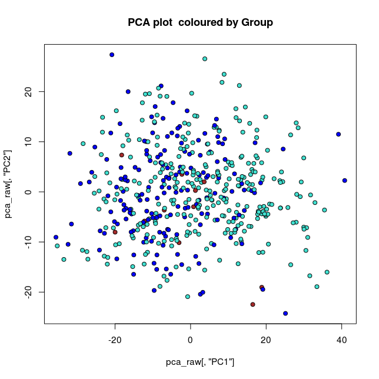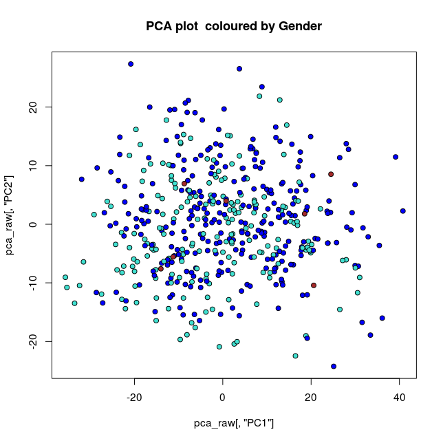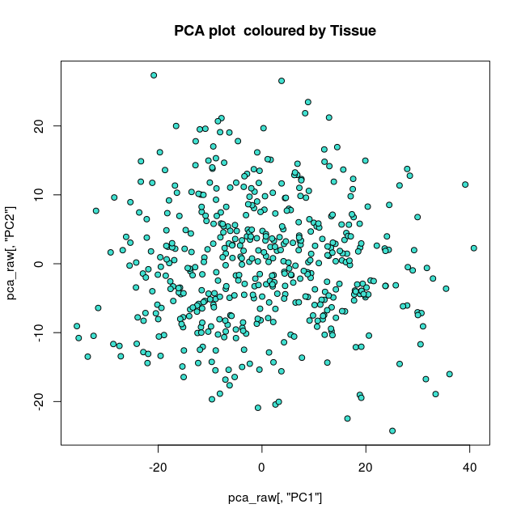

```
 begin looping through batch variable PCA plots  tech.Sentrix.Barcode 
 
```


```
 begin looping through batch variable PCA plots  tech.SampleSection 
 
```

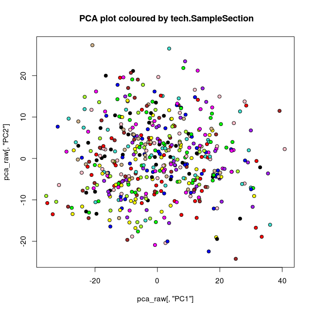

```
 begin looping through batch variable PCA plots  tech.Date_out 
 
```

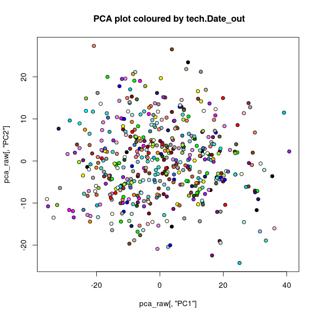

```
 begin looping through batch variable PCA plots  tech.Date_extraction 
 
```

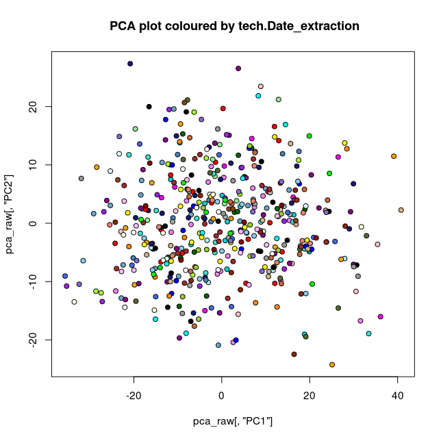

```
 begin looping through batch variable PCA plots  tech.Date_Dilutionand_Amplification 
 
```


```
 begin looping through batch variable PCA plots  tech.Date_cRNApurification 
 
```

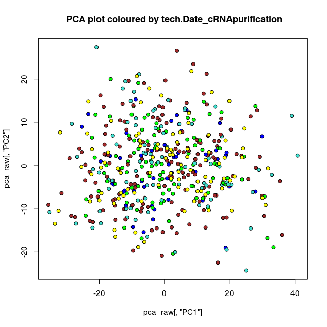

```
 begin looping through batch variable PCA plots  tech.Date_Quantitation_by_RiboGreen 
 
```

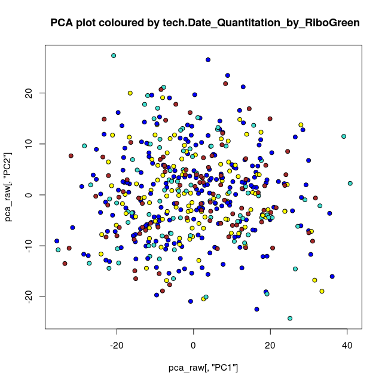

```
 begin looping through batch variable PCA plots  tech.Date_labelled_cRNA 
 
```


```
 begin looping through batch variable PCA plots  tech.Date_Hybridization_for_15_hours 
 
```

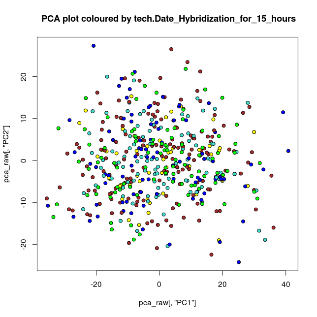

```
 begin looping through batch variable PCA plots  tech.Date_Washing_and_scanning 
 
```


```
 begin looping through batch variable PCA plots  tech.Conc_Nanodrop 
 
```

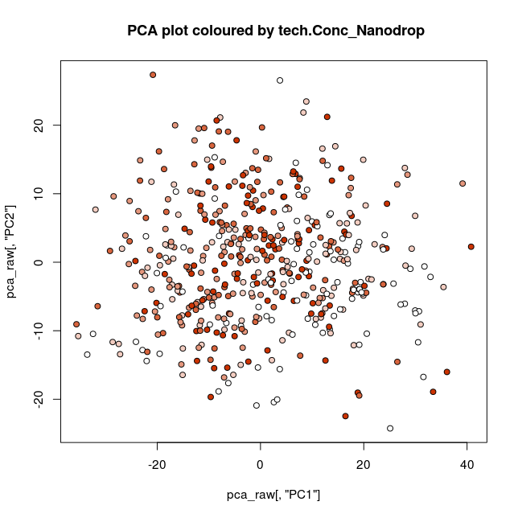

```
 begin looping through batch variable PCA plots  tech.labelled_cRNA_Yield 
 
```


```
 begin looping through batch variable PCA plots  tech.concentration_of_labelled_cRNA 
 
```

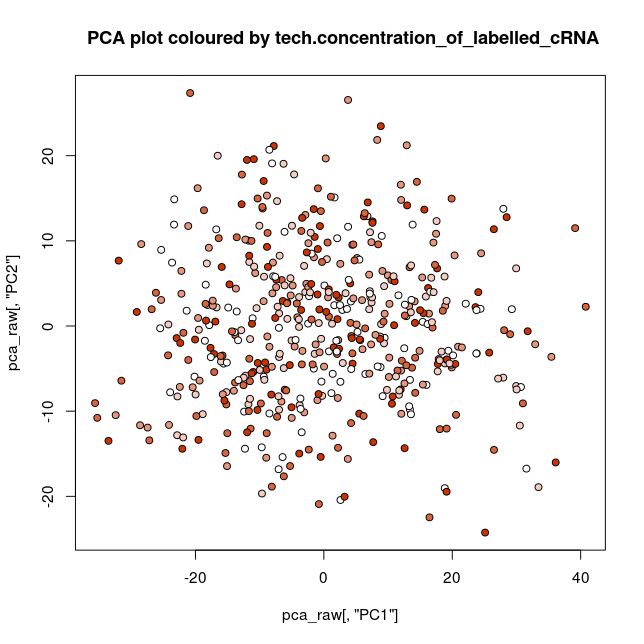

```
 begin looping through batch variable PCA plots  tech.BIOTIN 
 
```

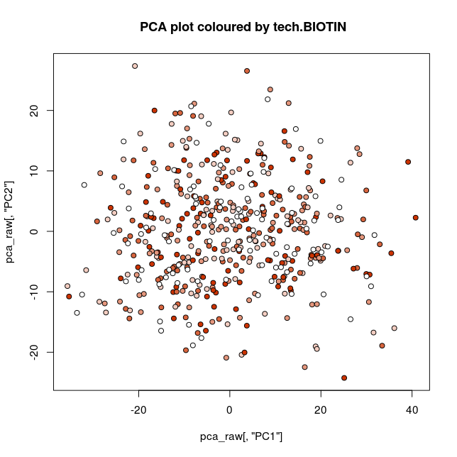

```
 begin looping through batch variable PCA plots  tech.CY3_HYB 
 
```

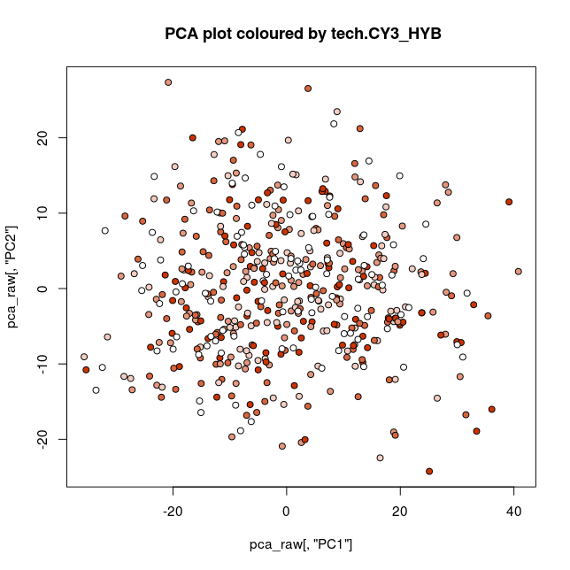

```
 begin looping through batch variable PCA plots  tech.HOUSEKEEPING 
 
```


```
 begin looping through batch variable PCA plots  tech.LABELING 
 
```

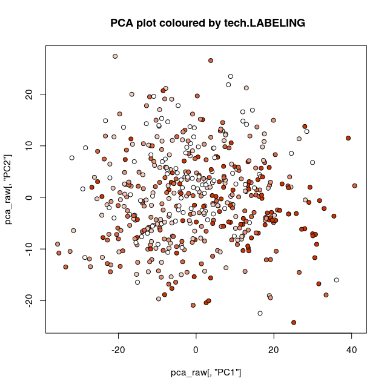

```
 begin looping through batch variable PCA plots  tech.LOW_STRINGENCY_HYB 
 
```

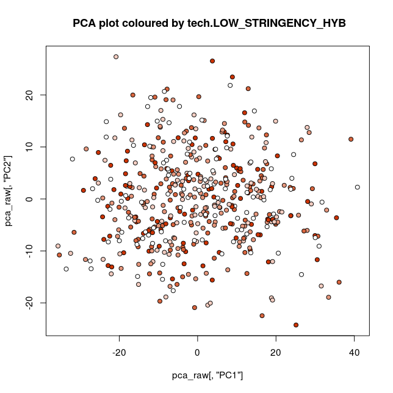

```
 begin looping through batch variable PCA plots  tech.NEGATIVE..background. 
 
```

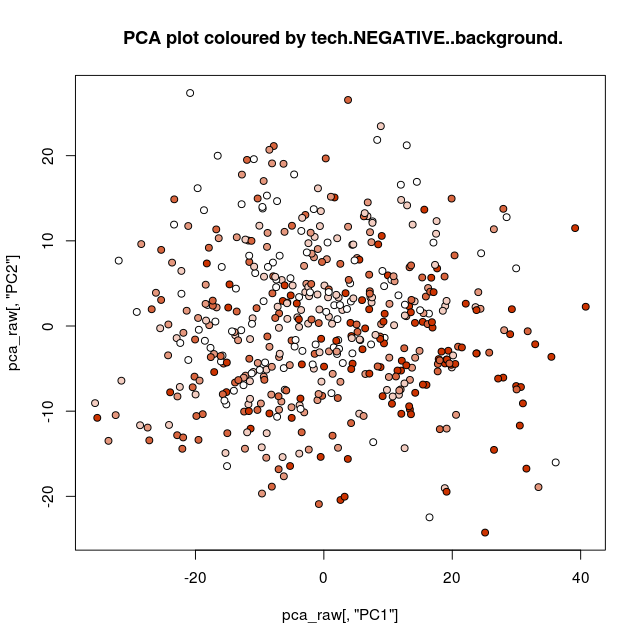

```
 begin looping through batch variable PCA plots  tech.Noise 
 
```

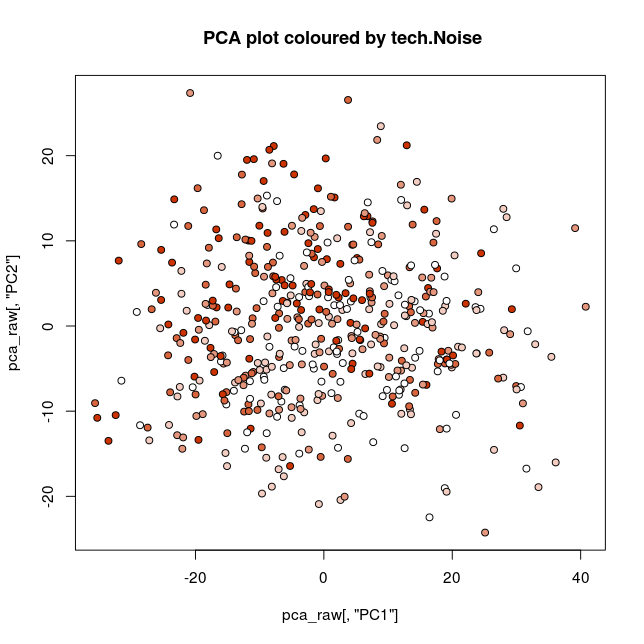

```r
par(def.par)
```


```r
pdf(file = paste(out_dir, "/", project_name, ".eset_final.pca_plot_lumi.pdf", 
    sep = ""), width = 7, height = 7)
pca_plot_lumi(eset_final)
```

```
 setting up data for qc plots 
 
 get pheno data 
 
 basic colours 
 
 batch pheno data 
 
 begin PCA plots 
 
 calculating PCs using prcomp() 
 
 plotting Proportion of Variance Explained 
 
```

```
 begin looping through batch variable PCA plots  tech.Sentrix.Barcode 
 
```

```
 begin looping through batch variable PCA plots  tech.SampleSection 
 
```

```
 begin looping through batch variable PCA plots  tech.Date_out 
 
```

```
 begin looping through batch variable PCA plots  tech.Date_extraction 
 
```

```
 begin looping through batch variable PCA plots  tech.Date_Dilutionand_Amplification 
 
```

```
 begin looping through batch variable PCA plots  tech.Date_cRNApurification 
 
```

```
 begin looping through batch variable PCA plots  tech.Date_Quantitation_by_RiboGreen 
 
```

```
 begin looping through batch variable PCA plots  tech.Date_labelled_cRNA 
 
```

```
 begin looping through batch variable PCA plots  tech.Date_Hybridization_for_15_hours 
 
```

```
 begin looping through batch variable PCA plots  tech.Date_Washing_and_scanning 
 
```

```
 begin looping through batch variable PCA plots  tech.Conc_Nanodrop 
 
```

```
 begin looping through batch variable PCA plots  tech.labelled_cRNA_Yield 
 
```

```
 begin looping through batch variable PCA plots  tech.concentration_of_labelled_cRNA 
 
```

```
 begin looping through batch variable PCA plots  tech.BIOTIN 
 
```

```
 begin looping through batch variable PCA plots  tech.CY3_HYB 
 
```

```
 begin looping through batch variable PCA plots  tech.HOUSEKEEPING 
 
```

```
 begin looping through batch variable PCA plots  tech.LABELING 
 
```

```
 begin looping through batch variable PCA plots  tech.LOW_STRINGENCY_HYB 
 
```

```
 begin looping through batch variable PCA plots  tech.NEGATIVE..background. 
 
```

```
 begin looping through batch variable PCA plots  tech.Noise 
 
```

```r
dev.off()
```

```
pdf 
  2 
```


## SampleNetwork Plots 

```r
# SampleNetwork Plots plot to screen
sampleNetwork_plot_all_lumi(eset_final, colBy = "chip")
```

```
 setting up data for qc plots 
 
 expression matrix and IAC 
 
 fundamentalNetworkConcepts 
 
 colorvec [ chip ] 
 
 begin SampleNetwork plots 
 
```

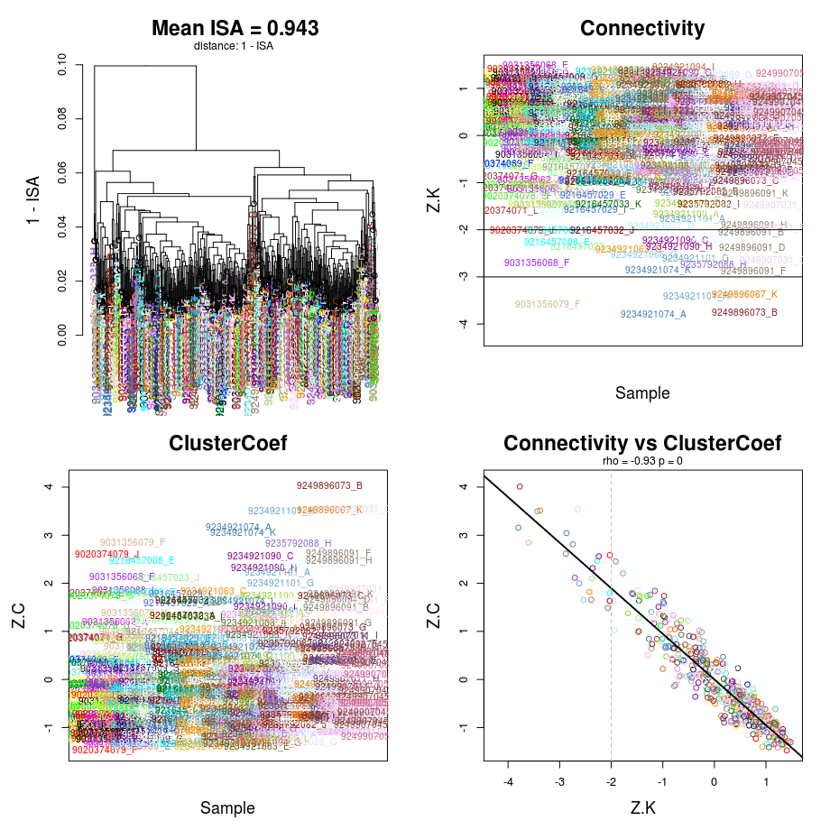

```r
sampleNetwork_plot_all_lumi(eset_final, colBy = "group")
```

```
 setting up data for qc plots 
 
 expression matrix and IAC 
 
 fundamentalNetworkConcepts 
 
 colorvec [ group ] 
 
 begin SampleNetwork plots 
 
```


```r
par(def.par)
```


```r
pdf(file = paste(out_dir, "/", project_name, ".eset_final.sampleNetwork_plot_all_lumi.pdf", 
    sep = ""), width = 8, height = 8)
sampleNetwork_plot_all_lumi(eset_final, colBy = "chip")
```

```
 setting up data for qc plots 
 
 expression matrix and IAC 
 
 fundamentalNetworkConcepts 
 
 colorvec [ chip ] 
 
 begin SampleNetwork plots 
 
```

```r
sampleNetwork_plot_all_lumi(eset_final, colBy = "group")
```

```
 setting up data for qc plots 
 
 expression matrix and IAC 
 
 fundamentalNetworkConcepts 
 
 colorvec [ group ] 
 
 begin SampleNetwork plots 
 
```

```r
dev.off()
```

```
pdf 
  2 
```


****

Clean up
=========


```r
cat(" Clean up processing directory", "\r", "\n")
```

```
 Clean up processing directory 
 
```

```r

cat(" Making data directories", "\r", "\n")
```

```
 Making data directories 
 
```

```r
system(paste(" mkdir ", out_dir, "/eset_raw", sep = ""))
system(paste(" mkdir ", out_dir, "/eset_bg", sep = ""))
system(paste(" mkdir ", out_dir, "/eset_bg_log2_rsn", sep = ""))
system(paste(" mkdir ", out_dir, "/eset_final", sep = ""))
system(paste(" mkdir ", out_dir, "/XIST_Gender_checks", sep = ""))
system(paste(" mkdir ", out_dir, "/detected_probes", sep = ""))
system(paste(" mkdir ", out_dir, "/SampleNetwork", sep = ""))
system(paste(" mkdir ", out_dir, "/batch_regressions/", sep = ""))

cat(" Cleaning up data directories", "\r", "\n")
```

```
 Cleaning up data directories 
 
```

```r
# XIST
system(paste(" mv -v ", out_dir, "/", "*.XIST* ", out_dir, "/XIST_Gender_checks/", 
    sep = ""))

# detected probes
system(paste(" mv -v ", out_dir, "/", "*.detected_probes* ", out_dir, "/detected_probes/", 
    sep = ""))

# SampleNetwork
system(paste("  mv -v ", out_dir, "/", "*ampleNetwork* ", out_dir, "/SampleNetwork/", 
    sep = ""))

# batch regressions multivariate
system(paste(" mv -v ", out_dir, "/", "*multivariate* ", out_dir, "/batch_regressions/", 
    sep = ""))

# eset_****
system(paste(" mv -v ", out_dir, "/", "*.eset_raw.* ", out_dir, "/eset_raw/", 
    sep = ""))
system(paste(" mv -v ", out_dir, "/", "*.eset_bg.* ", out_dir, "/eset_bg/", 
    sep = ""))
system(paste(" mv -v ", out_dir, "/", "*.eset_bg_log2_rsn* ", out_dir, "/eset_bg_log2_rsn/", 
    sep = ""))
system(paste(" mv -v ", out_dir, "/", "*.eset_final.* ", out_dir, "/eset_final/", 
    sep = ""))
```


****

Create and Write Project Summary
==================================
Just making a dataframe of all project settings, input, output files, saved \*.RData files and numbers of samples and probes after various stages ot processing.


```r
project_summary <- data.frame(project_dir = project_dir, project_name = project_name, 
    out_dir = out_dir, gs_report = gs_report, gs_probe = gs_probe, gs_sample = gs_sample, 
    gs_control = gs_control, anno_table = anno_table, pheno_file = pheno_file, 
    tech_pheno_file = tech_pheno_file, probe_det = probe_det, sample_det = sample_det, 
    sex_check = sex_check, iac_check = iac_check, iac_sd_thrs = iac_sd_thrs, 
    mbcb_method = mbcb_method, transform_method = transform_method, norm_method = norm_method, 
    analyst_email = analyst_email, analyst_name = analyst_name, lab_contact_email = lab_contact_email, 
    lab_contact_name = lab_contact_name, chip_id = chip_id, chip_species = chip_species, 
    chip_probes = chip_probes, n_expression_chips = n_expression_chips, n_unique_study_id = n_unique_study_id, 
    n_expression_chips_with_data = n_expression_chips_with_data, n_gender_fails = n_gender_fails, 
    n_unique_study_id_gender_fails = n_unique_study_id_gender_fails, gender_concordance = gender_concordance, 
    n_good_probes = n_good_probes, n_outliers = length(outlier_samples), n_unique_study_id_outliers = n_unique_study_id_outliers, 
    n_good_samples = dim(eset_bg_log2_rsn)[2], n_unique_study_id_good_samples = length(unique(pData(eset_bg_log2_rsn)$Study_ID)))


# some data wrangling
project_summary <- as.data.frame(t(project_summary))
colnames(project_summary) <- "Project_Setting"
project_summary$Project_Variable <- rownames(project_summary)
project_summary <- project_summary[, c("Project_Variable", "Project_Setting")]

# write table to out_dir
write.table(project_summary, file = paste(out_dir, "/", project_name, ".project_summary.csv", 
    sep = ""), row.names = FALSE, quote = FALSE, sep = ",")

# looksee
project_summary
```

```
                                             Project_Variable
project_dir                                       project_dir
project_name                                     project_name
out_dir                                               out_dir
gs_report                                           gs_report
gs_probe                                             gs_probe
gs_sample                                           gs_sample
gs_control                                         gs_control
anno_table                                         anno_table
pheno_file                                         pheno_file
tech_pheno_file                               tech_pheno_file
probe_det                                           probe_det
sample_det                                         sample_det
sex_check                                           sex_check
iac_check                                           iac_check
iac_sd_thrs                                       iac_sd_thrs
mbcb_method                                       mbcb_method
transform_method                             transform_method
norm_method                                       norm_method
analyst_email                                   analyst_email
analyst_name                                     analyst_name
lab_contact_email                           lab_contact_email
lab_contact_name                             lab_contact_name
chip_id                                               chip_id
chip_species                                     chip_species
chip_probes                                       chip_probes
n_expression_chips                         n_expression_chips
n_unique_study_id                           n_unique_study_id
n_expression_chips_with_data     n_expression_chips_with_data
n_gender_fails                                 n_gender_fails
n_unique_study_id_gender_fails n_unique_study_id_gender_fails
gender_concordance                         gender_concordance
n_good_probes                                   n_good_probes
n_outliers                                         n_outliers
n_unique_study_id_outliers         n_unique_study_id_outliers
n_good_samples                                 n_good_samples
n_unique_study_id_good_samples n_unique_study_id_good_samples
                                                                                                                              Project_Setting
project_dir                                                                                                /media/D/expression/GAP_Expression
project_name                                                                                                                              GAP
out_dir                                                          /media/D/expression/GAP_Expression/GAP_lumi_processing_26_01_2014_1390755915
gs_report                      /media/D/expression/GAP_Expression/final_reports_genomestudio/Sample_and_Control_Probe_Profile_FinalReport.txt
gs_probe                                   /media/D/expression/GAP_Expression/final_reports_genomestudio/Group_Probe_Profile_Final_Report.txt
gs_sample                                         /media/D/expression/GAP_Expression/final_reports_genomestudio/sample_table_Final_Report.txt
gs_control                               /media/D/expression/GAP_Expression/final_reports_genomestudio/control_probe_profile_Final_Report.txt
anno_table                                    /media/D/expression/GAP_Expression/final_reports_genomestudio/probe_annotation_Final_Report.txt
pheno_file                                                       /media/D/expression/GAP_Expression/final_reports_genomestudio/pheno_info.txt
tech_pheno_file                                                  /media/D/expression/GAP_Expression/final_reports_genomestudio/batch_info.txt
probe_det                                                                                                                                  80
sample_det                                                                                                                                 80
sex_check                                                                                                                                   1
iac_check                                                                                                                                   1
iac_sd_thrs                                                                                                                                 2
mbcb_method                                                                                                                               MLE
transform_method                                                                                                                         log2
norm_method                                                                                                                               rsn
analyst_email                                                                                                      stephen.newhouse@kcl.ac.uk
analyst_name                                                                                                                 Stephen Newhouse
lab_contact_email                                                                                                    charles.curtis@kcl.ac.uk
lab_contact_name                                                                                                                Charle Curtis
chip_id                                                                                                          HumanHT12_V4_0_R1_15002873_B
chip_species                                                                                                                            Human
chip_probes                                                                                                                             47231
n_expression_chips                                                                                                                        618
n_unique_study_id                                                                                                                         549
n_expression_chips_with_data                                                                                                              608
n_gender_fails                                                                                                                             30
n_unique_study_id_gender_fails                                                                                                             30
gender_concordance                                                                                                                      0.951
n_good_probes                                                                                                                            4756
n_outliers                                                                                                                                122
n_unique_study_id_outliers                                                                                                                113
n_good_samples                                                                                                                            486
n_unique_study_id_good_samples                                                                                                            452
```

```r

# Print out tree of results dir
system(paste(" tree ", out_dir, sep = ""))
```


****

The End!
========


```r
system(paste(" chmod 776 ", out_dir, "/", project_name, "***", sep = ""))
sessionInfo()
```

```
R version 3.0.2 (2013-09-25)
Platform: x86_64-pc-linux-gnu (64-bit)

locale:
 [1] LC_CTYPE=en_GB.UTF-8       LC_NUMERIC=C              
 [3] LC_TIME=en_GB.UTF-8        LC_COLLATE=en_GB.UTF-8    
 [5] LC_MONETARY=en_GB.UTF-8    LC_MESSAGES=en_GB.UTF-8   
 [7] LC_PAPER=en_GB.UTF-8       LC_NAME=C                 
 [9] LC_ADDRESS=C               LC_TELEPHONE=C            
[11] LC_MEASUREMENT=en_GB.UTF-8 LC_IDENTIFICATION=C       

attached base packages:
 [1] tcltk     splines   grid      parallel  stats     graphics  grDevices
 [8] utils     datasets  methods   base     

other attached packages:
 [1] WGCNA_1.34                vsn_3.30.0               
 [3] scatterplot3d_0.3-34      relaimpo_2.2-2           
 [5] survey_3.29-5             preprocessCore_1.24.0    
 [7] plyr_1.8                  mitools_2.2              
 [9] MBCB_1.16.0               tcltk2_1.2-9             
[11] MASS_7.3-29               lumiHumanIDMapping_1.10.0
[13] lumiHumanAll.db_1.22.0    org.Hs.eg.db_2.10.1      
[15] RSQLite_0.11.4            lumi_2.14.1              
[17] limma_3.18.7              impute_1.36.0            
[19] Hmisc_3.13-0              survival_2.37-4          
[21] lattice_0.20-24           gplots_2.12.1            
[23] ggplot2_0.9.3.1           Formula_1.1-1            
[25] foreign_0.8-57            flashClust_1.01-2        
[27] dynamicTreeCut_1.60-1     DBI_0.2-7                
[29] cluster_1.14.4            boot_1.3-9               
[31] annotate_1.40.0           AnnotationDbi_1.24.0     
[33] affy_1.40.0               Biobase_2.22.0           
[35] BiocGenerics_0.8.0        shiny_0.8.0              
[37] markdown_0.6.3            knitr_1.5                

loaded via a namespace (and not attached):
 [1] affyio_1.30.0          base64_1.1             beanplot_1.1          
 [4] BiocInstaller_1.12.0   biomaRt_2.18.0         Biostrings_2.30.1     
 [7] bitops_1.0-6           BSgenome_1.30.0        bumphunter_1.2.0      
[10] caTools_1.16           codetools_0.2-8        colorspace_1.2-4      
[13] corpcor_1.6.6          dichromat_2.0-0        digest_0.6.4          
[16] doParallel_1.0.6       doRNG_1.5.5            evaluate_0.5.1        
[19] foreach_1.4.1          formatR_0.10.3         gdata_2.13.2          
[22] genefilter_1.44.0      GenomicFeatures_1.14.2 GenomicRanges_1.14.4  
[25] gtable_0.1.2           gtools_3.1.1           httpuv_1.2.1          
[28] illuminaio_0.4.0       IRanges_1.20.6         iterators_1.0.6       
[31] itertools_0.1-1        KernSmooth_2.23-10     labeling_0.2          
[34] locfit_1.5-9.1         Matrix_1.1-1.1         matrixStats_0.8.14    
[37] mclust_4.2             methylumi_2.8.0        mgcv_1.7-27           
[40] minfi_1.8.9            multtest_2.18.0        munsell_0.4.2         
[43] nleqslv_2.1            nlme_3.1-113           nor1mix_1.1-4         
[46] pkgmaker_0.17.4        proto_0.3-10           RColorBrewer_1.0-5    
[49] RCurl_1.95-4.1         registry_0.2           reshape_0.8.4         
[52] reshape2_1.2.2         RJSONIO_1.0-3          R.methodsS3_1.6.1     
[55] rngtools_1.2.3         Rsamtools_1.14.2       rtracklayer_1.22.0    
[58] scales_0.2.3           siggenes_1.36.0        stats4_3.0.2          
[61] stringr_0.6.2          tools_3.0.2            XML_3.98-1.1          
[64] xtable_1.7-1           XVector_0.2.0          zlibbioc_1.8.0        
```


```r
# report_name <- paste(out_dir,'/',project_name,'.report',sep='')
# knit(paste(report_name,'.Rmd',sep='')) system(paste(' pandoc -s -t beamer
# --slide-level 1 ',report_name,'.md -o ',report_name,'.tex',sep=''))
```


****

GRAVE YARD OR TTHINGS TO THINK ABOUT DUMPING OR INCLUDING
=========================================================

NOT RUN!
### Heatmaps


## univariate_models


